> 📎 来源: [晓来在进化](https://mp.weixin.qq.com/s?__biz=MzkyMjMzMzc1Mg==&mid=2247486137&idx=1&sn=dcf93eded476bd8dd1376471dee22351&chksm=c092406fb8023e8de4ae4b7790cac2483b428a0bb3fa09e1fb35c28909f6f3f085a75149e0ac&mpshare=1&scene=1&srcid=0513mctPdK323JkcuJLXuaol&sharer_shareinfo=268ec0fb0001041c2f4466f541151fdd&sharer_shareinfo_first=268ec0fb0001041c2f4466f541151fdd) | 时间: 2026-05-13 15:31

---

hi～我是晓来！

现在我们都知道，要想 Agent 活干得好，Skills 肯定是少不了的。

而让 AI Agent 以一种更加安全稳妥的方式，读取网页、自动化采集数据等，之前一直没有看到可靠 Skill 能够很完美的实现。

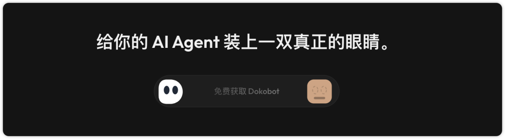

在之前，Agent 要读取网页，采集数据，更多采用 http 协议或以爬虫方式去获取网页数据内容，这就一定会存在一些问题，比如网站设置了 http 请求的频率限制，以及反爬机制等。

这无疑是给 Agent 使了些绊子。

今天，倒是发现了一个很不错的 Skill，采用了一种不同的方式，让 Agent 可以更好更稳定的读取网页……

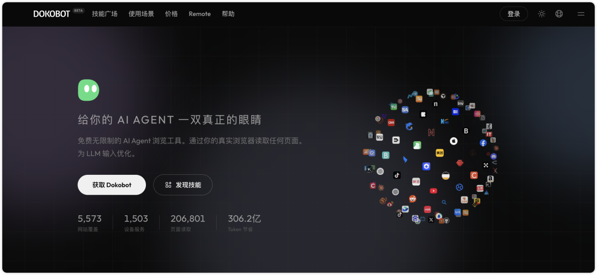

#是什么

Dokobot，一个让 Agent 使用真实浏览器读取任何页面的浏览工具。

它不是通过发送 http 请求或者爬虫形式去获取网页 DOM 内容，而是直接使用你的本地浏览器，就像人一样，读取渲染后的网页，分析像素，输出对 LLM 大模型友好的结构化文本。

支持本地使用和远程登录使用，本地使用是完全免费、不需要注册、不需要密钥，也没有任何限制。

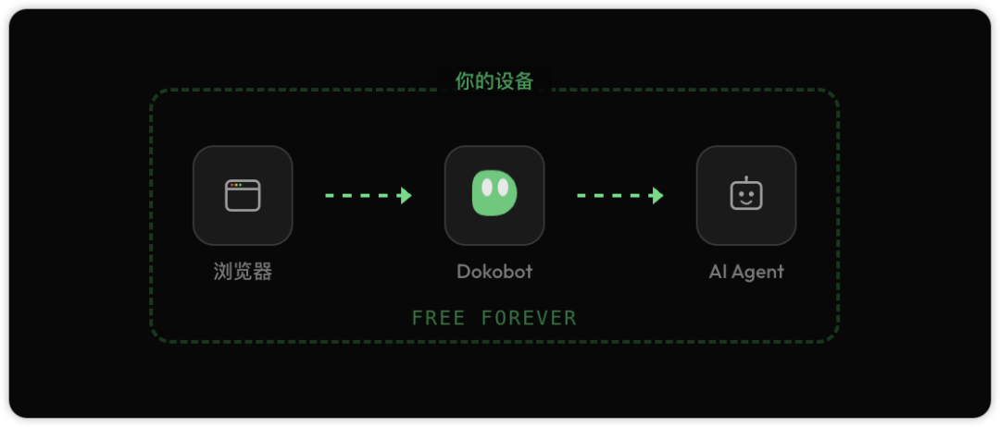

基本上可以在所有主流的 Agent 里使用，如 Claude Code、Codex、OpenCode、OpenClaw、Hermes Agent等等。

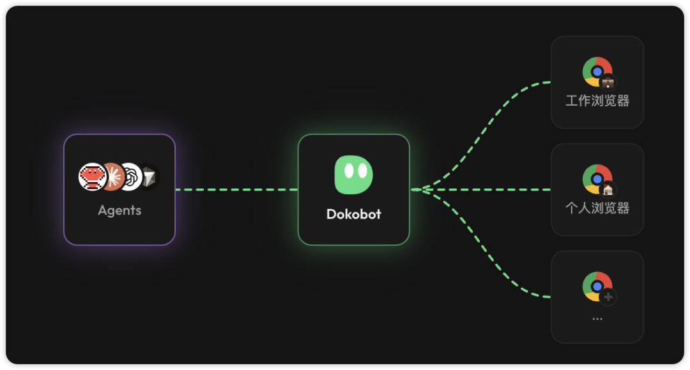

Dokobot 在使用真实浏览器时，复用你浏览器的登录状态，因此不需要再设置密码，就能读取登录墙、JS 渲染的网页、内网站点，以及有反爬机制的网站等。

官网链接：https://dokobot.ai/zh-CN

#怎么用

首先我们单击这个「获取 Dokobot」按钮，进入到安装说明页。

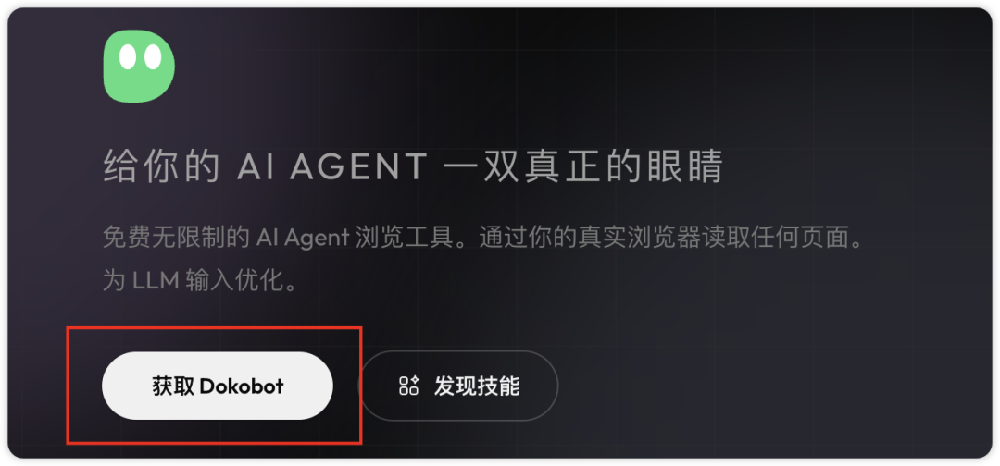

单击这个「添加至 Chrome」按钮，给浏览器装上这个插件，Chrome、Edge、Brave 都支持。

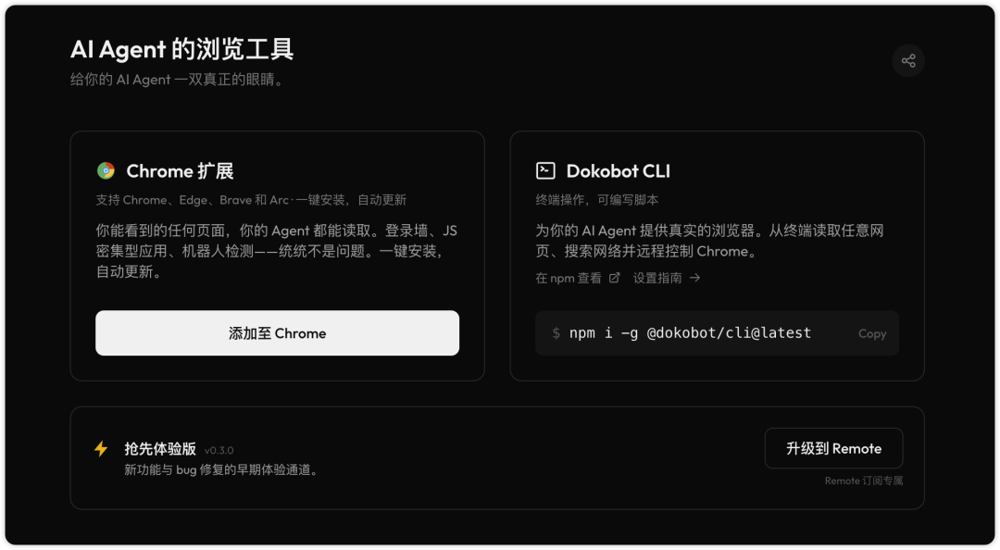

然后，我们要安装 Dokobot CLI 工具（在安装 CLI 工具前，要先配置 Node.js 环境，这个大家上网搜索配置一下就好啦）。

在终端命令行里输入：

```
npm i -g @dokobot/cli@latest
```

接着再配置本地桥接模式，在终端里输入：

```
dokobot install-bridge
```

到这一步，dokobot 其中在本地已经安装配置好了。

我们可以在终端里，输入命令：dokobot help，查看安装情况。

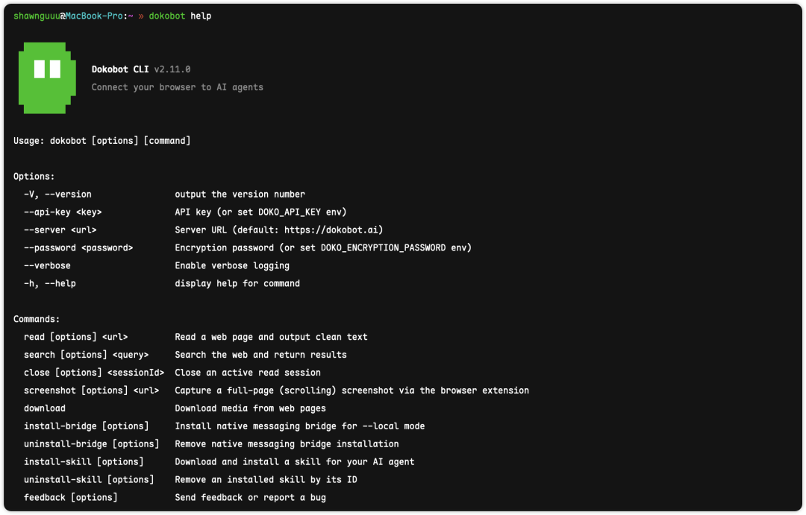

这样就是没问题的啦。

接下来，我们要在 Agent 里使用，就需要给 Agent 装上这个 Dokobot Skill。

在终端输入命令：

```
dokobot install-skill
```

选择你使用的 Agent，然后敲一下空格键勾选中，再回车确认就好啦。

比如我这里使用的是 OpenCode 这个 Coding Agent，它就会将这个 Skill 专门配置给 OpenCode 来使用。

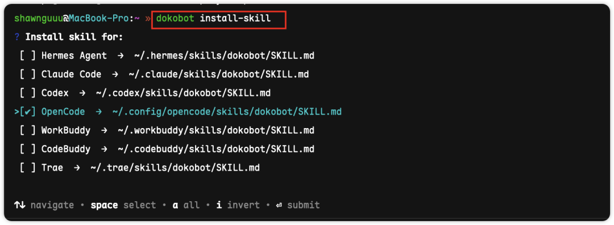

这样，在 OpenCode 里，就可以直接搜索到这个 dokobot 快捷命令了。

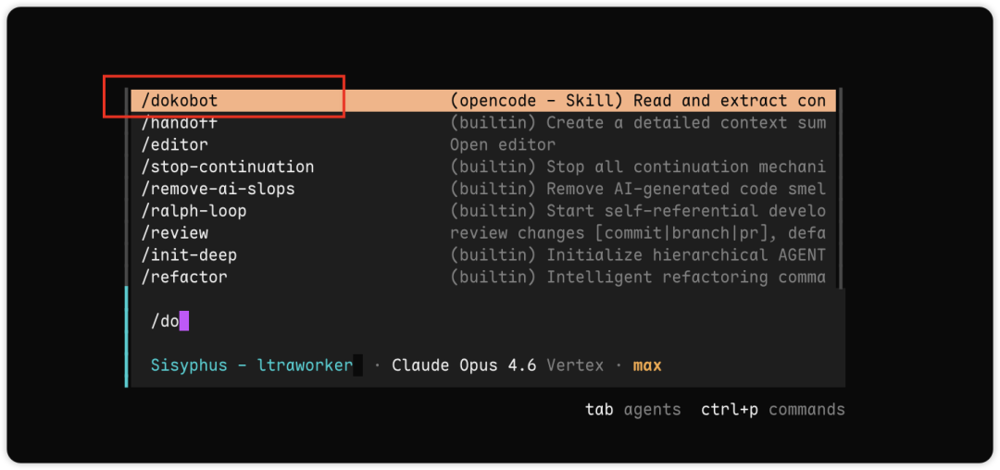

随后，我们就可以在对话框里这样使用啦。

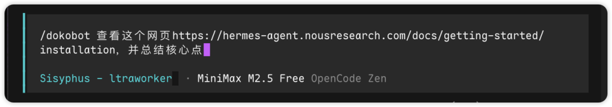

以很友好的格式为我输出了结果：

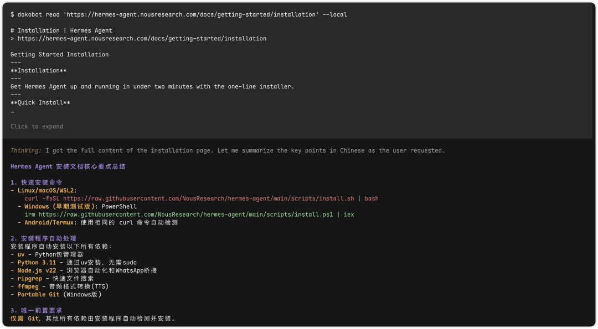

整个体验是很丝滑的。

如果在 OpenClaw 或者 Hermes Agent 里面使用，效果肯定很丝滑哈。

好了，关于 Dokobot 就先介绍到这里。

以上，如果本期内容你觉得不错，可以随手点个赞、在看，也欢迎转发给有需要的朋友，创作不易，感谢喜欢～我是晓来，再会。
