> 📎 来源: [机器之心](https://mp.weixin.qq.com/s?__biz=MzA3MzI4MjgzMw==&mid=2651029172&idx=1&sn=9035b7642dd93e365e43b35caba4876a&chksm=8575428e5108b8ff7b04a40e1ab5c2e425c300a1bf1cc6e53d5caf50eb2ba9be6e2faf178d38&mpshare=1&scene=1&srcid=0422yKRhJDocPffh03P54UVh&sharer_shareinfo=284526194bf6650b62c0ac6cd9a73ee3&sharer_shareinfo_first=284526194bf6650b62c0ac6cd9a73ee3) | 时间: 2026-04-22 17:34

---

编辑｜杜伟、冷猫

Agent 终于要告别「单打独斗」，迎来二阶段进化了吗？

就在今天凌晨，月之暗面正式发布并开源了 Kimi 系列最新一代旗舰模型 ——Kimi K2.6，距离[上个版本](https://mp.weixin.qq.com/s?__biz=MzA3MzI4MjgzMw==&mid=2651013995&idx=1&sn=67f58dc2037de606fb1abf2d79f1055b&scene=21#wechat_redirect) K2.5 推出还不到 3 个月的时间。发出来之后热度非常高，官推浏览量已经达到 400 万。

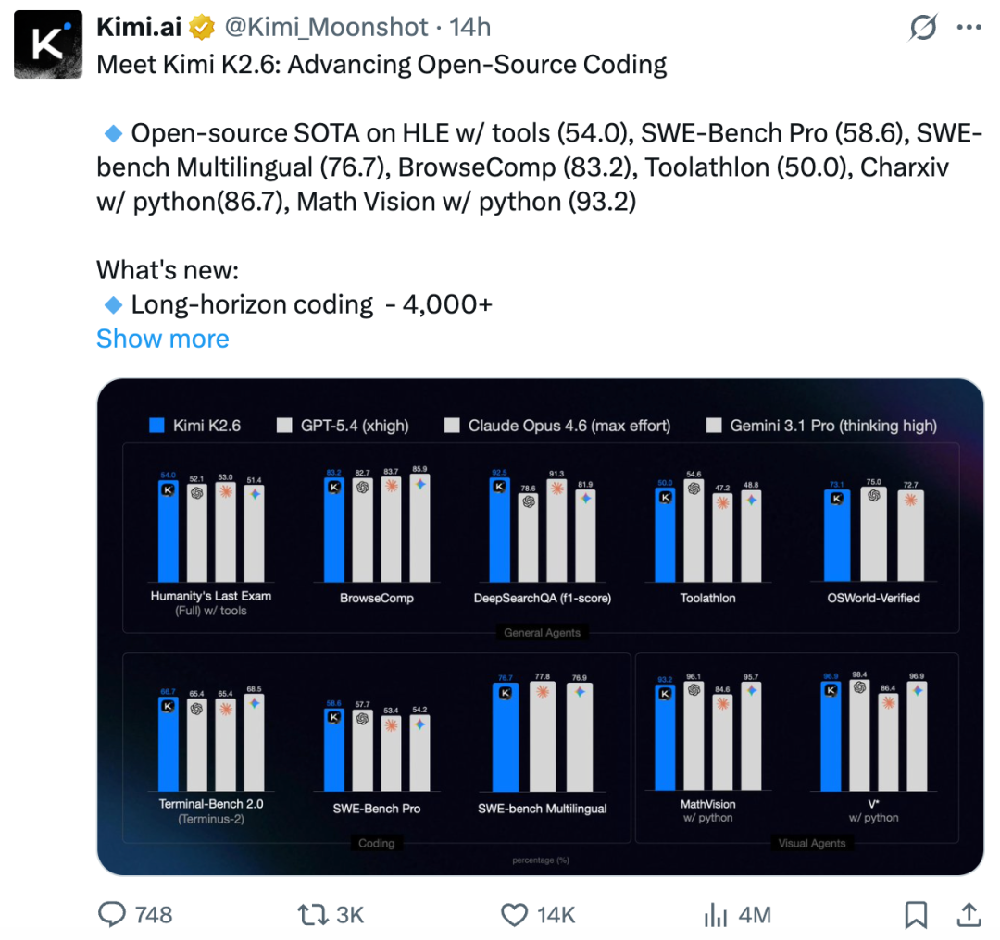

当前的 Agent 在处理复杂工程项目时往往力不从心，虽然它们擅长独立完成特定任务，但团队协作还有所欠缺。如何突破这一局限，成为 Kimi K2.6 的核心目标。

新版本探索了如何激发 Agent 的团队协作能力：进一步加强 K2.5 引入的 Agent Swarm（Agent 集群）功能，通过对 OpenClaw 等框架的适配强化 Agent 主动式工作，全新的 Claw Group（Claw 群组）又补上了组织协作这一能力。这一整套能力的系统性叠加，构建起了一个更接近人类团队的 AI 系统。

要实现这一切，底层模型必须足够强大。此次，Kimi K2.6 在通用 Agent、代码、看图理解这些核心能力上都有明显进步。像人类最后的考试（Humanity's Last Exam）、贴近真实开发场景的 SWE-Bench Pro 以及考察 Agent 深度检索能力的 DeepSearchQA 测试，K2.6 都稳稳领先竞争对手。

即使将 K2.6 与 GPT-5.4、Claude Opus 4.6、Gemini 3.1 Pro 这些闭源模型放在一起看，它也完全不虚，甚至有些指标还能压一头。

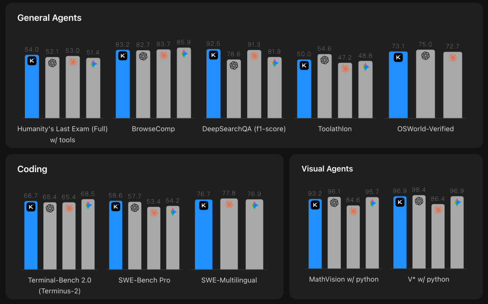

大模型评测平台 Artificial Analysis 给出最新结果，「Kimi K2.6 成为开源模型新王」！

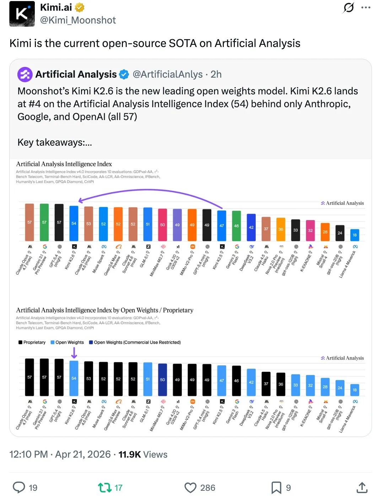

在上线 Kimi K2.6 之后，大模型聚合平台 OpenRouter 给出了颇高评价，认为月之暗面新一代模型主打长时序编程能力，专为需要持续执行的 Agent 场景打造。相比传统聊天机器人，它更像一个「系统工程师」，能把复杂任务拆解开来，一步步执行，并在过程中不断优化。

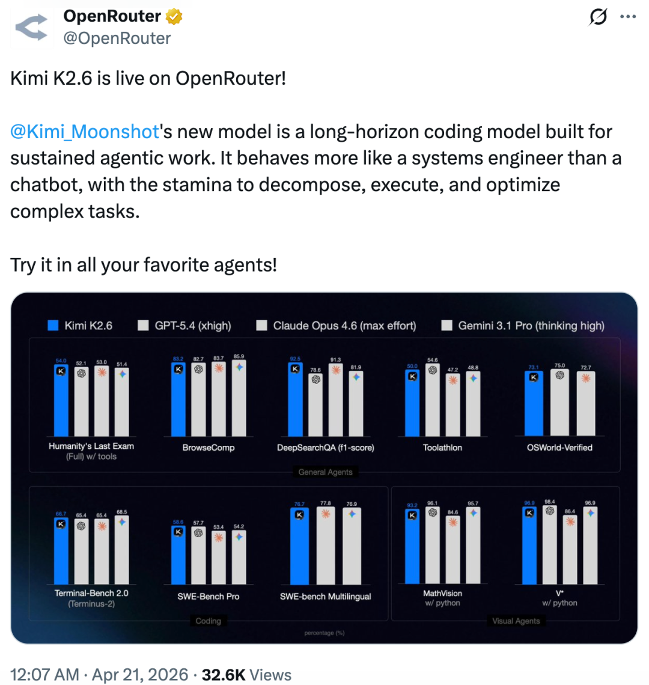

有网友感叹，这代 Kimi 旗舰模型强到离谱，写代码这块已经可以跟 GPT-5.4 掰手腕了，价格又比 Opus 4.7 低一大截，还是开源、免费用。现在基本每隔几个月，都会有一个新的开源模型逼近闭源 GPT 和 Claude。「感觉开源模型真的追上来了，而且都是中国在推进节奏。」

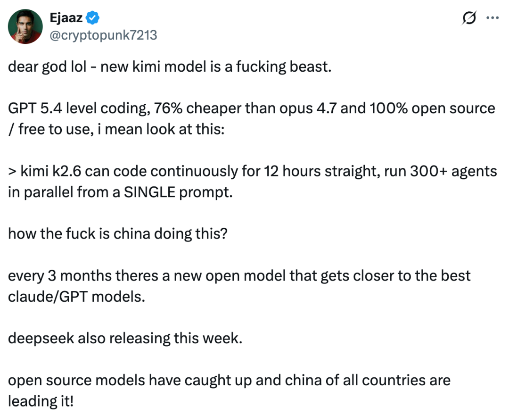

12 个小时连轴转、300 个 Agent 同时开工

Agent 终极形态来了？

此次，Kimi K2.6 在编程领域继续发力。几天前，海外还在热议低调上线的 Kimi K2.6-Code-Preview，并对 K2.6 正式版充满期待。

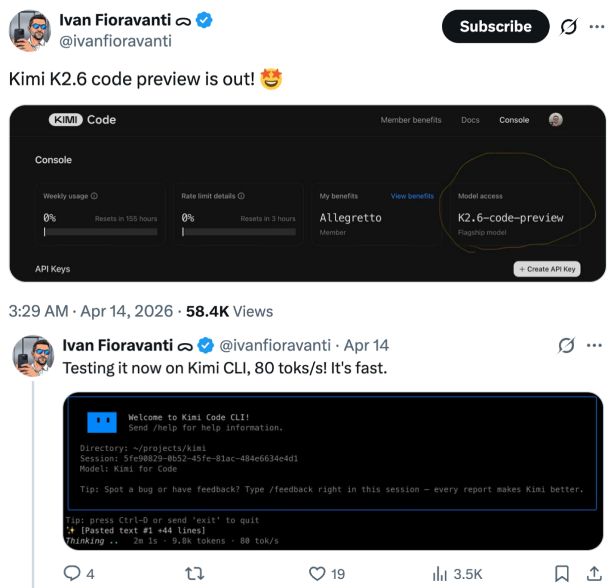

作为 Kimi 系列编程能力迄今最强的模型，Kimi K2.6 的长程编码能力实现了突破，有助于将软件开发的自动化推向更深层次的工程环节。

比如，Kimi K2.6 可以在 Mac 本地顺利下载 Qwen3.5-0.8B 并跑起来。它没有走常见技术栈，直接用小众的 Zig 语言重写推理流程并持续优化，这一步本身就体现了模型的泛化能力。

整个过程持续了 12 个多小时，期间调用工具超过 4000 次，前后迭代 14 轮。随着不断调参和重构，推理速度从最初的约 15 tokens/s 一路跃升到约 193 tokens/s，最终比本地大模型聊天应用 LM Studio 还快了大约 20%。

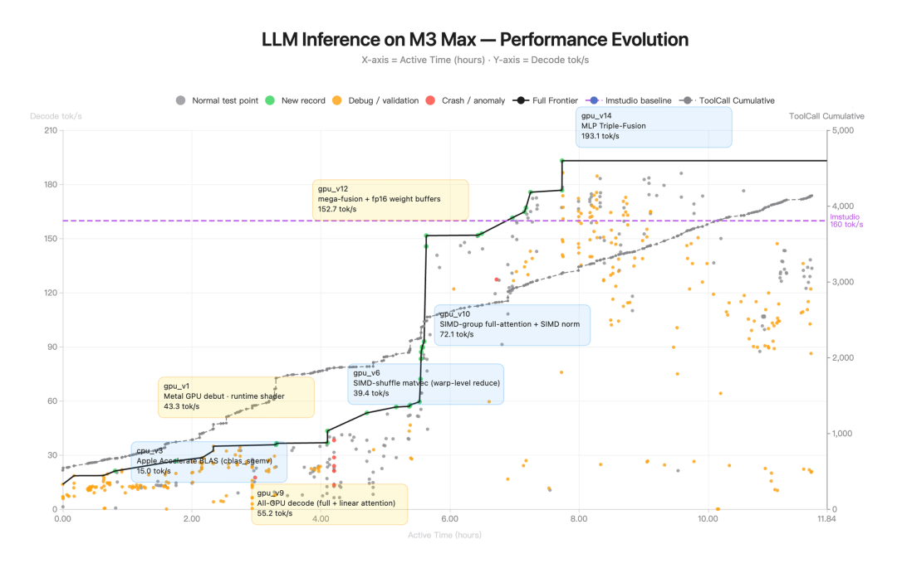

接下来到了 Kimi K2.6 此次升级的重心，其延续并进一步强化了 Agent 集群的协同输出能力。简单来说，该功能是要把「Agent 怎么一起干活」这件事理顺。

现在能做到什么程度呢？K2.6 把一个复杂任务自动拆开，分配给不同专长的 Agent，让它们各自处理搜索、深度调研、文档分析、长文写作等环节，再把结果拼接起来继续往下推进。

在这样一套机制下，一次运行就能完成整条链路：从原始资料、网页内容，再到 PPT 和表格，全部自动生成，中间不需要来回切工具，也不需要人手动接力。

同时，Agent 集群的底层架构也做了扩展，最多可以同时调度 300 个子 Agent，完成 4000 步协作，并行能力直接被拉到了一个新量级。规模上来之后，AI 的角色也变了：开始接管整个流程，并直接给出成体系的结果。

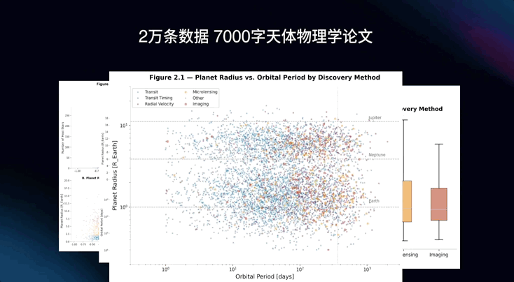

Agent 集群将一篇高密度视觉数据的天体物理论文拆解复用，生成了约 7000 字研究报告、2 万条数据集和 14 张图表。

为了让 AI 进化为一个全天候不间断、无需人工干预的赛博员工，Kimi K2.6 对 OpenClaw、Hermes Agent 等框架做了更加深入的适配。

为此，Kimi K2.6 进一步压榨模型的自主执行能力：无论是 API 调用的精准度、长时间运行的稳定性，还是执行复杂研究任务时的安全防护，K2.6 都表现得可圈可点。

在 Vibe Coding 方面，Kimi K2.6 的网站设计更加出彩。K2.6 生成的网站尤其是首屏区，一眼望上去有很大的视觉冲击力，风格的一致性也保持得不错。并且，各种交互元素与滚动特效等细节的加入，也能吸引用户停留更长时间。

除了前端设计，此次 Kimi K2.6 还给后端开发人员带来了惊喜，它上线了 Kimi 账户登录和表单信息收集功能。你可以用它创建一个活动报名页面，并轻松查看后端报名信息。如此一来，前后端衔接更加顺畅。

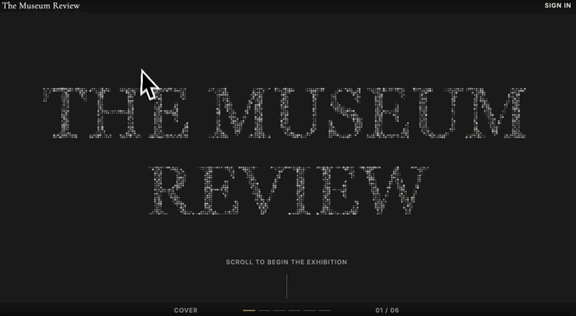

目前，Kimi K2.6 已成为 Kimi 网页版、App 和 Kimi Code 编程助手的默认模型，赶紧用起来。

一手实测，秀翻全场

话不多说，我们直接上手实测一些案例，看看效果如何。

测试第一 Part 选用「K2.6 Agent」，从实用和美学两个维度出发，看看它能不能做出一些足够抓眼的前端效果。

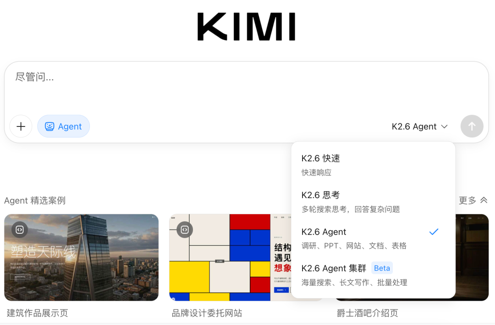

有人喜欢《女神异闻录 5》吗？

这是一种极具辨识度的艺术风格，是一场披着漫画外衣的视觉暴力美学。它用极度不规整的设计挑战审美惯性，将「反抗社会平庸」的主题直接刻进了像素和线条里。完美融合了平面设计与 3D 空间，让漫画符号和视觉表达深度融合。

如果，我们开一家 P5 风格的小酒馆，主页会是什么样的呢？

Demo链接：https://umxz7lursh26i.beta-ok.kimi.link/

我们发现，在构建前端网页的过程中，Kimi K2.6 智能体会进行充分的测试，甚至模拟点击操作：

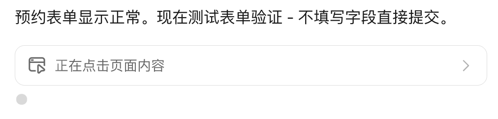

另外，我们做了个小彩蛋，让 Kimi K2.6 参考《女神异闻录 5 皇家版》的开场视频，完全不提供任何素材，做了一小段动画效果。

我们继续提需求，这次是另一种风格的前端设计：「为电商平台设计一个富有视觉冲击力的首页，顶部导航栏包含品牌标识、搜索框、购物车、登录 / 注册按钮，主横幅（Hero Section）展示平台的主要促销活动、热销商品或季节性优惠，在 Hero Section 下方展示推荐商品或类别，在首页底部或者某个显眼区域展示一些精选商品的用户评价。」

一次生成，就实现了超高完成度的首页。虽说略有些瑕疵，但我们相信一些小问题经过一次迭代就能修复，瑕不掩瑜。

我们接着实测了 K2.6 Agent 集群的功能，为斯坦福大学《2026 年人工智能指数报告》制作了宣传册，要求其交付网页、表格和 PPT，并且完全没有给予任何附加信息和文档，考验智能体集群相互写作的性能。

我们注意到，每个智能体有各自的工牌、职能说明和简介。使用 Agent 集群的时候，你真的会像一个运筹帷幄的董事长，调动手下一切人力资源，知人善任，瞬间打造一个工作小组，为你全自动地执行任务。就差把「靠谱」写在工牌上了。

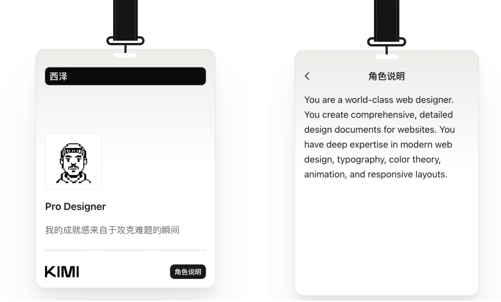

最终输出了我们需要的全部内容，金光闪闪的网页，高效排版的 PPT，以及严肃的数据表。

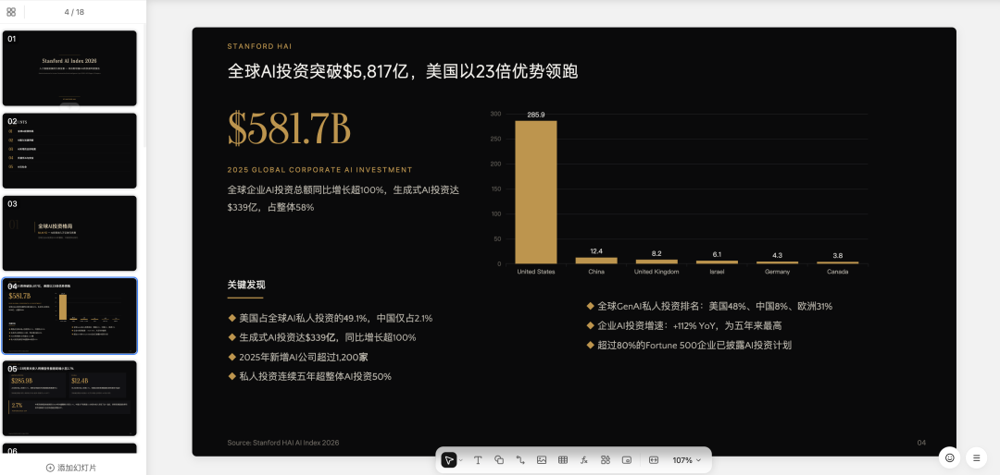

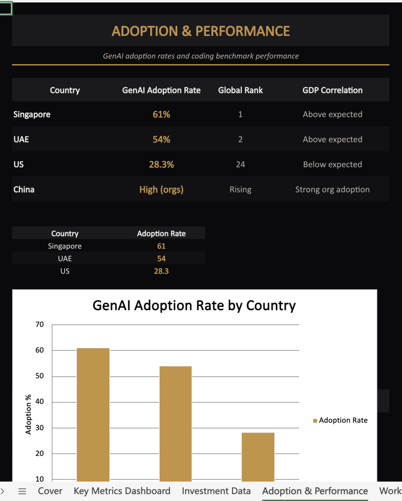

多智能体协作的未来已来？

上述一系列测试，让我们看到了 Kimi K2.6 作为 Agent 时代「基座模型」的强大实力。

在 OpenClaw 掀起的「龙虾热」持续升温的当下，全新登场的 Claw 群组又为智能体下一阶段的演进指出了一种清晰的路径。

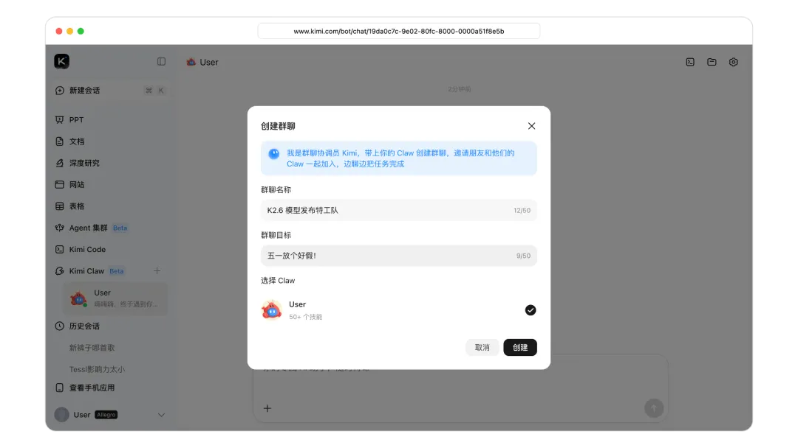

目前，Claw 群组已经开启小范围内测。

这一功能标志着智能体协作进入了一个全新的时代。你可以接入运行在本地、手机或云端的各种 Agent，它们各自带着工具、技能和记忆进场，在一个「群组」里共同推进任务。

在这里面，K2.6 更像一个调度的人：谁擅长检索、谁负责分析、谁来产出内容，它会按能力去分工。如果哪个环节卡住了，它也能及时发现，重新拆任务、换人接手，让流程继续走下去。

想象一下，当你需要准备一份复杂的汇报或是开发一个多层次的项目，Claw 群组的智能体们将像一群专业人士一样，在群聊中讨论、对接、调整，最终呈现给你一份精准、完备的成果。

这一创新不仅突破了传统的个体智能体执行模式，更推动了组织智能的前进。它的出现，让「多个 AI 智能体一起干活」这件事更接近现实。

© THE END 

转载请联系本公众号获得授权

投稿或寻求报道：liyazhou@jiqizhixin.com
