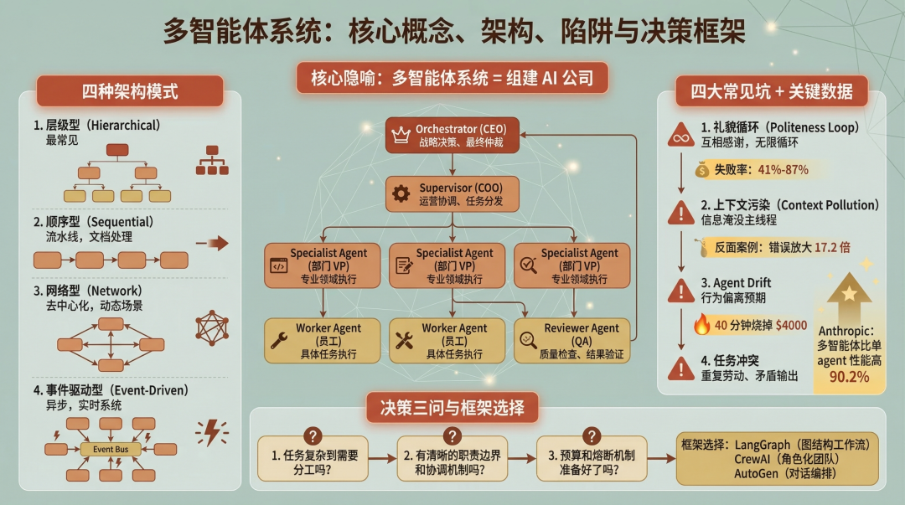
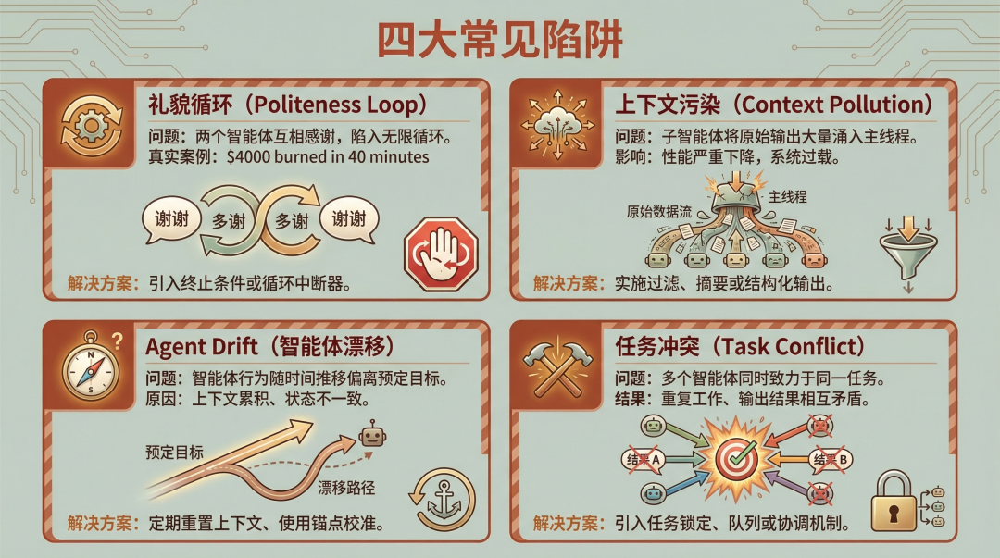

> 📎 来源: [AIGC生活实验室](https://mp.weixin.qq.com/s?__biz=MzkxODEwODkwOQ==&mid=2247484668&idx=1&sn=a2a3ce308856ae108941f144f7a345db&chksm=c029644a42cab8cd764c61adfc955168103e4c0e69c19b2f2fce18eb75e2bf391669280a89f9&mpshare=1&scene=1&srcid=0426HkSMNJUfJNRHitDi4qYm&sharer_shareinfo=dd029b5b2e2862607d358e9304155057&sharer_shareinfo_first=dd029b5b2e2862607d358e9304155057) | 时间: 2026-04-26 17:44

---

> **公众号**：AIGC 生活实验室
> **简介**：探索 AI 如何改变工作与生活
> **作者**：皮皮鲁呀鲁西西

多智能体系统不是堆砌更多 AI agent 就能变强，而是像组织一家公司 - 需要清晰的 CEO、部门经理、员工分工和协调机制。

说实话，多智能体系统（Multi-Agent System）这两年火得一塌糊涂。Anthropic 说自己的多智能体架构比单 agent 性能高出 90%，OpenAI 也在推 Codex 的多智能体工作流。但社区里翻车的案例一点也不少 - 错误放大 17 倍、失败率 41% - 87%、过度设计导致不如单 agent 好用。

## 把多智能体系统当成一家公司

先说个核心比喻，后面会反复用到。

多智能体系统，本质上就是在组建一家**AI 公司**。

你想啊，一个公司要有 CEO 做战略决策，要有部门经理协调工作，要有员工干具体活，要有 QA 检查结果。多智能体系统也是一样：

•**CEO → Orchestrator**：战略决策、最终仲裁

•**COO → Supervisor**：运营协调、任务分发

•**部门 VP → Specialist Agent**：专业领域执行

•**员工 → Worker Agent**：具体任务执行

•**QA → Reviewer Agent**：质量检查、结果验证

这个类比不是瞎编的。有一篇专门讨论 AI agent 组织架构的文章指出：**大多数企业把 agent 系统当成软件实现，但实际上，它们是在构建需要所有权、控制层级、治理和透明度的功能单元，就像人类组织一样。**

所以，当你考虑要不要用多智能体系统时，先问自己一个问题：**这个任务复杂到需要组建一个团队吗？**

如果一个人能干完的活，你非要拉一个部门，那不是效率，是官僚主义。

## 90% 性能提升背后的条件

Anthropic 在 2025 年 6 月发了一篇工程博客，分享了一个很有意思的数据：

> 一个以 Claude Opus 4 为主智能体、Claude Sonnet 4 为子智能体的多智能体系统，性能比单智能体的 Claude Opus 4 高出 **90.2%**。

90% 的提升，听起来很夸张。但这里有几个容易被忽略的前提：

1.**任务是**研究复杂话题：Anthropic 的 Research 功能，需要探索多个信息源、综合分析。这种任务天然适合分工

2.**主智能体负责规划，子智能体负责搜索**：职责边界清晰，不会互相踩脚

3.**子智能体只返回摘要**：不把原始中间输出丢给主线程，避免**上下文污染**

同样的多智能体系统，换个场景可能就是灾难。

有一篇分析文章给出了一个反常识的数据：**多智能体系统在某些任务上可以提升 81% 的性能，但在另一些任务上可能降低 70%。** 这不是四舍五入的误差，是成功和灾难的区别。

说白了，多智能体系统不是万能药。用对了是 90% 提升，用错了是 17 倍错误放大。

## 四种组织架构，选对很关键

既然是**组建公司**，那组织架构就有讲究。调研下来，主流的多智能体架构有四种：

### 1. 层级型（Hierarchical）

Orchestrator（CEO）
         /    |    \
      Agent  Agent  Agent（部门）

这是最常见的模式。一个主 agent 负责规划和协调，把任务分发给专业子 agent，最后汇总结果。

**优点**：集中控制，调试简单，适合合规性要求高的工作流。
**风险**：Orchestrator 可能成为瓶颈。

Anthropic 的 Research 功能用的就是这个模式。

### 2. 顺序型（Sequential）

Agent A → Agent B → Agent C → Result

流水线模式。每个 agent 处理完，传给下一个。

**优点**：复杂度低。
**缺点**：执行慢，一个环节卡住全链等待。
**适合**：文档审查、数据处理管道。

### 3. 网络型（Network / Peer-to-Peer）

Agent A ←→ Agent B
      ↕        ↕
  Agent C ←→ Agent D

去中心化模式。agent 之间点对点通信，没有中心协调者。

**优点**：弹性高，适合动态场景。
**风险**：协调复杂，可能出现冲突。

### 4. 事件驱动型（Event-Driven）

异步执行，响应式架构。适合实时系统，但需要强大的事件总线。

---

有个黄金法则值得记住：**Orchestrator 必须只协调，不执行。** 它分解任务、分发任务、验证结果、处理异常。但不写代码、不跑测试、不改文件。

换句话说，CEO 不应该亲自去写代码。

## 真实踩坑案例：四个最常见的坑

翻了一圈社区讨论，发现大家踩的坑出奇一致。

### 坑 1：礼貌循环（Politeness Loop）

开头说的 $4000 教训就是这个。

两个 agent 互相感谢、确认，陷入无限循环。一个说**谢谢你的帮助**，另一个回**不客气，有什么需要随时找我**，然后继续……

**解决方案**：设置最大对话轮数限制，使用确定性终止条件。比如，**对话超过 5 轮自动终止**或**任务完成标志出现即停止**。

### 坑 2：上下文污染（Context Pollution）

这是 OpenAI 官方文档里提到的问题。

如果每个子 agent 都把完整的执行过程返回给主线程，主 agent 的上下文会被大量无关信息淹没，性能直线下降。

**解决方案**：子 agent 只返回摘要，不返回原始输出。就像员工给老板汇报，说结果就行，别把所有邮件往来都转过去。

### 坑 3：Agent Drift（智能体漂移）

长时间运行的系统中，agent 的行为会逐渐偏离预期。可能是因为上下文累积、状态不一致，或者模型本身的随机性。

**解决方案**：定期重置、状态检查点、行为监控。

### 坑 4：任务冲突与状态不同步

多个 agent 同时处理相同任务，或者状态不一致，导致重复劳动或矛盾输出。

**解决方案**：任务队列、锁机制、统一状态管理。

---

有一个研究发现：**独立的多智能体系统，错误会被放大 17.2 倍。** 即使是集中式架构，错误放大也有 4.4 倍。

这不是小问题。

## 什么时候不该用多智能体？

有个开发者在论坛里分享了一个教训：

> 我花了三周多时间，搭建了一个优雅的多智能体系统处理文档 - 规划 agent、提取 agent、验证 agent、协调 agent……结果一个带好 prompt 的单 agent，一天就解决了同样的问题，准确率还更高。

过度设计是多智能体系统最大的陷阱。

根据调研，以下场景**不建议**用多智能体：

1.**简单任务**：单一 agent 足够处理的任务，没必要复杂化。

2.**低延迟要求**：多智能体协调会增加延迟，对实时性要求高的场景不友好。

3.**预算敏感项目**：API 调用成本可能失控，尤其是没有设置熔断机制时。

4.**高可靠性要求**：非确定性行为难以保证，需要 100% 可靠的场景慎用。

有个决策框架说得很好：**大多数**多智能体问题**其实是纪律问题。你需要的不是更多 agent，而是更清晰的边界、更好的状态管理，以及拒绝过早自治的勇气。**

## 框架选择：LangGraph vs CrewAI vs AutoGen

如果你确定要用多智能体系统，框架选择也很关键。目前主流的三个框架各有特点：

•**LangGraph**：核心理念是图结构工作流，适合需要状态管理、确定性执行的场景

•**CrewAI**：核心理念是角色化团队，适合需要清晰角色定义、任务分配的场景

•**AutoGen**：核心理念是对话编排，适合需要灵活对话、事件驱动的场景

LangGraph 把工作流当成有状态图，适合需要可视化、可调试的复杂流程。CrewAI 的思路是**组建一个团队**，每个 agent 有明确的角色和职责。AutoGen 则是用多智能体对话来解决问题，适合需要灵活交互的场景。

选择的关键在于：**你的任务更像流水线（LangGraph），还是更像团队协作（CrewAI），还是更像自由讨论（AutoGen）？**

## 写在最后

多智能体系统是一把双刃剑。

用对了，Anthropic 能拿到 90% 的性能提升。用错了，错误放大 17 倍。

核心问题从来不是单个 agent 够不够聪明，而是**如何让它们协同工作而不冲突**。就像管理一家公司，最难的不是招到聪明人，而是让聪明人高效协作。

如果你正在考虑要不要上多智能体系统，先问自己三个问题：

1.任务复杂到需要分工吗？

2.有没有清晰的职责边界和协调机制？

3.预算和熔断机制准备好了吗？

三个问题有一个答案是**否**，先别急着加 agent。

---

**相关资源**

Anthropic 多智能体研究系统：https://www.anthropic.com/engineering/multi-agent-research-system

OpenAI 多智能体文档：https://developers.openai.com/codex/multi-agents/

LangGraph 官方文档：https://langchain-ai.github.io/langgraph/

CrewAI 官方文档：https://docs.crewai.com/

AutoGen 官方文档：https://microsoft.github.io/autogen/

---

如果这篇文章帮到了你，点个在看👀吧，下次再见

---

**AIGC 生活实验室**

> 📮 投稿/合作：egretss.bai.it@gmail.com
> 💬 交流群：回复**加群**
> ✍️ 作者：皮皮鲁呀鲁西西
> 🚀 关注我，一起探索技术的更多可能
