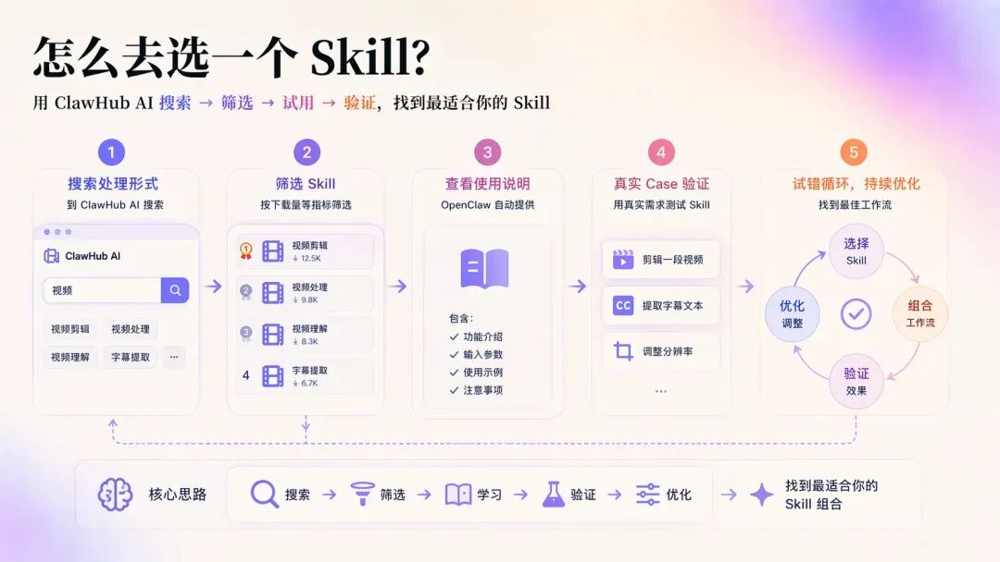
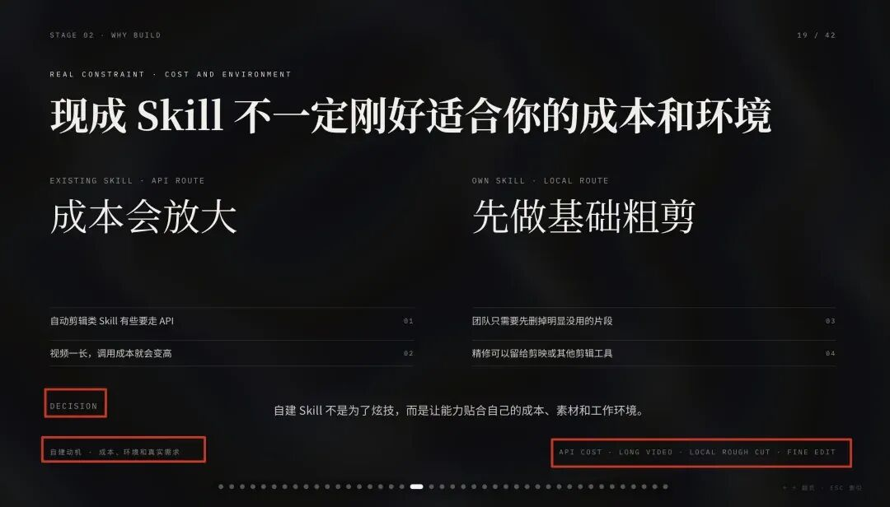
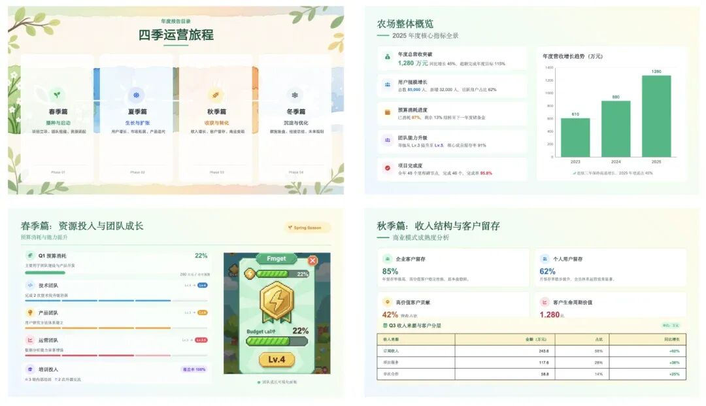

> 📎 来源: [AI工具实战pai](https://mp.weixin.qq.com/s?__biz=MzYzMzkwODkyOA==&mid=2247483705&idx=1&sn=4b59ce96eb6b50d7d06cfccbc71d6bef&chksm=f1eb193b835b7f02b8fb1fbfd6acd174e90c056952834663aa52bf0c209719150e38f80552be&mpshare=1&scene=1&srcid=05118q41lCaLJ78LOWMgJlsY&sharer_shareinfo=9414d73b62dd0cf628bfee398fce43fc&sharer_shareinfo_first=9414d73b62dd0cf628bfee398fce43fc) | 时间: 2026-05-11 02:53

---

这周我赶公司季度复盘会的 PPT，熬到两点还在改排版，第二天早上起来眼睛都是肿的，同部门的实习生看到了给我推了千问 PPT Agent，说她上个月做毕业答辩 PPT 全靠这个。

我之前踩过不少 AI 生成工具的坑，要么内容全是套话要么排版丑到没法用，本来没抱什么期望，想着反正死马当活马医，试了 3 次，结果第一次生成的内容改了 10 分钟就直接用了。

今天这篇就说我真实的使用感受，不吹不黑，不讲虚的参数，只说普通用户能不能用、好不好用。

# 我花了多少钱买的 / 试的

我最开始用的是免费额度，不用注册账号，直接在网页上就能试，每次可以生成最多 15 页的 PPT，每天有 2 次免费生成的机会。

试了两次觉得内容质量还可以，就开了个月卡，花了 39 块钱，主要是因为免费版不能导出可编辑的 PPT 源文件，生成的页数也不够我做工作汇报用。月卡每天可以生成 10 次，最多支持 50 页，还有不少行业模板可以用，对我来说性价比还可以。

# 我实测的核心功能

## 1️⃣ 文字转 PPT 功能

我是怎么用的：我把之前写的 3000 字季度复盘 word 草稿直接粘贴进去，选了「互联网行业汇报」的模板，还特意备注了 "要数据图表页，不要太花哨的动画，页数控制在 20 页以内"，点生成之后等了大概 2 分 40 秒就出结果了。

用下来怎么样：内容不是瞎凑的，我写的核心数据都自动提炼出来了，还帮我把几个业务增长的数据做成了柱状图和折线图，省了我自己做图的时间。

问题也有，有两页的逻辑顺序是反的，还有个业务指标的注释写错了，我自己调整了下顺序改了注释，前后花了 8 分钟就改完了。排版比我自己套模板好看，配色是统一的商务蓝，不用我再挨个调字体字号。

## 2️⃣ 大纲生成 PPT 功能

我是怎么用的：上周要做一个 AI 工具行业的分享，我还没写完整内容，只有个大概的大纲："1. 今年 AI 工具的发展趋势 2. 普通创作者能用的工具类型 3. 实际使用避坑指南"，我把这个大纲输进去，选了「分享类 PPT」风格，备注了要加案例页和互动提问页。

用下来怎么样：自动帮我把大纲扩充成了 18 页的内容，每个部分都补了具体的案例，甚至还给我加了 3 个用户常见问题的答疑页，正好适合我分享最后用。

缺点是补的案例有些比较旧，有个 2022 年的案例我换成了今年的，其他基本没怎么改，直接就用来做分享了，省了我至少 2 小时找资料的时间。

## 3️⃣ PPT 优化功能

我是怎么用的：我把之前自己做的一个很粗糙的客户方案 PPT 导了进去，选了「优化排版和逻辑」的选项，备注了 "要更正式的商务风格，突出合作收益部分"。

用下来怎么样：排版确实好看了很多，原来我乱堆的文字内容都自动分了点，重点内容还标了高亮，逻辑顺序也帮我调整得更顺，把客户最关心的收益部分放到了最前面。

问题是导入的 PPT 要是有很多自定义的图片，识别会有点误差，有两张我之前插的产品图位置歪了，我自己拖了下就好了。

# 四、我搜集的真实用户反馈

大家普遍说好的点：

快，赶急活的时候真的能救命，不用自己熬夜套模板

内容不敷衍，不是网上随便凑的套话，只要你输入的内容够具体，生成的内容基本能用

导出的源文件是可以编辑的，不像有些工具只能导出 PDF

大家普遍吐槽的点：

免费版的额度确实不够用，每天 2 次稍微多试几次就没了

生成的图表有时候格式不太对，需要自己微调

太冷门的行业模板很少，比如做生物科研、建筑工程的

我自己的感受是，这些吐槽都挺真实的，我用的时候也遇到过图表格式的问题，不过总体来说瑕不掩瑜，毕竟省下来的时间是真的。

# 五、这工具适合你吗

✅适合的人：

经常要做工作汇报、方案 PPT 的职场人，尤其是经常赶急活的

学生党做毕业答辩、课程作业 PPT，要求不是特别高的

要做行业分享、简单培训课件的

❌不适合的人：

要求特别高的，比如要做给大领导汇报的、非常专业的行业定制 PPT

做非常冷门的专业领域 PPT 的

想完全不用动脑子的，生成完直接就想用的

# 六、我的总结

优点：效率确实高，原来要花 2 小时做的 PPT，现在半个小时就能搞定；门槛低，不用学复杂的排版技巧。

缺点：冷门行业的模板少，免费额度不够用，生成的内容偶尔会有小错误。

建议大家先试试免费额度，觉得适合自己再付费，别上来就买年卡，万一用不上浪费钱。

# 📊 你们呢？

你们用 AI 工具做过什么？有什么坑想跟大家吐槽的？评论区聊聊！

# 📌 最后说两句

我每周都会实测 1-2 个 AI 工具，好用的我会推荐，不好用的我也会直接说。

觉得今天的文章对你有帮助的话，点个在看吧，让更多人少被坑。

我是木子晴，咱们下期见。

---

# 🎯 互动环节

💬 你在工作中遇到过最无语的加班是什么？评论区聊聊～

🎁 留言最用心的 3 位小伙伴，送精选 AI 提示词合集

如果这篇文章帮我省了不少时间，转给需要的朋友看看！

