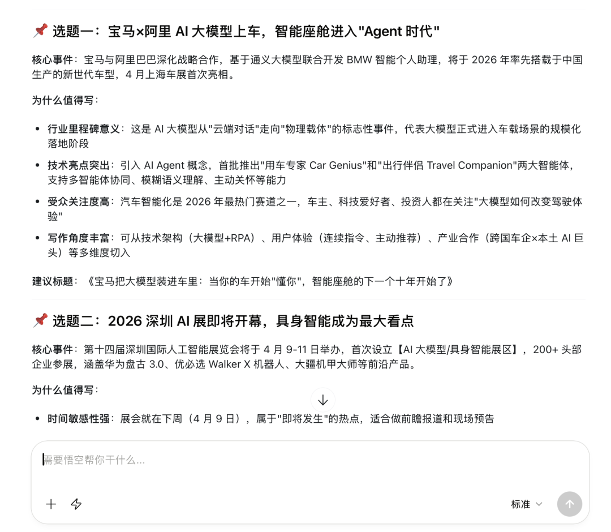
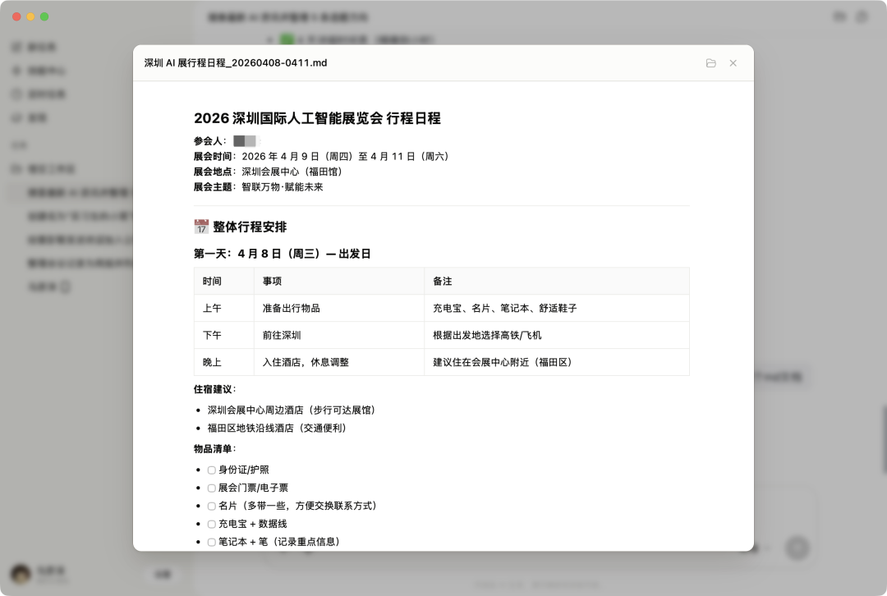
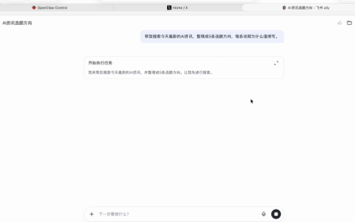
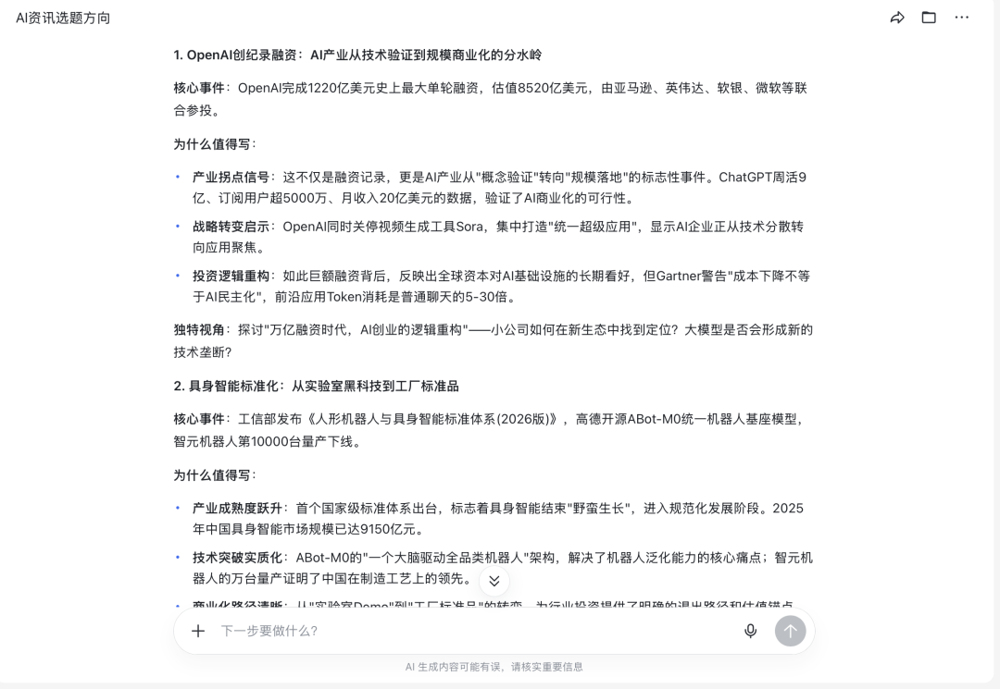
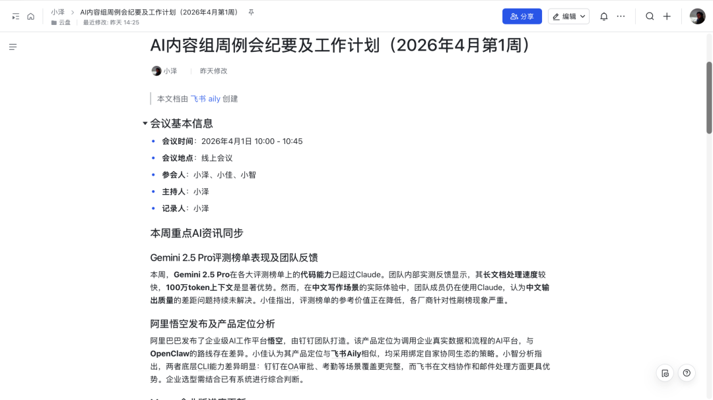
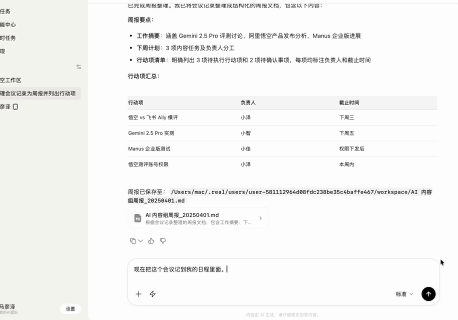
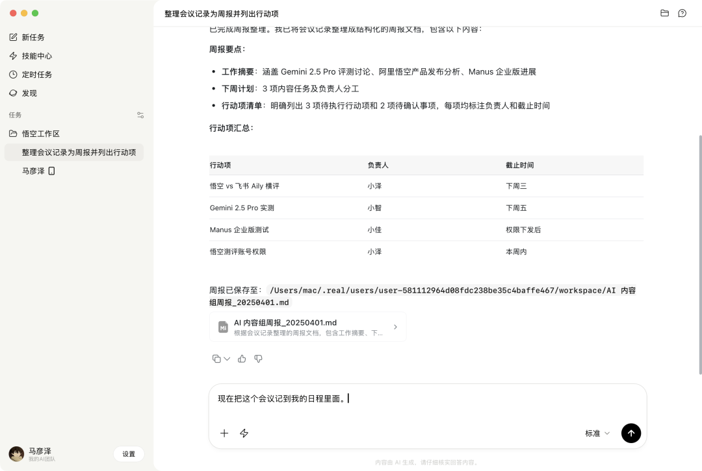
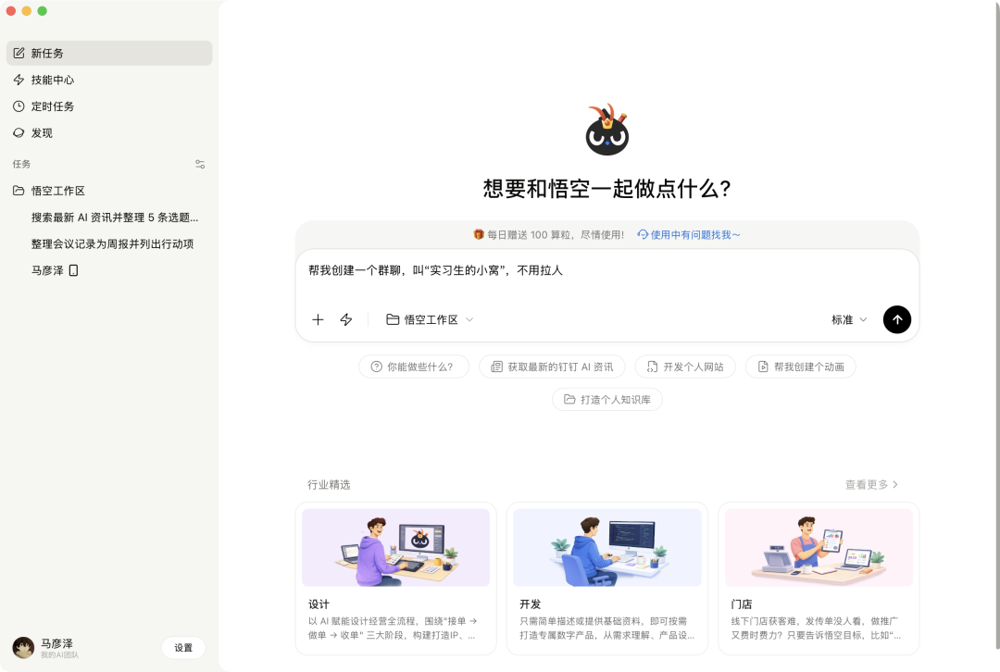
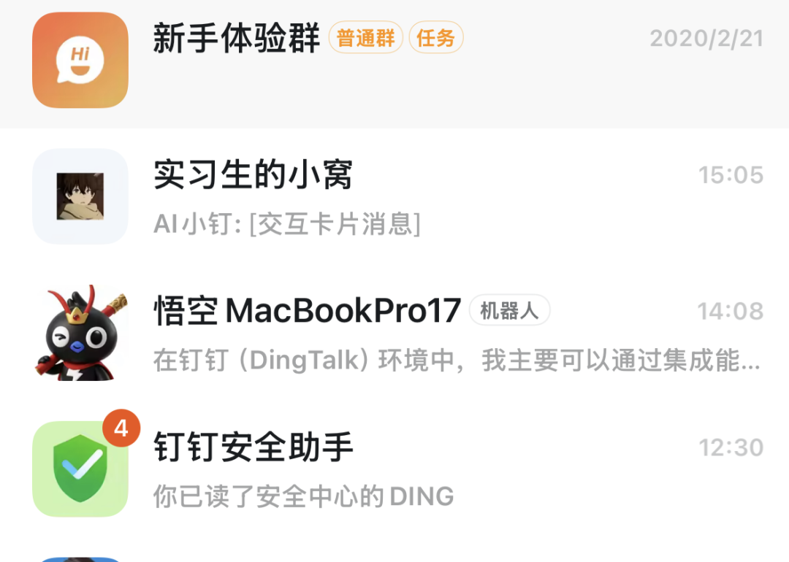
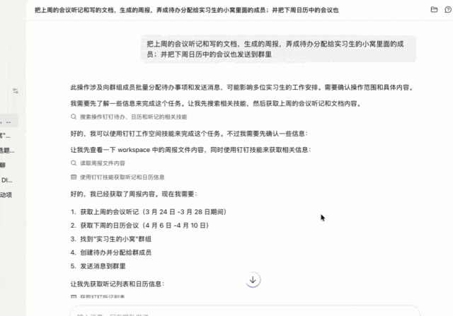

> 📎 来源: [路人甲TM](https://mp.weixin.qq.com/s?__biz=MzIzMDQyMjcxOA==&mid=2247514548&idx=1&sn=2bfcee10dfe72c49d095b3e73b41106a&chksm=e90716fa738dc1c3d510e222e675157553d1237b4530c2146607514c2daf01507aa4a1f1d21b&mpshare=1&scene=1&srcid=0410PsEG3WxwHpSW1wPdmtj3&sharer_shareinfo=09ec7adf794d910665652f18eab75322&sharer_shareinfo_first=09ec7adf794d910665652f18eab75322) | 时间: 2026-04-13 16:15

---

最近一个月，钉钉、飞书、企业微信先后开源了各自的CLI。

为什么这些走在国内前列的企业级办公软件一个个争先恐后地在干同一件事？

我想恐怕是因为大家都想知道：

当AI能够操控企业系统的时候，会发生什么？

这两天，飞书和钉钉也都推出了自家的AI办公提效工具：

飞书是aily，一个云端的AI助手。能够帮你在飞书生态中整理文档，查询日历，整理表格等等。

同时也能够让用户通过接入龙虾的方式，在本地电脑上，用Agent来协助工作。

钉钉这边是悟空，一个企业级的AI原生办公平台，把云端的工作流编排和本地Agent执行、企业级的安全管控给做成了统一的产品。

悟空是应用层直接调用底层，Aily是在飞书生态里协作，然后开发者再通过CLI做扩展。

简单来说，飞书Aily + 飞书接龙虾，这两块加起来，大致等于悟空一个产品做的事。

两者毕竟不是同一层级的产品，不过我们可以用同一个任务来看看它们各自的表现。

场景一：资讯整理

我给两边的提示词一样。

让它们搜索当天最新的AI资讯，整理出5条选题方向，并说明每条为什么值得写。

先看看悟空的效果：

一共给我写了5个可写的选题。

我看到选题二，突然来了兴趣。

既然是下周开，那我能不能试着让它添加到我的日程里面？

我直接跟他说：

我下周要去这个深圳展览会，替我规划一下行程并且添加到我的日程里。

悟空也是立马完成了这个任务。

也同步到了我手机里的钉钉。

再来看看aily。

速度一样很快。

不过我也想测试测试飞书的日程管理能力。

我告诉它这周五开会汇报这些选题。

也是很快就完成了。

还生成了飞书日程链接。

总的来说，悟空和aily任务完成的都不错，你挑不出什么毛病。

毕竟两家都是国内顶尖大厂出来的产品嘛。

如果非要说，那我认为悟空给的选题更偏企业应用场景，aily更偏资讯和科技方向。

都有可以借鉴的地方。

场景二：会议记录转周报

这个场景是想看看各家产品处理文档的能力。

我给两边发了同一份会议记录，让它们转成周报。

先来看看aily。

不得不说，飞书在文档处理这一块确实权威。

不仅生成了周报，还顺手给我存到飞书云盘里去了。

不过添加到日程的时候，出了点岔子。

我的提示词说现在把这个会议记到我的日程里。

aily直接添加到这周二开会了。。。

我想了想，其实我也有问题。

我的表述不够明确，让aily没有正确识别日期，换一句提示词就好了。

也不能怪它。

那在在企业管理这方面更加得心应手的悟空表现怎么样呢？

还是同样的提示词。

可以看到，悟空不但总结好了内容周报。

而且列了个表格，让我一眼就知道行动项目和各自的负责人。

悟空在替我们省事这方面真是煞费苦心啊。

我还让他们添加到了日程，下周二开会汇报。

OK，也是很好地添加到了我的钉钉日程里。

这次没有闹日期错误的乌龙。

不过也体现出了在同样模糊的指令下，

悟空更能理解上下文关系。

而且它还会自动加戏，一切为了人类服务。

悟空的专属场景

因为aily的定位和使用场景原因，这一段企业应用场景我只用悟空来跑。

我新建了一个钉钉账号，从零开始试试它的功能。

先建一个群，名字就叫实习生的小窝，哈哈。

一句话直接就建好了。

继续测试发消息的能力，让它在群里发一句言。

做的还蛮贴心的，标注出来的是悟空AI发送的。

我还想着到时候会把真人和AI发的消息搞混了，那就坏了。

然后创建一个明天早上10点的入职培训，这个想必新入职的新人都要经历。

这下可便宜公司里的人事了，一句话直接群发通知可太方便了。

我又想到：

能不能把这些场景用一句话串联起来，看悟空能不能完成任务。

可以看到，悟空在这个过程中除了问我要了两次权限之后，剩下的活都自己干完了。

一步步规划，获取信息，创建待办等等。

我在手机上看了看结果。

每个要求都做到了，没有出现卡BUG的地方。

而且也没有出现弄混的地方，不用手动返工对我来说真的太棒了。

整个过程我都没有打开钉钉，全是在电脑上和悟空对话。

这就是因为钉钉把底层全面CLI化了，从而悟空调用钉钉系统的方式发生了翻天覆地的变化。

从前的AI操作系统，本质上还是模仿人类在点击，遇到问题就先绕过去，要是碰到系统更新可能就直接歇菜了。

现在的悟空是另一种方式，它能够以一个合法的方式和系统进行对话，每一个指令都带着完整的权限，让系统认识它，知道它能做什么不能做什么。

这才能够实现这样的效果。

和飞书aily的差异不是能力层面，而是架构层面。

至于企业中常见的OA审批、考勤、DING消息。

这些飞书CLI都没有覆盖，根本原因也在这里。

不是飞书没做，是两边底层架构设计思路就不一样。

两条路，走向不同的未来

飞书走的是渐进式增强。

在现有协作体系上叠加AI能力，对现有用户友好，迁移成本低，今天就能用。缺点是受限于原有架构，能看到上限。

悟空走的是重构式创新。

钉钉把底层重写了一遍，从第一天就为AI原生设计，落地难度更高，但优点是潜力和想象空间大。

这让我想到移动互联网早期。

有一批产品是把PC网页缩小到手机屏幕上，使用是能使用，但最后赢的却是移动原生的产品。

两条路今天都能跑，但指向的未来不同。

企业如果要在现有基础上加个AI，飞书够用。

但企业如果要押注AI，把AI当成未来的生产力底座，那就得想清楚选的平台从底层是不是为AI而生的。

这个问题没有标准答案，但值得认真想一想。
