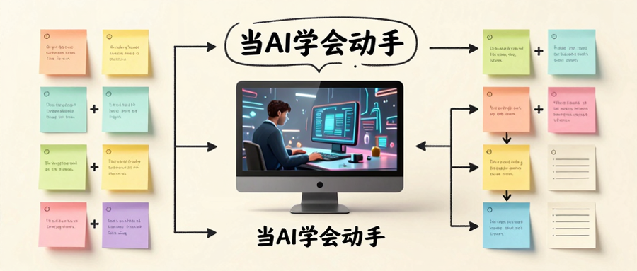

> 📎 来源: [明见如是](https://mp.weixin.qq.com/s?__biz=MzUxODUwMjc5NQ==&mid=2247484912&idx=1&sn=edb0eda5432e83deb0d526ca45ec4ce0&chksm=f8e934a34f920f2aaf19ed90ce638673cbf3db010b2f6e89d23a992dc68f753e246371b4b465&mpshare=1&scene=1&srcid=0429C1difnK2abrDWtb0E3oC&sharer_shareinfo=4c7e7b6a4c6f157aedf6ac6ad24c56a3&sharer_shareinfo_first=4c7e7b6a4c6f157aedf6ac6ad24c56a3) | 时间: 2026-04-29 11:47

---

> 这不是一篇普通的工具教程，而是一次关于「AI如何落地」的深度思考。

## 写在前面

我为什么要写CUA？

因为我发现了一个被严重低估的趋势：**AI正在从「能说会道」变成「能说会做」。**

过去一年，大家都在卷Prompt、卷Agent、卷Context Engineering。但真正的问题是——AI卷完了，然后呢？

总不能一直停留在「对话框里陪你聊」这个层面。

所以CUA出现了。它让AI不只是说话，而是真的能帮你操作电脑。这件事的深远程度，可能超过大多数人的想象。



---

## 01｜先理解CUA是什么

### 什么是CUA

CUA全称Computer Use Agent，计算机操作智能体。

用人话说，就是一个能帮你操作电脑的AI。它能通过屏幕识别看到界面，然后模拟人类的鼠标点击和键盘输入去操作电脑。

如果说大模型是AI的大脑，那CUA就是AI的手和眼。

### CUA解决了一个根本矛盾

国内互联网的生态，你们懂的——大部分APP都不Open。

微信开放过外部操作接口吗？没有。淘宝开放过吗？没有。抖音、美团、小红书……一个个都是铜墙铁壁。

底层API走不通，AI被逼到只剩一条路：用眼睛看，用鼠标点。

所以CUA本质上是「用魔法打败魔法」——你建护城河砌得再高，我让AI模仿人操作，不就绕过去了？

听起来有点心酸？但这就是现实。

### CUA在革谁的命

我要说一个被忽视的角度：**CUA在革RPA的命。**

RPA（机器人流程自动化）做了二十年，一直不温不火。为什么？

因为RPA本质上是「脚本驱动」——你得写代码、设规则、盼着页面别改版。一旦网页改版，脚本全废。

从业者自己都自嘲：RPA最大的敌人不是AI，是产品经理改需求。

但CUA不一样。CUA是「模型驱动」。它不需要你写死脚本，它看得懂界面，学得会操作，甚至能沉淀经验。

让它操作一次，它就能记住。下次再让它干同样的事，它调用这个Skill就能更快、更稳。

这意味着从「你教它做」变成「它自己学」。相当于你花十分钟带了个徒弟，以后这活儿就是他的了。

而且边际成本趋近于零。

---

## 02｜Turix实操指南

### 安装

Turix有两个版本：

#### 桌面版（推荐新手）

1. 访问官网：https://turix.ai/

2. 下载安装包

3. 安装即用

桌面版的优点：

• 安装即用，有优化的图形界面

• Work（办公）模式和Chat（聊天）模式结合

• 安全权限做得更好——涉及到文件删除、发送邮件等关键步骤时，会弹窗询问用户

#### Agent版（推荐进阶玩家）

如果你本身就在用Codex、OpenClaw这些Agent，可以把Turix当成一个Skill挂载进去。

1. 把GitHub链接丢给Agent：

```
请帮我安装这个GitHub仓库里的Agent Skill：https://github.com/TurixAI/TuriX-CUA
```

1. 配置模型API

需要一个带有强大视觉识别能力的模型API。官方推荐组合效果最佳。

• 注册Turix官方API平台：https://turixapi.io/console/token

• 新建一个API Key

• 把Key提供给Agent，让它帮你配置

我实测发现，注册后账户余额里自动躺了100万Tokens，可以先白嫖。

### 基础操作

安装好后，基本操作流程是这样的：

1. **打开Turix**

2. **下达Prompt**：用大白话描述你想让它做什么

3. **看它执行**：鼠标会自动在屏幕上操作

4. **结果确认**：做完了你自己检查一遍

核心心法：**Prompt不需要写得和专业寫代码一样，只需要把你交给实习生做的事描述清楚。**

比如：

• 「打开微信，打开通讯录，找到新的朋友，从最上面一个一个点同意」

• 「打开这个文件夹，按日期排序，把3月份的文件移到Q1文件夹」

• 「打开美团，点我常吃的那家店」

---

## 03｜实战案例

### 案例一：批量处理文件

**场景**：每周整理100多个Excel，按月份分类

**Prompt**：

```
打开这个文件夹，按日期排序，把3月份的文件移动到「Q1」文件夹，把4月份的移动到「Q2」文件夹
```

**结果**：它真的在帮我分类。虽然偶尔会分错，但无所谓，我检查一遍改回来就行。

**我的启发**：AI的价值不在于「不犯错」，而在于「犯错之后能改」。迭代效率比初稿质量更重要。

### 案例二：自动化测试

**场景**：做小工具时，用CUA帮忙跑测试用例

**Prompt**：

```
打开这个网页，测试登录功能的各种边界情况：空密码、错误密码、特殊字符，记录每次的结果
```

**结果**：相当于多了个测试实习生。虽然偶尔会点错，但大部分时候比我自己测得全。

**我的启发**：AI和人的协作模式，应该是——AI做执行、人做校验。AI做初稿、人做终稿。

### 案例三：帮我写代码

**场景**：让AI打开Cursor，帮我写一个简单的API

**Prompt**：

```
打开Cursor，帮我写一个简单的API：用户注册接口，包含用户名、邮箱、密码三个字段，返回用户ID
```

**结果**：我还没说完，它已经把代码写完了。

**我的启发**：这已经不是简单地操作电脑了，这是直接在操作IDE。软件工程的生产力，可能会被重新定义。

以前我们要学编程、记API、调试bug。以后可能只需要会说话——说出你想要什么，AI帮你写。

这才是真正的「No Code」。

### 案例四：自动通过微信好友验证

**场景**：微信里有3000多个好友，每天都有人加，一个一个点烦了

**Prompt**：

```
打开微信，打开通讯录，找到新的朋友，从最上面开始，一个一个点击验证通过
```

**结果**：鼠标自己在屏幕上动，有条不紊地点、验证通过、返回、再点下一个。把重复劳动甩给AI的爽感，谁用谁知道。

**我的启发**：这就是Product-Me Fit——与其追求Product-Market Fit，不如追求Product-Me Fit。我的痛点，就是产品要解决的唯一问题。

重复劳动，就是我的痛点。

---

## 04｜我始终没敢让它干什么

你们知道不，我最大的顾虑不是技术，是身份。

让它帮我点通过好友、通过。这没问题，做错了大不了我手动改回来。

但让它帮我发微信消息？我不敢。

原因很简单：**AI对自己的身份边界没有概念。**

让它回消息，它真的敢回。让它聊5轮，它能聊50轮。

这就是我之前说的：**错的内容只能看感觉，正确的内容才能感受文化。**

当AI可以用你的身份做事时，这个边界在哪？

我的答案是：**可回溯 > 不可回溯。**

如果一件事做错了你能查出来、能改回来，就可以让AI做。如果不行，那就死死握在自己手里。

这是技术向善的底线，也是人机协作的红线。

---

## 05｜我的判断

### CUA这个方向有戏吗？

**有戏。**

但窗口期不会太长。模型大厂也在卷应用，效率派的窗口期大概3-6个月。

### 现在能做什么？

把那些你每天都在做、但不想做的重复劳动，甩给它。

• 批量文件处理

• 重复性操作

• 自动化测试

• 数据查询

### 未来可能的变数

• AI厂商开放更多底层API

• CUA速度和准确度提升

• Agent进化出更强的身份边界意识

### 我的建议

牌局还长，关键是留在桌上。

不要慌，太阳下山��月光。

---

## 06｜Q&A

**Q：CUA和RPA的区别是什么？**

A：RPA是脚本驱动，CUA是模型驱动。RPA要写代码盼着别改版，CUA看得懂界面学得会操作。

**Q：CUA有没有封号风险？**

A：没有。因为它本质上就是在模拟正常人的鼠标点击，根本不涉及底层协议破解。

**Q：让AI帮我操作电脑，安全性怎么保障？**

A：桌面版在涉及到文件删除、发送邮件等关键步骤时会弹窗询问用户。核心是「可回溯」——做错了你能改回来。

**Q：CUA可以帮我付款吗？**

A：理论上可以，但涉及钱的事建议手动确认。AI对自己的身份边界没有概念，你让它付10块，它可能敢付100块。

---

## 07｜资源入口

• Turix官网：https://turix.ai/

• Turix GitHub：https://github.com/TurixAI/TuriX-CUA

• Turix API平台：https://turixapi.io/console/token

---

## 最后

CUA这个方向，我认为值得关注。

不是因为它现在有多牛，而是因为它代表了一个趋势——AI终于从「说」变成了「做」。

这件事的深远程度，可能需要一年后才能看清。

但有一点是确定的：**AI的价值交付，正在从「能力展示」走向「价值交付」。**

用户买的不是能力，是结果。

这句话我说了很多遍，因为实在太重要了。

---

P.S. 你想让AI帮你干什么重复劳动？，有什么有意思的案例，欢迎评论区聊聊。

我的判断是——群众的力量是无穷的，总有人能玩出我想象不到的花样。
