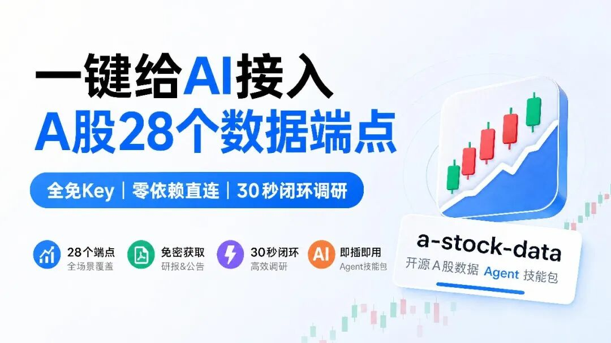
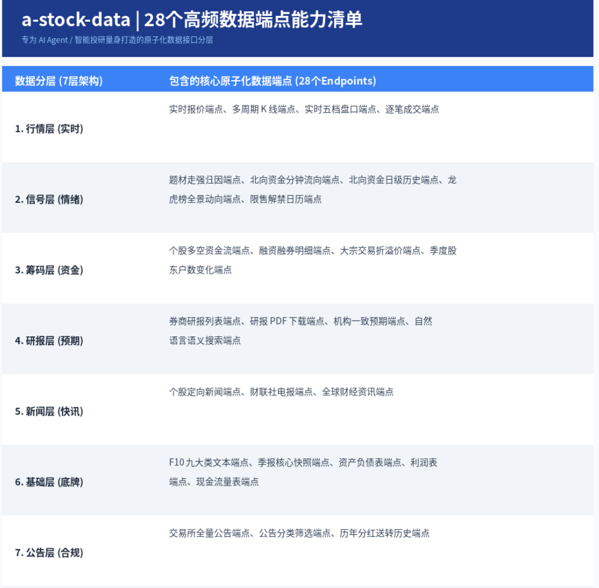
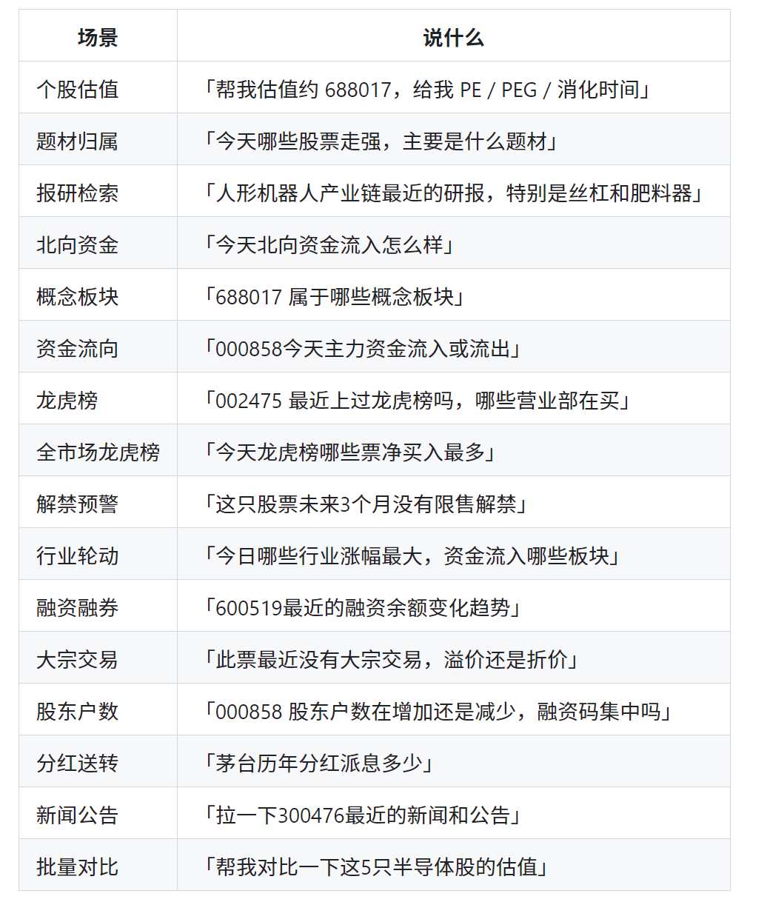
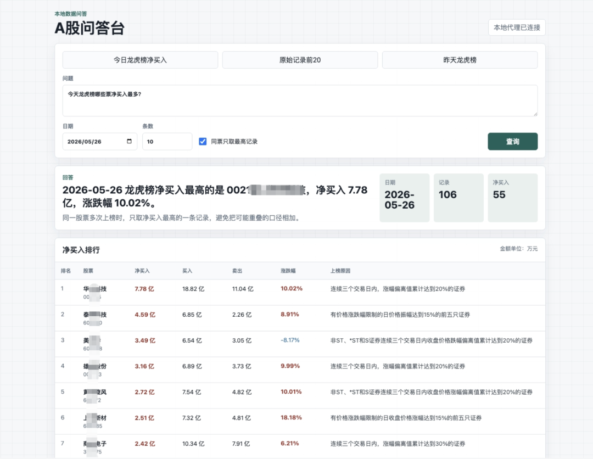

> 📎 来源: [开源AI项目落地](https://mp.weixin.qq.com/s?__biz=MzkyMTYwNjgwNA==&mid=2247495684&idx=1&sn=431bffba45927c1f0c50138b41a34233&chksm=c0cba639356a9550d892d3f9e31f0246e462b7f76b6d4a58f592ed40fb8d2e8b541e165a7e29&mpshare=1&scene=1&srcid=0529UEM25IA7oM6ahX24svp2&sharer_shareinfo=de2e89bebe1f576647f1e6ea0731ddc4&sharer_shareinfo_first=de2e89bebe1f576647f1e6ea0731ddc4) | 时间: 2026-05-29 12:14

---



聪明的你想用Agent去分析股票，但是却发现根本没法用，很多数都是错的或者AI幻觉出来的。

问题就在于数据来源没解决。

去网页搜索的数据那准确性实在是太差了。

**而且数据非常分散，自己捣鼓非常非常麻烦！**

今天给大家推荐一个开源的工具包，一键给Agent接入A股28个数据端点。

**你没听错，是一键**，不需要API，也更不需要登录注册这些复杂的操作，全都在一个skill里，非常方便。

**项目简介**

a-stock-data 是一个A股全场景数据 Agent 技能注入包，在 30 秒内闭环完成基于客观大厂数据的自动化调研。



全方位覆盖了从实时五档盘口、主力资金分钟级流向，到券商研报免密PDF下载、巨潮公告精准匹配、F10核心基本面快照等28个高频数据端点。

**DEMO**

用起来很简单，把链接丢Agent里，1分钟就能用上了。

先给大家看下比较常见的可以用它来解决的问题。



我随便选了个问题来测试下。



**功能特点**

- **零依赖直连稳定不挂**

  移除了二次封装库，原生Python直连13个大厂底层HTTP API和通达信TCP行情源，中间商最少，不因为第三方库不兼容崩溃。
- **7层全栈架构，28个端点全覆盖**

  一站式打通 A 股投研闭环，包含实时行情、情绪信号、深度筹码、券商研报、财联社快讯及全量交易所公告。
- **极致节省token**

  对大模型上下文进行文本清洗和截断优化，过滤掉F10和基础资料中70%的无用废话，帮AI极大降低推理成本，防止长文本迷失。
- **全免Key架构**

  全库除问财外全部免Key免费，可高频调用。
- **即插即用**

  全套代码和逻辑打包成一个skill，直接丢进Claude Code或OpenClaw，内置单票估值、360°漏斗扫描等流程，让AI查数据层层递进不胡言乱语。

**项目链接**

```
https://github.com/simonlin1212/a-stock-data
```

**扫码加入AI交流群**

**获得更多技术支持和交流**

**（请注明自己的职业）**


关注「**开源AI项目落地**」公众号

与AI时代更靠近一点
