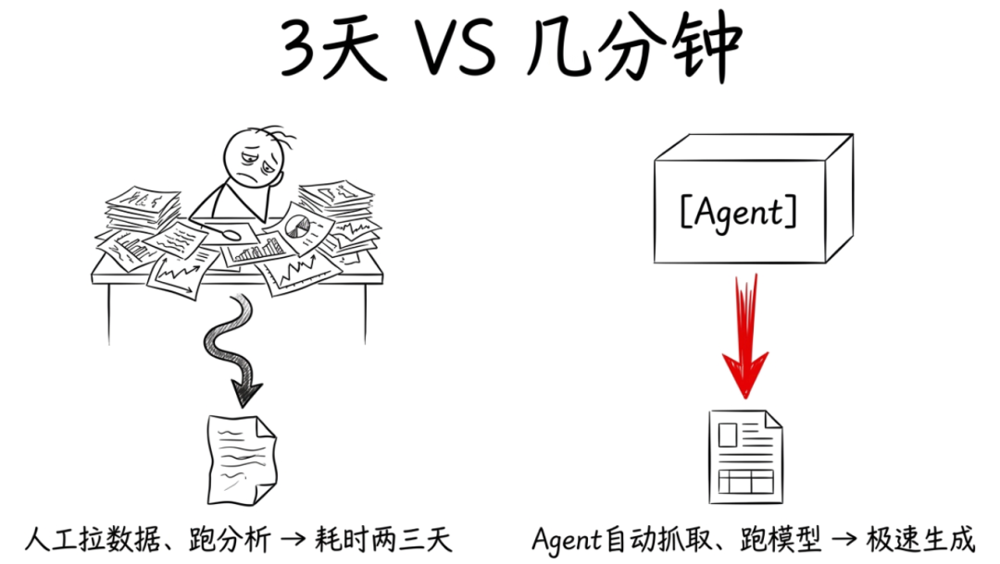
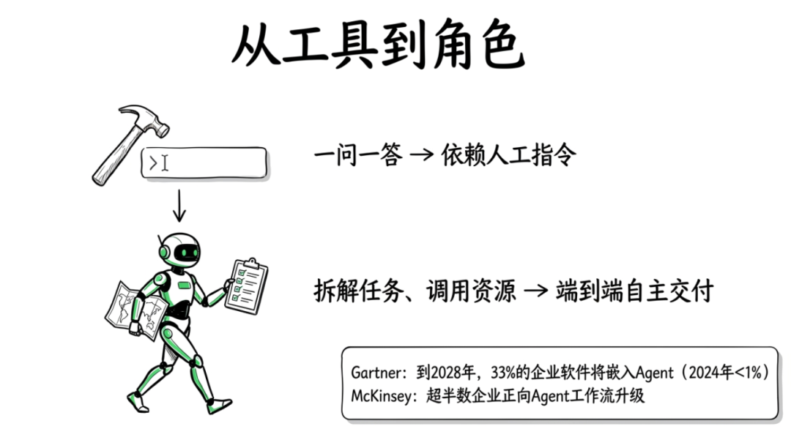
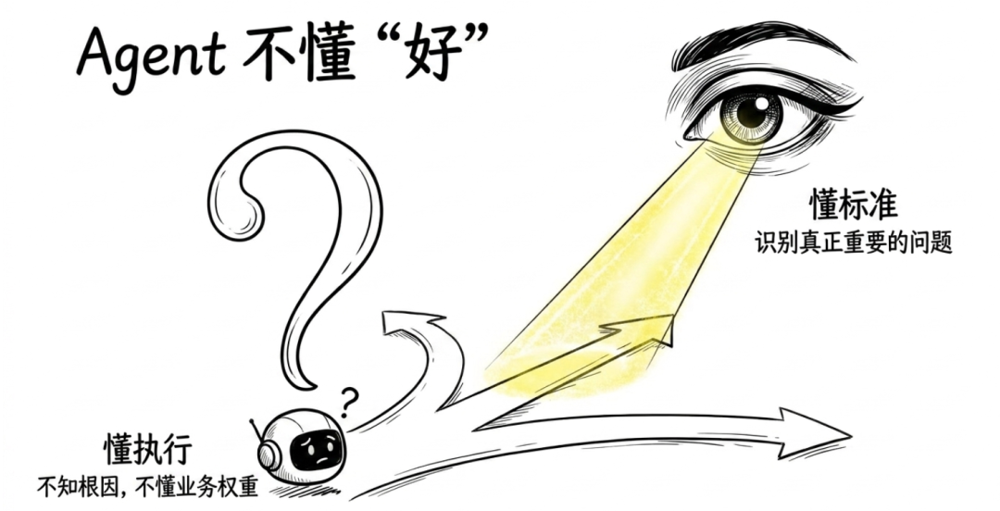
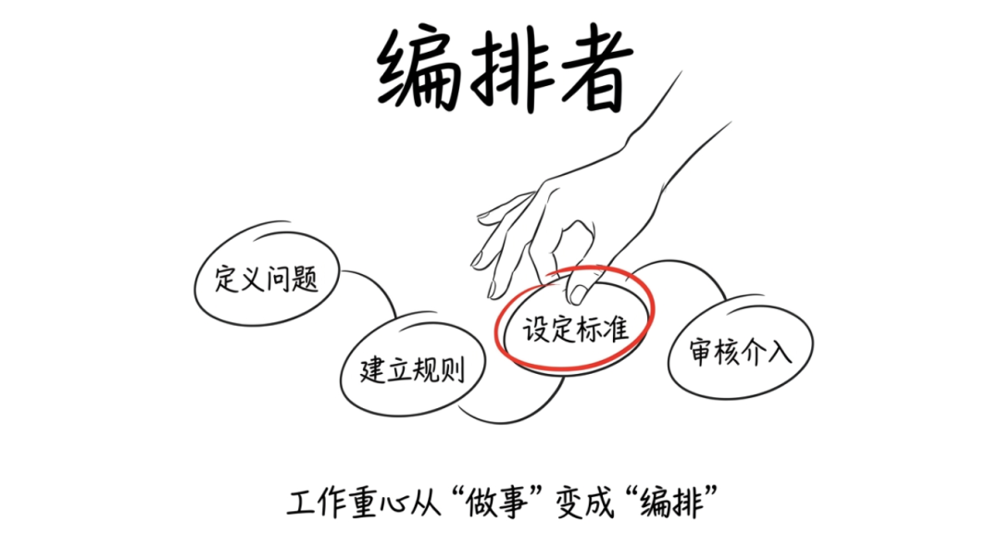
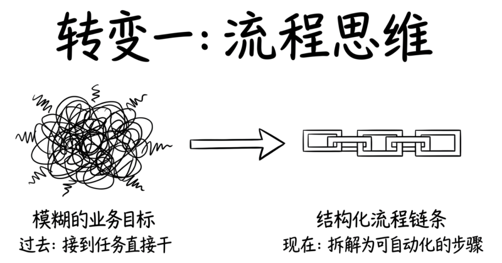
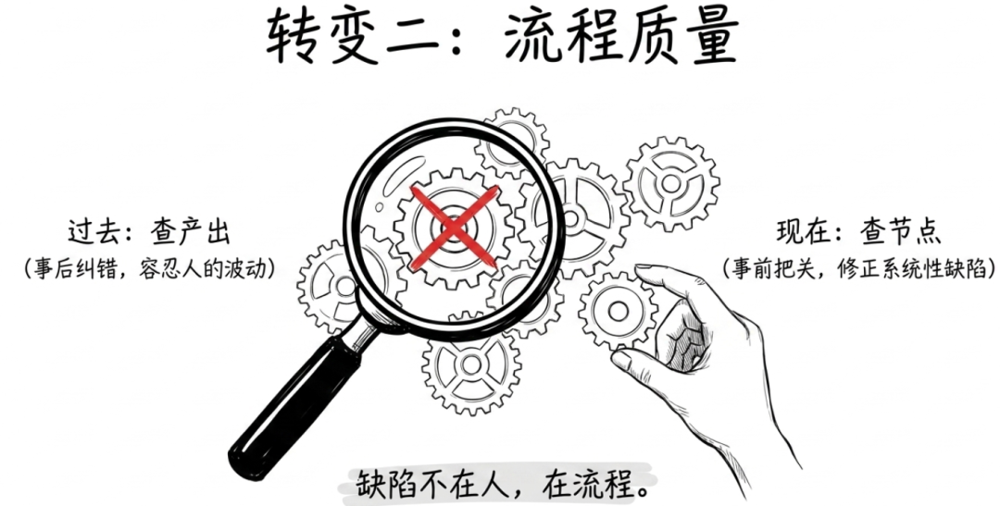
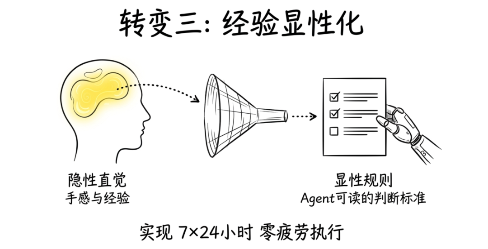
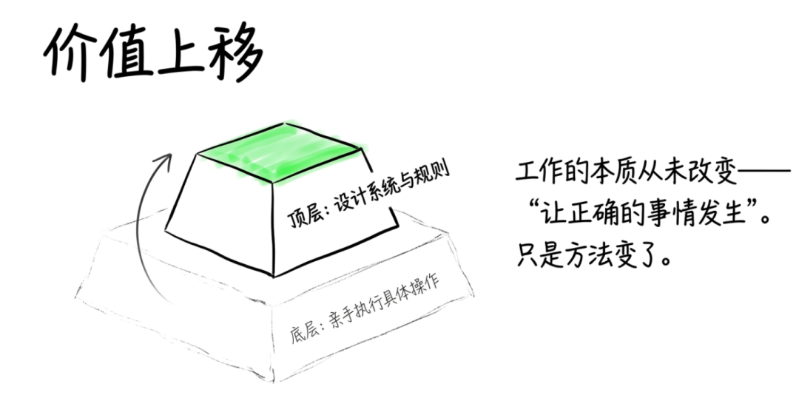
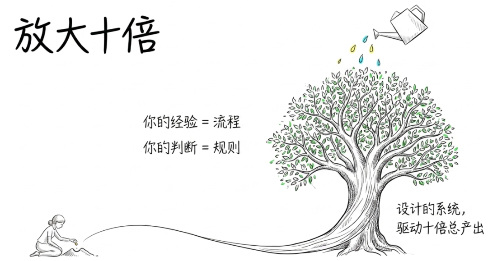

> 📎 来源: [金技局](https://mp.weixin.qq.com/s?__biz=MzE5ODU0NjU0Mg==&mid=2247484585&idx=1&sn=f4e1b88f8271ca55d13428b753ddebc0&chksm=9764ff035c9789123662545255e4d8aaba0c81bc38a4bea0455cc182c05dbd54e1c7045024da&mpshare=1&scene=1&srcid=0501GesyelLsdaMiI6ikTIhY&sharer_shareinfo=2c7294a64b1a6745ec95d96797052777&sharer_shareinfo_first=2c7294a64b1a6745ec95d96797052777) | 时间: 2026-05-01 12:30

---

这周局长做了一件事，做完之后有点恍惚。

我搭了一个Agent，自动生成业务简报。

它做的事情是这样的：拉数据、跑分析、识别问题、匹配指标，然后从一个预设的工具库里自动推荐解决方案，最后输出一份结构完整、判断清晰的简报。

过去这活儿是人干的。一个熟练的分析师，从数据拉取到简报交付，大概需要两到三天。涉及跨部门协作的话，可能一周。

现在呢？几分钟。

我不是在炫耀效率提升。我是在说一个让我自己都有点不适的事实：这个Agent上线之后，我发现自己盯的东西变了，不是"这个简报怎么写"，而是"简报的生成流程对不对"。

这个变化比看起来要大得多。它不只是我个人工作方式的变化，更像是一个趋势的缩影。当Agent开始接管越来越多的执行性工作，"管事"的含义本身正在被重新定义。

## 一个正在发生的变化：执行的工作正在被Agent吃掉

先说一个很多人感受到、但没有说出来的现象。

过去一年，几乎所有大公司的AI战略报告里都在讲一个词：Agent。不是大模型对话框那种一问一答的AI，而是能自主规划、自主调用工具、自主完成多步任务的AI系统。

Gartner预测，到2028年，33%的企业软件将嵌入Agent能力，而2024年这个数字不到1%。麦肯锡的调查更直接：已经部署AI的企业中，超过一半正在将独立AI工具升级为端到端的Agent工作流。

什么意思？过去AI是一个"工具"，你问它一个问题，它给你一个回答。现在AI正在变成一个"角色"，你给它一个目标，它自己拆解任务、调用资源、完成交付。

这对每一个职场人的冲击是直接的。

不管你是团队负责人还是一线执行者，你都会发现一件事：过去你花大量时间做的那些执行性工作：写报告、做分析、整理数据、跑流程，正在一件一件被Agent接手。

留给人的，不再是"动手做"，而是"想清楚怎么做"。

## 局长的一个实践：搭完Agent之后，工作重心变了

回到我搭的那个Agent。

它的工作流大概是这样的：

第一步，自动抓取机构的经营数据和公开信息。

第二步，跑分析模型，识别核心问题和异常指标。

第三步，从一个预设的解决方案库里做匹配推荐。

第四步，整合成一份结构化的业务简报。

听起来不复杂。但做的过程中，我发现了一件非常反直觉的事：

最难的部分不是技术，是流程设计。

Agent本身很强，它能处理数据、做分析、出报告。但它不知道"好"的标准是什么。它不知道哪些指标对合作方真正重要，哪些问题是表面问题、哪些是根因，哪些解决方案看起来正确但在实际场景里根本行不通。

这些判断，必须由人来做。

但不是以"自己动手写报告"的方式，而是以"设计流程"的方式。

我花了大量时间做的不是写代码，而是：定义什么叫"好的问题识别"、建立解决方案推荐的匹配规则、设定输出质量的检查标准、以及在关键节点设置人工审核的介入机制。

换句话说，我的工作重心从"做事"变成了"编排"，编排Agent的工作流程，确保它产出的东西是靠谱的。

做完之后我意识到：这可能不只是我个人效率的提升。这是一种新的工作模式：人负责设计和判断，Agent负责执行和交付。

## 这个趋势对每个人意味着什么？三个正在发生的转变

如果把这个变化往下推演，不管你是什么岗位，可能都会感受到三件事。

第一，日常工作从"做任务"往"设计流程"偏移。

过去一个典型的工作日：接到任务，做调研，写文档，交付成果。

Agent介入之后的工作日：设计一个工作流，定义每一步的输入输出和质量标准，让Agent去跑，自己做最后的审核和判断。

变化在哪？你不是在做"具体的活"，而是在想"这个活应该怎么被做"。日常工作从执行和操作变成了设计和优化。

这要求每个人具备一种过去不太被强调的能力：流程思维。 你得能把一个模糊的业务目标，拆解成一条结构清晰、可被自动化执行的流程链条。

第二，关注点从"产出本身"到"产出背后的流程质量"。

过去衡量工作好不好，看的是交付物：报告写得好不好、数据准不准、方案行不行。

现在如果你的工作涉及Agent协作，你需要关注的是流程本身：数据源靠不靠谱、分析逻辑有没有偏差、推荐规则是否准确、输出格式是否合规。

微妙之处在于：人做事有波动，偶尔出一次差错可以理解。但流程的缺陷是系统性的，如果流程逻辑本身有问题，它不会犯一次错，它会每次都犯同样的错。

这意味着我们需要培养一种"质量工程师"的思维：不只是事后检查结果，更要事前把关流程。发现一个错误时，不是归因于"人不行"，而是回溯"流程哪一步有缺陷"，然后修正它。

第三，经验需要被"翻译"成规则。

这一点最微妙，也最重要。

很多人工作中的核心竞争力是经验和直觉。一个干了十年的老手"感觉"某个方案不对，他可能说不清为什么，但判断经常是准的，因为他见过太多案例。

但当你要和Agent协作时，你必须把这些"经验"和"直觉"显式化、规则化。

因为Agent不懂"感觉"。你不能跟Agent说"这份报告质量差了点"，你必须定义"质量"是什么：数据时效性不超过多久？分析维度必须覆盖哪几个？推荐方案的匹配度用什么标准衡量？

这逼着每个人做一件以前可以不做的事：把隐性知识变成显性规则。

好处是巨大的：一旦规则建立好，Agent可以7×24小时、零疲劳、零情绪地执行。你的经验不再锁在自己脑子里，而是变成了一套可复用的系统能力。

坏处也很明显：如果你的规则本身就是错的，Agent会非常忠实地、大规模地、高效地执行一个错误的判断。

## 一个诚实的提醒：这件事没有想象中那么容易

说到这里，有必要泼一盆冷水。

从"做事"到"编排事"的转变，对很多人来说不是简单的技能叠加，而是一次工作方式的重构。

有些人的核心竞争力就是"手感好"：他写的报告天然有洞察、他做的分析自带判断力。这种能力非常宝贵，Agent替代不了。

但如果一个人只会自己做、不会把"怎么做好"的标准抽象出来给Agent，那他的产出就始终受限于个人的时间和精力。

反过来，另一些人天然有流程思维。他们本来就喜欢画流程图、定义标准、做系统化设计。Agent时代对他们来说如鱼得水：他们终于有了一个可以忠实执行他们流程设计的"助手"。

未来最有竞争力的大概是两种能力的叠加：既能自己做出好东西，又能把"好"的标准变成流程让Agent放大。

## 工作方式变了，工作的意义没变

最后说一个更根本的事。

有人可能会觉得，"设计流程"听起来没有"自己动手做"那么有成就感。亲手写一份漂亮的报告、亲自做一个精彩的分析，那种"手艺人"的满足感是真实的。

但我想说的是：工作的本质从来不是"亲手做"还是"设计着做"，而是"让正确的事情发生"。

过去，让正确的事情发生，主要靠每个人把自己手上的活做好。

现在，让正确的事情发生，越来越多地依赖于设计正确的流程、定义清晰的规则、在正确的节点做出正确的判断。

人的价值不是在缩小，而是在上移。

从"亲手执行"上移到"设计系统让执行自动发生"。从具体操作的执行者，变成流程和规则的设计者。

这不是某个岗位的变化，是每一个知识工作者都会面对的变化。

搭完那个Agent之后，我最大的感受不是"效率真高"，而是我对自己工作的理解被重新洗了一遍。

过去我以为做好工作就是"把手上的事做漂亮"。这句话今天依然对。

但它不够了。

26年之后，做好工作还得加一句：把你的经验变成流程，把你的判断变成规则，让Agent帮你把产出放大十倍。

你的价值不再只体现在你个人的产出里，而是体现在你设计的流程所驱动的总产出里。

不是你一个人能做多少事，而是你设计的系统能跑出多大的结果。

这可能是接下来几年，每个人最值得投资的能力。

关联阅读：

[Meta：真正该追问的不是"要不要蒸馏"，而是"蒸馏之后怎么办"](https://mp.weixin.qq.com/s?__biz=MzE5ODU0NjU0Mg==&mid=2247484571&idx=1&sn=a95884d70959b7bdf2d767598bd440c3&scene=21#wechat_redirect)

[初级岗位消失后，年轻人怎么长大？](https://mp.weixin.qq.com/s?__biz=MzE5ODU0NjU0Mg==&mid=2247484512&idx=1&sn=a7ebf633d2afbbee2f15a63a23bd3e25&scene=21#wechat_redirect)

[1800亿砸进去了，银行的AI到底长什么样？](https://mp.weixin.qq.com/s?__biz=MzE5ODU0NjU0Mg==&mid=2247484463&idx=1&sn=f1582f033537420dbac344936e446c2a&scene=21#wechat_redirect)

[AI编程杀死了初级程序员，还是杀死了"初级"](https://mp.weixin.qq.com/s?__biz=MzE5ODU0NjU0Mg==&mid=2247484343&idx=1&sn=454ad60c55d3f3604195284f70a1ea5f&scene=21#wechat_redirect)

[你以为你了解AI，其实你用的是去年的AI](https://mp.weixin.qq.com/s?__biz=MzE5ODU0NjU0Mg==&mid=2247484226&idx=1&sn=646d1909440b0403d0ae5bc621b401f0&scene=21#wechat_redirect)

[别被“别学了”骗了](https://mp.weixin.qq.com/s?__biz=MzE5ODU0NjU0Mg==&mid=2247484088&idx=1&sn=a62551ce53d469885fc48994b647ff12&scene=21#wechat_redirect)
