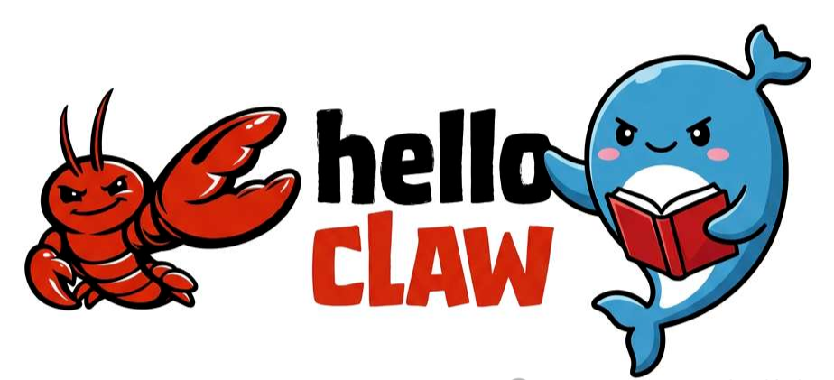
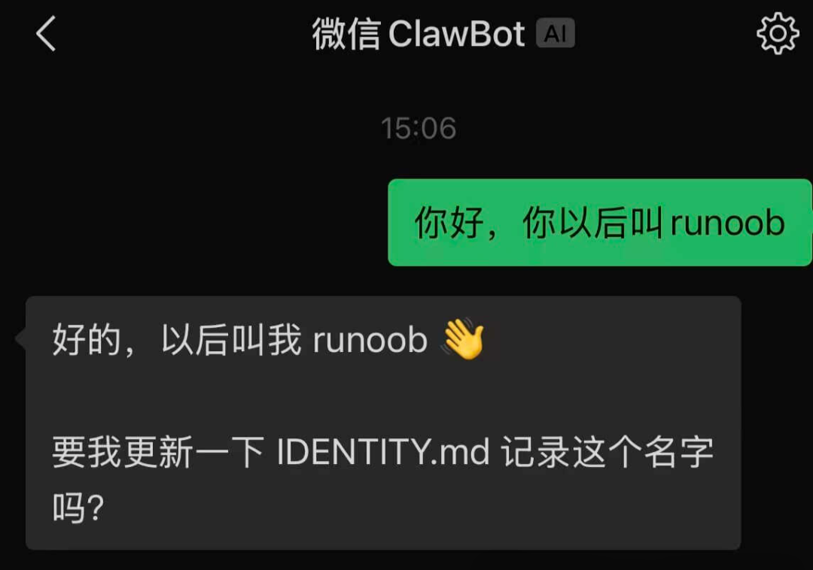
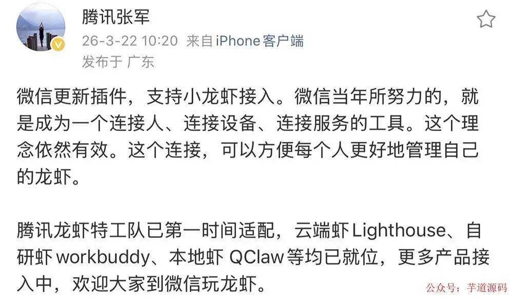
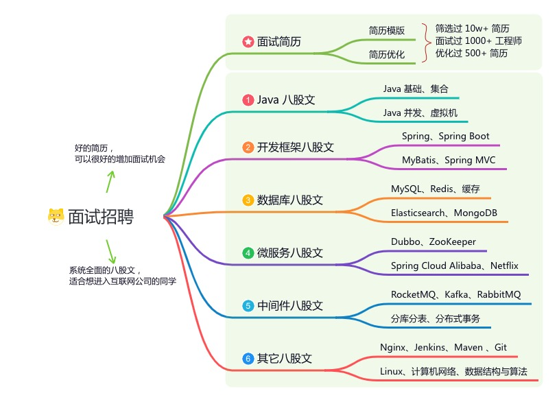

> 📎 来源: [芋道源码](https://mp.weixin.qq.com/s?__biz=MzUzMTA2NTU2Ng==&mid=2247619860&idx=1&sn=623cb2cc04761dce64558c0c77076add&chksm=fb08840124f7da01cd082dcd4e3166bd2f83bacf5cecd296c603bc54a33640b980087b9c97ac&mpshare=1&scene=1&srcid=05018hiscHjEOS1UN0Chz6dI&sharer_shareinfo=3014d738a9894050a5f8a67cf503b538&sharer_shareinfo_first=089895c8e233c791d71c34ab9f82b991) | 时间: 2026-05-02 01:12

---

> 👉 **这是一个或许对你有用****的社群**

> 🐱 一对一交流/面试小册/简历优化/求职解惑，欢迎加入「**[芋道快速开发平台](http://mp.weixin.qq.com/s?__biz=MzUzMTA2NTU2Ng==&mid=2247576728&idx=1&sn=1298645b025eb51d9078e8c3de7b3c17&chksm=fa4bd329cd3c5a3fd63e455cf39507d3611a7b040be1381fd5ecfc0a7ce3867575fda4b7313d&scene=21#wechat_redirect)**」知识星球。下面是星球提供的部分资料： 

> - [《项目实战（视频）》](http://mp.weixin.qq.com/s?__biz=MzUzMTA2NTU2Ng==&mid=2247576728&idx=1&sn=1298645b025eb51d9078e8c3de7b3c17&chksm=fa4bd329cd3c5a3fd63e455cf39507d3611a7b040be1381fd5ecfc0a7ce3867575fda4b7313d&scene=21#wechat_redirect)：从书中学，往事上**“练”**
> - [《互联网高频面试题》](http://mp.weixin.qq.com/s?__biz=MzUzMTA2NTU2Ng==&mid=2247576728&idx=1&sn=1298645b025eb51d9078e8c3de7b3c17&chksm=fa4bd329cd3c5a3fd63e455cf39507d3611a7b040be1381fd5ecfc0a7ce3867575fda4b7313d&scene=21#wechat_redirect)：面朝简历学习，春暖花开
> - [《架构 x 系统设计》](http://mp.weixin.qq.com/s?__biz=MzUzMTA2NTU2Ng==&mid=2247576728&idx=1&sn=1298645b025eb51d9078e8c3de7b3c17&chksm=fa4bd329cd3c5a3fd63e455cf39507d3611a7b040be1381fd5ecfc0a7ce3867575fda4b7313d&scene=21#wechat_redirect)：摧枯拉朽，掌控面试高频场景题
> - [《精进 Java 学习指南》](http://mp.weixin.qq.com/s?__biz=MzUzMTA2NTU2Ng==&mid=2247576728&idx=1&sn=1298645b025eb51d9078e8c3de7b3c17&chksm=fa4bd329cd3c5a3fd63e455cf39507d3611a7b040be1381fd5ecfc0a7ce3867575fda4b7313d&scene=21#wechat_redirect)：系统学习，互联网主流技术栈
> - [《必读 Java 源码专栏》](http://mp.weixin.qq.com/s?__biz=MzUzMTA2NTU2Ng==&mid=2247576728&idx=1&sn=1298645b025eb51d9078e8c3de7b3c17&chksm=fa4bd329cd3c5a3fd63e455cf39507d3611a7b040be1381fd5ecfc0a7ce3867575fda4b7313d&scene=21#wechat_redirect)：知其然，知其所以然


> 👉**这是一个或许对你有用的开源项目**

> 国产Star破10w的开源项目，前端包括管理后台、微信小程序，后端支持单体、微服务架构

> RBAC权限、数据权限、SaaS多租户、**商城**、支付、工作流、大屏报表、**ERP、CRM**、**AI大模型、IoT物联网**等功能：

> - 多模块：https://gitee.com/zhijiantianya/ruoyi-vue-pro
> - 微服务：https://gitee.com/zhijiantianya/yudao-cloud
> - 视频教程：https://doc.iocoder.cn

> 【国内首批】支持 JDK17/21+SpringBoot3、JDK8/11+Spring Boot2双版本

- [3 月 22 日，微信悄悄做了一件事](https://mp.weixin.qq.com/s?__biz=MzUzMTA2NTU2Ng==&mid=2247487551&idx=1&sn=18f64ba49f3f0f9d8be9d1fdef8857d9&chksm=fa496f8ecd3ee698f4954c00efb80fe955ec9198fff3ef4011e331aa37f55a6a17bc8c0335a8&scene=21&token=899450012&lang=zh_CN#wechat_redirect)
- [OpenClaw + ClawBot：双层架构看一眼就懂](https://mp.weixin.qq.com/s?__biz=MzUzMTA2NTU2Ng==&mid=2247487551&idx=1&sn=18f64ba49f3f0f9d8be9d1fdef8857d9&chksm=fa496f8ecd3ee698f4954c00efb80fe955ec9198fff3ef4011e331aa37f55a6a17bc8c0335a8&scene=21&token=899450012&lang=zh_CN#wechat_redirect)
- [研发能拿它干啥：5 个真实场景](https://mp.weixin.qq.com/s?__biz=MzUzMTA2NTU2Ng==&mid=2247487551&idx=1&sn=18f64ba49f3f0f9d8be9d1fdef8857d9&chksm=fa496f8ecd3ee698f4954c00efb80fe955ec9198fff3ef4011e331aa37f55a6a17bc8c0335a8&scene=21&token=899450012&lang=zh_CN#wechat_redirect)
- [3 步接入：把 OpenClaw 接进微信](https://mp.weixin.qq.com/s?__biz=MzUzMTA2NTU2Ng==&mid=2247487551&idx=1&sn=18f64ba49f3f0f9d8be9d1fdef8857d9&chksm=fa496f8ecd3ee698f4954c00efb80fe955ec9198fff3ef4011e331aa37f55a6a17bc8c0335a8&scene=21&token=899450012&lang=zh_CN#wechat_redirect)
- [真在用之前要绕开的几个技术坑](https://mp.weixin.qq.com/s?__biz=MzUzMTA2NTU2Ng==&mid=2247487551&idx=1&sn=18f64ba49f3f0f9d8be9d1fdef8857d9&chksm=fa496f8ecd3ee698f4954c00efb80fe955ec9198fff3ef4011e331aa37f55a6a17bc8c0335a8&scene=21&token=899450012&lang=zh_CN#wechat_redirect)
- [一句话收口](https://mp.weixin.qq.com/s?__biz=MzUzMTA2NTU2Ng==&mid=2247487551&idx=1&sn=18f64ba49f3f0f9d8be9d1fdef8857d9&chksm=fa496f8ecd3ee698f4954c00efb80fe955ec9198fff3ef4011e331aa37f55a6a17bc8c0335a8&scene=21&token=899450012&lang=zh_CN#wechat_redirect)

---

## [3 月 22 日，微信悄悄做了一件事](https://mp.weixin.qq.com/s?__biz=MzUzMTA2NTU2Ng==&mid=2247576728&idx=1&sn=1298645b025eb51d9078e8c3de7b3c17&scene=21#wechat_redirect)

3 月 22 日，微信上线了一个插件，叫 **ClawBot** 。发布会没有，公关稿没有——「我 → 设置 → 插件」里多了一行而已。

但对研发来说这件事有意思——**它意味着你的手机微信，第一次能直接当 AI Agent 的远程操控器** 。

通勤路上做技术规划、半夜 on-call、临时让 Agent 跑个 code review、远程触发 CI——这些以前要打开电脑才能做的事，现在可以**给微信里的 AI 联系人发条消息搞定** 。



下面先把架构讲清楚，然后直接说**5 个能立刻拿来用的研发场景** 。

> 基于 Spring Boot + MyBatis Plus + Vue & Element 实现的后台管理系统 + 用户小程序，支持 RBAC 动态权限、多租户、数据权限、工作流、三方登录、支付、短信、商城等功能

> - 项目地址：https://github.com/YunaiV/ruoyi-vue-pro
> - 视频教程：https://doc.iocoder.cn/video/

## [OpenClaw + ClawBot：双层架构看一眼就懂](https://mp.weixin.qq.com/s?__biz=MzUzMTA2NTU2Ng==&mid=2247576728&idx=1&sn=1298645b025eb51d9078e8c3de7b3c17&scene=21#wechat_redirect)

社区俗称的"小龙虾"指的是 **OpenClaw** ——一个开源 AI Agent 框架。

```
Claw
```

 是爪子，加上官方 Logo 是红色龙虾，名字就这么来了。

但很多人混淆了 OpenClaw 和 ClawBot。它们是**两层独立的东西** ：

| 层 | 是什么 | 谁负责 |
| --- | --- | --- |
| **OpenClaw** （Agent 框架） | 跑 Agent 逻辑：接模型、调工具、走 MCP、处理任务 | 你自己部署 |
| **ClawBot** （微信通道） | 微信端的入口插件，把消息和 OpenClaw 实例连起来 | 腾讯/微信 |

简单类比：**OpenClaw 是发动机，ClawBot 是方向盘** 。少了哪个都不行——光有 OpenClaw 用户接触不到，光有 ClawBot 后端是空的。

「微信负责 UI + 你负责后端」——**所以这玩意儿的天花板其实是你的 OpenClaw 后端能调多少工具、连多少 MCP** 。



> 基于 Spring Cloud Alibaba + Gateway + Nacos + RocketMQ + Vue & Element 实现的后台管理系统 + 用户小程序，支持 RBAC 动态权限、多租户、数据权限、工作流、三方登录、支付、短信、商城等功能

> - 项目地址：https://github.com/YunaiV/yudao-cloud
> - 视频教程：https://doc.iocoder.cn/video/

## [研发能拿它干啥：5 个真实场景](https://mp.weixin.qq.com/s?__biz=MzUzMTA2NTU2Ng==&mid=2247576728&idx=1&sn=1298645b025eb51d9078e8c3de7b3c17&scene=21#wechat_redirect)

放下战略分析，直接讲**研发拿这玩意儿能省哪些事** 。下面 5 个场景按"出现频率 × 体验提升"排序，**每个场景背后 OpenClaw 要接什么工具/MCP 也写清楚** 。

#### [场景一：远程做 Code Review](https://mp.weixin.qq.com/s?__biz=MzUzMTA2NTU2Ng==&mid=2247576728&idx=1&sn=1298645b025eb51d9078e8c3de7b3c17&scene=21#wechat_redirect)

**痛点** ：周末/通勤路上收到 PR 链接，电脑不在手边，看到「请帮忙 review」纯纯心智压力。

**用法** ：把 PR 链接发给 ClawBot。

**OpenClaw 后端要接** ：

- **GitHub MCP** （拉取 PR diff、关联 commit、读 description）；
- 静态分析工具（按语言接：ESLint / SonarQube / Checkstyle 等）；
- LLM（Claude/Sonnet/Opus 都行，做最终的 review 总结）。

**Agent 能给你的回复** ：

- diff 关键变更列表（哪些文件、哪些方法、改了什么）；
- 静态分析告警（如果有）；
- review 意见草稿（边界条件、命名、潜在 bug、是否需要单测）；
- 一句话「我建议 LGTM / 有改动需求 / 必须打回」。

你扫一眼回个「同意 + 直接合」或者「还有问题，我电脑前再看」，**5 分钟解决一个 PR** 。

#### [场景二：on-call 第一响应](https://mp.weixin.qq.com/s?__biz=MzUzMTA2NTU2Ng==&mid=2247576728&idx=1&sn=1298645b025eb51d9078e8c3de7b3c17&scene=21#wechat_redirect)

**痛点** ：半夜接到告警，下意识想抓手机，但只能看到告警文字——不打开电脑根本不知道发生了什么。

**用法** ：把告警转发给 ClawBot，加一句「帮我先看看」。

**OpenClaw 后端要接** ：

- **Loki / ELK MCP** （拉时间窗口内的错误日志）；
- **Prometheus MCP** （拉相关 service 的 QPS / 延迟 / 错误率曲线）；
- **K8s MCP** （看 Pod 状态、最近的事件、是否有 OOMKilled）；
- LLM 做关联分析，给一个「**初步判断 + 建议行动** 」。

**Agent 5 秒内回你** ：

- 故障范围（单 Pod / 单服务 / 全局）；
- 最有可能的原因（看日志特征 + metrics 异常）；
- 建议行动（重启 Pod / 回滚版本 / 等自愈 / 必须人工介入）。

**够你判断「现在要不要爬起来开电脑」** ——这一步省的就是凌晨那种「打开电脑要 5 分钟，看清楚要 10 分钟」的认知负担。

#### [场景三：远程触发 CI / 部署 / 重启](https://mp.weixin.qq.com/s?__biz=MzUzMTA2NTU2Ng==&mid=2247576728&idx=1&sn=1298645b025eb51d9078e8c3de7b3c17&scene=21#wechat_redirect)

**痛点** ：出差/休假时偶尔想"我就是想点一下重新部署"，但每次都要 VPN + 网页登录 + 找到流水线 + 触发，烦。

**用法** ：「帮我重新部署 staging 的 user-service」「触发 main 分支的 release pipeline」「重启生产 trade-svc 的所有 Pod」。

**OpenClaw 后端要接** ：

- **GitLab/Jenkins/GitHub Actions MCP** （触发 pipeline、查状态）；
- **K8s MCP** （kubectl rollout / restart / scale）；
- **审批环节** ：Agent 在执行高危操作前**必须发确认信息让你 reply yes** 。

**关键点** ：**生产环境的写操作必须二次确认** 。Agent 收到指令 → 解析意图 → **回一条「我准备做 XXX，请确认」** → 你回「yes」 → 才执行。这是底线。

#### [场景四：通勤路上做技术规划/方案脑暴](https://mp.weixin.qq.com/s?__biz=MzUzMTA2NTU2Ng==&mid=2247576728&idx=1&sn=1298645b025eb51d9078e8c3de7b3c17&scene=21#wechat_redirect)

**痛点** ：通勤路上想到一个技术方案，但没条件画架构图、列对比表，回家又忘了。

**用法** ：跟 ClawBot 像跟同事聊天一样讨论：「我们想做一个延时消息组件，对比一下基于 Redis ZSET、RocketMQ 延时消息、和时间轮算法的取舍」「帮我列一下用户中心拆分微服务的关键决策点」。

**OpenClaw 后端要接** ：

- LLM（Claude / GPT 做主要思考）；
- **可选** ：tavily / 多搜索 MCP（让 Agent 查最新资料）；
- **可选** ：你自己的内部知识库 MCP（接 Confluence / Notion / 内部 wiki）。

**Agent 给你的回复** ：

- 候选方案列表 + 每个的 pros/cons；
- 选型建议（基于你说的场景、约束）；
- 待你确认/补充的关键问题。

**最后让 Agent 把讨论结果生成一份 markdown 草稿** ，到家后直接整理进 Confluence。**通勤 30 分钟从"放空"变成"半个方案"** 。

#### [场景五：原型代码 + 单测一键生成](https://mp.weixin.qq.com/s?__biz=MzUzMTA2NTU2Ng==&mid=2247576728&idx=1&sn=1298645b025eb51d9078e8c3de7b3c17&scene=21#wechat_redirect)

**痛点** ：临时想到一个工具脚本/算法实现，电脑不在手边，想先把骨架定下来。

**用法** ：「帮我写一个 Java 的 LRU 缓存实现，要线程安全 + 带过期时间，给完整代码 + 3 个测试用例」「写一个 Python 脚本，扫某目录下所有 Java 文件，找出超过 200 行的方法」。

**OpenClaw 后端要接** ：

- LLM（Claude Sonnet / Opus 写代码质量最稳）；
- **可选** ：你自己项目的代码风格规范（提示里塞，或者用 RAG 接你自己的代码库）；
- **可选** ：执行沙箱（让 Agent 跑一下生成的测试，看是否通过）。

**Agent 回你** ：

- 实现代码（带注释）；
- 测试用例（覆盖关键边界）；
- 用法示例。

到电脑前直接复制粘贴 → 按你的风格微调 → 跑测试 → 提 PR。**原本要 1 小时的活，半小时搞定** 。

## [3 步接入：把 OpenClaw 接进微信](https://mp.weixin.qq.com/s?__biz=MzUzMTA2NTU2Ng==&mid=2247576728&idx=1&sn=1298645b025eb51d9078e8c3de7b3c17&scene=21#wechat_redirect)

实操不复杂，**真正难的是第二步** ——大多数人卡在 OpenClaw 配得不好。

**第一步：升级微信 + 开启插件**

微信需更新到 **v8.0.70 及以上** 。手机微信「我 → 设置 → 插件」找到 ClawBot 开启，页面会生成终端安装指令，复制备用。

**第二步：准备 OpenClaw 实例** （卡住大多数人）

按上面 5 个场景对应去接你需要的 MCP / 工具：

- 想做 Code Review → GitHub MCP + 静态分析工具
- 想做 on-call → Loki + Prometheus + K8s MCP
- 想做远程触发 → CI MCP + K8s MCP + 二次确认机制
- 想做技术脑暴 → LLM + 可选知识库 MCP
- 想做代码生成 → LLM + 可选执行沙箱

**OpenClaw 后端的丰富度，决定了 ClawBot 的能干活程度** 。

**第三步：终端连接 ClawBot**

在跑 OpenClaw 的服务器或本地终端执行：

```
npx -y @tencent-weixin/openclaw-weixin-cli@latest install
```

按提示扫码授权。授权成功后 ClawBot 和你的 OpenClaw 建立连接：

```
与微信连接成功！
```

终端出现连接成功提示后，微信里就能看到那个 AI 联系人：



ClawBot 微信接入概览

## [真在用之前要绕开的几个技术坑](https://mp.weixin.qq.com/s?__biz=MzUzMTA2NTU2Ng==&mid=2247576728&idx=1&sn=1298645b025eb51d9078e8c3de7b3c17&scene=21#wechat_redirect)

不是商业风险，是**你真上线后头三天会踩的技术坑** ：

#### [坑一：长时任务 vs 微信消息超时](https://mp.weixin.qq.com/s?__biz=MzUzMTA2NTU2Ng==&mid=2247576728&idx=1&sn=1298645b025eb51d9078e8c3de7b3c17&scene=21#wechat_redirect)

OpenClaw 跑一个完整 code review 可能要 30-60 秒，跑 on-call 拉日志加分析可能 10-20 秒。但**微信的消息回复链路是有超时的** ——超过窗口，用户可能以为「Agent 没反应」。

**做法** ：Agent 收到任务后**先立刻回一句「收到，处理中，预计 X 秒」** ，再异步推送结果。别让用户对着空白屏幕等。

#### [坑二：高危操作必须二次确认](https://mp.weixin.qq.com/s?__biz=MzUzMTA2NTU2Ng==&mid=2247576728&idx=1&sn=1298645b025eb51d9078e8c3de7b3c17&scene=21#wechat_redirect)

涉及部署、重启、删库、改配置这种**不可逆 / 影响面大** 的操作，Agent **不能直接执行** ——必须发一条「我准备做 XXX，请回复 yes 确认」，等用户明确确认才动手。

否则一句口误「重启所有服务」就是事故现场。

#### [坑三：MCP 工具权限的最小化](https://mp.weixin.qq.com/s?__biz=MzUzMTA2NTU2Ng==&mid=2247576728&idx=1&sn=1298645b025eb51d9078e8c3de7b3c17&scene=21#wechat_redirect)

接 K8s MCP 时，**别给 cluster-admin** ——按场景拆 RBAC，只给必要的命名空间、必要的资源类型、必要的动词。

接数据库 MCP 时，**生产库只给只读账号** ——除非你愿意有一天 Agent 帮你执行了一条 

```
DELETE FROM users WHERE 1=1
```

。

接代码库 MCP 时，**先给只读权限** ，写操作走 PR 流程，别让 Agent 直接 push 到 main。

#### [坑四：调试比想象中难](https://mp.weixin.qq.com/s?__biz=MzUzMTA2NTU2Ng==&mid=2247576728&idx=1&sn=1298645b025eb51d9078e8c3de7b3c17&scene=21#wechat_redirect)

Agent 在微信里执行的过程**你看不到完整日志** ——只能看到最终回复。问题是当 Agent 行为不符合预期时，你需要知道**它中间调了哪些工具、传了什么参数、收到什么返回** 。

**做法** ：OpenClaw 后端记完整 trace 日志（带 conversation\_id），出问题时去服务端查日志，别在微信里调试。

#### [坑五：上下文窗口和会话隔离](https://mp.weixin.qq.com/s?__biz=MzUzMTA2NTU2Ng==&mid=2247576728&idx=1&sn=1298645b025eb51d9078e8c3de7b3c17&scene=21#wechat_redirect)

多设备登录、多家庭成员共用、群聊里 @它——这些场景下**会话隔离** 是要提前设计的。OpenClaw 的 conversation context 默认按用户 ID 隔离没问题，但群聊语义、多账号场景要测过。

## [一句话收口](https://mp.weixin.qq.com/s?__biz=MzUzMTA2NTU2Ng==&mid=2247576728&idx=1&sn=1298645b025eb51d9078e8c3de7b3c17&scene=21#wechat_redirect)

ClawBot 把微信变成你的 AI Agent 的**远程操控器** 。

最大的价值不是"很酷"，是 **5 个具体的研发场景立刻可用** ：

| 场景 | 省什么 |
| --- | --- |
| 远程 Code Review | 周末/通勤 5 分钟过 PR |
| on-call 第一响应 | 半夜先在床上判断要不要爬起来 |
| 远程触发 CI/部署 | 不用 VPN + 找流水线点按钮 |
| 通勤做技术规划 | 30 分钟通勤变半个方案 |
| 原型代码 + 单测 | 1 小时活半小时干完 |

天花板**不在 ClawBot 这个通道，全在你的 OpenClaw 后端调多少工具、接多少 MCP** 。后端做得好，微信入口才有价值；后端只接个 LLM，那就是个聊天机器人。

接，但不要把它当玩具——**它本质上是一个能执行写操作的远程终端** ，安全和确认机制必须从第一天就做对。

---

欢迎加入我的知识星球，全面提升技术能力。

👉 加入方式，**“**长按**”或“**扫描**”下方二维码噢**：


星球的**内容包括**：项目实战、面试招聘、源码解析、学习路线。





```
文章有帮助的话，在看，转发吧。谢谢支持哟 (*^__^*）
```
