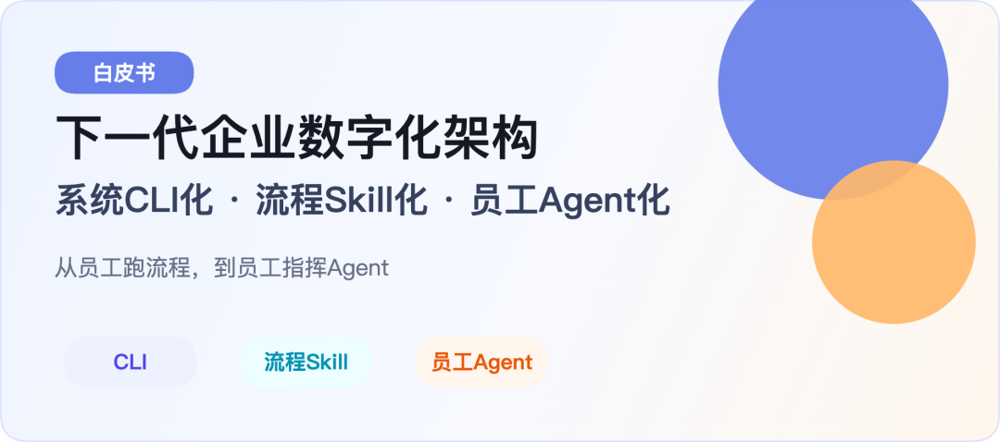
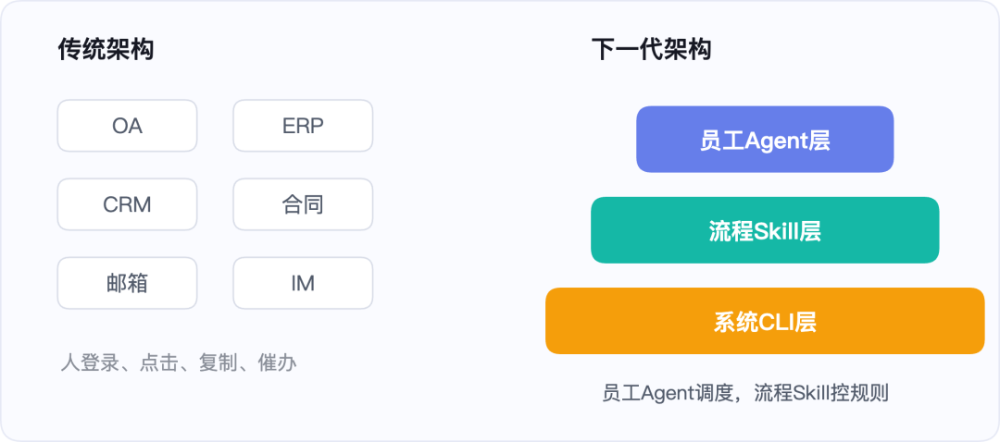
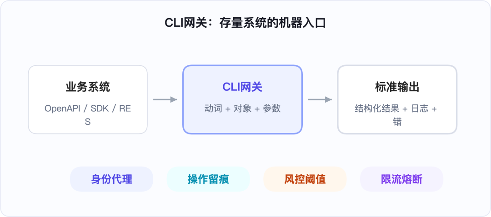
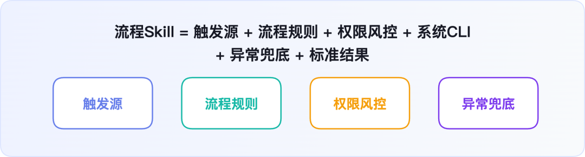
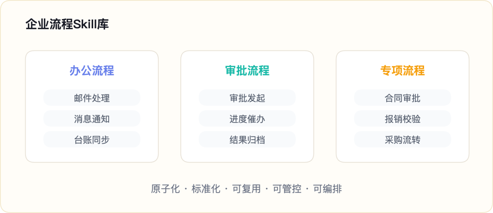
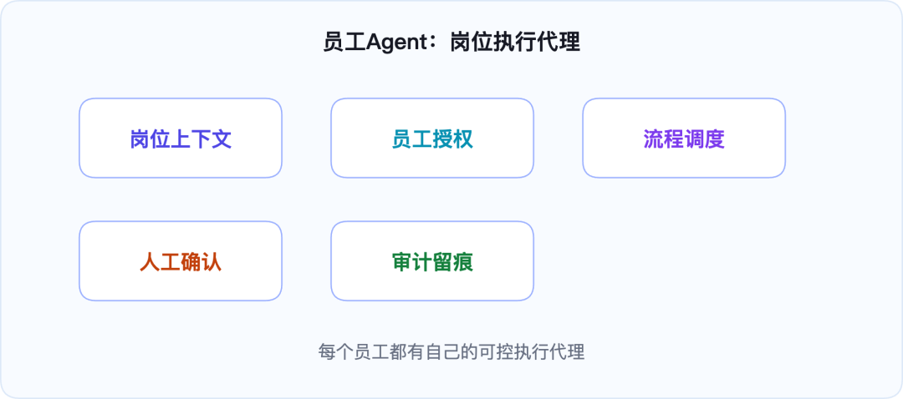
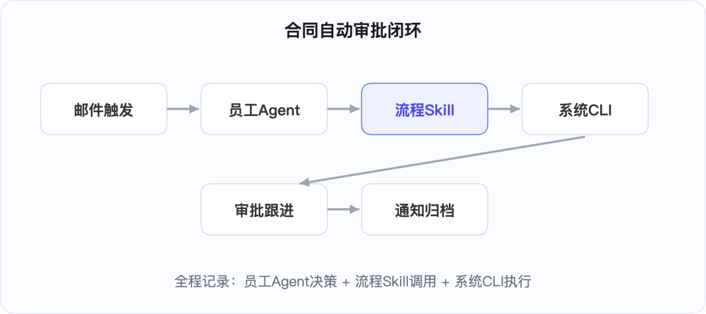
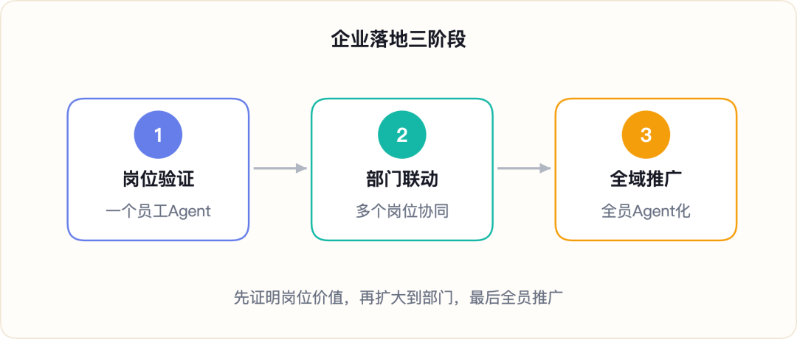
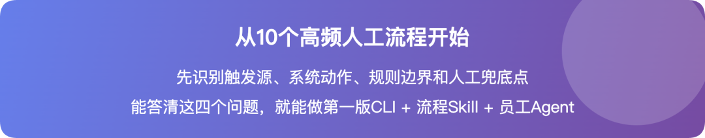
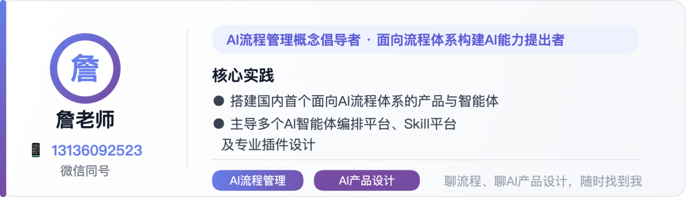

> 📎 来源: [詹生Talk](https://mp.weixin.qq.com/s?__biz=MzkxMTczNzkyMA==&mid=2247486199&idx=1&sn=18fbeb93dee63e8e5b00b7ffb19f8e40&chksm=c084c9674e77823ce7acd0ec30feed95cf8f9e5d9d6449545e6cb8aafca36a0eeb320b736cc7&mpshare=1&scene=1&srcid=05178iLlFRnTiBrzxZ5P5dbs&sharer_shareinfo=6b9409f50893440642baa7a61153afca&sharer_shareinfo_first=6b9409f50893440642baa7a61153afca) | 时间: 2026-05-17 22:20

---



詹老师 · AI产品专家 / 流程管理专家

很多企业一谈Agent落地，第一句话就讲虚了。

比如说：系统要智能化，Skill要能力化，Agent要智能化。

听起来很完整，其实没有多少新增信息。Skill本来就是能力封装，Agent本来就应该智能。把定义再说一遍，不会让企业真的少一次登录、少一次复制、少一次催办。

真正的问题要更具体。

一份合同进来，谁下载附件？谁上传系统？谁发起审批？谁盯流程？谁回邮件？

如果答案还是员工本人，那企业只是多了一个聊天框，工作方式没有变。


所以题目必须换。

下一代企业数字化，不是“Skill能力化、Agent智能化”。那是同义反复。

真正有变化量的是这三句话：

**系统CLI化，流程Skill化，员工Agent化。**

公开资料也在给出同一个信号。OpenAI、Microsoft、Anthropic MCP等生态都在强调工具调用、动作执行和上下文编排；Postman、MuleSoft等API报告也反复提到，API已经从技术接口变成企业能力连接方式。

企业要抓住的不是“AI会聊天”，而是“AI能不能接管一段可控流程”。

· · ·

## 一、真正的三层变化是什么

这套架构可以压缩成三层。

1**系统CLI化：**让所有业务系统暴露标准化机器操作入口。

2**流程Skill化：**把合同、报销、采购、审批等流程拆成可复用、可审计、可编排的Skill。

3**员工Agent化：**让每个员工拥有岗位Agent，由Agent代替员工跑流程，员工负责授权、审核和处理异常。

这里的CLI，不要狭义理解成黑色终端。

在企业架构里，它更像一层“机器操作协议”。它把审批、查询、归档、通知、同步这些系统动作，统一变成可授权、可审计、可稳定调用的命令入口。



图1：从“员工跑流程”转向“员工指挥Agent”

这三层不是换词。

系统CLI化，解决“系统怎么被机器调用”。

流程Skill化，解决“流程怎么从人脑和SOP里抽出来”。

员工Agent化，解决“员工怎么从亲自操作，升级为指挥、授权和审核”。

这才是企业数字化真正的变化。

## 二、第一层：业务系统CLI化

传统GUI系统的最大问题，不是不好看，也不是功能少。

它的问题是：它默认“操作者是人”。

人可以看页面、理解按钮、处理弹窗、容忍等待。机器不应该这样工作。机器需要稳定接口、明确参数、结构化返回、错误码和日志。

因此，系统CLI化的目标很直接：

**把企业存量系统的核心能力，封装成标准命令。**

比如：

```
bpm approve --instanceId=xxx --user=员工ID --comment=合规通过
```

```
mail scan --today --tag=合同审批
```

```
feishu notify --chatId=部门群 --msg=审批已办结
```

企业并不一定要重构老系统。

更现实的路径，是在原有系统外面加一层轻量CLI网关。网关接收标准命令，再翻译成系统原生API、SDK、数据库只读查询或受控页面自动化。



图2：CLI化不是推倒重来，而是为系统补上一层机器入口

这件事的难度，常常被高估。

飞书、企业微信、邮箱、主流SaaS，本来就有OpenAPI或SDK。许多BPM、OA、财务系统，也有业务API。真正难的是老旧自研系统，但也可以先从可控查询、页面动作和关键流程开始封装。

更关键的是安全。

CLI网关必须内置实名身份代理、权限边界、限流熔断、操作留痕、黑白名单和人工复核阈值。

一句话：

**CLI层只负责执行，不能拥有业务判断权。**


## 三、第二层：流程Skill化

只有CLI，还不够。

因为CLI只解决“系统动作怎么执行”。它不解决“流程应该怎么走”。

企业真正复杂的东西，不在按钮上，而在流程里。

什么材料算齐？什么金额要加签？什么条款要法务复核？什么节点超时要催办？什么异常必须暂停？

这些东西过去散落在制度文档、老员工经验、审批习惯和群聊提醒里。

流程Skill化，就是把这些流程规则固化成标准能力。

一个合格的流程Skill，应该是这样的公式：



所以，Skill不是“能力化”。

Skill本身就是能力。真正要被Skill化的，是流程。

比如“合同审批流程Skill”。它不是简单上传合同，而是把合同收件、条款初筛、金额阈值、审批路径、超时催办、结果归档这一整段流程封装起来。

比如“报销流程Skill”。它也不是简单识别发票，而是把票据校验、预算核对、重复风险、审批发起、台账同步封装成一条可复用流程。

流程Skill化以后，企业得到的不是零散工具，而是一批可组合的业务流程积木。



图3：流程Skill化，把SOP和经验沉淀成可调用能力

## 四、第三层：员工Agent化

“Agent智能化”这句话没有抓住重点。

Agent当然要智能。但企业落地时，真正关键的是：Agent属于谁，替谁工作，能做什么，做到哪里必须停。

所以更准确的说法是：员工Agent化。

不是把员工变成机器。

而是每个员工都有自己的岗位Agent。这个Agent理解员工职责，继承员工授权，调用员工可用的流程Skill，替员工完成重复流程。

员工从“亲自跑流程的人”，变成“指挥Agent、审核异常、优化规则的人”。



图4：员工Agent不是聊天框，而是岗位执行代理

一个法务员工的Agent，可以监听合同邮件，调用合同流程Skill，发起审批，追踪节点，提醒业务补材料。

一个财务员工的Agent，可以处理报销单据，调用发票校验Skill，核对预算，发起付款审批。

一个销售员工的Agent，可以更新CRM，生成跟进纪要，触发合同流程，提醒回款风险。

这才是“员工Agent化”的含义。

企业不是做一个万能Agent放在天上，而是让每个岗位都有可控的执行代理。

每个Agent都必须绑定真实员工身份，坚持最小权限，关键动作可追溯，高风险节点必须人工确认。

## 五、三层如何完成一个闭环

用合同审批来举例。

客户发来一封合同邮件。法务员工的Agent监听到邮件事件，识别附件和关键词，判断这是合同审批场景。

Agent不会自己乱点系统，也不会临时编一套规则。

它调用“合同审批流程Skill”。Skill先做权限校验，再做合同风险初筛。如果合同金额、条款风险、主体信息都在规则范围内，就继续执行。

接着，Skill依次调用邮箱CLI、合同系统CLI、BPM CLI，完成附件下载、合同上传、审批发起和流程记录。

之后，员工Agent定时调用“审批流转Skill”，查询审批状态。超时了，就调用消息通知Skill催办。流程办结后，再调用归档Skill和邮件回复Skill，完成结果同步。



图5：员工Agent调度流程Skill，流程Skill调用系统CLI

这个链路里，三层边界非常清楚。

CLI层只执行系统动作。

Skill层只处理流程规则。

员工Agent层只负责感知、判断和调度。

一旦出现高风险合同、金额超限、缺少授权、系统异常，流程不会硬往前冲。它会暂停，记录原因，再推给对应责任人。

企业真正需要的不是“全自动到失控”。

**企业需要的是：低风险自动化，高风险可控化，关键过程可追溯。**


## 六、落地路径：先做岗位Agent，再做全域平台

这套架构看起来很大，但落地不应该一上来就做全公司平台。

正确路径是从一个高频、规则清晰、风险可控的场景开始。

比如合同初审、报销校验、审批催办、邮件分类、台账同步、会议纪要归档。

这些场景有三个特点：重复多、边界清、收益容易验证。



图6：从一个岗位Agent，走向企业级Agent体系

### 第一阶段：验证闭环

选一个岗位，选一个场景，封装少量CLI，做一个极简流程Skill，用员工Agent跑通从触发到结果的完整链路。

这一阶段不要追求平台化。

重点是验证三件事：系统能不能被调用，流程能不能被Skill化，员工是不是少做了重复操作。

### 第二阶段：部门试点

当单点闭环跑通后，再搭建轻量Agent平台。

加入权限、日志、任务队列、异常告警和Skill版本管理。选择一个部门，把3到5个岗位Agent串起来。

比如法务部门可以先做合同收件、风险初筛、审批发起、审批催办、归档通知。

### 第三阶段：全域推广

等部门试点稳定后，再推动更多系统CLI化、更多流程Skill化、更多员工Agent化。

此时企业数字化的重心会发生变化。

IT不再只是建系统。业务也不再只是提需求。双方共同沉淀可复用能力，并持续提升自动化率。

## 七、组织也要一起升级

技术架构变了，组织分工也必须变。

企业需要一个新的角色：**AI流程架构师**。

这个角色不只是懂AI，也不只是懂流程。他要能把岗位职责、业务规则、系统接口、权限风控和Agent编排放在一起看。

他的核心工作包括：

规划业务系统CLI化的优先级。

梳理高频重复流程，拆成可复用流程Skill。

设计员工Agent自动化链路，设置人工兜底节点。

建立权限、风控、日志、版本和灰度规则。

员工的工作也会变化。

以前，员工把大量时间花在登录系统、复制数据、催流程、补材料上。以后，员工会更多训练自己的岗位Agent、优化流程Skill、审核风险、解决非标问题。

管理层也要换指标。

除了流程时效和处理量，还要看业务场景自动化覆盖率、人工重复操作替代率、异常人工干预率、流程Skill复用率和员工Agent成功闭环率。

这些指标会比“又上线了几个系统”更接近数字化的真实价值。


## 八、最后的判断

未来企业不会没有GUI。

GUI仍然需要存在。它会服务人工查看、异常处理、复杂配置和兜底操作。

但GUI不会再是企业数字化的中心。

中心会迁移到三层架构：底层系统CLI化，中层流程Skill化，顶层员工Agent化。

这套架构的价值，不是把一个流程自动化，而是把企业工作方式重新组织起来。

新增一个系统，只需要补充CLI入口。新增一条流程规则，只需要更新流程Skill。新增一个岗位场景，只需要配置对应员工Agent。

企业的数字资产，也会从“系统功能清单”变成“流程Skill库”和“岗位Agent体系”。

这件事真正落地以后，企业会慢慢摆脱一种旧惯性：所有问题都通过新系统解决，所有流程都靠员工推进，所有数据都靠人工同步。

更现实的迁移路径，是先选一个岗位高频场景，做出第一个员工Agent闭环；再把闭环拆成标准流程Skill；再把流程Skill放进部门级Agent体系；最后把成功经验推广到更多岗位。

不要一开始就追求宏大的平台，也不要停留在个人自动化脚本。企业需要的是可审计、可授权、可复用、可扩展的岗位Agent体系。

我的建议很简单：

**从明天开始，先盘点十个高频人工流程。每个流程问四个问题：触发源是什么，系统动作是什么，规则边界是什么，哪个员工的Agent来执行。能答清楚这四个问题，就能开始做第一版“系统CLI化、流程Skill化、员工Agent化”。**

下一代企业数字化，不是让人更熟练地操作系统。

而是让系统、流程和员工Agent一起工作，让人回到更值得人做的位置。



## 资料参考

本文核心判断参考了OpenAI Agents SDK、Model Context Protocol、Microsoft Copilot Studio、Postman State of the API、MuleSoft Connectivity Benchmark、NIST AI Risk Management Framework等公开资料。文章观点结合企业流程与AI产品落地经验整理。


