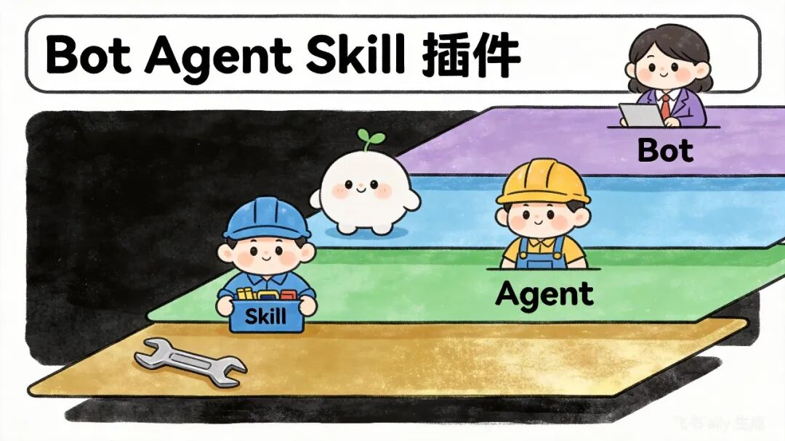

> 📎 来源: [AI有些意思](https://mp.weixin.qq.com/s?__biz=MzA4OTI5NjMwMg==&mid=2247483936&idx=1&sn=1d46846330d5967d5313cd933700b361&chksm=9190b476efa161f686d7dc404df36c1ff45acf8d4fc9a161fd1950f3a7053c731959a65c2e4f&mpshare=1&scene=1&srcid=0429zLM1HXTx35xMhoNkQAFW&sharer_shareinfo=813cb4e93e0cb3af912b702ac4357e92&sharer_shareinfo_first=813cb4e93e0cb3af912b702ac4357e92) | 时间: 2026-04-29 14:04

---

今天分享下技能商店。

说到技能商店，就得说到Skill。

但Skill到底是什么？它跟Bot、Agent、插件又有什么关系？

很多人刚接触扣子时，被这几个词搞晕了——打开技能商店看到一堆Skill，创建Bot时又能加插件，还有Agent智能体……

为什么要讲这个？

主要是为了能了解这几个名词之间的关系，也能让大家更能了解什么是Skill。

---

## 一、整体逻辑（从上到下）

用户 → Bot（工厂前台）→ Agent（工人）→ Skill（工人的技能）→ 插件 

/ 工具（工具）

**核心规则：**上层调用下层，下层支撑上层。

## 二、每个概念详细说明（带工人类比案例）

### 1. 插件 / 工具（最底层）

#### 定义

插件 = 工具。没有思想、不会思考，仅能执行单一、固定动作的基础组件。

#### 特点

- 不会思考
- 不会判断
- 不会说话
- 只固定执行单一类型任务

#### 生活化例子（工人场景）

螺丝刀、扳手、电钻、计算器、尺子

#### 扣子真实例子

- 搜索插件：只负责全网网页搜索
- 天气插件：只负责查询实时气温、天气状况
- 文件读取插件：只负责读取解析文档内容
- 计算插件：只负责数值运算

### 2. Skill（技能）

#### 定义

Skill = 工人掌握的一项专业技能，是一套标准化的固定作业流程 + 工具使用方法的集合。

#### 特点

- 具备完整作业步骤、标准化流程
- 自身无法独立思考、自主决策
- 必须依靠 Agent（工人）调度指挥才能执行
- 单个技能可调用多个不同工具完成任务

#### 生活化例子（工人场景）

装灯泡技能、换水龙头技能、组装桌子技能、贴瓷砖技能、焊接技能

#### 扣子真实例子

- 周报生成技能：标准化完成数据整合、内容撰写、格式排版
- 标题优化技能：统一规则打磨标题、提升吸引力
- 出行建议技能：整合交通、天气信息生成出行方案
- 文案润色技能：优化语句、修正语病、统一文风

### 3. Agent（智能体）

#### 定义

Agent = 工人/员工，是具备自主判断力的核心执行主体，拥有独立决策能力，负责统筹完成整体任务。

#### 特点

- 拥有独立思考、判断、决策能力
- 可自主选择匹配任务的 Skill（技能）
- 可自主调度所需的插件/工具
- 能够独立承接并完成完整业务任务
- 支持多个智能体有序配合、协同作业

#### 生活化例子（工人场景）

木工师傅、水电工、装修工人、维修工、流水线工人

#### 扣子真实例子

- 自媒体写作智能体：承接写作需求，统筹完成全文创作
- 电商运营智能体：处理商品文案、用户答疑、数据分析等运营任务
- 数据分析智能体：解读数据、生成报表、输出分析结论
- 客服问答智能体：对接用户问题、精准答疑、处理基础咨询

### 4. Bot（机器人）

#### 定义

Bot = 工厂前台/店铺门面/对外机器人，是用户直接交互的入口，是产品对外展示的载体。

#### 特点

- 不执行具体业务工作
- 无自主思考、决策能力
- 仅负责承接、响应用户对话需求
- 接收用户需求后，转发给内部 Agent 处理
- 支持多平台发布：抖音、豆包、网页等

#### 生活化例子（工人场景）

装修公司前台、维修店接待员、工厂客服窗口

#### 扣子真实例子

- 抖音 AI 客服 Bot：承接用户咨询，分发任务给客服智能体
- 自媒体写作 Bot：接收用户写作需求，对接写作智能体
- 电商运营助手 Bot：面向商家，承接各类运营辅助需求

## 三、四者核心关系（重中之重）

### 一句话总关系

**Bot 接待用户 → 交给 Agent 工人 → 工人调用 Skill 技能 → 技能调用 Plugin 工具**

### 完整生活场景举例（通俗易懂）

**场景：家里水管损坏，上门维修**

- **用户：**有维修需求，主动找到装修公司
- **Bot（装修公司前台）：**接待用户，收集维修需求，自身不会维修，将任务转接给在岗工人
- **Agent（水电工师傅）：**接收任务，自主思考判断：水管故障位置、维修方案、所需工具，统筹整体维修工作
- **Skill（修水管技能）：**工人脑海中标准化作业流程：关水阀 → 拆卸破损水管 → 安装新水管 → 通水测试排查漏水
- **插件 / 工具（扳手、生料带、新水管）：**被动使用的维修工具，无自主动作，依靠工人操作完成作业

### 扣子真实场景举例

**任务：帮用户撰写一篇 AI 工具公众号文章**

- **用户：**发送需求「帮我写一篇 AI 工具文章」
- **Bot：**承接用户对话需求，识别任务类型，转发给内部写作智能体
- **Agent（写作智能体）：**判断用户需求，确定写作方向，自主调用「文章写作 Skill」
- **Skill（文章写作技能）：**执行标准化流程：调用搜索插件查阅行业资料 → 梳理文章大纲 → 撰写正文内容 → 润色优化文案 → 统计字数
- **插件：**搜索插件、资料读取插件、字数计算插件，全程被动配合技能完成单项任务

最终整合所有内容，生成完整公众号文章返回给用户。

## 四、超级对比表（一分钟熟记所有区别）

|  |  |  |  |  |  |  |  |
| --- | --- | --- | --- | --- | --- | --- | --- |
| |  | | --- | |  |  |  |  |  |  |  |  | | --- | --- | --- | --- | --- | --- | | |  | | --- | |  |  |  | | --- | |  |  |  | | --- | |  |  |  | | --- | |  |  |  | | --- | |  | | |

|  |
| --- |
|  |

|  |
| --- |
|  |

| 概念 | 比喻 | 会不会思考 | 能不能独立对话 | 层级 |
| --- | --- | --- | --- | --- |
| 插件 / 工具 | 螺丝刀、扳手 | ❌ 不会 | ❌ 不能 | 最底层 |
| Skill（技能） | 装灯泡、修水管 | ❌ 只有流程 | ❌ 不能 | 中间层 |
| Agent（智能体） | 工人、师傅 | ✅ 会思考 | ✅ 能 | 大脑层 |
| Bot（机器人） | 前台、店铺 | ❌ 不干活 | ✅ 能 | 最外层 |

## 五、最终记忆口诀

Bot 是门面， Agent 是工人， Skill 是技能， 插件是工具。

---

**觉得有用？点个赞，让更多人看到。**

**收藏一下，下次用得上。**

**转发给朋友，一起提升效率。**
