> 📎 来源: [悟鸣AI](https://mp.weixin.qq.com/s?__biz=Mzg3NzI0MzAyNA==&mid=2247493315&idx=1&sn=8cff76d164225c60720f4dbcb5a6ef2b&chksm=ce776dc6b9c9be158808567eb74537c9c769b8fd40d17763ba5bc345875517ba3a56fc4b0cd7&mpshare=1&scene=1&srcid=0427sBS1HseClatWuSzgM3Yp&sharer_shareinfo=d7f5484b1301284430c787d0c8362f08&sharer_shareinfo_first=d7f5484b1301284430c787d0c8362f08) | 时间: 2026-04-27 18:50

---

大家好，我是悟鸣。

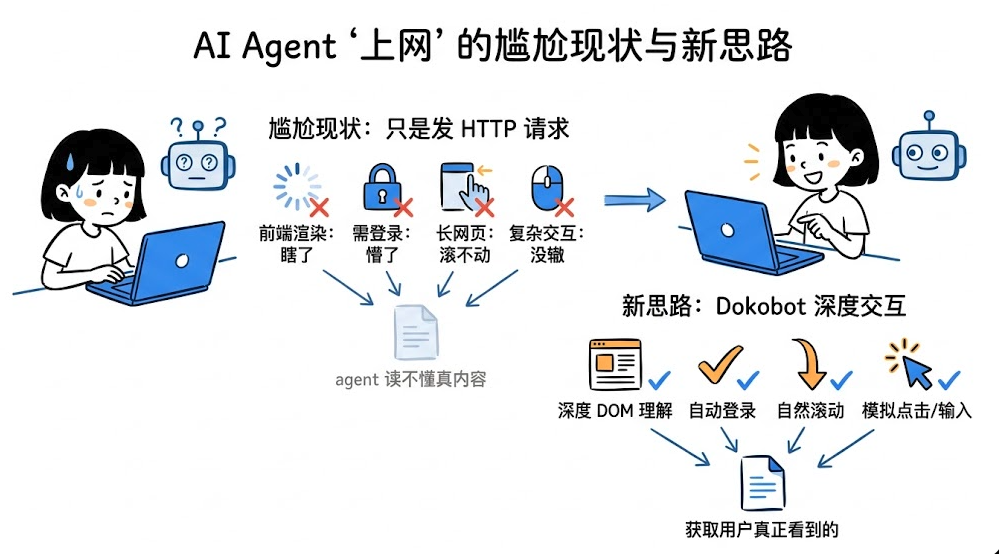

如果你最近也在折腾 AI agent，大概率会遇到一个很现实的问题：

很多 agent 看起来会“上网”，其实只是会发 HTTP 请求。

这在简单页面上问题不大，但一旦网页是前端渲染的，或者需要登录、滚动、交互，这种能力就很容易不够用了。页面能打开，不代表 agent 真能读懂；接口能返回，也不代表它拿到的是用户真正看到的内容。

这也是我最近看到 Dokobot 时，觉得它挺有意思的原因。

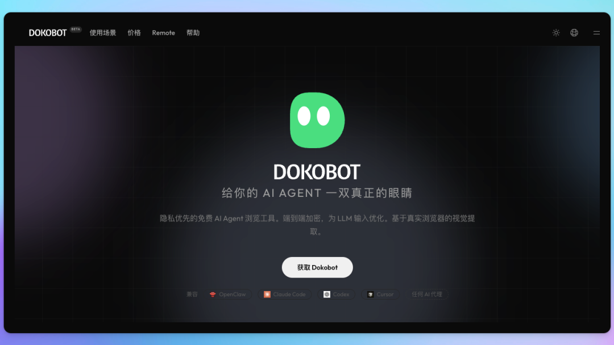

官网：https://dokobot.ai

它想解决的，不是“怎么让 agent 再多发几个请求”，而是一个更底层的问题：

怎么让 agent 真正看见网页。

Dokobot 的思路很直接。它不是再给 agent 包一层更花哨的 

```
fetch
```

，而是直接让 agent 借助真实的 Chrome 浏览器去读网页、搜网页。换句话说，它处理的不是一份冷冰冰的网页源码，而是用户眼前那个已经渲染好的页面。

这一点非常关键。

因为很多我们平时觉得“网页就在那”的内容，其实对 agent 并不天然可见。内容可能是 JS 动态加载出来的，可能要登录之后才能看到，也可能得滚动几屏才会完整出现。用普通抓取方式做这些事情，往往要补很多额外逻辑；但如果直接走真实浏览器，整件事就会顺很多。

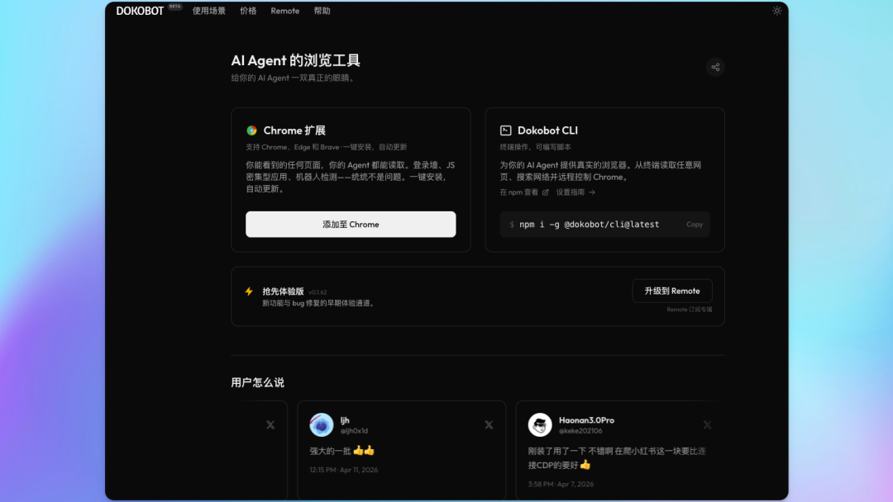

安装教程：https://dokobot.ai/zh-CN/install

从这个角度看，Dokobot 更像是在给 agent 补一块长期缺失的能力拼图。

很多 agent 不是不会推理，也不是不会调用工具，而是卡在“看不到真实网页内容”这一步。一旦这一步打通，后面的资料收集、页面检查、信息提取、搜索整理，都会顺畅很多。

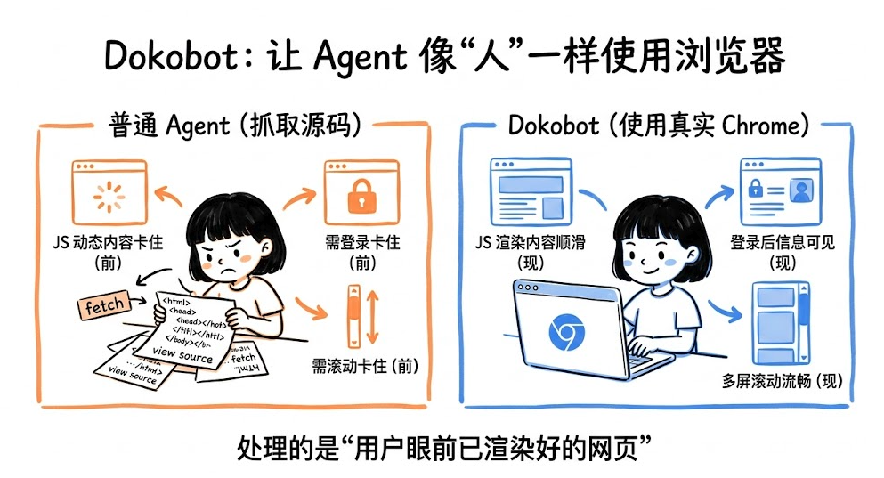

它提供的能力也很直接：

- ```
  dokobot read [url]
  ```

  ：读取网页内容，支持 JS 渲染、登录态、无限滚动，还能做多屏截图
- ```
  dokobot search [query]
  ```

  ：直接做网页搜索

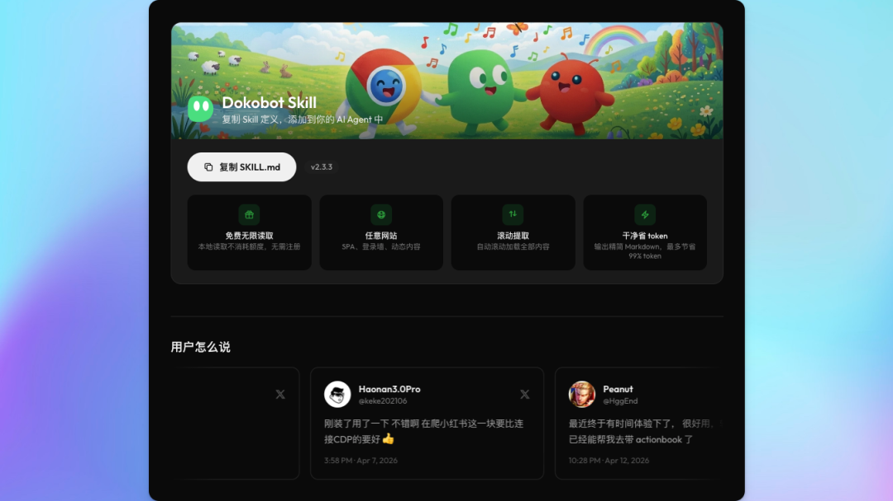

它还提供了 Skill： https://dokobot.ai/zh-CN/skill

表面上看，这只是两个命令。但它真正推进的，是 agent 的“网页理解能力”。

以前很多 agent 只能处理静态内容，现在它更接近真人打开浏览器、看到页面、继续往下操作的状态。这个变化听起来不花哨，但在真实工作流里非常实用。

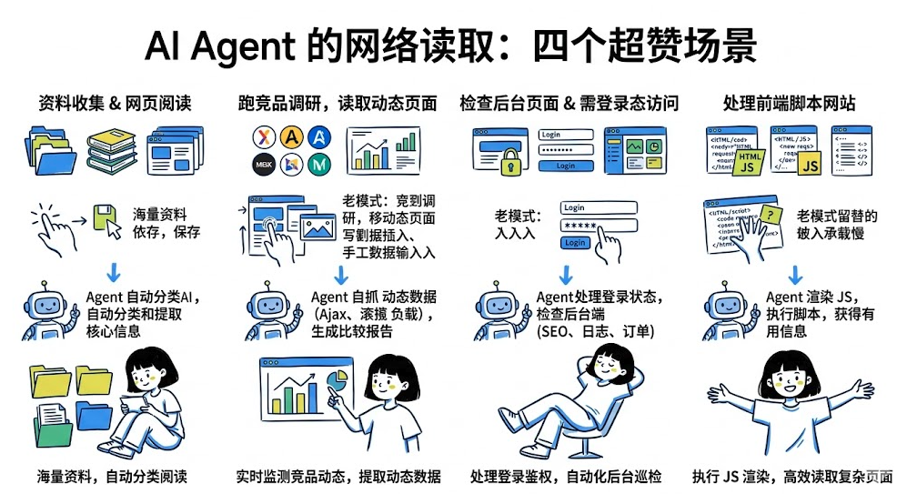

比如这些场景，我觉得都很适合：

- 做资料收集和网页阅读
- 跑竞品调研，读取动态页面信息
- 检查后台页面或需要登录态才能访问的内容
- 处理那种一打开就是一堆前端脚本的网站

很多原来必须人手打开、滚动、确认的页面，现在 agent 终于有机会自己完成第一轮读取了。

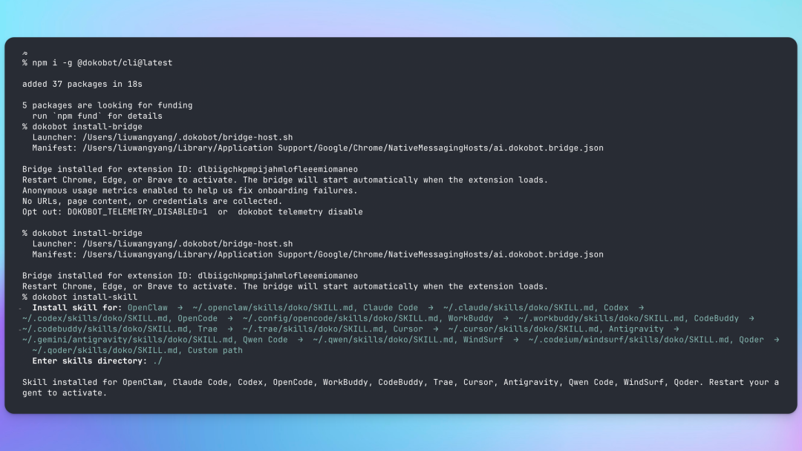

安装也不复杂：

```
npm install -g @dokobot/clidokobot install-bridgedokobot install-skill
```

它支持的 agent 也比较广，像 Claude Code、Cursor、Codex、Qwen Code、OpenClaw、Hermes、Trae、WindSurf 这些主流 coding agent 基本都能接，走的是 MCP 或 Skills 协议。

---

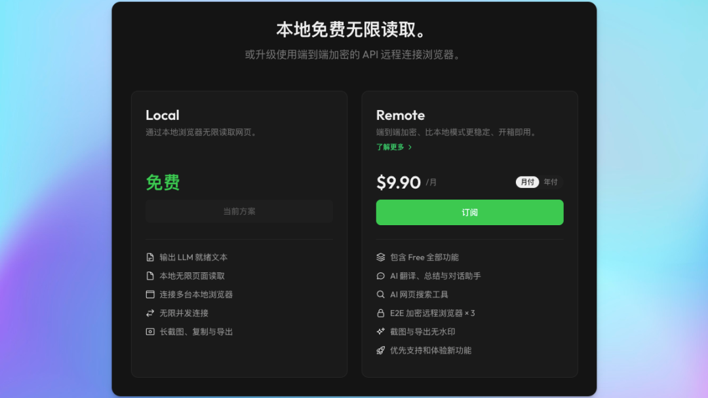

它读取网页操作浏览器，截图复制等等，导出等等都是免费的，完全够用。

---

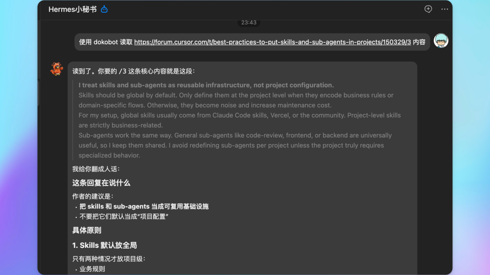

使用的时候非常简单，直接让它读取什么内容就可以了。

我这里为了专门测试这工具，所以说故意提了一下这个名字。你其实你可以不用提，因为你装了它Skill之后，AI就会自动知道有这样的工具可以使用。

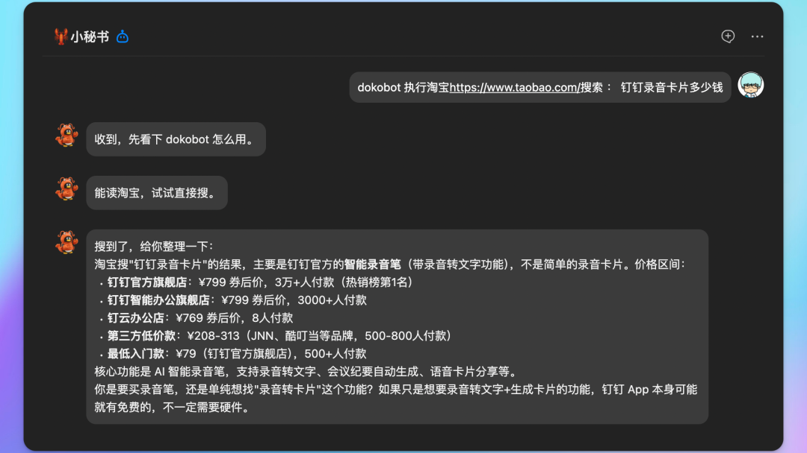

让他去淘宝去搜索一下录音卡的价格，他也能够正常的搜索，然后进行汇总。

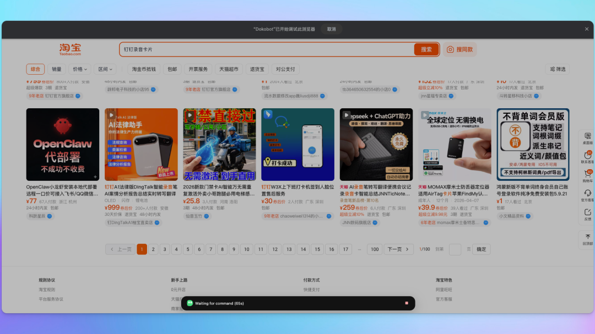

它的插件可以配合 Cli 打开网页，执行相关的动作。

---

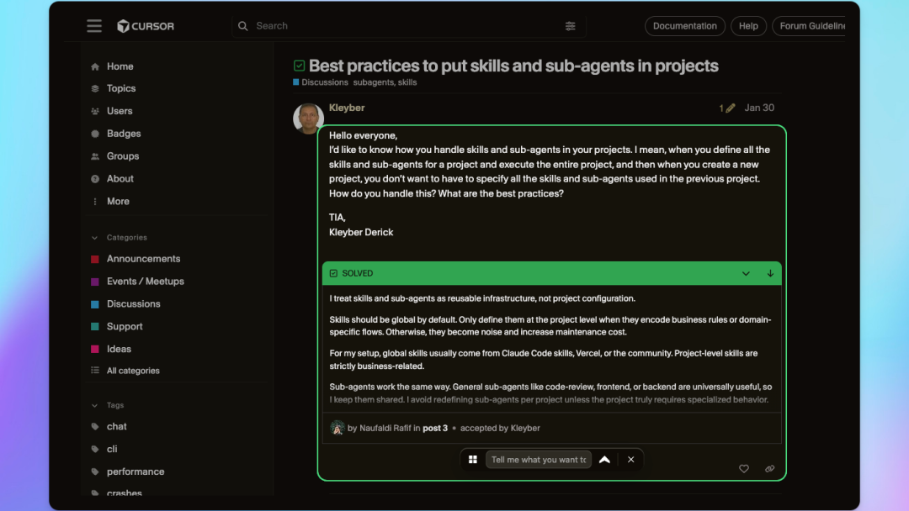

你还可以在网页上，用它的插件选择一些文本，导出，直接复制成比较干净的 Markdown 格式，也可以导入成 PDF 或者是直接对话等等。

---

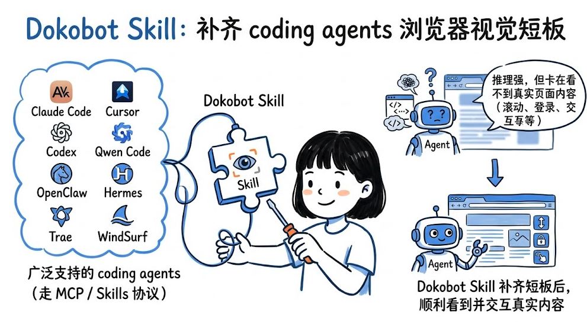

很多时候，决定 agent 上限的，不只是模型够不够强，而是它到底能不能看到用户真正看到的网页。

如果这一步一直缺着，后面的很多自动化都只是纸上谈兵。一旦这块补上，agent 才算真正开始接近“会用浏览器做事”。

所以如果你最近也在做 agent 自动化，尤其是涉及复杂网页、动态页面、登录态页面，我觉得这个工具值得装上试试。

欢迎关注我的公众号，后续会陆续分享比较有用的 AI 工具和比较好的 AI 经验，比较客观理性的 AI 观点等。
