> 📎 来源: [游戏人的法律手册](https://mp.weixin.qq.com/s?__biz=Mzg4OTY0NTc5Mw==&mid=2247487726&idx=1&sn=fd0069feaef8fb0c914ca7df23665d42&chksm=ce91cf2a7125fd18da95646ff3d2bfef1e7b4bd3792712c1a91f81261bfe72af7a00dd4e2040&mpshare=1&scene=1&srcid=0512M5OuA4y6dn5LJoTyJ2Iy&sharer_shareinfo=b8e64c95b2372c9ebad1a21c228914f9&sharer_shareinfo_first=b8e64c95b2372c9ebad1a21c228914f9) | 时间: 2026-05-12 04:05

---

点击上方蓝字 · 关注更多游戏法律知识

好久没更新的WordOllama，终于又更新了！

WordOllama是什么？可以看这个前情提要：

[【WordOllama】发布 | 为Word增加AI功能 | 支持本地模型、CHatGPT和国产大模型](https://mp.weixin.qq.com/s?__biz=Mzg4OTY0NTc5Mw==&mid=2247485983&idx=1&sn=b34cba12a19671595067eb8e91a17bbd&scene=21#wechat_redirect)

[在WPS上“免费”使用AI功能 | 把WordOllama接入WPS](https://mp.weixin.qq.com/s?__biz=Mzg4OTY0NTc5Mw==&mid=2247486109&idx=1&sn=75a730401051ff75f2732cb47562b2ec&scene=21#wechat_redirect)

这次正式引入了Agent功能

版本号也来到了2.X

是时候让Word自己改合同了

\* 本文仅为笔者个人观点，不视为任何法律建议。

一**更新功能**

底层代码重构、UI小优化、保存设置优化（理论不会再出现设置丢失的问题了）这些“感知不强”的优化就不详细展开了，具体说一下这次新加的Agent功能：

**Agent面板**

只要打开最左侧的【Agent任务】按钮，就可以打开Agent面板

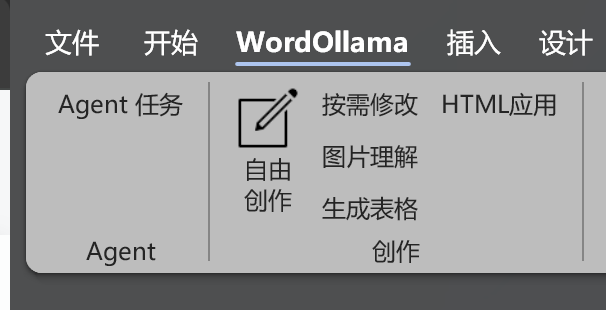

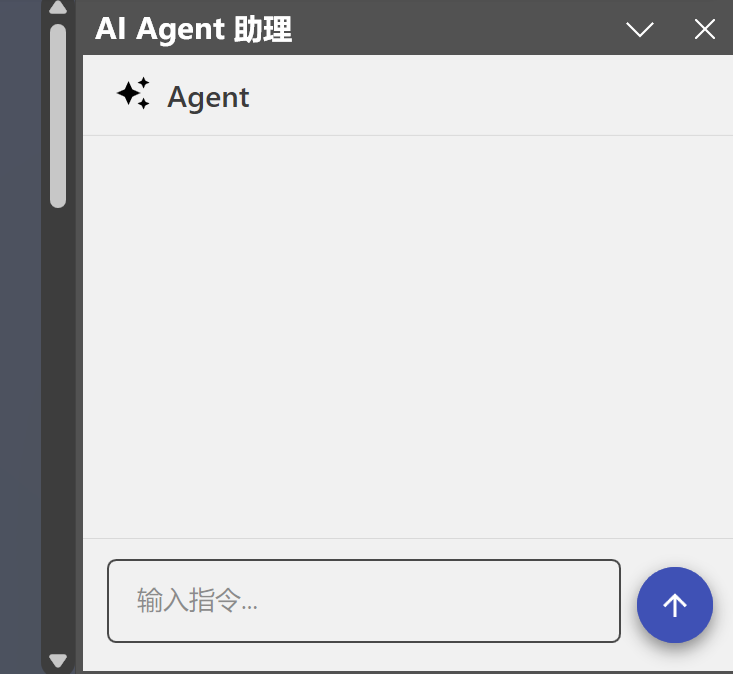

和其他Agent软件一样，只要在输入框中输入需要Agent执行的任务，Agent就会自动规划任务，自动开始执行

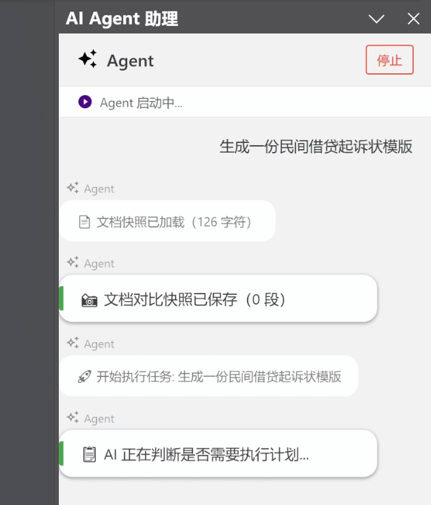

我给Agent暴露了**“理论上够用”**的各类Word能力

AI可以根据任务需要，自动调用相关能力操作文档

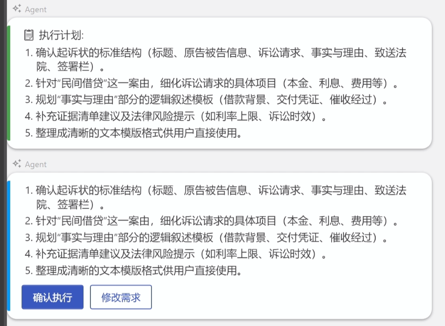

如果是要求AI修改内容，默认会用修订模式完成，方便改后审查，当然改完也会有修改面板用来统一查阅结果

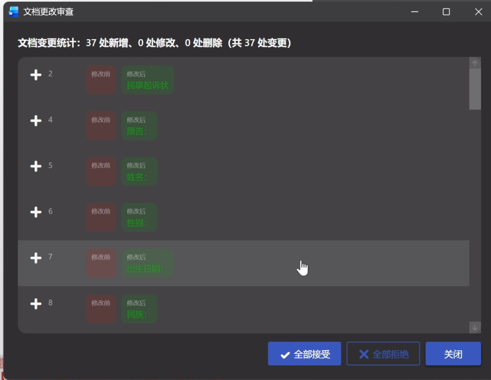

重要节点、危险动作会要求用户批准才会操作，而当遇到AI无法确认的东西，AI会主动询问用户，用户回复后才会继续执行任务

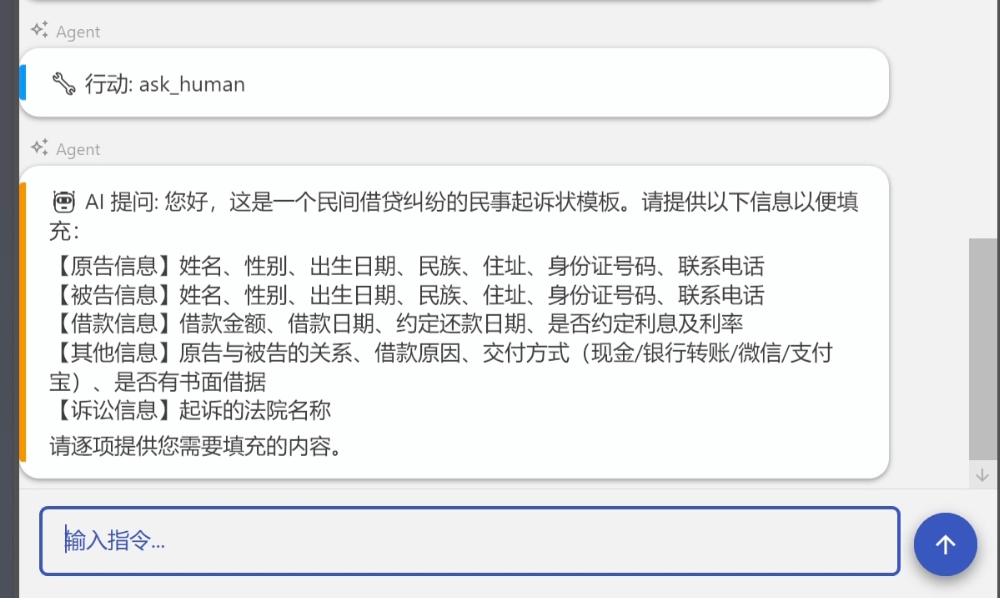

反正，就是希望有常见的Agent体验

当然，斜杠命令也有弄：

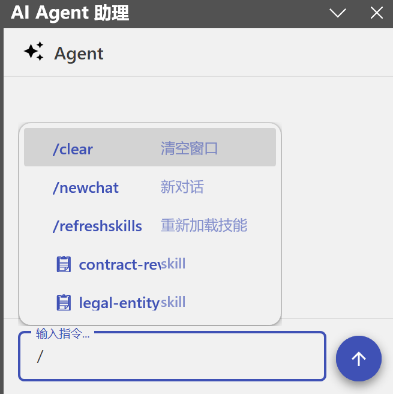

如果想看效果的话，这是本地模型（Qwen3.6B 35B A3B）跑出来的速度（GIF没有加速）：

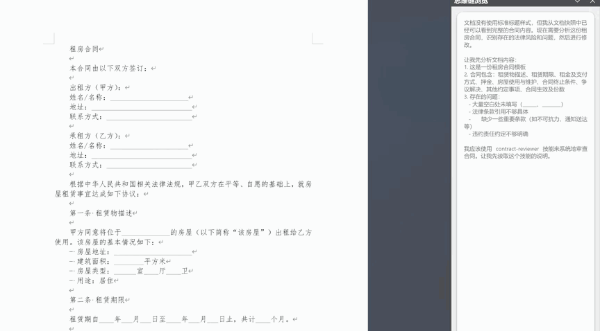

**SKILL**

说到Agent，另一个重要内容必定是SKILL

这次我也为Agent添加了SKILL功能

在设置中，可以导入符合标准的SKILL

无论是Zip包还是直接把文件夹放进去都是可以的

点一下刷新就会看到更新进去的SKILL

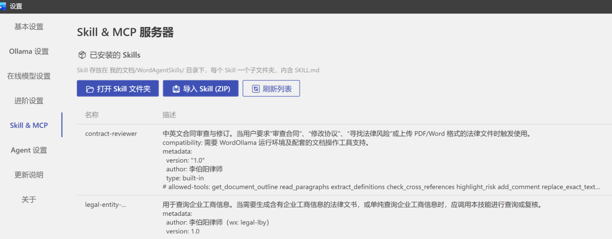

使用SKILL有两种方式：

第一种是让AI根据需要自己选：

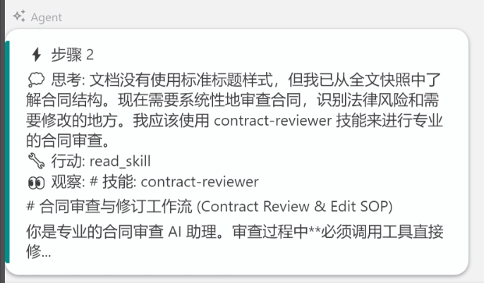

另一种是直接通过斜杠/指令，来获取SKILL列表，选一个来要求AI使用

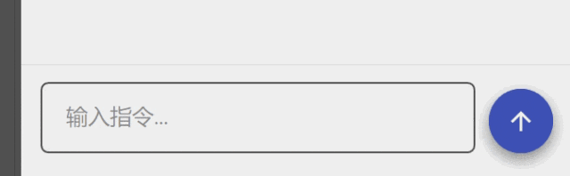

无论是想引入规范性SKILL还是功能性SKILL都是可以的

甚至，这次我给Word提供了终端能力，意味着，Agent可以直接调用带Python等代码的SKILL：

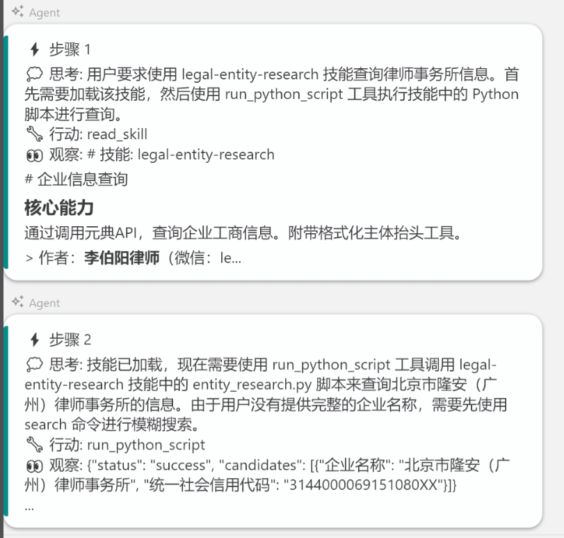

**【注意：虽然我给代码底层加入了危险动作要用户二次确认的指令，但也不排除AI和软件同时存在BUG的可能性。建议不要让Agent执行任何删除文件的动作。】**

**静默审查**

这次另一个 烧Token 工作利器，是静默审查功能。

这个功能默认关闭

因为会导致调用AI次数比较多，建议大家按需开启

也可以选一个小模型来处理

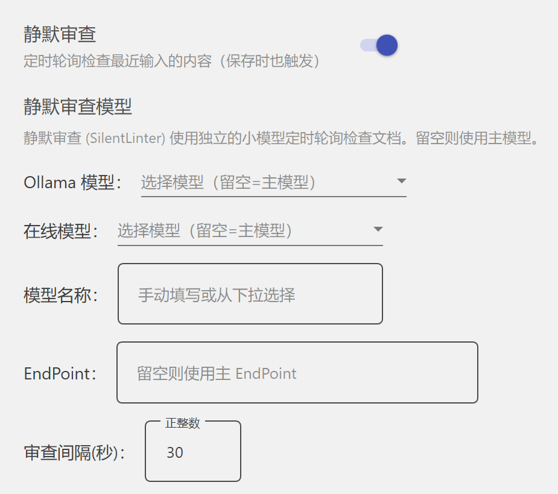

功能核心就是，当用户保存文档时，会【自动审查修改段落是否存在问题】，如果发现有问题，会在Agent面板进行提示

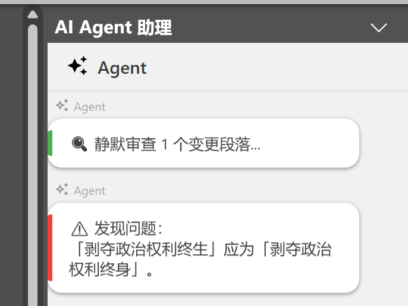

**其他**

还有一些小更新就不展开了，大家如果遇到什么不明白的，都可以随时留言或者加我沟通

二**怎么装？**

安装方式如此前，不过现在建议在以下网址（终于有官网了！）安装：

https://www.wordollama.com

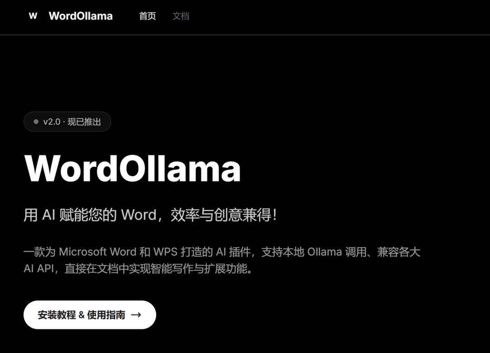

只要复制这行脚本，在终端（管理员）中粘贴执行即可。

```
iex(irm 'https://download.wordollama.com/WordOllamaInstaller.ps1')
```

旧版用户理论也会自动更新，但建议还是通过上面这个脚本重新安装一下

避免以后获取不了新版更新

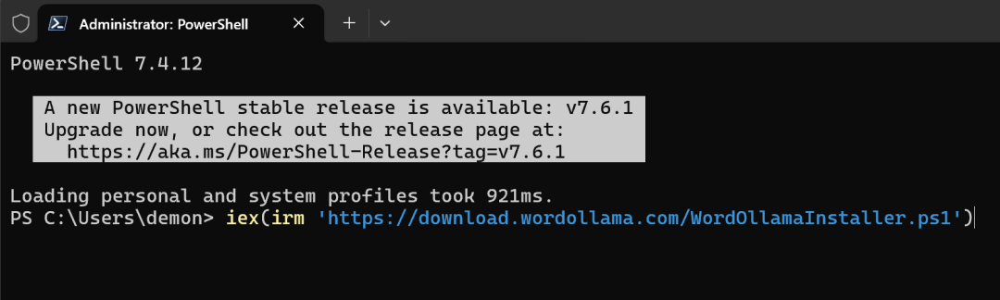

需要离线版的用户烦请再等等，等我研究一下怎么更方便的加密打包方式

三**最后**

没什么想说的了

要知道，Word 365的Agent功能要另外订阅

WPS的AI功能要开VIP

而且，都不能用本地模型，有隐私风险

我这个，通通都合规

如果大家觉得好用，不妨推荐给身边人一起用

期待下次大版本更新

（也不知道什么时候）

作者简介


### **李伯阳** 律师

北京市隆安(广州)律师事务所律师、隆安湾区人工智能法律研究中心高级顾问，《法律人ChatGPT应用指南》作者，Word/WPS AI插件 WordOllama 作者。 具有十余年互联网法律实务经验，曾先后为创业板上市互联网企业、全国互联网综合实力50强企业、互联网快时尚零售独角兽等提供法律服务。擅长办理互联网类企业诉讼与合规业务，擅于通过计算机技术手段深度挖掘证据。

---

往期推荐

> [可能是首个【免费】中国现行法律校检SKILL，随便用](https://mp.weixin.qq.com/s?__biz=Mzg4OTY0NTc5Mw==&mid=2247487680&idx=1&sn=4e619b060a778f22e02d23c1bf32b1cc&scene=21#wechat_redirect)

> [软著应该保护的是软件整体还是代码？——兼论AI辅助生成代码的著作权适格性与登记实务困境](https://mp.weixin.qq.com/s?__biz=Mzg4OTY0NTc5Mw==&mid=2247487665&idx=1&sn=285c03d093465d7a30c725302a5245af&scene=21#wechat_redirect)

> [Token就是“词元”？随便把token就翻译成词元，可能大错特错！](https://mp.weixin.qq.com/s?__biz=Mzg4OTY0NTc5Mw==&mid=2247487622&idx=1&sn=2acb0edd63fb4886dcfc3af3ee2d09d9&scene=21#wechat_redirect)

> [软著全面封杀AI：脱离现实的政策，正在逼迫开发者集体撒谎](https://mp.weixin.qq.com/s?__biz=Mzg4OTY0NTc5Mw==&mid=2247487600&idx=1&sn=76f5c9ccba957f559af2145fd40ce12d&scene=21#wechat_redirect)

> [代言人接别家“烂活”导致游戏被冲，公司能找 TA 索赔吗？](https://mp.weixin.qq.com/s?__biz=Mzg4OTY0NTc5Mw==&mid=2247487592&idx=1&sn=6fcf57e7ec83d03be705516749d9cbdb&scene=21#wechat_redirect)

> [公司部署了AI工具但不提供Tokens，算“未提供相应的劳动条件”吗？](https://mp.weixin.qq.com/s?__biz=Mzg4OTY0NTc5Mw==&mid=2247487586&idx=1&sn=45ced4054056e5d081440eb655ef2e29&scene=21#wechat_redirect)

> [华为渠道下的游戏账号全部封禁？原因是什么？技术 + 法律实务分析一起来](https://mp.weixin.qq.com/s?__biz=Mzg4OTY0NTc5Mw==&mid=2247487576&idx=1&sn=b370a160b4cea853ad434056976c1b7f&scene=21#wechat_redirect)
