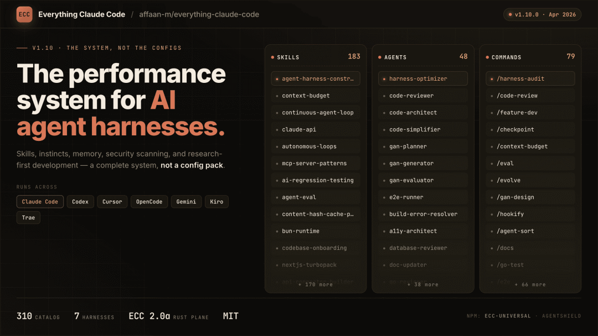

> 📎 来源: [零壹界点](https://mp.weixin.qq.com/s?__biz=MzIxMzk1MzQ0Ng==&mid=2247484442&idx=1&sn=27fd529c7678285e963f1640dfb3336b&chksm=967880d5d5ff6680bd2023c6cc46c0743fc74abbba0ad41481731883baac0d4d6e11e6e5ac68&mpshare=1&scene=1&srcid=0526JjhPJZ9M5JIG6BNaS21h&sharer_shareinfo=8cb03d9336c2d195e97dc0a591ff0467&sharer_shareinfo_first=8cb03d9336c2d195e97dc0a591ff0467) | 时间: 2026-05-26 12:01

---

一个人，8 小时，单挑 Anthropic 黑客松，拿走了 $15,000。

而他靠的不是什么惊天算法——是一套攒了十个月的 Claude Code 配置文件。



比夺冠更离谱的是后续：他把这套配置往 GitHub 上一丢，**7 个月狂揽 18.2 万颗星**。170 多个贡献者，被翻译成十几种语言。有人管它叫「AI 编程时代的第一个操作系统」。

这东西叫 **ECC（Everything Claude Code）**。里面装着 60 个专业 Agent、232 个技能、75 条命令，还有一套能扫描 1,282 种安全隐患的检查系统。

用一句话说：**它是给 Claude Code 装上的一层「外挂操作系统」。**

而且，你五分钟就能装上。

## 那个一个人干翻全场的黑客松

主角叫 Affaan Mustafa。你可能没听过这个名字——他是预测市场聚合平台 Itô 的联合创始人，也是 elizaOS 的核心贡献者。

2025 年 9 月，纽约。Anthropic × Forum Ventures 黑客松。

别人组队三四个人，他和 @DRodriguezFX 两个人参赛。8 小时之内，他们用 Claude Code 手搓出了一个实时协作聊天平台 zenith.chat。

**拿了第一。奖金 $15,000。**

> "The key to the win was not a novel algorithm, but 10 months of Claude Code configuration refinement that Affaan had built through daily production use." （原文："获胜的关键不是一个新奇算法，而是 Affaan 在过去十个月里每天高强度使用 Claude Code 时打磨出来的一套配置系统。"）

赛后他做了个让所有人都没想到的决定：**把整套配置开源。**

然后就像开了挂一样。从 2025 年 10 月到 2026 年 5 月，星星数从零冲到 18 万。注意看曲线的斜率——它不是线性增长，是指数级的。说明用的人越多，推荐的人越多。那**这东西到底能帮你干什么？你怎么用？**

## 第一次上手：3 步把它跑起来

**这章的唯一目标——你按着操作一遍，能成功。**

ECC 有两种安装路径：通过 Claude Code 插件市场装（推荐），或者手动 clone 仓库自己配。**两条路只能选一条，千万别混着装。** 最常见的翻车现场就是：先装了插件，又跑了 `./install.sh --profile full`，结果技能和命令全部重复加载，一堆诡异行为。

我们一起走最佳推荐路线。

### 第一步：注册市场地址

这步的目的是让 Claude Code 知道去哪找到 ECC。不装任何东西，只是登记一个来源。

```
/plugin marketplace add https://github.com/affaan-m/ECC
```

### 第二步：安装插件

```
/plugin install ecc@ecc
```

这一步会把 60 个 Agent、232 个技能、75 条命令全部加载进来。等它跑完就行，不需要额外操作。

> **重点**：跑完插件安装后，绝对不要再去执行 `./install.sh --profile full` 或 `npx ecc-install --profile full`。插件已经加载了所有内容，完整安装器会再往你的用户目录复制一遍，造成技能重复和运行时冲突。

### 第三步：手动拷贝规则文件

Claude Code 的插件系统有个已知限制——不能自动分发 rules（规则文件）。所以这里需要手动操作一下：

```
git clone https://github.com/affaan-m/ECC.gitcd ECC
```

然后只拷你需要的：

```
# 通用规则（必须装）mkdir -p ~/.claude/rules/ecccp -r rules/common ~/.claude/rules/ecc/# 按技术栈选装，不要全拷cp -r rules/typescript ~/.claude/rules/ecc/
```

规则文件覆盖了 12 种语言生态——TypeScript、Python、Go、Rust、Java、Kotlin、C++、Swift、PHP、Perl 等等。**先装 common 和你的主力语言，别的等你真用到了再加。** 每个规则文件都会占用 Claude Code 的上下文窗口，一口气全装等于自己给自己降性能。

> 配好之后，每次使用只需要像往常一样打开 Claude Code——Agent 和技能已经自动加载了。不需要额外启动命令。

> 备选路径：如果你网络环境特殊、插件市场装不上，可以走手动安装——clone 仓库后运行 `./install.sh --profile minimal --target claude`。这个路径不依赖插件市场，但同样注意：**不要和插件路径混用。**

### 协同工具：记忆与规划

ECC 官方还推荐了两个搭配使用的插件：

```
/plugin install claude-mem      # 跨会话记忆/plugin install superpowers     # 强制规划流程
```

**claude-mem** 解决的是 Claude Code 最大的痛点：每次新会话都是一张白纸。它会在每次会话结束时用 AI 压缩关键上下文，存到 SQLite 里。下次打开 Claude Code，自动注入相关记忆。

**superpowers** 解决的是另一个痛点：Agent 一上来就闷头写代码。它会强制走「头脑风暴→设计→TDD→两阶段审查」的流程，用 git worktree 隔离每个任务，防止 Agent 写飞了。

> **重点**：这两个工具单独用也有价值。如果你只想解决「每次从零开始」的问题，只装 claude-mem 就够了。

## 装好之后怎么用？先记住这 4 条命令

232 个技能看着吓人，但你日常会用的不超过一只手。

**`/ecc:plan "描述你的需求"`**：让 Planner Agent 把你的需求拆解成实现步骤，然后自动分派给对应领域的专门 Agent 去执行。你说「加个 OAuth 登录」，它自己会规划、分任务、写代码、写测试。

```
/ecc:plan "Add user authentication with OAuth"
```

**`/code-review`**：5 路并行检查——代码质量、安全性、可维护性、性能、测试覆盖。跑一次等于手动查五遍。

**`/security-scan`**：启动 AgentShield 安全审计。

**`/simplify`**：重构清洁工，去死代码、提升可读性。

## AgentShield：三个 AI 互相盯着找漏洞

这部分是 ECC 里最容易被跳过的，也是最硬核的。

常规的安全扫描工具是什么套路？正则匹配已知模式。AgentShield 不这么干。它的思路是：

> 派三个 Claude Opus 4.6 Agent，分别扮演攻击者、防御者和审计员，对你的配置进行红蓝对抗。

```
npx ecc-agentshield scan --opus --stream
```

| 角色 | 任务 |
| --- | --- |
| Attacker | 寻找可利用的漏洞链 |
| Defender | 评估现有防御措施 |
| Auditor | 综合双方报告，生成优先级风险清单 |

它扫描的范围包括：

- **CLAUDE.md**

  ：是否有硬编码的 API 密钥、可注入的指令
- **settings.json**

  权限配置是否有漏洞
- **MCP 配置**

  服务器风险（覆盖 25 个以上已知 CVE）
- **Hooks**

  注入分析
- **Agent 定义**

  Prompt 注入、权限提升风险

输出示例：

```
Grade: B+Critical: 0 | High: 2 | Medium: 5 | Low: 3HIGH: Hardcoded API key in CLAUDE.md:15Fix: Move to environment variable
```

> **重点**：这不是简单的模式匹配——三个 Agent 互相博弈，能发现那种「单独看没问题、组合起来要命」的漏洞链。

你可以把它加到 CI 流程里。任何改了 Agent 配置的 PR 都先过 AgentShield 安检。Exit code 2 表示有严重发现，直接卡住构建。

## Claude Code 会越用越懂你

ECC 最让人「卧槽」的功能不是安全扫描，是**持续学习系统**。

正常情况，Claude Code 每次新会话都是从零开始。不知道你的代码风格，不知道你的偏好，不记得你上次纠正过什么。

ECC 的持续学习 v2 改变了这个局面：

- **Session 1**

  ：你纠正了一个 async error 处理模式 → 系统记录，置信度 0.3
- **Session 5**

  ：同样的模式被反复确认、修正 → 置信度 0.6
- **Session 10**

  ：模式稳定，置信度 0.9 → **自动应用**

几周之后，Claude Code 写出来的代码自带你的编码习惯。不再是那个「所有人用起来都一样」的通用模型输出。你随时可以看看它学到了什么：

```
/instinct-status     # 查看已学习的模式/evolve              # 把相似模式聚合成新技能/instinct-export     # 导出你的「习惯」，分享给团队
```

> 它不是在读心——它是在观察你每次的修改，然后自己总结规律。

## 这意味着什么

ECC 的爆火不是一个孤立事件。它反映了一个正在发生的趋势：**AI 编程工具的核心战场，正在从「模型能力」转向「系统集成」。**

模型本身再强，也只能在一个会话窗口里工作。真正的效率提升，来自 Agent 编排、安全门禁、记忆持久化、跨会话学习——这些「模型之外」的系统能力。ECC 本质上是把一整套软件工程方法论，编码成了 Agent 可执行的规则、技能和 hooks。

> 18.2 万颗星，不是因为它好看——是因为每个星背后，都有一个被 Claude Code 默认配置折磨过的人，终于找到了解法。

Affaan 做的事说起来也简单：他不是造了一个更聪明的 AI，而是给现有的 AI 搭了一套「操作系统」。让它知道什么时候该想、什么时候该查、什么时候该审、什么时候该停。

**这个思路，比任何一个单独的模型更新都更值得关注。**

> **重点**：ECC 真正适合的是「已经重度使用 AI 编程工具、觉得还能更好用、愿意花半小时配置换来长期效率提升」的开发者。它不是给「偶尔让 AI 帮忙写个函数」的人准备的。

你不需要一口气把 60 个 Agent 和 232 个技能全装上。挑你需要的，把不需要的卸载掉，保持 Claude Code 的上下文干净。**ECC 的价值在「可定制」，不在「全都要」。**

*[1] Reddit 原帖：https://www.reddit.com/r/AIAgentsInAction/comments/1t84rlc/* 

*[2] ECC GitHub：https://github.com/affaan-m/ECC* 

*[3] claude-mem：https://github.com/thedotmack/claude-mem* 

*[4] superpowers：https://github.com/obra/superpowers*

点赞、转发、小心心 ❤️ 欢迎在评论区留下你的想法！

**— 完 —**
