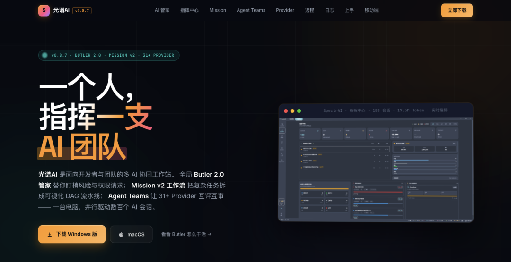
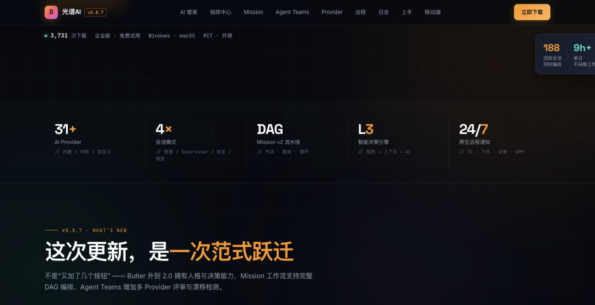
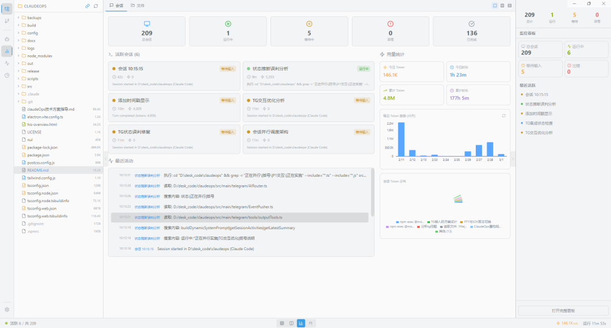
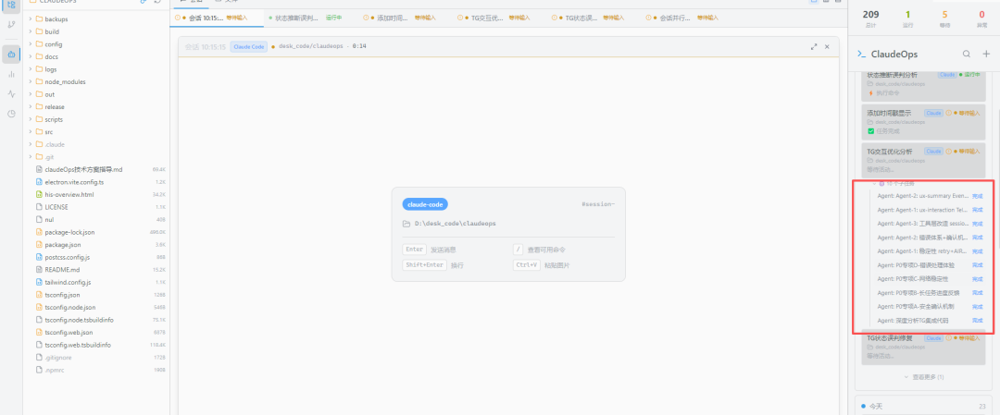
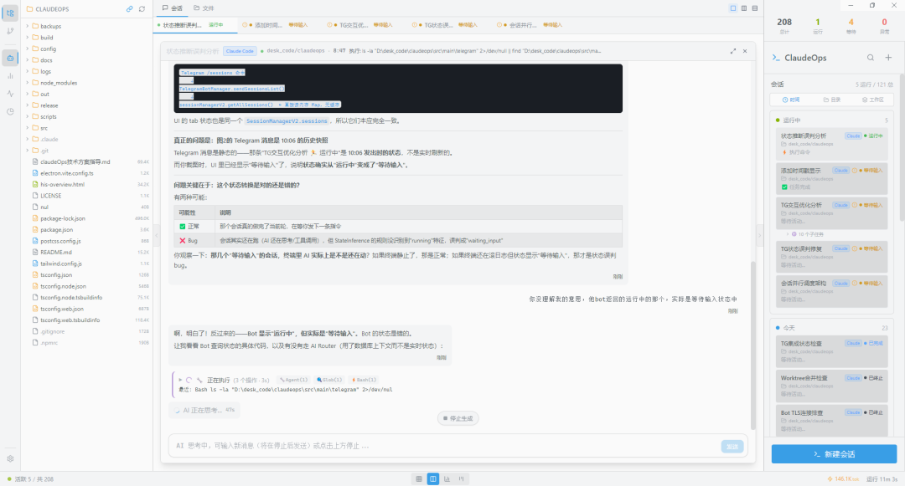
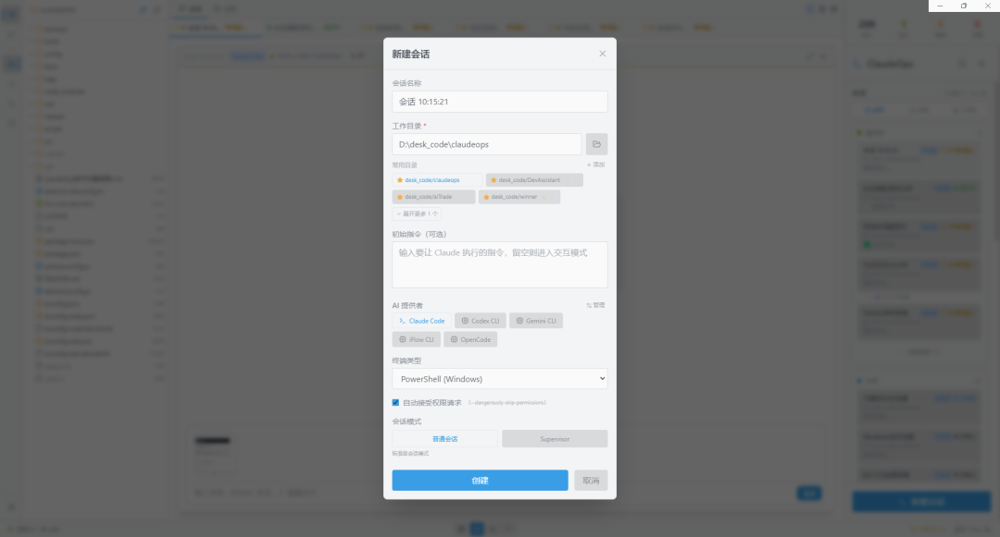
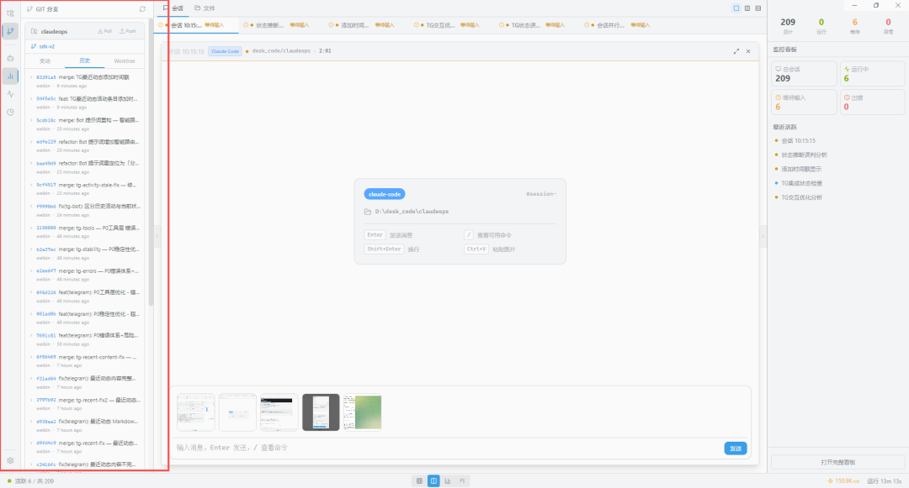
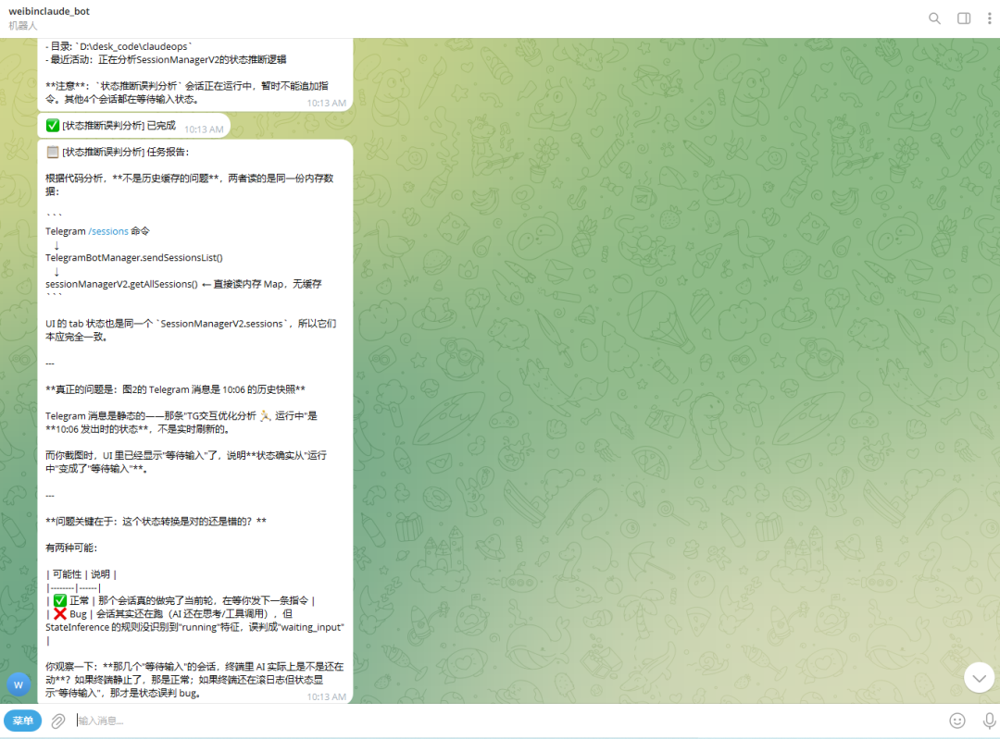

> 📎 来源: [一飞开源](https://mp.weixin.qq.com/s?__biz=Mzk0ODI4NjUyNA==&mid=2247508569&idx=1&sn=18fa6db70130af94a64e7ad8c6314829&chksm=c2bf305300c4dedb407fc1679aefd213c14b895cfd86477fd444b1fa188b0d1610f07fac3610&mpshare=1&scene=1&srcid=0518LKh3XnyIlEJuoMY12wkX&sharer_shareinfo=37c98570a218d8708e1831a9b822da16&sharer_shareinfo_first=37c98570a218d8708e1831a9b822da16) | 时间: 2026-05-18 23:12

---

> 一飞开源，介绍创意、新奇、有趣、实用的开源/AI应用、系统、软件、硬件及技术，一个探索、发现、分享、使用与互动交流的开源/AI技术社区平台。致力于打造活力开源/AI社区，共建开源新生态！

# 一、开源项目简介

# SpectrAI

# 一个人， 指挥一支 AI 团队

光谱AI 是面向开发者与团队的多 AI 协同工作站。

光谱AI (SpectrAI) — 开源多会话 AI 编程桌面客户端，支持 Claude/Codex/Gemini 多 Provider 并行，内置 MCP 工具网关、技能模板、文件管理、Git 面板与终端。

# 二、开源协议

使用MIT开源协议

# 三、界面展示

















# 四、功能概述

# SpectrAI

**多 AI CLI 会话编排与管控平台**。在一个桌面应用中同时管理多个 AI 会话，提供结构化对话视图、看板式任务管理、实时状态监控、Agent 编排、工作流自动化和远程控制。

# 核心功能

# 多会话管理

- 同时运行多个 AI CLI 会话，会话列表按时间自动分组（运行中 / 今天 / 历史）
- **结构化对话视图**

  — AI 回答以消息气泡呈现，工具调用以卡片展示，不再是裸终端输出
- **多标签页切换**

  — 顶部标签栏支持多会话并排浏览，支持聚焦、网格、仪表盘等视图切换
- 会话恢复 — 保存 Claude 会话 ID，支持 --resume 续接多轮对话（Claude Code 专属）
- **图片粘贴**

  — 在会话输入框 Ctrl+V 直接粘贴图片，发送给 AI 进行多模态分析

# Provider Adapter 架构

统一 BaseProviderAdapter 抽象层，屏蔽各 CLI 的通信差异，每个 Provider 独立实现：

|  |  |  |
| --- | --- | --- |
| Provider | 通信方式 | 特性 |
| **Claude Code** | Agent SDK V2 | 可恢复、自动接受、会话追踪 |
| **Codex CLI** | JSON-RPC (codex serve) | 自动接受 |
| **Gemini CLI** | NDJSON 流式 | 自动接受 |
| **iFlow CLI** | ACP 协议 | 自动接受 |
| **OpenCode** | 可配置命令行 | 自动接受 |
| **自定义提供者** | 可配置命令行 | 用户自定义 |

- AdapterRegistry 工厂注册，toolMapping 统一事件映射
- 每个 Provider 可独立配置启动参数、Node.js 版本、状态推断阈值
- 支持 **自定义 AI 提供者**（Settings → AI 提供者管理 → 添加自定义 AI 提供者）

# Agent 编排系统

完整的 MCP（Model Context Protocol）基础设施，让 Claude 能够自动创建和管理子会话：

- **spawn\_agent**

  — 创建子 Agent（支持一次性 oneShot 和持久多轮对话模式）
- **send\_to\_agent**

  — 向持久 Agent 发送追加指令
- **wait\_agent / wait\_agent\_idle**

  — 等待 Agent 完成或进入空闲
- **get\_agent\_output / get\_agent\_status / list\_agents**

  — 监控 Agent 状态
- **cancel\_agent**

  — 终止 Agent
- **Supervisor 模式**

  — 自动注入 System Prompt，引导 Claude 使用 Agent 工具进行任务分解
- **子任务实时追踪**

  — 右侧面板动态展示所有 Agent 子任务的运行状态与完成情况

# Agent Teams — 多角色 AI 协作

区别于 Supervisor 单中心调度，Teams 是去中心化的多 AI 并行协作模式：

|  |  |
| --- | --- |
| 特性 | 说明 |
| **多 Provider 混搭** | 每个角色独立选择 Claude / Codex / Gemini / iFlow，扬长避短 |
| **SharedTaskList** | SQLite 持久化任务队列，原子    WHERE status='pending'    认领，零冲突 |
| **TeamBus 消息总线** | P2P 路由，支持单播（指定角色）和广播，角色间直接通信 |
| **MCP 原生工具集** | 5 个 MCP 工具：team\_message\_role    /    team\_broadcast    /    team\_claim\_task    /    team\_complete\_task    /    team\_get\_tasks |
| **DB 持久化** | 6 张表（teams / roles / instances / members / tasks / messages），重启后历史完整保留 |
| **可视化追踪** | TaskKanban 看板实时展示任务流转，TeamMessageFlow 对话流展示成员通信 |

**支持团队模板化**：预定义角色分工（如"需求分析师 + 架构师 + 前端 + 后端 + 测试"），一键启动团队实例，填入目标即可开始协作。

# 文件资源管理器

- **文件树**

  — 实时展示会话工作目录，支持展开/折叠、双击打开文件预览
- **AI 改动追踪**

  — FS Watch 实时监听（300ms debounce），改动文件右侧显示蓝色圆点
- **会话改动列表**

  — 列出该会话的所有创建 / 修改 / 删除文件，支持点击在代码查看器中预览
- **多会话归因**

  — 多个会话同时运行时，按工作目录深度 + 最近活动时间自动归因，竞态冲突标记警告
- **Worktree 支持**

  — Worktree 会话 merge 后通过 git diff 归因，记录完整改动历史
- **自动跟随**

  — 默认跟随当前选中会话的工作目录，可手动解除切换任意目录

# Git 分支管理面板

- 内置 **GIT 分支** 侧边栏，支持定位 / 历史 / Worktree 三视图切换
- 一览提交历史，commit 消息直接在面板中显示
- **Git Worktree 隔离**

  — 为每个任务创建独立分支，完成后合并，彻底隔离代码修改

# 看板式任务管理

- 四列看板：待办 → 进行中 → 等待中 → 已完成
- 拖拽排序、优先级标记（高/中/低）
- 任务关联会话，一键创建会话执行任务

# 工作流引擎

- DAG 依赖解析，支持串行/并行多步骤执行
- 步骤间输出路由和数据传递
- 手工审核步骤支持
- 内置工作流模板（代码审查、文档生成、调研撰写）

# 自主规划引擎

- 接收高级目标，LLM 驱动自动分解为子任务
- 通过 Agent 池并发执行，依赖追踪
- 结果聚合与汇总

# Telegram 远程控制

- Telegram Bot 集成，随时随地管理会话
- 多 AI Provider 路由（Deepseek、通义千问、GPT-4 等）
- 事件推送 — 完成通知、错误告警、卡住提醒
- **结构化消息 — 任务报告以 Markdown 表格、代码块形式推送，信息清晰易读**
- 远程工具 — 查询会话状态、发送命令、获取输出

# 实时监控看板

- 会话总览：总会话数 / 运行中 / 等待中 / 异常 / 已完成
- **Token 用量统计：今日 / 累计 Token 消耗、今日 / 累计运行时长**
- **30 天 Token 趋势图（Recharts 柱状图）**
- **会话 Token 分布饼图，直观显示各会话的 Token 占比**
- 最近活动实时流，精确到秒的操作时间线

# 代理与网络

- 内置代理设置（HTTP / SOCKS5），用于 AI 连接 Anthropic / Telegram 等服务
- Windows 下自动从环境变量或 PowerShell profile 读取系统代理

# 数据持久化与统计

- SQLite + Repository 模式（Session / Conversation / Task / Usage 等多个仓库）
- **结构化存储 AI 对话消息**

  （ConversationMessage），支持历史回溯
- Token 用量统计与可视化仪表盘（日/累计 Token、时长、Token 分布饼图）
- 会话 AI 回答摘要提取与跨会话感知
- 日志自动归档（默认 30 天保留）

# 五、技术选型

# 技术栈

|  |  |
| --- | --- |
| 类别 | 技术 |
| **框架** | Electron 28 + React 18 + TypeScript 5 |
| **构建** | electron-vite + Vite 5 |
| **AI 接入** | @anthropic-ai/claude-code Agent SDK V2 + 各 CLI 适配器 |
| **状态管理** | Zustand |
| **存储** | better-sqlite3 (SQLite) + Repository 模式 |
| **UI** | Tailwind CSS + Lucide Icons + Allotment (分栏) |
| **拖拽** | @dnd-kit |
| **图表** | Recharts |
| **MCP** | @modelcontextprotocol/sdk |
| **通信** | WebSocket |
| **远程控制** | node-telegram-bot-api |

---

# 前置要求

- Node.js >= 18
- npm >= 9
- 至少安装一个支持的 AI CLI（claude / codex / gemini / iflow 等）
- Windows: 需要安装 Visual Studio Build Tools（用于编译 better-sqlite3 等原生模块）

# 快速开始

```
# 1. 安装依赖
```

# 常用命令

|  |  |
| --- | --- |
| 命令 | 说明 |
| npm run dev | 启动开发模式（热重载） |
| npm run build | 构建生产版本 |
| npm run build:win | 构建 Windows 开发版 |
| npm run build:mac | 构建 macOS 开发版（.app） |
| npm run dist | 打包 Windows 安装程序（NSIS） |
| npm run dist:mac | 打包 macOS 安装程序（DMG + ZIP） |
| npm run preview | 预览生产构建 |
| npm run rebuild | 重建所有原生模块 |
| npm run typecheck | TypeScript 类型检查 |
| npm run lint | ESLint 代码检查 |

# 六、源码地址

开源项目地址：

https://github.com/wei9966/SpectrAI

访问一飞开源：https://code.exmay.com/
