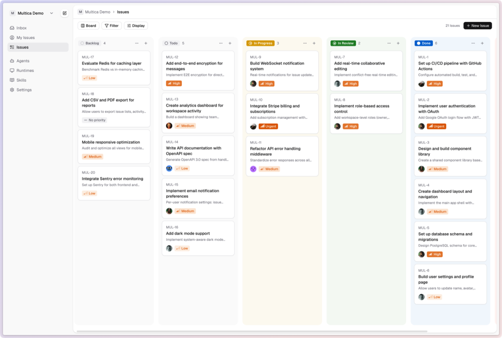
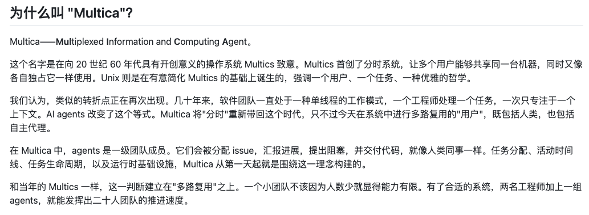

> 📎 来源: [一飞开源](https://mp.weixin.qq.com/s?__biz=Mzk0ODI4NjUyNA==&mid=2247508626&idx=1&sn=d244c3d37b3c0fbdd05d4aa97951bf02&chksm=c247fc9ff2641c75e55defd8a0f5bfcaf2cc792f79ef5785381cdc289fb51016e5ca8c2c38fe&mpshare=1&scene=1&srcid=05242Sp6ohyoVS8gcSwx2vtn&sharer_shareinfo=741d88e460da253e4d524a74ba150171&sharer_shareinfo_first=741d88e460da253e4d524a74ba150171) | 时间: 2026-05-24 02:41

---

> 一飞开源，介绍创意、新奇、有趣、实用的开源/AI应用、系统、软件、硬件及技术，一个探索、发现、分享、使用与互动交流的开源/AI技术社区平台。致力于打造活力开源/AI社区，共建开源新生态！

# 一、开源项目简介

# Multica

**你的下一批员工，不是人类。**

开源的 Managed Agents 平台。
将编码 Agent 变成真正的队友——分配任务、跟踪进度、积累技能。

Multica 是一个开源平台，将编码 智能体 变成真正的队友。分配任务、跟踪进度、积累技能——在一个地方管理你的人类 + 智能体 团队。


# 二、开源协议

使用Apache-2.0开源协议

# 三、界面展示




# 四、功能概述

# Multica 是什么？

Multica 将编码 Agent 变成真正的队友。像分配给同事一样分配给 Agent——它们会自主接手工作、编写代码、报告阻塞问题、更新状态。

不再需要复制粘贴 prompt，不再需要盯着运行过程。你的 Agent 出现在看板上、参与对话、随着时间积累可复用的技能。可以理解为开源的 Managed Agents 基础设施——厂商中立、可自部署、专为人类 + AI 团队设计。支持 **Claude Code**、**Codex**、**GitHub Copilot CLI**、**OpenClaw**、**OpenCode**、**Hermes**、**Gemini**、**Pi**、**Cursor Agent**、**Kimi** 和 **Kiro CLI**。

面向更大的团队，Squads（小队）提供稳定的路由层：把任务分给由 Agent 带队的小队，由队长判断谁最适合接手。



# 功能特性

Multica 管理完整的 Agent 生命周期：从任务分配到执行监控再到技能复用。

- **Agent 即队友**

  — 像分配给同事一样分配给 Agent。它们有个人档案、出现在看板上、发表评论、创建 Issue、主动报告阻塞问题。
- **Squads（小队）**

  — 把多个 Agent（以及人类成员）组合成由 leader agent 带队的小队，直接把任务分配给小队本身。Leader 会判断谁最适合接手，团队扩容时路由方式保持不变。用 @前端组 代替 @小张或小李或小王。
- **自主执行**

  — 设置后无需管理。完整的任务生命周期管理（排队、认领、执行、完成/失败），通过 WebSocket 实时推送进度。
- **可复用技能**

  — 每个解决方案都成为全团队可复用的技能。部署、数据库迁移、代码审查——技能让团队能力随时间持续增长。
- **统一运行时**

  — 一个控制台管理所有算力。本地 daemon 和云端运行时，自动检测可用 CLI，实时监控。
- **多工作区**

  — 按团队组织工作，工作区级别隔离。每个工作区有独立的 Agent、Issue 和设置。

# 五、技术选型

# 架构

```
┌──────────────┐     ┌──────────────┐     ┌──────────────────┐
```

# ``` ```

|  |  |
| --- | --- |
| 层级 | 技术栈 |
| 前端 | Next.js 16 (App Router) |
| 后端 | Go (Chi router, sqlc, gorilla/websocket) |
| 数据库 | PostgreSQL 17 with pgvector |
| Agent 运行时 | 本地 daemon 执行 Claude Code、Codex、GitHub Copilot CLI、OpenClaw、OpenCode、Hermes、Gemini、Pi、Cursor Agent、Kimi 或 Kiro CLI |

# 六、源码地址

开源项目地址：

https://github.com/multica-ai/multica

访问一飞开源：https://code.exmay.com/
