> 📎 来源: [So talk](https://mp.weixin.qq.com/s?__biz=MzA3NzE0MjgwMw==&mid=2651665963&idx=1&sn=41c464896df7f1e869fa624473f60f3b&chksm=855fa8a2fc3545e28d8855b1ddd42aeca2939b6464bfe4f98736a4f4fdd075e52e55364dc934&mpshare=1&scene=1&srcid=0530SclWPxTMyidwWhY69Mzj&sharer_shareinfo=208d73ec5a6ea8e912f72abb296a38aa&sharer_shareinfo_first=208d73ec5a6ea8e912f72abb296a38aa) | 时间: 2026-05-30 01:56

---

朋友公司做品牌合作的，经常需要在签合同之前摸清楚对方艺人的口碑情况——这个人最近有没有负面、粉丝画像是什么、舆论风向怎么样。

  我就想，这个需求能不能自己搭一个，作为研究学习的目的

然后找到了 **BettaFish（微舆）**，开源的，免费部署，折腾了两天，跑起来了。

*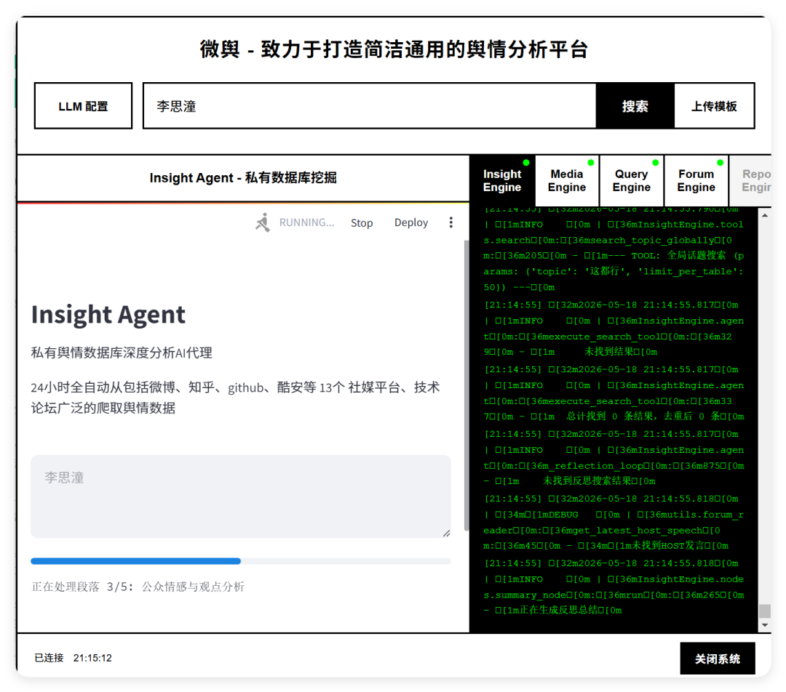*

*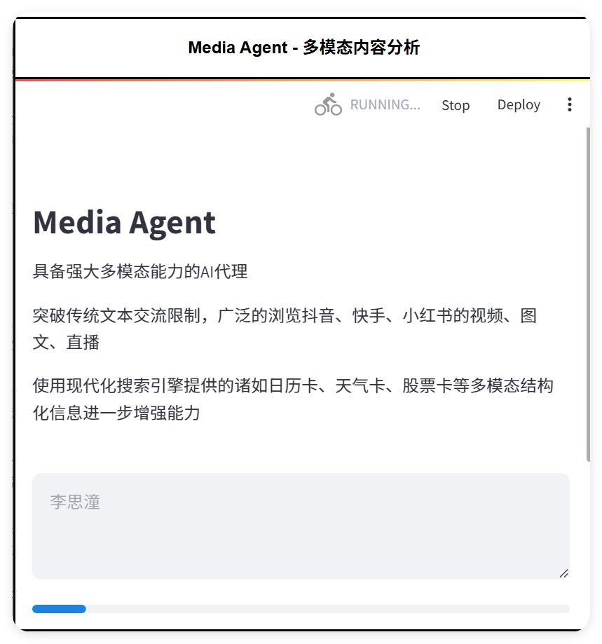*

*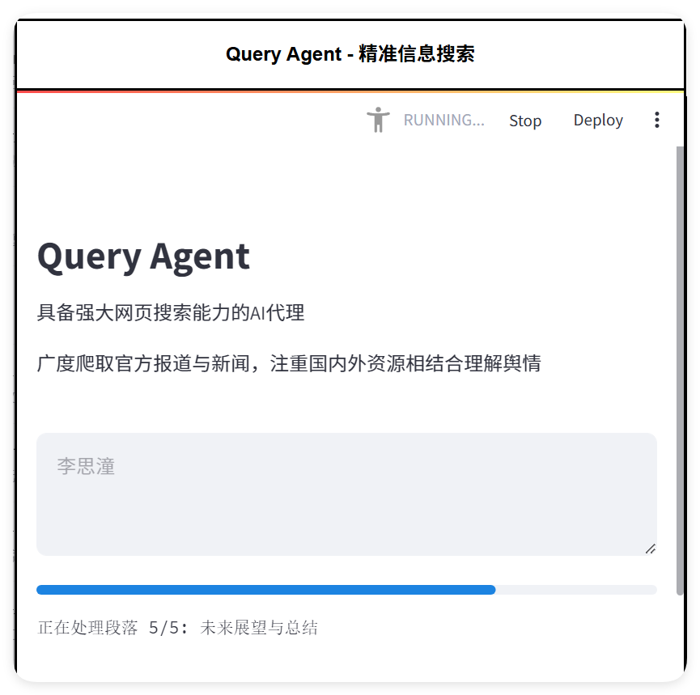*

---

## 它解决的是什么问题

先说清楚舆情系统到底有什么用，不然后面的东西没有意义。

做品牌合作的人，在谈一个艺人或者KOL之前，最想知道的是三件事：

•**这个人现在风评怎么样**，有没有潜在的雷

•**粉丝在说什么**，是真实口碑还是控评出来的

•**如果出了负面**，情绪是在扩散还是在消退

传统的做法是人工去各平台搜，又慢又片面，很容易漏掉关键信息。专业舆情软件能做到，但价格劝退了大部分中小团队。

⚡ 多Agent协作思路

BettaFish的思路是用多个AI Agent分工协作——一个负责全网抓内容，一个负责分析情绪和关键词，一个负责生成可读的报告。你输入一个名字或者话题，它自己去跑，最后给你一份结构化的分析。

---

## 我测试了一个真实场景

最近大热的电影《给阿嫲的情书》，女主角是我们的校友，我就拿对方的名字 **李思潼** 测了一下。

等了大概三十分钟，报告出来了，洋洋洒洒2.1万字的全面分析报告。

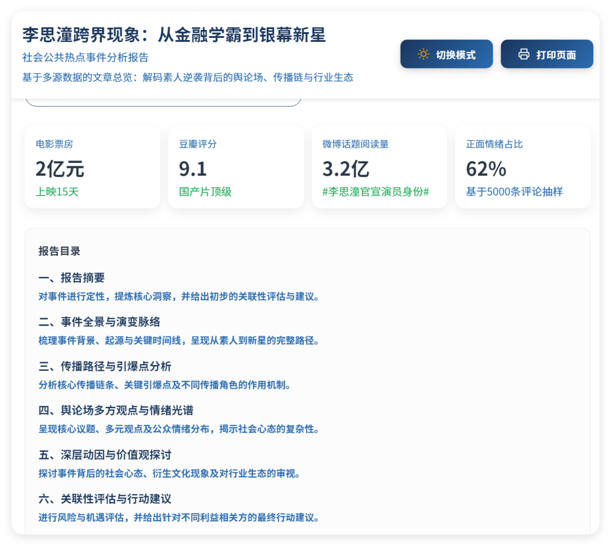

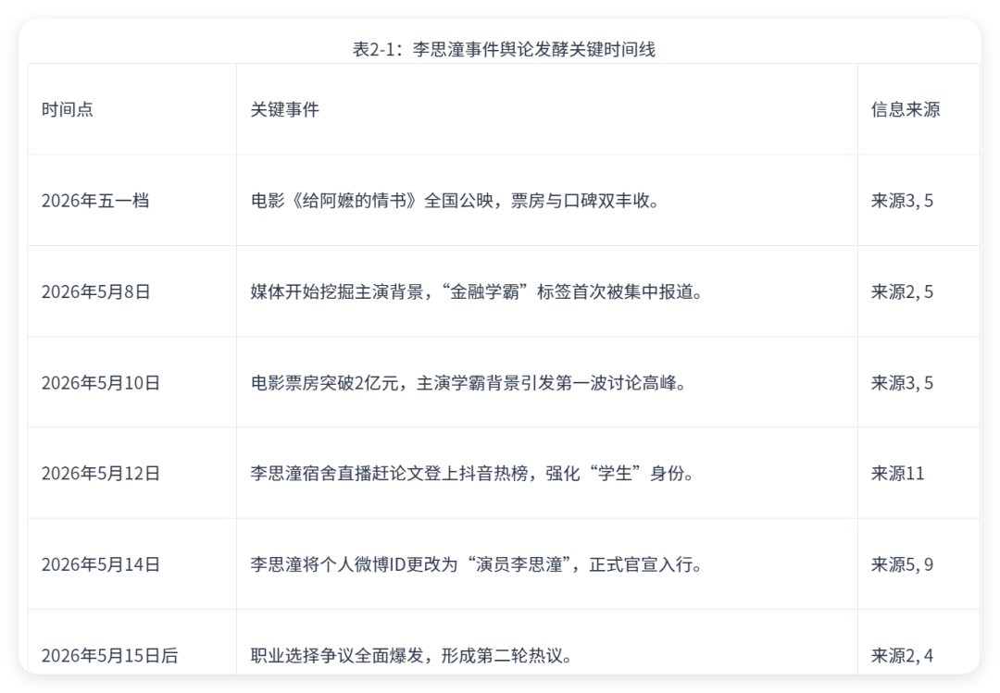

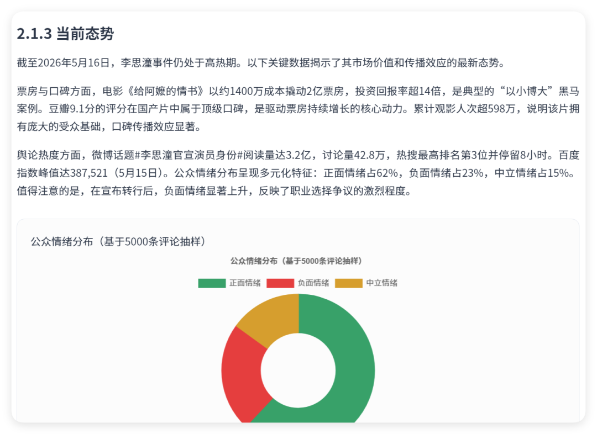

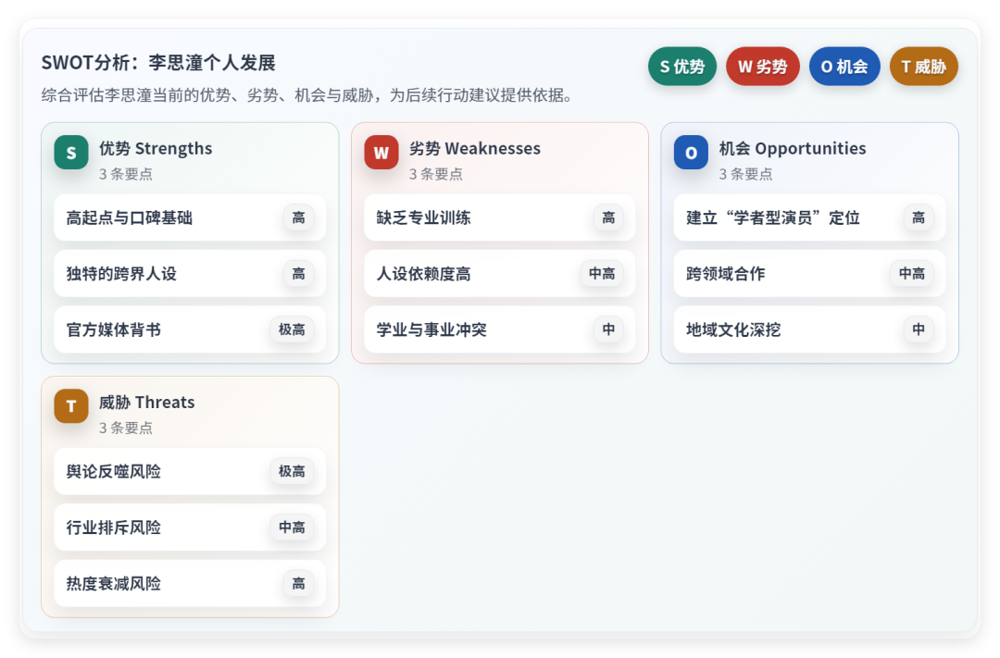

  几个让我觉得有用的地方：

•**情绪时间线**：不是简单的正负面比例，而是能看到情绪在哪个时间点发生了变化，对应的事件是什么。这个对判断"负面是偶发还是持续"很关键，偶发的可以接受，持续走低的就要慎重了。

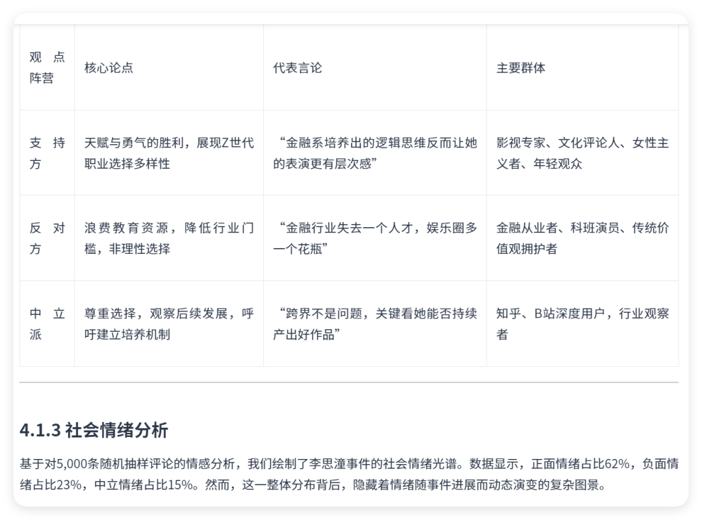

•**关键词聚类**：大家提到这个人的时候，高频词是什么。这个能快速告诉你公众对这个人的固有印象是什么，跟品牌调性合不合得上。

•**内容来源分布**：哪个平台声量最大，微博还是小红书还是抖音评论区。不同平台的用户群体不一样，这个信息影响你判断合作的传播路径。

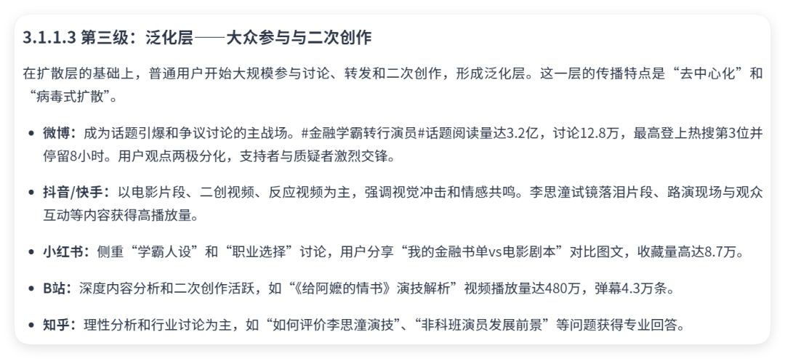

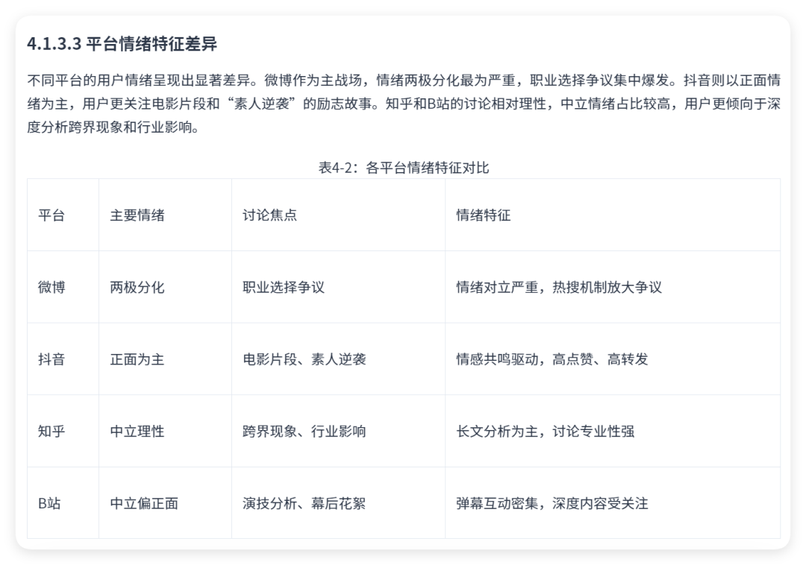

💡 使用定位

当然也有局限。部分平台的数据覆盖不够全，实时性也不如商业产品，适合做背景调研，不太适合做危机实时监控。但对于辅助参考了解的需求，完全够用。

---

## 关于部署这件事

 我不是开发背景，整个过程基本靠 **Vibe Coding**——遇到问题就把报错丢给 Claude Code，让它帮我分析原因和解决方案，我来判断和执行。

 这个方法现在让我觉得很多"看起来很难"的工具其实都能上手。BettaFish用的是Docker部署，文档写得清楚，真正卡住的地方只有一次依赖冲突，AI帮我定位到了具体的配置文件，改了一些东西解决，里面用到的众多AI的API接口会稍微麻烦，但是也是花点时间就可以的。

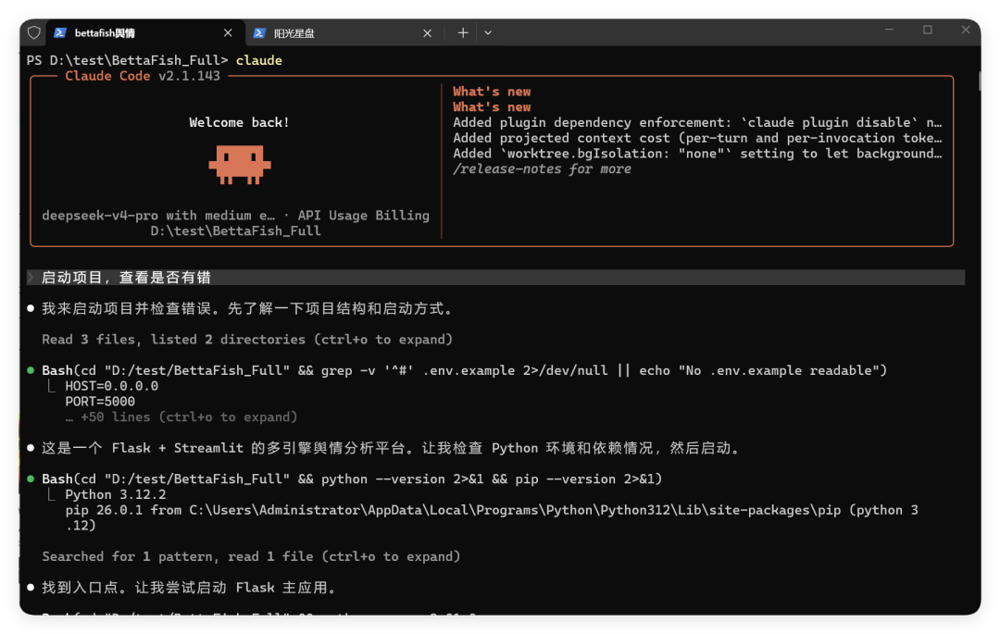

⚡ 一个值得思考的问题

很多团队花大钱买的SaaS工具，有多少其实是可以用开源替代的？不是所有场景都适合，但至少值得先问一句。

---

## 这东西适合谁用

整理一下，我觉得真正能从这个工具里拿到价值的场景：

•**品牌方/市场团队**：在选合作对象之前做背景调查，成本极低，几块钱以内一份。

•**公关从业者**：监控自家品牌的舆论动态，尤其是在发布会或者有争议事件之后，看情绪走向是在收敛还是在扩散，直接搜索自家公司的事件。

•**研究者或者内容创作者**：追踪某个话题的舆论演变，比人工搜集效率高很多。

•**想学AI应用的人**：这个项目的多Agent架构本身就是一个很好的学习样本，能看到Agent之间怎么协作、怎么分工。

 如果你也有类似的需求，GitHub搜 **666ghj/BettaFish，自己研究搭建。**

本文仅用于学习研究vibe coding的知识，请勿商用
