> 📎 来源: [Excel广场AI实验室](https://mp.weixin.qq.com/s?__biz=Mzg3MDczOTEyNA==&mid=2247512513&idx=1&sn=8d2db9f14de4eefad2eaf589fdb012e9&chksm=cf172d119bdf4196c1ea02b3222d0dd9933a351e855a10bd5c9e305db2e0ecb7641a083ffb21&mpshare=1&scene=1&srcid=05303coeNgtcDogHMrCp46lL&sharer_shareinfo=4f9000d7e7cfeaead2707a5e0502e8d6&sharer_shareinfo_first=4f9000d7e7cfeaead2707a5e0502e8d6) | 时间: 2026-05-30 13:34

---

做PPT这件事，我熬过太多个夜了。

排版、找图、配色、对齐……一份汇报方案折腾到凌晨，第二天领导一句“风格再换换”，瞬间想原地消失。

更别提那些号称“AI一键生成PPT”的工具了，要么生成出来根本没配图，光秃秃一片；要么图丑到不敢直视；好不容易凑出个样子，想改个字还得导出来重新折腾。跟最终成品差隔着十万八千里。

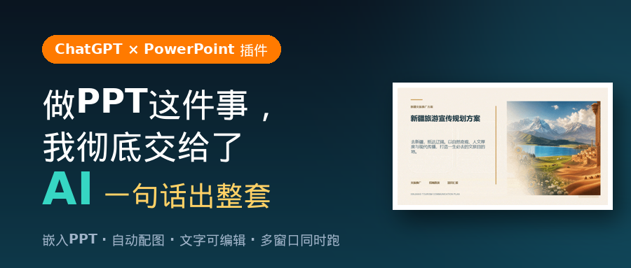

但，现在不一样了！！

# **先看效果，别急着划走**

这是一份**《新疆旅游宣传规划方案》**，从封面到总结页，雪山、草原、湖泊、路线图、数据图表全都有，视觉直接拉满。

源文件：新疆旅游宣传规划方案.pdf

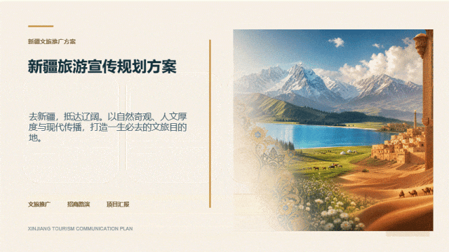

*△ 全程由 GPT 生成的成品封面，文字均可编辑*

**重点来了，这份PPT****我一个字都没改。**

全程就输了一段需求，剩下的全是 GPT 自己生成的：文字可编辑、配图自动配、版式自己排。

它用的是**ChatGPT for PowerPoint 插件**，直接嵌在 PPT 里，调用 Images 2.0 生图，所见即所得。

那段“咒语”我也放出来，你可以直接抄作业

```
请制作一份《新疆旅游宣传规划方案》PPT，目标用于文旅推广、招商路演或旅游项目汇报。
```

把里面的“新疆旅游”换成你自己的主题，立马变成你的方案。

# **怎么用？真的就三步**

别被“插件”两个字吓到，比点外卖还简单。

## **第一步：装插件**

打开**PowerPoint**（注意⚠️不是 WPS，是微软的 PowerPoint），点“开始”选项卡 →“加载项” → 搜索“**chatgpt**”，点击添加。

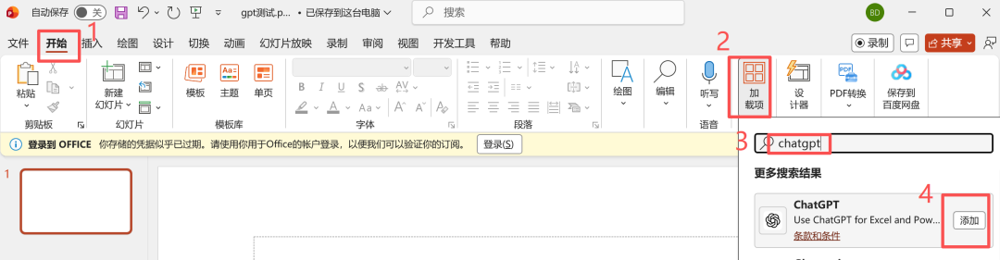

装好后，右上角会出现一个 ChatGPT 的功能框，点它，选“使用 ChatGPT 账号继续”登录。

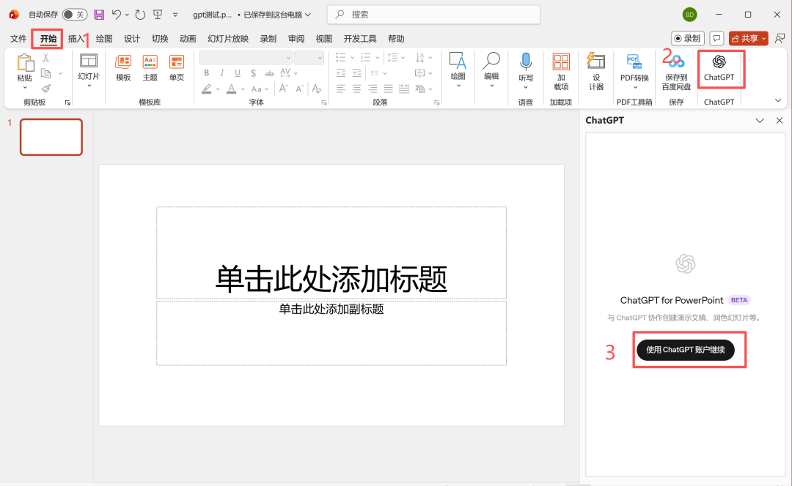

## **第二步：输入需求**

登录后，在输入框里把你的需求一打，点发送。支持上传文件、选择技能、调整模型复杂度，该有的功能一个不少。

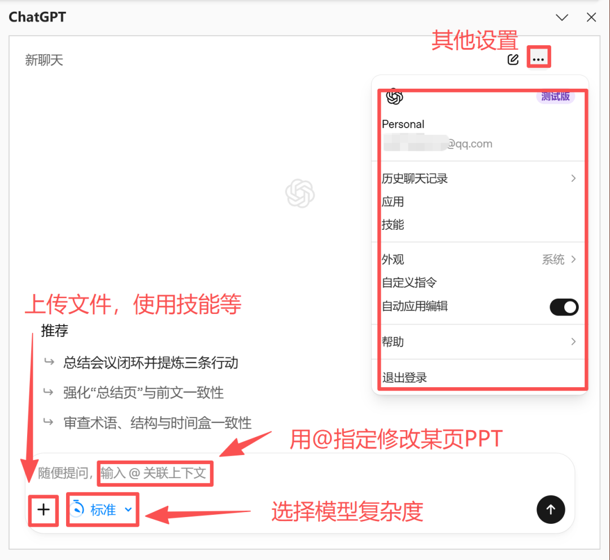

## **第三步：等几分钟，收工**

PPT 就自动做好了，稍等几分钟即可。

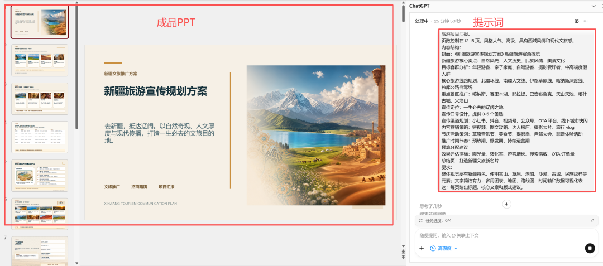

*△ 输入提示词，PPT 自动生成*

不满意？两种改法：

直接在 PPT 里手动改；或者用 GPT 的 **@功能** 指定某一页改，比如“@第7页，加一个符合主题的透明色背景”。

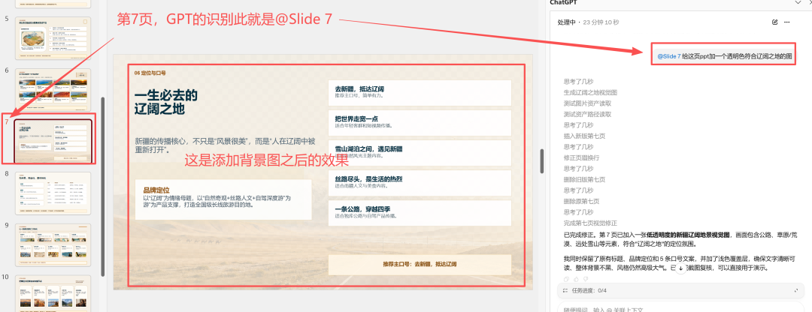

## **进阶玩法**

**已经有现成 PPT 想优化？**直接把文件传给它，让 GPT 帮你重做版式、补图、润色，旧稿秒变高级稿。

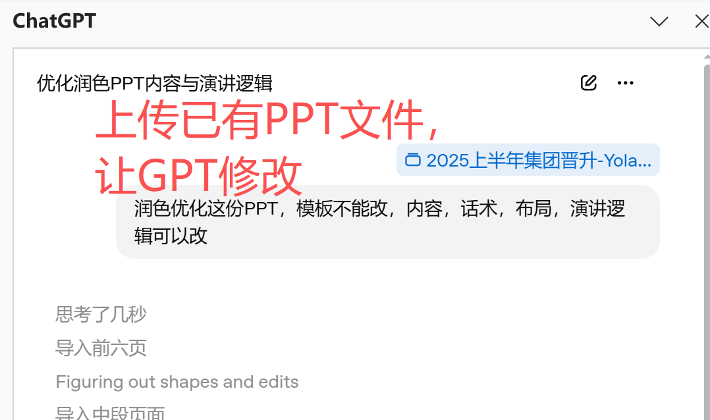

**更狠的是，它支持****多窗口同时跑**——同时写 5 份 PPT 是什么概念？你品，你细品。

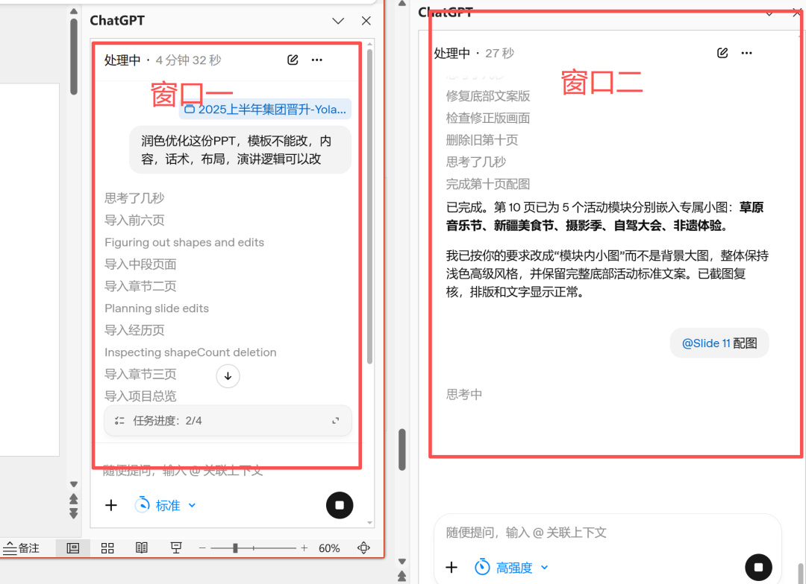

 

# **没有 GPT 账号怎么办？**

**没账号：**打开https://**chatgpt.com**，用 163 或 QQ 邮箱注册一个，几分钟搞定。

**想升级会员、解锁更强生图和额度：**打开https://gppshop.top，一键搞定，省心。

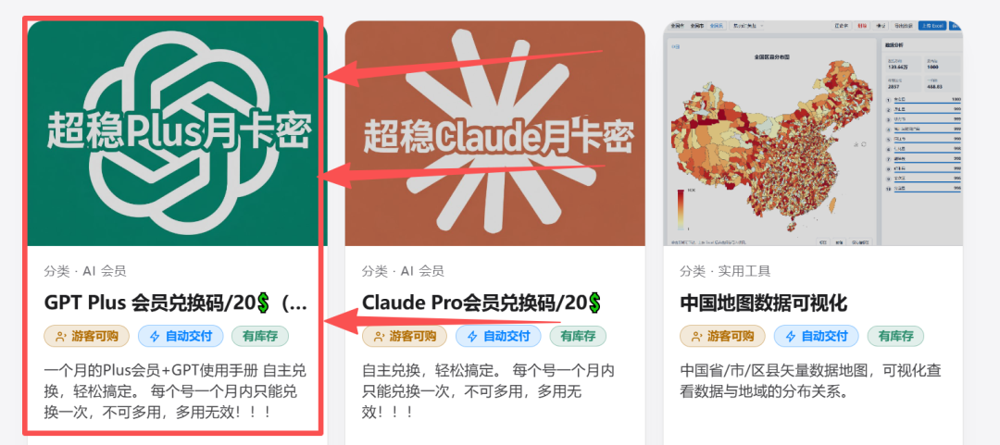

会员开起来之后，生图质量、模型能力、跑的份数都不在一个量级，做 PPT 这件事是真的可以“躺平”了。

# **写在最后**

以前我们是“做 PPT”，现在是“指挥 AI 做 PPT”。

一段需求→ 几分钟 → 一份能直接拿去汇报的方案。这效率，回不去了。

更详细的玩法，我都整理进了：[从0到1带你速通AI，《GPT使用手册》终于来了！](https://mp.weixin.qq.com/s?__biz=Mzg3MDczOTEyNA==&mid=2247512474&idx=1&sn=abad4429b1178000b789a20f4eae29b0&scene=21#wechat_redirect)

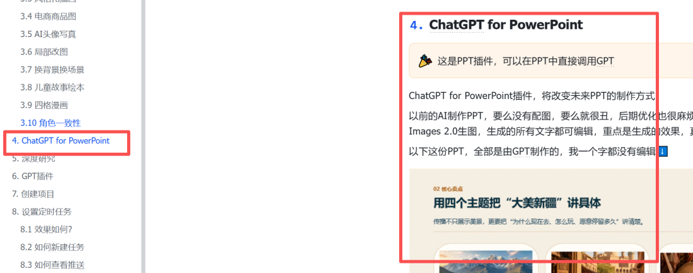

**觉得有用，点个赞 + 在看 + 转发给那个还在通宵改 PPT 的同事吧**
