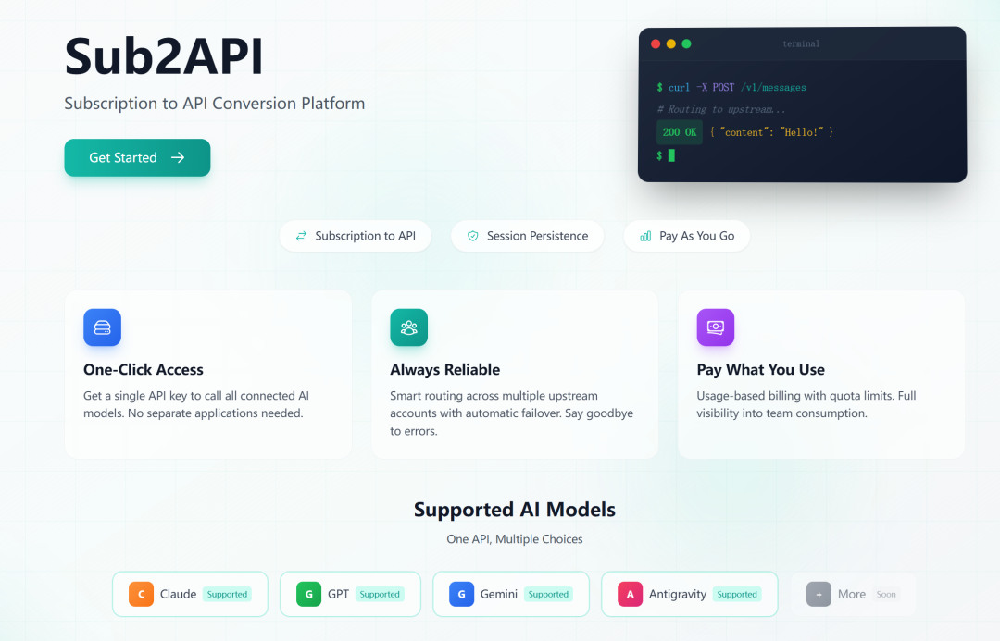

> 📎 来源: [万事屋的银时](https://mp.weixin.qq.com/s?__biz=MzUzMzY5MTg5NQ==&mid=2247484281&idx=1&sn=89c2a621ff899d856bf1dcda03e4613d&chksm=fbd4628249a81469ba56ef5e51ebd900f1637b7b63de8ca3dc53f3567106633f48ece046ee61&mpshare=1&scene=1&srcid=0501FrwPzZiZjlYh9ljyazXm&sharer_shareinfo=e7fed4cc05876114e980d1cbbf45b4d9&sharer_shareinfo_first=e7fed4cc05876114e980d1cbbf45b4d9) | 时间: 2026-05-01 00:53

---

> 你是不是也遇到过这种尴尬:

> - 一个月花 200 块订阅了 Claude Pro,结果每天只用一两次,白花花的钱在浪费;
> - 想几个朋友一起拼车 ChatGPT Plus,但账号互发密码总担心被盗、还容易踢号;
> - 在 Cursor、Claude Code 里想用自己订阅的额度,但官方只给 Web 版用,API 还得另外充钱;
> - 想给团队搞个统一的 AI 入口,做权限管理、做账单核算,找了一圈没找到趁手的工具。

> 今天给大家介绍一个 GitHub 上有 **7.1k Star** 的开源神器 —— **Sub2API**(读作 sub-to-api),它正好解决以上所有问题。

## 一、它到底是干嘛的?

一句话总结:**Sub2API 把你买的 AI 订阅(Claude、ChatGPT、Gemini 等),变成可以拿来调用的 API,还能拼车给多个人用,自带计费和权限管理。**

更通俗点说,它做的事情其实是把"订阅制"和"API 调用"这两个原本割裂的世界打通了。

按官方介绍,Sub2API 是一个面向"订阅额度分发"的 AI API 网关平台,用户通过平台生成的 API Key 就能访问上游 AI 服务,而平台本身负责鉴权、计费、负载均衡和请求转发[1]。

举个例子让你秒懂:

- 你买了 Claude Pro(每月 20 美元)和 ChatGPT Plus(每月 20 美元);
- 部署一个 Sub2API,把这两个账号"喂"进去;
- 然后给老婆生成一个 Key、给同事生成一个 Key、给自己工作机生成一个 Key;
- 每个人拿着 Key 就能在 Claude Code、Cursor、Codex 等工具里直接用,**就像在用 OpenAI 官方 API 一样自然**;
- 后台还能看到谁用了多少 Token、花了多少钱、有没有人在刷你额度。

是不是有种"把家庭宽带做成 Wi-Fi 路由器"的感觉?**一份订阅,多人享用,而且井井有条。**



## 二、为什么这个项目这么火?

短短时间冲到 7.1k Star、被 Trendshift 收录,绝不是无缘无故的[^1]。我帮你拆几个关键点:

**痛点 1:订阅吃灰** 重度用户不够用,轻度用户用不完。Sub2API 让"用不完"的额度可以分给"不够用"的朋友,完美错峰。

**痛点 2:拼车混乱** 传统拼车就是大家共用一个账号密码,有人多设备登录、有人改密码、有人触发风控,一团糟。Sub2API 给每人一个独立 Key,**用量、并发、限速都能单独控制**,出了问题谁的锅也清清楚楚。

**痛点 3:订阅 ≠ API** Claude Pro、ChatGPT Plus 给的是"网页用"的额度,不能直接拿来在 IDE 里写代码。Sub2API 通过协议适配,让你在 Claude Code、Codex、Cursor 这些原生工具里**像调用 API 一样调用你的订阅**,无缝接入[^1]。

**痛点 4:没有管理工具** 个人用还行,团队用、做内部小项目就抓瞎了。Sub2API 自带 Web 管理后台,能监控、能配额、能审计,该有的都有。

## 三、它有哪些拿得出手的功能?

按官方 README 的列表[^1],主要有这几大块:

**🎯 多账号管理** 支持多种上游账号类型(OAuth、API Key 等),可以同时管理 Claude、OpenAI、Gemini、Antigravity 等多家供应商的账号。

**🔑 API Key 分发** 为不同用户生成独立 API Key,权限隔离,不互相影响。

**💰 精确计费** Token 级别的用量追踪和费用计算,谁用得多、用得少,后台数据一目了然。

**🧠 智能调度** 账号之间智能分配请求,还支持"粘性会话"(Sticky Session)—— 同一个对话固定走同一个账号,避免上下文错乱。

**🚦 并发控制 + 限速** 可以设置每用户、每账号的并发上限,以及请求频率和 Token 用量的速率限制,防止有人开"狂暴模式"把账号刷爆。

**🖥️ 管理后台** Vue 3 + TailwindCSS 写的现代化 Web 界面,监控、管理、配置一站式搞定。

**🧩 外部系统集成** 支持通过 iframe 嵌入支付系统、工单系统等外部模块,扩展性很强。社区还有人基于它搞了**自助充值支付系统**(Sub2ApiPay)和**移动端管理 App**(sub2api-mobile)[^1],生态在持续生长。

**⚡ Antigravity 适配** 对新兴的 Antigravity 平台账号也有专门支持,Claude 和 Gemini 模型都能用,在 Claude Code 里改个环境变量就能直连。

## 四、技术栈和部署难度

技术栈相当现代化也相当成熟:

- **后端**:Go 1.25 + Gin + Ent
- **前端**:Vue 3.4+ + Vite 5 + TailwindCSS
- **数据库**:PostgreSQL 15+
- **缓存/队列**:Redis 7+
- **协议**:Docker 部署友好

官方提供了**三种部署方式**[^1],可以按自己的情况挑:

**方式一:脚本一键安装(适合有 Linux 服务器的同学)**

只要一行命令:

```
curl -sSL https://raw.githubusercontent.com/Wei-Shaw/sub2api/main/deploy/install.sh | sudo bash
```

脚本会自动检测系统架构、下载二进制、配置 systemd 服务,然后浏览器打开 

```
http://你的IP:8080
```

 跟着引导走完安装向导即可。

**方式二:Docker Compose(推荐,简单稳定)**

跑一个一键部署脚本,会自动生成安全密钥、创建数据目录,然后 

```
docker-compose up-d
```

 启动,前后端 + PostgreSQL + Redis 一锅端。需要迁移到新机器?直接 

```
tar
```

 打包整个目录搬过去就行,非常省心。

**方式三:从源码编译**

适合想二次开发的同学,Go + pnpm 打包,本地跑前后端热重载也很方便。

如果你只是个人用、不想搞 SaaS 那一套,还可以开启 **Simple Mode**(简单模式),设置环境变量 

```
RUN_MODE=simple
```

,就会隐藏 SaaS 相关功能、跳过计费流程,适合个人开发者或小团队内部用。

## 五、不想自己折腾?有官方托管版

如果你看完上面这一堆部署步骤已经头大了,作者贴心地准备了一个官方托管服务 —— **PinCC**。

它是基于 Sub2API 搭的中转服务,直接买就能用,Claude Code、Codex、Gemini 等热门模型都支持,**不用部署、不用维护**。怕折腾的朋友可以先用这个体验一下,觉得好用再考虑自建。

也就是说:这个项目对**技术党(自建)** 和**懒人党(直接买现成的)** 都很友好。

## 六、几个一定要看的注意事项 ⚠️

这部分非常重要,**少看一行可能账号没了**,大家务必仔细读:

**1. 服务条款风险**

作者在 README 里明确写了一段免责声明[^1]:使用本项目可能违反 Anthropic 的服务条款,使用前请仔细阅读 Anthropic 的用户协议,**因使用本项目造成的所有风险由用户自行承担**。说人话就是 —— OpenAI、Anthropic 的 ToS 一般是不允许拿订阅做 API 中转的,**你的账号有被封的可能**,自己评估好风险再用。

**2. 仅用于学习研究**

项目本身定位是技术学习和研究用途,**不要拿去做商业转售**,作者对账号封禁、服务中断等损失不负责。

**3. 警惕"假冒山寨"**

README 里有一段挺重要的提示[^1]:Sub2API 官方只使用 

```
sub2api.org
```

 和 

```
pincc.ai
```

 这两个域名,其他用 Sub2API 名义的网站可能是第三方部署或服务,**和这个项目本身没有关系**,大家自行甄别,别被"野鸡中转"骗了钱。

**4. 部署时注意安全配置**

如果你打算公网部署,务必生成强密钥(JWT*SECRET、TOTP*ENCRYPTION\_KEY、数据库密码),所有上游 URL 都建议走 HTTPS。如果你关闭了 URL 校验、又允许了 HTTP,API Key 可能在传输过程中被截获,**千万别在生产环境这么干**[^1]。

**5. Sora 相关功能暂不可用**

官方说明 Sora 相关集成由于上游技术问题暂时不可用,生产环境**不要依赖 Sora**[^1]。

## 七、写在最后

AI 订阅时代,大家手里都攒了一堆账号:Claude、ChatGPT、Gemini、Cursor、Antigravity……每个都不便宜,每个又都用不满。Sub2API 这种"订阅 → API + 拼车 + 管理后台"的开源方案,把碎片化的订阅资源整合成统一入口,对想精打细算的个人和团队来说,**确实是个非常实用的工具**。

**适合谁用**

- 手里有多个 AI 订阅、想物尽其用的重度用户
- 几个朋友/同事想拼车,但又怕账号管理混乱的小团队
- 希望在 Claude Code、Cursor、Codex 等工具里直接用订阅额度的开发者
- 想给团队搭个统一 AI 入口、做配额和审计的内部 IT

**谁要慎重**

- 在意账号绝对安全、不愿承担任何封禁风险的用户
- 想拿来商业转售的朋友 —— **强烈不建议**,违反 ToS 也违反项目作者意愿

**相关链接(按需自取)**

| 用途 | 链接 |
| --- | --- |
| 项目源码 | https://github.com/Wei-Shaw/sub2api |
| 在线 Demo(免部署体验) | https://demo.sub2api.org/ |
| 官方托管服务 PinCC | https://shop.pincc.ai/ |

> 觉得文章有用的话,**点个赞、转发给同样在为 AI 订阅头疼的朋友**,就是对我最大的支持~

---

## 参考资料

**项目主页与文档**

1. Wei-Shaw/sub2api 项目主页(英文 README) — https://github.com/Wei-Shaw/sub2api
2. Wei-Shaw/sub2api 中文 README — https://github.com/Wei-Shaw/sub2api/blob/main/README\_CN.md
3. Sub2API 在线 Demo(可直接体验) — https://demo.sub2api.org/

**生态与扩展项目**

1. Sub2ApiPay(自助支付系统) — https://github.com/touwaeriol/sub2apipay
2. sub2api-mobile(移动端管理 App) — https://github.com/ckken/sub2api-mobile
3. PinCC(基于 Sub2API 的官方托管服务) — https://shop.pincc.ai/

**相关背景资料**

1. Antigravity 平台(Sub2API 已适配) — https://antigravity.so/
2. Trendshift 项目趋势页 — https://trendshift.io/repositories/21823

> 本文所有功能描述、部署方式、注意事项均来自上述项目主页与官方文档,数据截至 2026 年 4 月。具体功能以项目最新版本为准。
