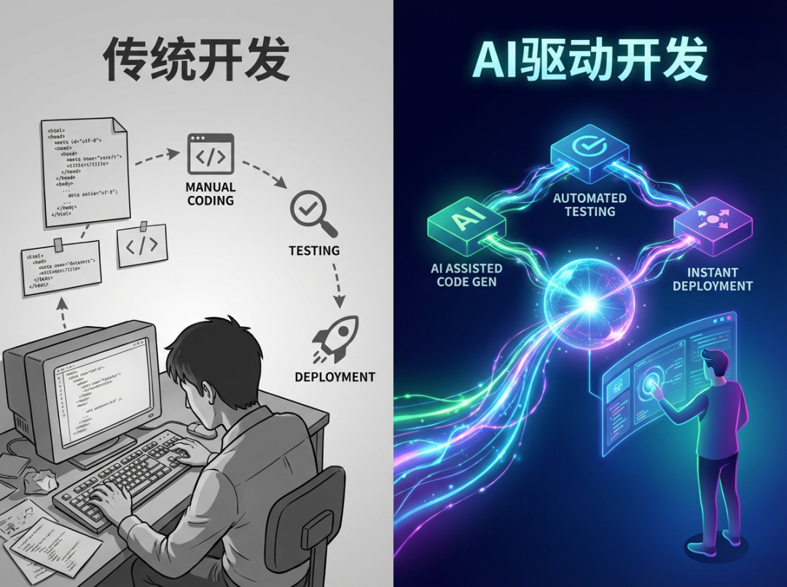
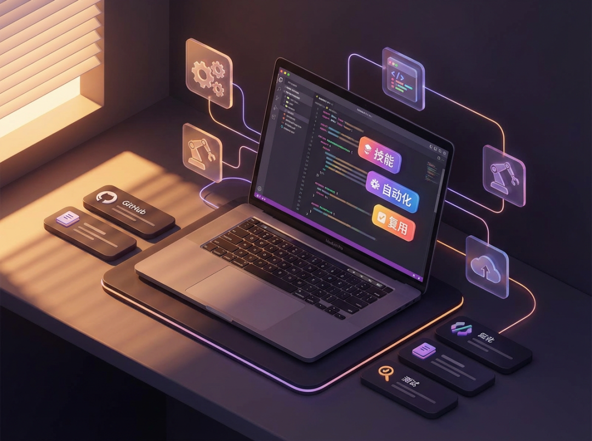

> 📎 来源: [锐宝在进化](https://mp.weixin.qq.com/s?__biz=MzYzOTUzMTM5MQ==&mid=2247483774&idx=1&sn=7ce6b1423c118a5bfc5a33afa8904402&chksm=f1a822246158e2335369d2053ed933f7cc7054dc2844398b2e33a3d0c6c989323d4fa57d36ce&mpshare=1&scene=1&srcid=0425TYECkDvKdxIyKSjfIw7v&sharer_shareinfo=59709059f207babaf2f1ba39cb8bfc61&sharer_shareinfo_first=59709059f207babaf2f1ba39cb8bfc61) | 时间: 2026-04-25 19:32

---

AI编程助手正在经历一场静默的革命。当大多数人还在用ChatGPT、Claude进行简单的代码问答时，Anthropic已经悄然推出了Claude Code的Skills功能——这将彻底改变开发者的工作方式。

## 什么是Skills？

Skills是Claude Code中的一项新功能，允许开发者创建可复用的自动化工作流。你可以把它理解为「AI时代的Makefile」或者「智能的Shell脚本」——但远比这两者强大。

> 传统开发方式是：发现问题 → 思考解决方案 → 手动编写代码 → 测试验证。而AI驱动的开发是：描述需求 → AI自动生成 → 人工审核 → 一键部署。

## Skills能做什么？

根据社区实践，Skills已经能够完成以下复杂任务：

- **自动化GitHub工作流**：自动创建Issue、关联PR、生成Changelog
- **项目初始化**：一键生成新项目结构、配置CI/CD、初始化文档
- **代码审查**：自动检查代码风格、发现潜在Bug、生成审查报告
- **文档维护**：自动生成API文档、更新README、同步多语言版本

## 为什么这很重要？

Skills的本质是「知识封装」。当你完成一个复杂任务后，可以将其封装成一个Skill，下次遇到类似问题时直接调用——而不需要重新思考。

这意味着：

- 个人效率大幅提升：重复性工作交给AI
- 团队协作更加顺畅：共享Skills库，统一工作标准
- 知识沉淀更加自然：工作过程本身就是知识积累

## 如何开始使用？

目前Skills功能需要：

1. 安装Claude Code最新版本
2. 在.skills目录下创建你的第一个Skill
3. 参考社区开源Skills学习最佳实践

社区已经涌现了大量开源Skills仓库，涵盖前端开发、后端架构、DevOps运维等多个领域。

## 写在最后

AI编程助手的竞争已经进入下半场。上半场拼的是模型能力和响应速度，下半场拼的是生态和可扩展性。Claude Code的Skills功能，正是在下半场投下的一枚重磅炸弹。

对于开发者来说，现在正是上手Skills的最佳时机。越早掌握这套新工具，就能越早享受效率红利。

---

作者：锐宝 | 本文首发于微信公众号
