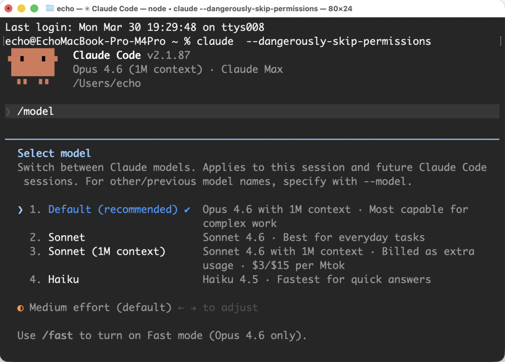
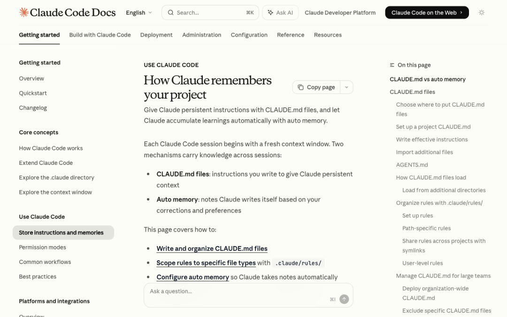
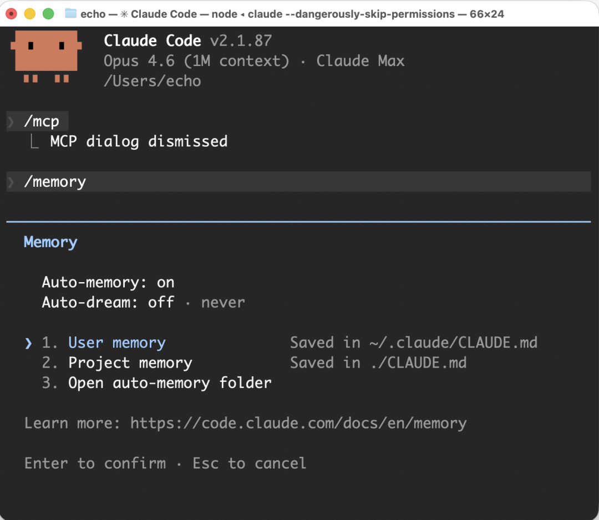
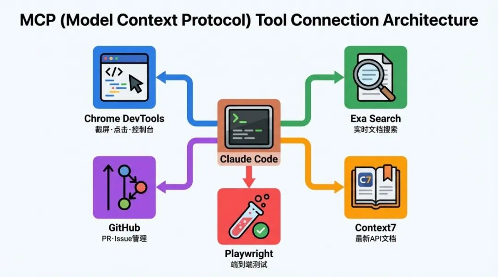
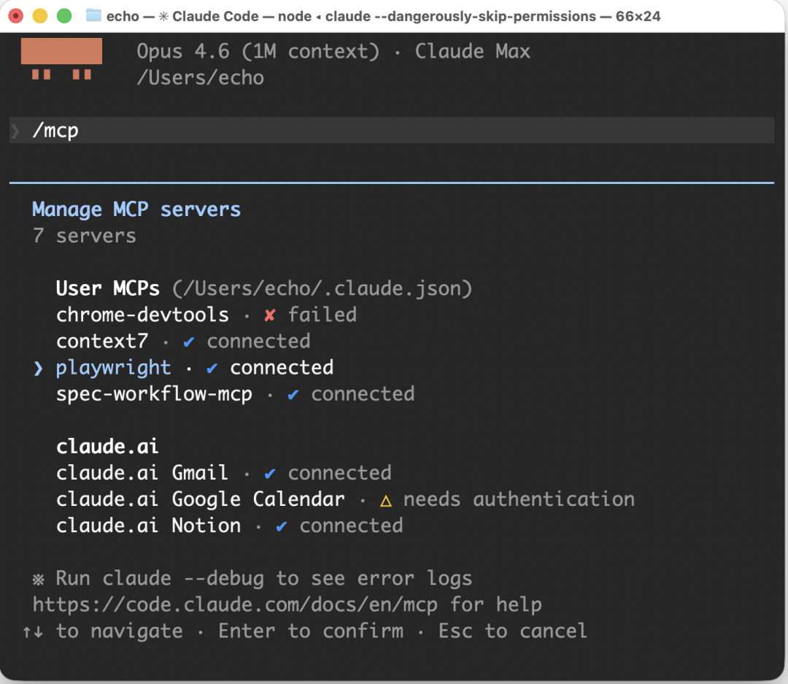
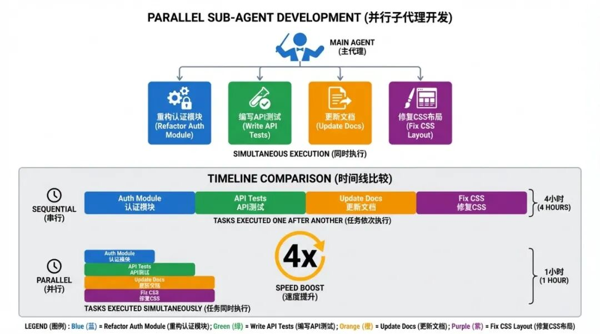

> 📎 来源: [AI2You](https://mp.weixin.qq.com/s?__biz=Mzk3NTMyNDk4Mg==&mid=2247483771&idx=1&sn=e6aecf209d98da9f4a99badc5e136d7e&chksm=c596d38aaf635072a9bc6aea6438b608a53ebc7ed1503f6ca85132b294d9c61ca729fd0e0c01&mpshare=1&scene=1&srcid=05017C2qYoHrj5WuGCx8m7yp&sharer_shareinfo=047c00f0d891abca849b3e57a3421fba&sharer_shareinfo_first=047c00f0d891abca849b3e57a3421fba) | 时间: 2026-05-01 00:51

---

**点击下面卡片，快速关注本公众号**

**大多数开发者把 Claude Code 当成"能访问文件系统的 ChatGPT"，输入请求、拿到文件、感觉很有效率。** 但他们只用了大约 10% 的能力。

ChatGPT 给你一个回答。Claude Code 改变你的项目。

这不是措辞上的夸张。Claude Code 不是一个更聪明的聊天机器人，而是一个运行在你机器上的智能体（Agent）：它读取你的文件，编写代码，打开浏览器点击元素、检查控制台，执行终端命令，部署到生产环境，创建 Pull Request。你不是在"问它问题"，而是给它任务然后走开。

区别不在于 AI 本身，而在于 AI 能触及的范围。

本文按 8 个层级递进，从安装配置到上下文管理，从工具生态到并行开发工作流，覆盖 Claude Code 的完整能力栈。每个层级都建立在前一个层级之上，到最后你将拥有一套让一个人像一支小团队一样工作的系统。



Claude Code界面

---

## Level 1：安装与基础配置

### 忘掉你以为的用法

大多数人打开 Claude Code 后开始问问题。

那不是它的用途。

ChatGPT 给你答案，你复制粘贴到项目里。Claude Code 直接在你的项目里工作。它读你的文件、写代码、运行命令、修改配置。你描述你想要什么，它去做。

### 两种安装方式

| 方式 | 安装方法 | 能力 |
| --- | --- | --- |
| **IDE 插件** | 在 VS Code 或 Cursor 的扩展面板搜索 "Claude"，安装 Anthropic 官方插件，登录 | 基础功能，适合入门 |
| **CLI 终端** | 安装 Node.js，然后通过 npm 安装 | 完整功能，解锁一切 |

CLI 是解锁全部能力的方式。安装只需两步：

```
npm install -g @anthropic-ai/claude-code
```

在任何项目文件夹中启动：

```
cd your-project-folderclaude
```

### 订阅方案

| 方案 | 价格 | 适用场景 |
| --- | --- | --- |
| **Pro** | $20/月 | 入门使用、轻度开发 |
| **Max 5x** | $100/月 | 日常正式开发 |
| **Max 20x** | $200/月 | 重度并行工作、Agent Teams |

同等 Token 用量通过 API 按量付费大约需要 $500/月。订阅方案在性价比上没有悬念。

如果你每周用量超限 2 次以上，就该从 Pro 升级到 Max 5x。如果你全天重度使用或跑多个并行智能体，Max 20x 是更合理的选择。

### 关闭确认循环

默认情况下，Claude Code 每次文件操作都会弹出确认提示：

```
Claude wants to create a folder. Allow? [y/n]
```

如果你对每个提示都点 Yes，你不是在委派任务，而是在监督一个非常慢的助手。

```
claude --dangerously-skip-permissions
```

建议在终端配置文件（

```
~/.zshrc
```

 或 

```
~/.bashrc
```

）中设置别名：

```
alias cc="claude --dangerously-skip-permissions"
```

然后重新加载：

```
source ~/.zshrc
```

之后用 

```
cc
```

 启动即可，不再有确认提示。

这个标志会跳过所有文件操作确认。在个人项目中这通常是安全的——Claude 对文件操作比大多数开发者更谨慎，你会不小心覆盖重要文件，Claude 不会。但对于包含生产密钥或敏感数据的项目，使用沙盒模式更稳妥：

```
claude --sandbox /path/to/safe/folder
```

Claude 可以读取任何位置，但只能写入指定文件夹内。

### 语音输入：被低估的效率倍增器

Claude Code 的瓶颈不是模型速度，而是指令质量。

打字时你会缩写、跳过上下文、假设模型能理解你的意思。结果是输出 80% 正确，你花 20 分钟修剩下的 20%，然后疑惑为什么这比自己写代码还慢。

说话时情况完全不同。因为说话比打字快，你不会自我编辑。你会解释完整画面、描述边缘情况、提到你打字时一定会跳过的约束条件。Claude 拿到更好的指令，第一次就产出更好的结果。

| 工具 | 平台 | 特点 |
| --- | --- | --- |
| **内置语音** | 所有平台 | 终端中按住空格键即可使用 |
| **Wispr Flow** | Mac | 按住 fn 键，在任何应用中即时转录，准确率高 |
| **Aqua Voice** | Mac | 类似功能 |
| **Handy Computer** | Mac | 免费替代方案 |

一个打字需要 40 秒的提示，说话只需要 8 秒。试一个会话，你会一直用下去。

### 常用命令速查

| 命令 | 作用 |
| --- | --- |
| ``` /cost ``` | 查看当前会话 Token 消耗 |
| ``` /doctor ``` | 诊断安装和配置问题 |
| ``` /clear ``` | 清空会话，在同一项目中重新开始 |
| ``` /memory ``` | 查看当前加载到上下文中的所有内容 |
| ``` /status ``` | 当前模型、上下文占比、活跃配置 |

```
/cost
```

 是最常用的命令。在每次重度任务后运行它，你会立刻明白什么操作是昂贵的——臃肿的 CLAUDE.md、从不使用的全局工具，都会在这里暴露。

```
/doctor
```

 是调试的第一步。在你花 30 分钟排查一个坏掉的 MCP 之前先运行它。它检查 Node 版本、认证状态、MCP 连接、已知冲突。大多数 Claude Code 的问题是环境问题，

```
/doctor
```

 能在几秒内定位。

---

## Level 2：让 Claude 记住你的项目



CLAUDE.md 与自动记忆：两种跨会话持久化机制

### 33000 Token 的"认路税"

每个新的 Claude Code 会话都从零开始。它做的第一件事是探索——读目录、打开文件、搞清楚项目结构。

在一个小型 Chrome 扩展项目上，这个探索过程消耗了 33000 Token，而同一会话中的实际工作只消耗了 18500 Token。**认路成本几乎是实际工作的两倍。** 每个新会话都会重复这个过程。

这是一个已解决的问题。大多数人不知道而已。

### CLAUDE.md：一次投入，持续受益

在项目根目录创建一个叫 

```
CLAUDE.md
```

 的文件。Claude 在每次会话启动时自动读取它——比你说第一句话还早。不再需要探索。

用一个命令自动生成：

```
claude /init
```

Claude 探索你的项目一次，写好文件。你再也不用为那次探索付费。

一个好的 CLAUDE.md 长这样：

```
# Project: Markdown Checklist Chrome Extension## What this isChrome extension that converts markdown files into interactive checklists.Side panel in Chrome. IndexedDB for persistence.## Stack- Vanilla JS, no frameworks- Chrome Extensions Manifest V3## File structure- /chrome/ — extension files- /landing/ — marketing landing page## Rules- Never install npm packages without asking first- Always English in code and comments- When I say "deploy", run: cd landing && npx vercel --prod
```

Anthropic 官方建议控制在 **200 行以内**，不超过 300 行。目标是定位导航，不是完整文档。

判断标准：如果删掉某一行不会改变 Claude 的行为，就删掉它。

| 应该放进 CLAUDE.md | 不应该放进 CLAUDE.md |
| --- | --- |
| 技术栈、文件结构 | 完整的 API 文档（Claude 自己能查） |
| 规则和约束 | 库的使用说明（浪费上下文） |
| 常用命令 | README 的复制粘贴 |
| 项目特有的决策 | 个人待办事项 |
| 如何找到更多信息的指引 | 代码风格规则（交给 linter） |

### 全局规则

有些规则应该在所有项目中生效。把它们放在 

```
~/.claude/CLAUDE.md
```

：

```
- Never install packages without permission- Always English in code- Never store API keys in code or local files- Always use Git worktrees for parallel work- Use Exa MCP for web search- Use Context7 for any library or framework docs
```

在会话中随时添加全局规则：

```
Add a global rule: never install packages on my machine without asking first
```

下次会话生效，每个项目。

### 自动记忆：有用但需要维护

Claude 会在会话过程中给自己写笔记，保存在 

```
~/.claude/projects/[project-name]/memory.md
```

。它写的内容通常是这样的：

```
- Build script requires Node 20+, user's machine has 18. Use nvm first.- Port 3000 is taken. Use 3001 for dev server.- Playwright tests fail if Chrome is already open.- User prefers pnpm over npm.
```

这很有用。环境怪癖、出过的问题、机器特定的事实。

问题在于：你看不到它在积累什么。Claude 有时会写入过时、错误或无用的信息，这些信息持续占用上下文。

**原则：自动记忆用于环境事实，CLAUDE.md 用于一切重要的东西。** 定期检查和清理：

```
claude /memory
```

这个命令一次性展示你的全局 CLAUDE.md、项目 CLAUDE.md 和自动记忆。看到错误的，直接删掉。



---

## Level 3：给 Claude 装备正确的工具

### 开箱即用的局限

原生 Claude Code 只能读文件、写文件、运行 Shell 命令。就这些。

让它"打开落地页看看按钮对齐是否正确"——做不到。它会让你自己打开看。

让它"查一下最新的 Vercel 文档确认我们的部署配置是否还对"——做不到。它会从训练数据里编造一个可能过时的答案。

这是大多数人的天花板。他们对 Claude 不断在库版本上产生幻觉感到沮丧，无法看到浏览器，不知道六个月前发布的新 API。

解决方案是 MCP、Skills 和 Context7。一个一个来。



### MCP：给 Claude 眼睛和双手

MCP（Model Context Protocol）为 Claude 提供带描述的可调用工具。当 Claude 理解一个工具的功能时，它会在需要时自动使用，无需你指定。

安装 Chrome DevTools MCP（全局，所有项目可用）：

```
claude mcp add --scope user chrome-devtools npx @chrome-devtools/mcp@latest
```

现在 Claude 可以打开浏览器、导航到 URL、截屏、读取控制台、点击元素、填写表单。"构建落地页然后在 Chrome 里看看效果"变成了一个真正的任务，不再是一个比喻。

安装 Exa 做真正有用的网页搜索：

```
# 在 exa.ai 注册，每月 1,000 次免费请求claude mcp add exa "https://mcp.exa.ai/mcp?apiKey=YOUR_API_KEY_HERE"
```

Exa 和内置搜索的区别：

| 维度 | 内置搜索 | Exa |
| --- | --- | --- |
| **返回内容** | 从搜索结果中抓取的三句话摘要 | 完整网页内容 |
| **时效性** | 可能过时 | 当前版本 |
| **完整度** | 残缺不全 | 所有标记、所有示例 |

对于任何需要真实文档的场景，Exa 不是可选项。

查看已安装的 MCP：

```
claude /mcp
```

关于上下文的重要信息：当前版本的 Claude Code（v2.1.87）按需加载 MCP。当 Claude 判断需要某个工具时才加载描述，不需要时不加载。但只把你每个项目都真正使用的工具装成全局。其他的用项目级作用域。



### Context7：停止使用过时文档

Claude 的训练数据有截止日期。React Router v7 在截止日期之后发布了。Supabase 改了认证 API。Vercel 加了新的 CLI 标志。

Claude 不知道这些。它从记忆中写代码。记忆是错的。

Context7 修复这个问题。它在 Claude 写代码之前拉取当前文档。

```
claude mcp add context7 npx @upstash/context7-mcp@latest
```

加一条全局规则：

```
- Always use Context7 when working with any library, API, or framework
```

现在 Claude 拉取的是真正的当前文档，不是训练数据的最佳猜测。

工具解决了 Claude 的能力边界——它能看浏览器了、能搜索真实文档了、能用最新 API 了。但单个会话的上下文窗口仍然是瓶颈。Level 4 讲如何管理这个预算，Level 5 讲如何用子智能体突破这个限制。

### Skills：教 Claude 怎么做你的工作

MCP 连接 Claude 到外部服务。Skills 是完全不同的东西。

一个 Skill 是一个 Markdown 文件，存放在项目内：

```
.claude/skills/skill-name/SKILL.md
```

你写指令，Claude 在判断相关时读取它们。没有外部服务、没有 API 密钥、没有依赖。

关键机制：**只有 Skill 的头部信息（YAML frontmatter）自动加载到上下文。** 完整内容只在 Claude 判断这个 Skill 适用于当前任务时才加载。所以你可以安装 20 个 Skills，上下文成本几乎为零。

### Skills 社区注册表

Anthropic 官方 Skills 仓库已有 **105,000+ stars**，社区注册表 skills.sh 上有超过 **60,000** 个条目。通过一个命令浏览和安装：

```
# 在 Claude Code 会话中claude /plugins# 搜索 → 预览内容 → 选择 User（所有项目）或 Project（仅当前项目）
```

**值得立即安装的 Skills：**

**frontend-design：** 没有这个 Skill，Claude 的 UI 输出看起来像 AI 生成的——一样的灰色卡片、一样的可预测布局、一样的 Inter 字体 16px。这个 Skill 教 Claude 做真正的设计决策。全局安装，每个项目都受益。

**superpowers：** 最受欢迎的社区 Skill 合集（**42,000+ stars**），覆盖 TDD、系统调试、计划执行、代码审查等 20+ 场景。装一个顶二十个。Level 7 会详细介绍它的工作流。

**skill-creator：** 帮你构建自己的 Skills。描述你想让 Claude 做什么，它帮你搭好 SKILL.md 的脚手架。元技能，但确实好用。

### 投入回报最高的自定义 Skills

| 类型 | 作用 | 投入产出比 |
| --- | --- | --- |
| **内部库参考** | 为你的每个内部工具写一个 Skill。内部计费库、CLI 封装、数据库约定。Claude 不再从通用示例中推断，而是遵循你的实际模式 | 1小时编写，每周节省数小时 |
| **验证 Skill** | 定义精确的测试步骤——Playwright 步骤、CLI 断言、状态检查。"看起来对"和"确实对"之间的差距 | 高 |
| **运维手册 Skill** | 给 Claude 你的调试手册——服务 X 出现症状 Y，先检查 Z。Claude 一致地遵循流程，你不再每次都重新解释 | 高 |

创建自定义 Skill 的示例：

```
I want to create a skill that generates landing pages based on a reference screenshot.The skill should:- Accept a screenshot as input- Use the structural layout but apply its own design- Accept optional links for App Store, Google Play, Chrome Extension- Skip buttons for missing linksCreate this skill in .claude/skills/landing-creator/
```

你在写好的 Skill 上花的每一小时，都在未来的每一个会话中节省时间。它们是复利的。

工具解决了 Claude 的能力边界。它能看浏览器了、能搜索真实文档了、能用最新 API 了。但单个会话的上下文窗口仍然是瓶颈。Level 4 讲如何管理这个预算，Level 5 讲如何用子智能体突破这个限制。

---

## Level 4：上下文窗口是一笔预算

### 你在为什么买单

每个会话都有上下文限制。在你输入第一个字之前，以下内容已经占用了空间：

```
系统提示                     ← 始终加载内置工具                     ← 始终加载CLAUDE.md（项目级）          ← 始终加载CLAUDE.md（全局）            ← 始终加载MCP 工具（按需）             ← 需要时加载Skill 头部信息               ← 始终加载子智能体定义                 ← 始终加载自动记忆                     ← 始终加载─────────────────────────────你的对话                     ← 随工作增长
```

Opus 4 提供 100 万 Token 上下文。听起来很多，但在一个复杂任务进行 45 分钟后，Claude 就会开始忘记你在开头说过的话。

随时检查用了多少：

```
claude /cost
```

连续一周在每次重要任务后运行这个命令。你会立刻明白哪些配置是昂贵的。臃肿的 CLAUDE.md、从不使用的全局工具，都在这里。

### 三个区域

| 区域 | 上下文占比 | 表现 |
| --- | --- | --- |
| **绿区** | 0-50% | 完整质量，所有任务都应该在这个区域内完成 |
| **橙区** | 50-70% | 开始丢失早期信息。会话开头的指令被降权，你会注意到输出感觉"微妙地不对"——Claude 构建了违反你 40 条消息前提到的约束的东西 |
| **红区** | 70-85% | 明显退化。输出变得不一致，Claude 开始把你的项目当成一个通用项目来对待 |

到 85% 时触发自动压缩。Claude 总结对话并继续。有时有效，有时关键上下文在总结中消失，而你不一定能察觉。

目标很简单：**完成任务就开始新会话。不要把旧上下文带入新工作。**

### 安装状态栏

你需要在工作时随时看到上下文占比：

```
claude /status-line
```

Claude 会问你想显示什么。推荐配置：

```
Current folder path, model name, context usage percentage. Minimal, no colors.
```

设置后终端会显示：

```
~/projects/my-app  |  claude-opus-4  |  23%
```

**超过 50% 就收尾当前任务。不要在同一会话中开始新任务。**

### 手动压缩：深陷橙区时的救命工具

已经在橙区但任务还没完成？

```
claude /compact "Focus on: the landing page redesign, current file structure,the decision to use Manifest V3 over V2"
```

Claude 压缩除你指定内容外的所有对话历史。你失去了对话过程，但保留了关键上下文。你选择什么被保留——比自动压缩更可靠。

### 三条累积规则

**规则一：一个任务，一个会话。**

```
claude /clear
```

已完成任务的旧上下文不会帮助下一个任务。它只占用空间、引入噪音。做完就清空。

**规则二：不需要全局的工具不要装全局。**

每个全局 MCP 和 Skill 都加载到每个会话的上下文中。只把你每个项目都真正使用的东西装成全局。其他的都用项目级作用域。

**规则三：一个会话装不下的任务，就不该由一个智能体做。**

拆成子任务，让子智能体各自在隔离的上下文中处理。这正是 Level 5 要讲的。

---

## Level 5：子智能体与并行执行



并行子智能体开发：主Agent指挥4个子Agent同时执行，4倍速度提升

### 单线程的困境

大多数人把 Claude Code 当作一个会话、一个任务、一个上下文窗口来用。

这就像把所有代码放在一个线程里运行，然后疑惑为什么慢。

一个没有子智能体的会话长这样：

```
任务1：调研架构        →  100K tokens任务2：规划实现        →   50K tokens任务3：构建功能        →  100K tokens─────────────────────────────────────上下文已用 75%。质量已经在退化。15 分钟过去。才做完一个任务。
```

### 子智能体如何改变这一切

每个子智能体有自己隔离的上下文。它只做一件事然后汇报。主会话保持干净。

而且它们并行运行。顺序需要 15 分钟的三个任务，并行只需要 5 分钟。

子智能体默认继承主会话的所有工具，包括 MCP 工具。最多可同时运行 10 个。

### 临时触发

```
Run two sub-agents in parallel.Agent 1: dark minimal landing page design. Save to /landing-v3.Agent 2: colorful modern landing page design. Save to /landing-v4.Both use the frontend-design skill.
```

看着它们同时运行，而你的主上下文几乎没动。

查看它们在做什么：

```
# 会话中按 Ctrl+O# 完整的工具调用历史、每个子智能体的 Token 消耗
```

### 按任务选择模型

| 模型 | 适用场景 | 成本 |
| --- | --- | --- |
| **Opus** | 规划、架构、复杂推理 | 最高 |
| **Sonnet** | 写代码、实现功能 | 中等 |
| **Haiku** | 搜索文档、简单查询 | 最低 |

所有事情都用 Opus 就像开 F1 赛车去买菜。在关键时刻用大模型，日常任务用小模型。

```
Run a Haiku sub-agent to search Context7 for React Router v7nested routes documentation. Return only what's relevant.
```

Haiku 查文档，Sonnet 写代码，Opus 做架构决策。这是正确的资源分配。

### 创建可复用的子智能体

```
claude /agents# Create new agent → Scope: Project → Method: Create via Claude
```

定义一次：

```

```

欢迎扫码加入知识星球，获取完整教程内容


