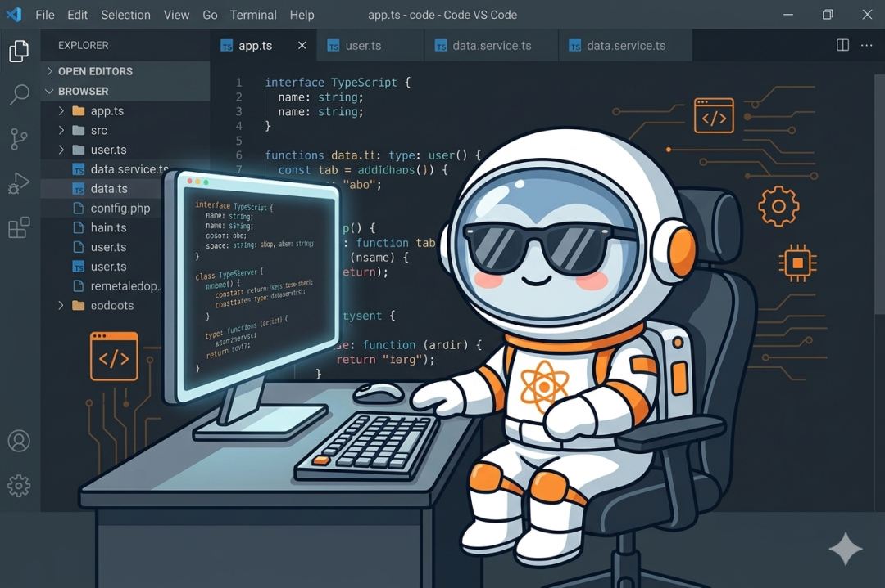
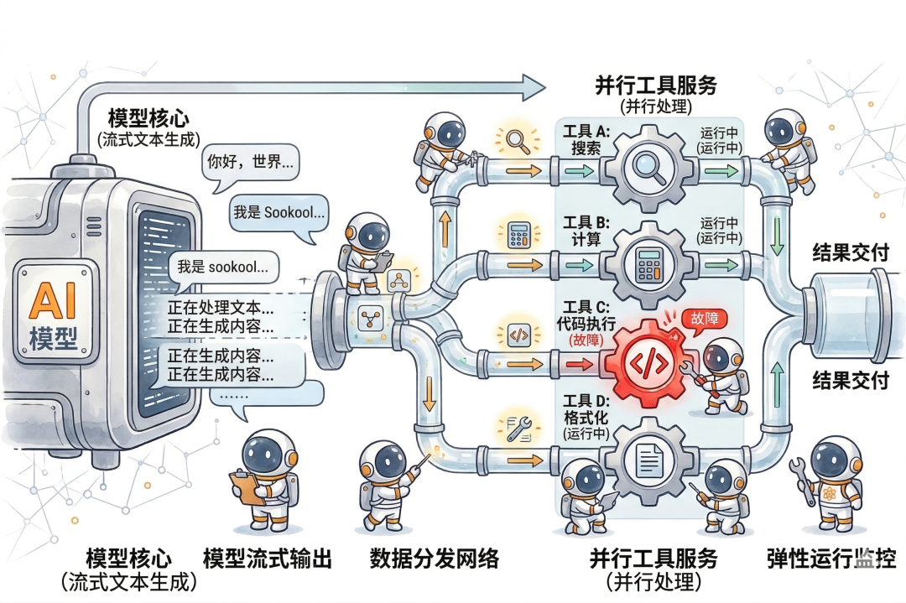
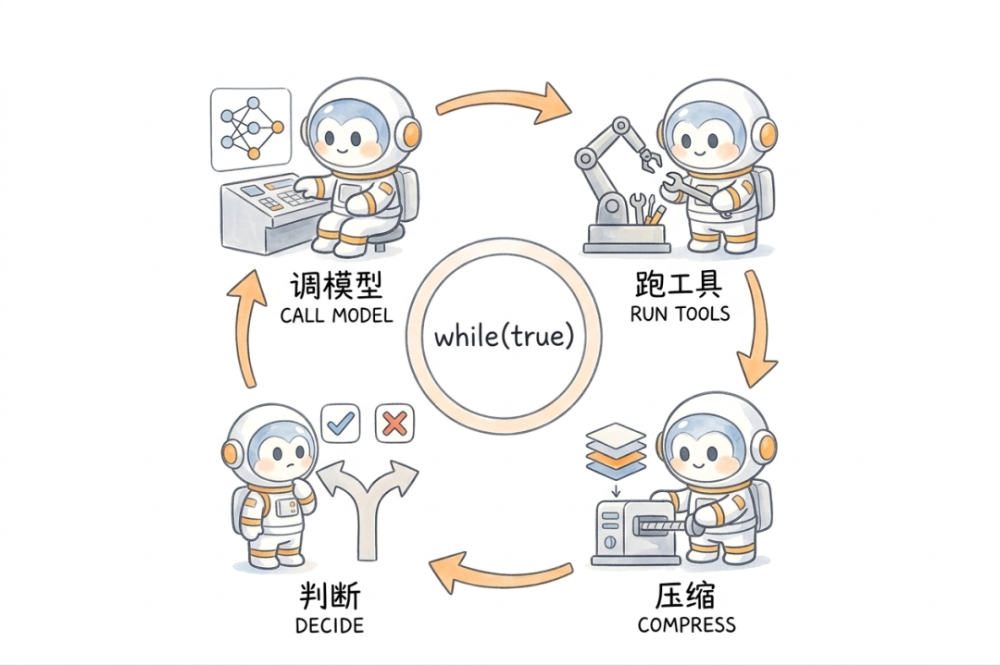
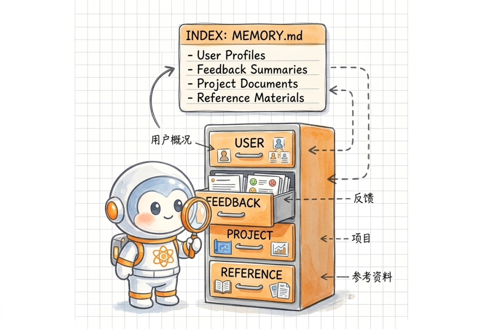
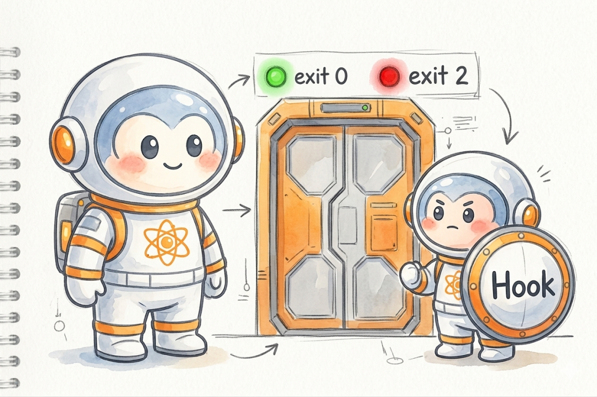
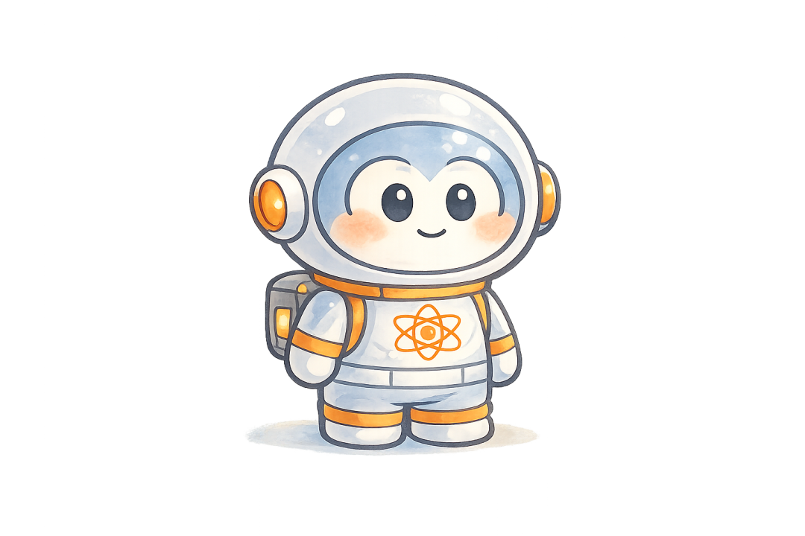

> 📎 来源: [SooKool](https://mp.weixin.qq.com/s?__biz=Mzg4MTk0Njc5Mw==&mid=2247483917&idx=1&sn=9f5c08fb3277222bdf423f7a2a91065a&chksm=ced1074017e3b55116012a8513b284e34ad779c59f2d84491b94da61353e559300503e680fa9&mpshare=1&scene=1&srcid=0424pkz4ej2EdJBV6zwJgtwP&sharer_shareinfo=85dfa206741752e074bcec4dcf2f0773&sharer_shareinfo_first=85dfa206741752e074bcec4dcf2f0773) | 时间: 2026-04-24 11:21

---

● Claude Code “开源”

Claude Code 的 Agent 工程

Claude Code 的源码泄露之后我和AI一起分析了一遍。模型调用部分平平无奇，标准 API streaming。但围绕它的工程量大到离谱，是调用本身的几十倍。这篇先讲五个对我有启发的设计，也是 Claude Code 跟市面上其他 Agent 拉开差距的地方。

—— ✦ ——

一、模型还在说话，工具已经跑完了

大多数 Agent 框架处理工具调用的流程是：模型输出完 → 解析出要调哪些工具 → 一个一个执行 → 拿到结果 → 下一轮。四步串行，中间全在等。

Claude Code 砍掉了这个等待。

它有一个叫 `StreamingToolExecutor` 的组件。模型在流式输出的过程中，只要吐出一个 tool\_use 的 JSON block，执行器立刻把这个工具启动。不等模型说完。模型接着吐第二个工具调用，执行器看一眼：是只读操作（读文件、搜代码）就直接并行启动，最多同时跑 10 个；是写操作就排队串行。

等模型把话说完的时候，读操作基本都已经返回结果了。

这种"边说边干"的流水线策略，在一次调用五六个工具的场景下快得非常明显。但代价是复杂度上来了：模型输出到一半 API 崩了怎么办，已经跑起来的工具结果往哪放。源码里有一个 `yieldMissingToolResultBlocks` 函数专门处理这种情况，给每个"孤儿工具调用"生成一个错误占位，再把中断的模型消息标记成 TombstoneMessage（墓碑消息），保证消息流不会出现断裂。

这个思路跟一般框架最大的区别在于：它把"失败一定会发生"当成设计前提，而不是异常。

—— ✦ ——

二、一个 while(true) 跑完所有事

Claude Code 的 Agent 主循环是一个异步生成器函数（`async function\*`）。整个核心逻辑在 `query.ts` 里，结构是这样的：

就这么一个 while 循环。

但这个循环不简单。每一轮结束时整个 state 对象被替换，`state.transition` 记录了上一轮为什么继续（工具调用、错误恢复、压缩重试），相当于一个隐式的状态机。用 `yield` 把每一条消息、每一个 token、每一个工具进度实时推给上层 UI。消费端慢了，循环自然暂停，背压控制天然就有。取消操作调 `generator.return()`，清理逻辑沿 `finally` 块级联。

Anthropic 自己总结过这个选择："A simple, single-threaded master loop combined with disciplined tools delivers controllable autonomy." 一个单线程主循环加上有纪律的工具，就够了。

市面上很多 Agent 框架喜欢搞多线程、搞多个 Agent 人格竞争。Claude Code 也有实验性的多 Agent 协作（Agent Teams），但它的核心执行路径就是这一个循环。复杂度低，好调试，好测试。多 Agent 是锦上添花，单线程循环才是基本盘。

“A simple, single-threaded master loop combined with disciplined tools delivers controllable autonomy.”
一个简单的单线程主循环，配合有纪律的工具，就能实现可控的自主性。

—— Anthropic 工程团队

—— ✦ ——

三、上下文快满了，四级压缩接力

对话长了上下文窗口会满，这是所有 Agent 的共同问题。大多数框架的做法是简单截断或者一次性总结替换。Claude Code 做了四级：

L1 Snip Compact：裁掉历史消息中较早的部分，保留最近的对话尾部不动。最轻量，几乎没有信息损失。

L2 Microcompact：通过 API 层的 cache\_edits 机制清掉旧的工具调用结果。不动正文，只清工具产生的冗余信息。缓存热的时候走 API 标记删除，缓存过期了就直接改本地消息体。

L3 Context Collapse（实验特性，feature-gated）：把一组消息折叠成摘要。关键点在于：原始数据保留，折叠操作记录在独立的 commit log 里，每次构建视图时通过 `projectView()` 重放日志。折叠可逆，可审计。Agent 跑偏了可以回溯到底哪一步出的问题。

L4 Autocompact：fork 一个子 Agent 做完整的对话总结，用摘要替换原文。重武器，只在前三级都兜不住的时候动用。

四级按顺序触发，先轻后重，各有独立的开关和触发条件。代码里的执行链是 `snip → microcompact → contextCollapse → autocompact`，轻量级的每轮都检查，重量级的只在前面兜不住时才启动。

L3 的可逆设计是我在别的框架里没见过的。大多数框架做压缩是破坏性的，一旦总结替换就回不去了。出了问题你不知道是哪一步偏的。Claude Code 选了更复杂的实现，就为了保住调试能力。这种取舍本身就能说明团队怎么排优先级：可调试性 > 实现简洁性。

—— ✦ ——

四、记忆不靠向量，靠小模型

Claude Code 的持久化记忆不是数据库，不是向量索引，是 Markdown 文件加 YAML frontmatter。每条记忆一个文件，`MEMORY.md` 做索引，限制 200 行。

记忆分四种：

User：用户画像。"这是个资深后端工程师，第一次碰 React。"

Feedback：用户对 Agent 行为的纠正和确认。"不要在这类测试里 mock 数据库，上次因为这个出过事。"

Project：项目动态。"下周四代码冻结，移动端要切分支。"

Reference：外部资源指针。"Pipeline 的 bug 跟踪在 Linear 的 INGEST 项目里。"

每次对话开始，系统只加载 MEMORY.md 索引。然后用 Claude Sonnet 做一次轻量推理：把所有记忆文件的标题和描述扔给它，让它挑出跟当前对话最相关的 5 个，注入上下文。

这比向量检索准得多。向量匹配的是词汇相似度，"用户上次说不要 mock 数据库"跟"现在要写数据库测试"之间的关联，embedding 算不出来。小模型能。成本极低（5 个文件头的推理），准确度完全不在一个量级。

Feedback 类型有一个细节值得说。它要求同时记录"纠正"和"确认"。纠正好理解，就是你告诉 Agent "别这么干"。确认是指 Agent 做了一个不明显的选择，你表示认可，也记下来。大多数系统只从错误中学习，时间长了会越来越保守。同时记录做对的事，能防止 Agent 退化成一个什么都不敢干的"老好人"。

—— ✦ ——

五、用 AI 来审查 AI

Claude Code 的 Hook 系统有四种用户可配置的类型。两种常规：Command（shell 命令）、HTTP（POST 外部服务）。两种用 AI 做审查的：

Prompt Hook：把操作的上下文发给 Claude Sonnet，让它判断该不该执行。

Agent Hook：部署一个完整的 Claude Haiku Agent 跑多步验证流程。

你可以设一个 Prompt Hook，每次 Agent 要写文件时先让 Sonnet 审一遍："这次修改合理吗，有没有明显的风险。" 也可以设一个 Agent Hook，让 Haiku 去跑一轮完整的检查流程再放行。

这做到了规则引擎做不到的事。"这次改动合不合理"不是一个能写成 if-else 的判断，它需要语义理解。用小模型来做这个事，成本低、覆盖广，比任何正则规则库都灵活。

Hook 还有一个退出码设计：exit 0 正常通过，exit 2 直接否决操作（阻塞性错误），其他码是警告但不阻断。这意味着 Hook 可以"一票否决"某个操作。你可以写一个 PreToolUse Hook，检测到 Agent 要执行危险命令时返回 exit 2，直接拦截。

—— ✦ ——

这些工程意味着什么

Dario Amodei 在 Lex Fridman 的播客里聊 Agent 未来时提了三个研究方向：long-horizon learning（长时间线规划执行）、multi-agent coordination（多 Agent 协调）、evaluation of dynamic systems（动态系统评估）。

这三个方向拼在一起，画出来的图景不是"一个超级 AI 替你干活"，而是一个多 Agent 协作、有长期记忆、能自我评估的系统。Claude Code 的 Coordinator 模式已经在这么做了：Coordinator 只调度，Worker 只执行，各自持有完全不同的工具集，通过架构本身来保证各司其职。

构建这样的系统，模型能力只是一个变量。循环设计、工具编排、上下文管理、记忆系统、人机接口，每一个都是独立的工程挑战，复杂度远超大多数人的想象。

Agent 领域正在分层。底层是模型能力，Anthropic、OpenAI、Google 在推。上层是 Agent 工程。Claude Code 的源码证明了这一层有多重，也给出了一份教科书式的参考实现。

在AI重塑一切的时代，重新理解人和工具的关系。

长按识别二维码关注
