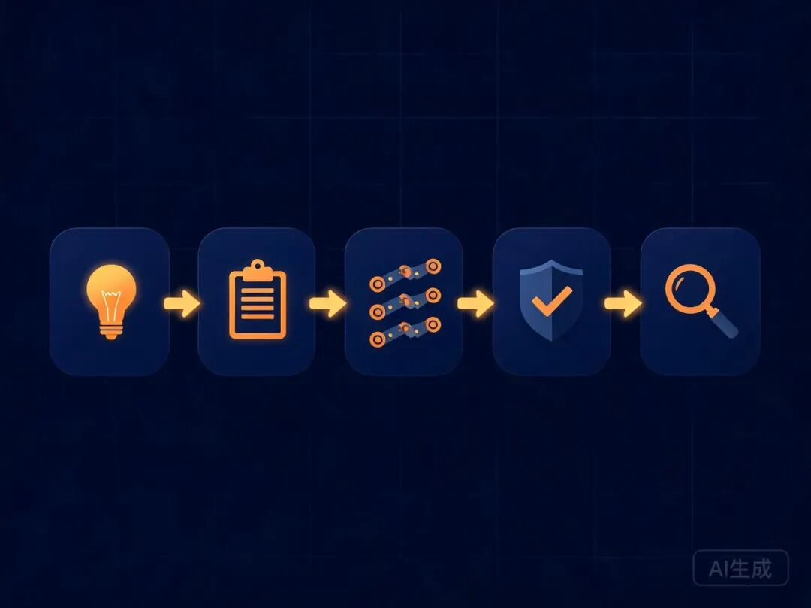
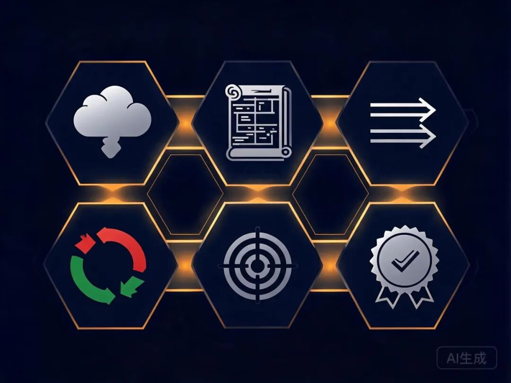

> 📎 来源: [万里数字笔记](https://mp.weixin.qq.com/s?__biz=MzYzOTY3NjUyNw==&mid=2247484956&idx=1&sn=dedabe9cb1ff45743b96a1aaed5b5d6b&chksm=f11532614dd47df496a5c8359e07ffa7d2876626969891eb18e28f70770001ea1f797db9a02f&mpshare=1&scene=1&srcid=0429N7UsTeMXhEmbzUgcLXPg&sharer_shareinfo=7da851d5b80ccdb333f05da2762031ca&sharer_shareinfo_first=7da851d5b80ccdb333f05da2762031ca) | 时间: 2026-04-29 15:32

---


你用 Claude Code 写代码，是不是经常这样：丢一个需求过去，它噼里啪啦一顿写，写完发现方向全错，删了重来？

这不是模型的问题，是工作方式的问题。人类高级工程师接到需求也不会上来就敲代码，他们会先问清楚、再定方案、最后分步执行。

GitHub 上有个项目叫 **Superpowers**，做的就是这件事——教 AI Agent 像高级工程师一样工作。

Superpowers 的作者是 Jesse Vincent（GitHub ID: obra），他是个老牌开源开发者。这个项目目前 **17 万+ Stars**，是 GitHub 上最受欢迎的 AI 编码方法论项目之一。

它本质上是一组 Markdown 格式的"技能指令"，安装在 Claude Code 里之后，会改变 AI 的工作方式。

核心思想就一句话：**别急着写代码。**

## 装了之后 Claude 会干什么？

装上 Superpowers 后，当你让 Claude 做一个项目，它不再直接开写。它会走这样一个流程：

**第一步：问你到底要干嘛**

它不会猜你的需求。它先通过提问把需求澄清——用户是谁、解决什么问题、有什么约束。这一步像产品经理在写需求文档。

**第二步：拆成小任务**

需求确认后，它把工作拆成 2-5 分钟一个的小任务。每个任务都有明确的文件路径、具体的代码和验证步骤。这一步像项目经理在排期。

**第三步：启动子 Agent 并行开发**

你说"开始"之后，它会启动多个子 Agent，每个负责一个任务。任务之间有依赖就串行，没有就并行。这一步像技术主管在分配工作。

**第四步：边写边测试**

每个任务都遵循 TDD 流程：先写测试、看它失败、写代码、看它通过。不是写完再测，而是测试驱动开发。这一步像资深工程师在保证质量。

**第五步：自动代码审查**

每完成一个任务，自动做代码审查——对照计划检查、按严重程度报告问题。关键问题会阻断进度，不会让错误累积。



## 一套完整的方法论闭环

Superpowers 不只是一个"聪明 prompt"，它是一套完整的方法论体系：

- **Brainstorming** — 苏格拉底式提问，把模糊想法变成清晰设计
- **Writing Plans** — 把设计变成可执行的实施计划
- **Subagent-Driven Development** — 子 Agent 驱动开发，多任务并行
- **Test-Driven Development** — 红-绿-重构，测试先行
- **Systematic Debugging** — 系统化调试，4 步定位根因
- **Requesting Code Review** — 提交前自检，按严重程度分级

每个环节都不是建议，是**强制触发**的。AI 会在每个节点自动检查并进入对应流程。



## 实际效果：跑两小时不偏题

Jesse Vincent 自己说，用了 Superpowers 之后，Claude 经常能**自主工作两三个小时不偏题**——因为你已经帮它想清楚了方向，它只需要执行。

这和"裸用" Claude Code 的体验完全不同。裸用时，AI 经常跑偏、重复劳动、遗漏边界条件。有了方法论约束，这些问题大幅减少。

## 怎么安装？

在 Claude Code 里，两行命令搞定：

```
/plugin marketplace add obra/superpowers-marketplace/plugin install superpowers@superpowers-marketplace
```

安装后不需要额外配置，技能会自动触发。当 Claude 检测到你在做一个开发任务，它就会进入 Superpowers 工作流。

除了 Claude Code，Superpowers 也支持 OpenAI Codex、Cursor、Gemini CLI、GitHub Copilot 等主流 AI 编码工具。

## 它给我的启发

Superpowers 最让我触动的不是技术细节，而是一个朴素的理念：

**给 AI 加上方法论约束，比单纯提升模型能力更有效。**

再聪明的 AI，没有工作方法论也会乱写。有了方法论，即使是能力一般的模型，也能产出高质量的代码。

这和人类世界一样——团队里最不可替代的往往不是写代码最快的人，而是那个知道"先做什么、后做什么、出了问题怎么排查"的人。

Superpowers 就是把这个人的经验，编码成了 AI 能理解的工作流。
