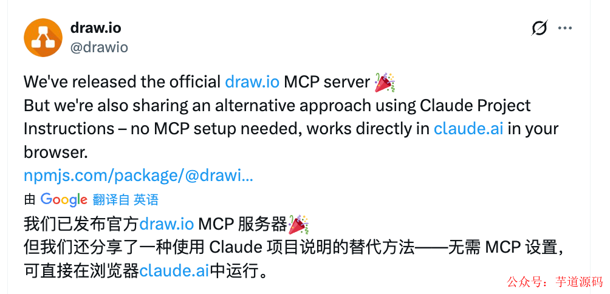
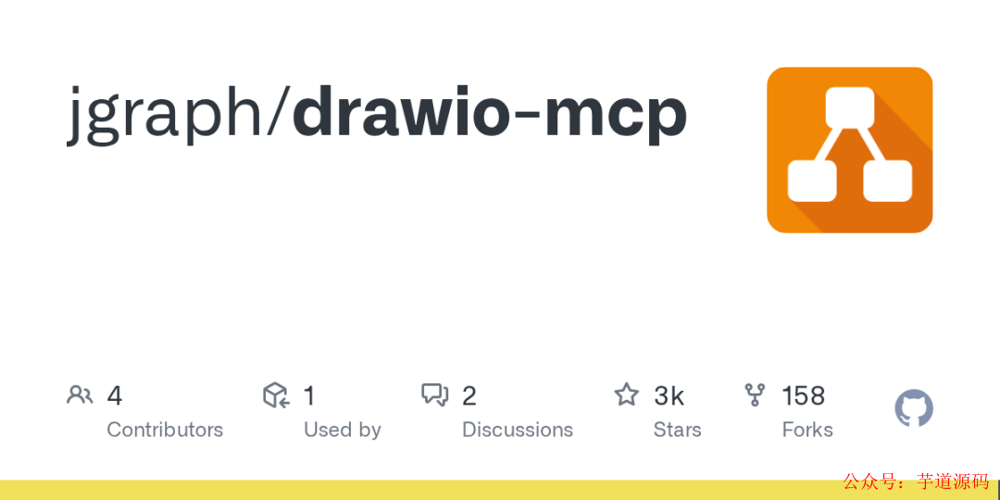
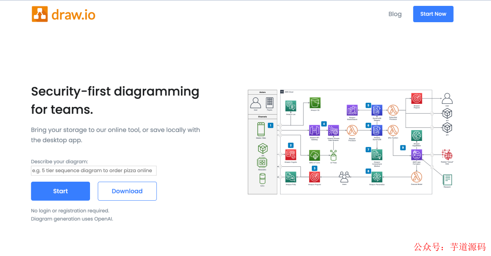
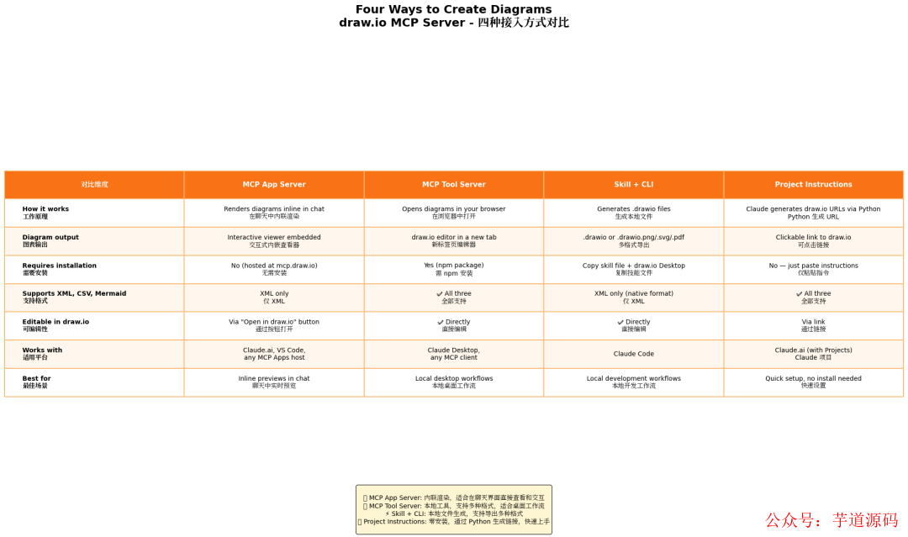

> 📎 来源: [芋道源码](https://mp.weixin.qq.com/s/sW1I9WqtOwxYJelzzMXprQ) | 时间: 2026-04-26 00:06

---

> 👉 **这是一个或许对你有用****的社群**

> 🐱 一对一交流/面试小册/简历优化/求职解惑，欢迎加入「**[芋道快速开发平台](http://mp.weixin.qq.com/s?__biz=MzUzMTA2NTU2Ng==&mid=2247576728&idx=1&sn=1298645b025eb51d9078e8c3de7b3c17&chksm=fa4bd329cd3c5a3fd63e455cf39507d3611a7b040be1381fd5ecfc0a7ce3867575fda4b7313d&scene=21#wechat_redirect)**」知识星球。下面是星球提供的部分资料： 

> - [《项目实战（视频）》](http://mp.weixin.qq.com/s?__biz=MzUzMTA2NTU2Ng==&mid=2247576728&idx=1&sn=1298645b025eb51d9078e8c3de7b3c17&chksm=fa4bd329cd3c5a3fd63e455cf39507d3611a7b040be1381fd5ecfc0a7ce3867575fda4b7313d&scene=21#wechat_redirect)：从书中学，往事上**“练”**
> - [《互联网高频面试题》](http://mp.weixin.qq.com/s?__biz=MzUzMTA2NTU2Ng==&mid=2247576728&idx=1&sn=1298645b025eb51d9078e8c3de7b3c17&chksm=fa4bd329cd3c5a3fd63e455cf39507d3611a7b040be1381fd5ecfc0a7ce3867575fda4b7313d&scene=21#wechat_redirect)：面朝简历学习，春暖花开
> - [《架构 x 系统设计》](http://mp.weixin.qq.com/s?__biz=MzUzMTA2NTU2Ng==&mid=2247576728&idx=1&sn=1298645b025eb51d9078e8c3de7b3c17&chksm=fa4bd329cd3c5a3fd63e455cf39507d3611a7b040be1381fd5ecfc0a7ce3867575fda4b7313d&scene=21#wechat_redirect)：摧枯拉朽，掌控面试高频场景题
> - [《精进 Java 学习指南》](http://mp.weixin.qq.com/s?__biz=MzUzMTA2NTU2Ng==&mid=2247576728&idx=1&sn=1298645b025eb51d9078e8c3de7b3c17&chksm=fa4bd329cd3c5a3fd63e455cf39507d3611a7b040be1381fd5ecfc0a7ce3867575fda4b7313d&scene=21#wechat_redirect)：系统学习，互联网主流技术栈
> - [《必读 Java 源码专栏》](http://mp.weixin.qq.com/s?__biz=MzUzMTA2NTU2Ng==&mid=2247576728&idx=1&sn=1298645b025eb51d9078e8c3de7b3c17&chksm=fa4bd329cd3c5a3fd63e455cf39507d3611a7b040be1381fd5ecfc0a7ce3867575fda4b7313d&scene=21#wechat_redirect)：知其然，知其所以然


> 👉**这是一个或许对你有用的开源项目**

> 国产Star破10w的开源项目，前端包括管理后台、微信小程序，后端支持单体、微服务架构

> RBAC权限、数据权限、SaaS多租户、**商城**、支付、工作流、大屏报表、**ERP、CRM**、**AI大模型、IoT物联网**等功能：

> - 多模块：https://gitee.com/zhijiantianya/ruoyi-vue-pro
> - 微服务：https://gitee.com/zhijiantianya/yudao-cloud
> - 视频教程：https://doc.iocoder.cn

> 【国内首批】支持 JDK17/21+SpringBoot3、JDK8/11+Spring Boot2双版本

- [drawio-mcp：让 Claude Code 直接操作 Draw.io](https://mp.weixin.qq.com/s?__biz=MzUzMTA2NTU2Ng==&mid=2247487551&idx=1&sn=18f64ba49f3f0f9d8be9d1fdef8857d9&chksm=fa496f8ecd3ee698f4954c00efb80fe955ec9198fff3ef4011e331aa37f55a6a17bc8c0335a8&scene=21&token=899450012&lang=zh_CN#wechat_redirect)
- [四种集成方式](https://mp.weixin.qq.com/s?__biz=MzUzMTA2NTU2Ng==&mid=2247487551&idx=1&sn=18f64ba49f3f0f9d8be9d1fdef8857d9&chksm=fa496f8ecd3ee698f4954c00efb80fe955ec9198fff3ef4011e331aa37f55a6a17bc8c0335a8&scene=21&token=899450012&lang=zh_CN#wechat_redirect)
- [能导出什么格式](https://mp.weixin.qq.com/s?__biz=MzUzMTA2NTU2Ng==&mid=2247487551&idx=1&sn=18f64ba49f3f0f9d8be9d1fdef8857d9&chksm=fa496f8ecd3ee698f4954c00efb80fe955ec9198fff3ef4011e331aa37f55a6a17bc8c0335a8&scene=21&token=899450012&lang=zh_CN#wechat_redirect)
- [内置图形库：不只是方框和箭头](https://mp.weixin.qq.com/s?__biz=MzUzMTA2NTU2Ng==&mid=2247487551&idx=1&sn=18f64ba49f3f0f9d8be9d1fdef8857d9&chksm=fa496f8ecd3ee698f4954c00efb80fe955ec9198fff3ef4011e331aa37f55a6a17bc8c0335a8&scene=21&token=899450012&lang=zh_CN#wechat_redirect)
- [实际使用场景](https://mp.weixin.qq.com/s?__biz=MzUzMTA2NTU2Ng==&mid=2247487551&idx=1&sn=18f64ba49f3f0f9d8be9d1fdef8857d9&chksm=fa496f8ecd3ee698f4954c00efb80fe955ec9198fff3ef4011e331aa37f55a6a17bc8c0335a8&scene=21&token=899450012&lang=zh_CN#wechat_redirect)
- [局限和注意事项](https://mp.weixin.qq.com/s?__biz=MzUzMTA2NTU2Ng==&mid=2247487551&idx=1&sn=18f64ba49f3f0f9d8be9d1fdef8857d9&chksm=fa496f8ecd3ee698f4954c00efb80fe955ec9198fff3ef4011e331aa37f55a6a17bc8c0335a8&scene=21&token=899450012&lang=zh_CN#wechat_redirect)

---

画流程图这件事，程序员其实都不太乐意手动干。从 Visio 到 Draw.io 到 PlantUML，工具一直在进化，但核心问题没变：**你得自己一个个拖方块、连线、对齐** 。

现在有个更偷懒的方案：让 Claude Code 帮你画。

**drawio-mcp** 是 Draw.io 官方发布的 MCP（Model Context Protocol）服务，让 AI 编程助手直接创建和编辑 Draw.io 文件——不需要打开 Draw.io 界面，不需要手动拖拽。



项目地址：https://github.com/jgraph/drawio-mcp



## [drawio-mcp：让 Claude Code 直接操作 Draw.io](https://mp.weixin.qq.com/s?__biz=MzUzMTA2NTU2Ng==&mid=2247576728&idx=1&sn=1298645b025eb51d9078e8c3de7b3c17&scene=21#wechat_redirect)

drawio-mcp 是一个 MCP Server，运行后提供一组工具（Tool），Claude Code 可以直接调用这些工具来：

- 创建新的 Draw.io 文件
- 在画布上添加节点、连线、文本
- 设置样式（颜色、字体、线型）
- 导出为多种格式

**本质上是把 Draw.io 的编辑能力变成了 API** ，AI 通过 API 操作画布，替代了人手拖拽。



> 基于 Spring Boot + MyBatis Plus + Vue & Element 实现的后台管理系统 + 用户小程序，支持 RBAC 动态权限、多租户、数据权限、工作流、三方登录、支付、短信、商城等功能

> - 项目地址：https://github.com/YunaiV/ruoyi-vue-pro
> - 视频教程：https://doc.iocoder.cn/video/

## [四种集成方式](https://mp.weixin.qq.com/s?__biz=MzUzMTA2NTU2Ng==&mid=2247576728&idx=1&sn=1298645b025eb51d9078e8c3de7b3c17&scene=21#wechat_redirect)

drawio-mcp 支持四种使用方式，覆盖不同开发场景：



| 方式 | 适用场景 | 说明 |
| --- | --- | --- |
| **Claude Desktop** | 桌面聊天 | 在 Claude Desktop 配置中添加 MCP Server |
| **Claude Code** | 终端开发 | `claude mcp add drawio-mcp` 一行搞定 |
| **VS Code + Copilot** | 编辑器内 | 通过 MCP 扩展集成 |
| **Cursor** | AI 编辑器 | 在 Cursor 设置中配置 MCP Server |

以 Claude Code 为例，配置就一行：

```
claude mcp add drawio-mcp npx drawio-mcp
```

之后在 Claude Code 里直接说"帮我画一个用户登录的流程图"，它就会自动调用 drawio-mcp 创建 

```
.drawio
```

 文件。

> 基于 Spring Cloud Alibaba + Gateway + Nacos + RocketMQ + Vue & Element 实现的后台管理系统 + 用户小程序，支持 RBAC 动态权限、多租户、数据权限、工作流、三方登录、支付、短信、商城等功能

> - 项目地址：https://github.com/YunaiV/yudao-cloud
> - 视频教程：https://doc.iocoder.cn/video/

## [能导出什么格式](https://mp.weixin.qq.com/s?__biz=MzUzMTA2NTU2Ng==&mid=2247576728&idx=1&sn=1298645b025eb51d9078e8c3de7b3c17&scene=21#wechat_redirect)

drawio-mcp 支持的导出格式覆盖了日常需求：

- **.drawio** ：原生格式，可在 Draw.io 桌面版或 VS Code 插件中继续编辑
- **.png / .jpg** ：适合嵌入文档和 PPT
- **.svg** ：矢量格式，适合技术博客和网页
- **.pdf** ：适合正式文档
- **.html** ：可交互的网页版本，支持折叠/展开

**推荐工作流** ：先让 AI 生成 

```
.drawio
```

 文件 → 在 Draw.io 中微调细节 → 导出为目标格式。AI 生成初版，人工精修。

## [内置图形库：不只是方框和箭头](https://mp.weixin.qq.com/s?__biz=MzUzMTA2NTU2Ng==&mid=2247576728&idx=1&sn=1298645b025eb51d9078e8c3de7b3c17&scene=21#wechat_redirect)

Draw.io 的一大优势是丰富的图形库，drawio-mcp 完全继承了这个能力：

- **通用图形** ：基本形状、流程图符号、UML 图元
- **架构图** ：AWS、Azure、GCP 的官方图标库
- **网络拓扑** ：路由器、交换机、防火墙等网络设备图标
- **软件架构** ：微服务、消息队列、数据库、缓存等组件图标
- **序列图** ：生命线、激活条、消息箭头

告诉 Claude Code"用 AWS 图标画一个三层架构图"，它能直接调用 AWS 图标库生成带 EC2、RDS、S3 图标的架构图。

## [实际使用场景](https://mp.weixin.qq.com/s?__biz=MzUzMTA2NTU2Ng==&mid=2247576728&idx=1&sn=1298645b025eb51d9078e8c3de7b3c17&scene=21#wechat_redirect)

**技术设计文档** ：写设计文档时让 Claude Code 根据你的描述自动生成架构图和流程图，嵌入到 Markdown 文档中。比手画快 10 倍。

**代码审查** ：让 AI 分析一段复杂的业务逻辑，自动生成对应的流程图，帮助审查者理解代码意图。

**会议白板** ：会议中口头描述一个方案，让 AI 实时生成图表，比在白板上画草图清楚得多。

## [局限和注意事项](https://mp.weixin.qq.com/s?__biz=MzUzMTA2NTU2Ng==&mid=2247576728&idx=1&sn=1298645b025eb51d9078e8c3de7b3c17&scene=21#wechat_redirect)

- **复杂布局仍需人工调整** ：AI 生成的图表在节点位置和连线路径上不一定最优，复杂图表建议在 Draw.io 中二次调整
- **依赖 MCP 协议** ：目前只有支持 MCP 的 AI 工具才能使用（Claude Code、Claude Desktop、部分 VS Code 扩展）
- **图形样式有限** ：AI 生成的图表样式偏基础，想要精美效果还得手动设置

说白了，drawio-mcp 解决的是"从零到一"的效率问题——**让 AI 帮你完成 80% 的绘图工作，剩下 20% 的精修由你来。** 这已经比全手工画图效率高太多了。

---

欢迎加入我的知识星球，全面提升技术能力。

👉 加入方式，**“**长按**”或“**扫描**”下方二维码噢**：


星球的**内容包括**：项目实战、面试招聘、源码解析、学习路线。


```
文章有帮助的话，在看，转发吧。谢谢支持哟 (*^__^*）
```
