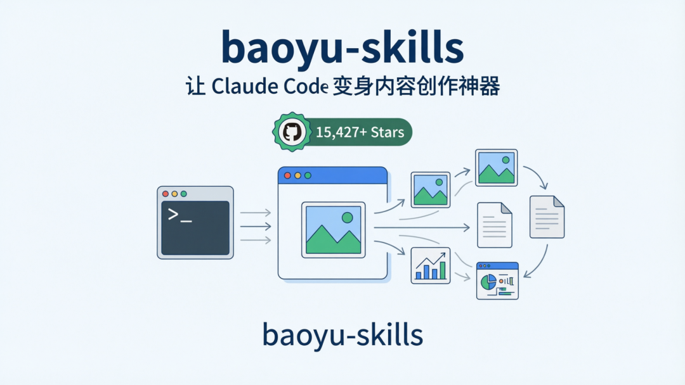
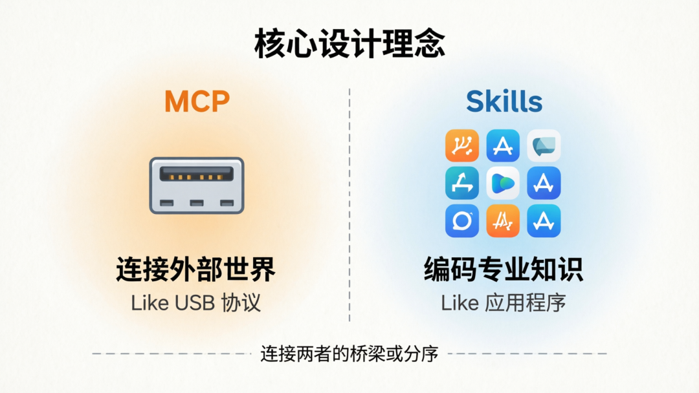
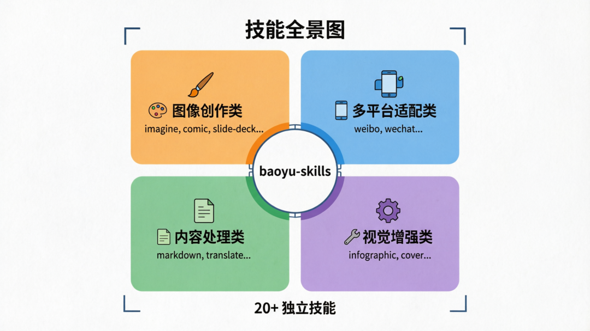

> 📎 来源: [智小码](https://mp.weixin.qq.com/s/ZE8K2yYp9jSfsE6sSvsJLQ) | 时间: 2026-04-21 23:48

---

> 宝玉开源的 baoyu-skills 集合，一站式搞定图像生成、内容处理等创作全流程

# GitHub 15000+ Stars！这款 AI 技能集，让 Claude Code 变身内容创作神器



> 作者：宝玉（@dotey） | 项目地址：github.com/JimLiu/baoyu-skills[1]

## 引言：从对话到行动，AI 助手的进化之路

过去两年，我们见证了大语言模型从"能聊天"进化到"能干活"。2026 年初，Claude Code 的横空出世让无数开发者眼前一亮——一个能在终端里直接操作代码的 AI 助手，仿佛把 ChatGPT 塞进了 VS Code。

但很快，有人提出了一个更深层的问题：**既然 Claude Code 可以执行命令、读取文件、调用 API，那我们能不能把日常工作中那些重复的流程，封装成"一键搞定"的自动化技能？**

答案是——不仅能，而且已经有人做了，还做到了 GitHub 上 **15000+ Stars**。

## 谁是宝玉？

宝玉（@dotey），资深开发者，技术博主，baoyu.io[2] 的主理人。他长期关注 AI 编程工具的演进，是国内最早一批深入探索 AI Agent 工作流的实践者之一。

他的核心理念很朴素：

> **MCP 解决的是"连接外部世界"的问题（像 USB 协议），而 Skills 解决的是"编码专业知识"的问题（像应用程序）。**

基于这个理念，宝玉把自己在内容创作、图像生成等场景中的经验，封装成了一套开箱即用的 Claude Code 技能集——**baoyu-skills**。



## 项目概览：一个技能，还是全家桶？

baoyu-skills 可不是一个单一技能，而是一整套面向**内容创作者**的工具箱。

| 指标 | 数据 |
| --- | --- |
| GitHub Stars | 15,427+ |
| Forks | 1,776+ |
| 编程语言 | TypeScript |
| 创建时间 | 2026 年 1 月 13 日 |
| 最近活跃更新 | 持续迭代中 |

项目包含 **20+ 个独立技能**，覆盖了从内容创作、图像处理到排版发布的全流程。接下来逐一拆解。



## 技能全景图

### 🎨 图像创作类：从文字到视觉的一站式生成

这部分是 baoyu-skills 的核心卖点，也是吸引大量 Star 的明星功能。

**baoyu-imagine / baoyu-image-gen** —— AI 图像生成的入口，支持 OpenAI、Azure OpenAI、Google 等多个后端。你只需描述想要的画面，技能会自动选择合适的模型和参数生成图片。

**baoyu-comic** —— 知识漫画生成器。把复杂的技术文档、学术文章转化为趣味漫画。支持多种艺术风格，适合做技术科普、产品说明。

**baoyu-slide-deck** —— 专业幻灯片组图生成。输入内容，自动生成一系列配图，直接可以用于 PPT 或 Keynote。

**baoyu-image-cards** —— 信息图卡片系列，12 种视觉风格可选。特别适合做小红书上那种"一图读懂"系列。

**实际效果**：用这些技能，创作者可以在几分钟内完成过去需要设计师几天才能完成的工作。有用户反馈，使用 baoyu-skills 后内容发布时间缩短了 **70%**。

### 📱 多平台适配类：格式兼容，效率翻倍

**baoyu-post-to-weibo** —— 微博内容格式化。支持常规帖子和时间线帖子两种模式，生成适配微博的格式。

**baoyu-post-to-wechat** —— 微信公众号排版助手。支持 Markdown 格式化、多种主题渲染，生成适配公众号编辑器的格式，大幅提升排版效率。

### 📝 内容处理类：格式转换与内容提取

**baoyu-format-markdown** —— Markdown 格式化。自动添加前置元信息、标题优化、代码块格式化，让你的 Markdown 文件更加规范。

**baoyu-markdown-to-html** —— Markdown 转 HTML。生成带精美主题的 HTML 页面，可直接嵌入博客或网站。

**baoyu-translate** —— 多语言翻译。在翻译过程中进行三层质量检查，确保翻译准确性。支持多种语言互译。

**baoyu-youtube-transcript** —— YouTube 视频字幕/文稿下载。一键获取视频的文字稿和封面图，方便做二次创作。

**baoyu-url-to-markdown** —— 任意网页转 Markdown。把网页内容抓取下来，转化为本地 Markdown 文件。

### 🔧 视觉增强类：让内容更好看

**baoyu-infographic** —— 专业信息图生成器。21 种布局类型 × 21 种视觉风格，支持线性时间线、对比矩阵、漏斗图、冰山图等多种信息结构。

**baoyu-cover-image** —— 文章封面图生成。5 种维度（类型、配色方案等），为你的文章自动匹配精美的封面。

**baoyu-article-illustrator** —— 文章智能配图。分析文章结构，识别需要配图的位置，自动生成对应的插图。

**baoyu-compress-image** —— 图片压缩。将图片压缩为 WebP（默认）或 PNG 格式，自动选择最优工具和压缩等级，减小文件体积。

## 核心设计理念：把重复变自动

baoyu-skills 最打动人的地方，不是某个单一功能的强大，而是它背后的设计哲学：

**1. 经验即代码**

把你在内容创作中积累的"最佳实践"——图片尺寸、排版格式、发布流程——直接编码到技能里。新手的产出也能接近专业水平。

**2. 全流程打通**

不是一个个孤立的工具，而是一条完整的流水线：输入素材 → 生成图片 → 格式化排版 → 输出成品。一气呵成。

**3. 可组合、可定制**

每个技能都是独立的，可以单独使用，也可以组合在一起。比如：`baoyu-youtube-transcript` 抓取视频文稿 → `baoyu-infographic` 生成信息图。

## 安装与使用

安装非常简单，只需在你的项目中克隆技能集并配置 Claude Code 即可：

```
# 安装 baoyu-skills 到你的 Claude Code 技能目录# 具体安装步骤请参考项目 README
```

安装完成后，在 Claude Code 中通过斜杠命令即可调用各个技能，例如：

- `/baoyu-infographic 你的内容.md` —— 生成信息图
- `/baoyu-comic` —— 生成知识漫画

每个技能都有完整的交互流程，会引导你选择参数、确认选项，最终输出结果。

## 总结

baoyu-skills 的成功不是偶然。它切中了一个真实的需求痛点：**AI 工具已经很强大了，但如何让它稳定地输出专业级别的结果？**

宝玉的做法是把专业经验沉淀为可复用的技能，让每次执行都是一次"专业级"的操作。这个思路不仅仅适用于内容创作，对于开发运维、数据分析、产品设计等任何有重复流程的场景，都值得借鉴。

如果你是一个 AI 工具爱好者，或者是一个每天都在和内容创作打交道的创作者，baoyu-skills 值得一试。

---

**项目地址**：github.com/JimLiu/baoyu-skills
