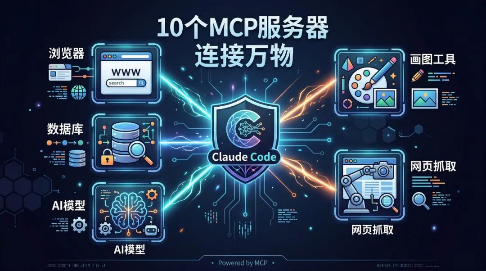
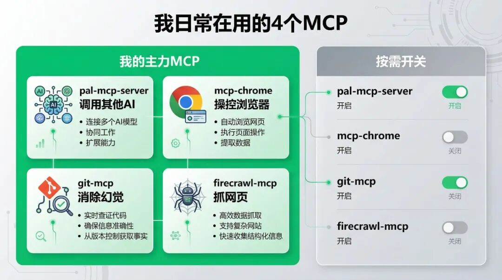

> 📎 来源: [AI落地手记](https://mp.weixin.qq.com/s?__biz=MzYzMjY1OTI0MA==&mid=2247484379&idx=1&sn=c04b644c5feadc6ca13c1c8533417ec1&chksm=f18f368376b110035000e9d466bef23bc097661dfa361aaa41c068eb915bb709b7fdbf9ab681&mpshare=1&scene=1&srcid=0525qTxYisfmxAD2qQI8AQGs&sharer_shareinfo=b72aef479d3a9af7f1aeeded407b4900&sharer_shareinfo_first=b72aef479d3a9af7f1aeeded407b4900) | 时间: 2026-05-25 22:41

---

上篇聊了4个Claude Code配置库。

有人私信问：配置装好了，Claude Code能不能连外部工具？比如操作浏览器、查数据库、控制其他AI？

能。靠的就是MCP。

MCP全称Model Context Protocol，你可以理解成AI工具的"万能插座"。Claude Code通过MCP连接外部世界——浏览器、数据库、API、甚至其他AI模型。

3月份MCP的SDK月下载量突破了**9700万次**。OpenAI和Google也宣布全面支持。已经不是实验性技术了，是基础设施。

我从GitHub上Star最高的MCP服务器里，挑了10个最实用的。

**不是什么都推荐。有几个坑很深，我帮你踩过了。**

---

## 先搞清一个概念

打个比方：

Claude Code是大脑，MCP服务器是手脚。
大脑再聪明，不接手脚就只能跟你聊天。接上MCP，它就能操作浏览器、读数据库、发消息、画图、调API。

安装也简单，在Claude Code配置文件里加几行JSON就行。后面每个都会说怎么装。

---

## 第1个：pal-mcp-server（11.4K Star）— 让Claude调用其他AI

这个最骚。

装上以后，Claude Code可以在工作过程中**调用Gemini、GPT、Ollama本地模型**。

什么场景用？比如Claude在写一段代码，拿不准某个API的用法，它会自己去问Gemini确认一下。或者Claude生成了一段文案，它调GPT帮忙润色。

**AI调用AI。你坐着看就行。**

我现在的工作流里就有这个。Claude写代码是主力，但生成图片它不行，就自动转给Gemini。

**坑：** Token消耗会翻倍，因为两个模型都在跑。适合关键任务，别什么都转。

---

## 第2个：mcp-chrome（11.1K Star）— 操控Chrome浏览器

让Claude Code直接控制你的Chrome。

打开网页、点击按钮、填表单、截图、提取页面数据——全自动。

**实际用法：** 我让Claude帮我检查一个网站部署成功没有。它自己打开Chrome，访问URL，截个图给我看，顺便检查了页面标题和加载时间。

比Playwright更轻量，不需要额外装浏览器。直接用你正在跑的Chrome。

**坑：** 需要Chrome开调试端口。启动时加 --remote-debugging-port=9222 参数。第一次配比较麻烦，配好就省心了。

---

## 第3个：mcp-use（9.7K Star）— MCP开发框架

如果你想**自己写MCP服务器**，用这个。

全栈框架，从定义工具、写逻辑、到测试部署一条龙。

普通用户不需要。但如果你的工作有特殊需求——比如让Claude连公司内部系统、操作特定数据库、调用私有API——自己写一个MCP服务器是最靠谱的方案。

我给自己写过3个MCP：一个连企业微信机器人，一个连邮件系统，一个查数据库。每个大概200行代码，Claude帮忙写的。

**适合谁：** 有编程基础、想深度定制的人。

---

## 第4个：git-mcp（7.9K Star）— 消除代码幻觉

这个解决一个真实痛点。

Claude Code有时候会"幻觉"——编造一个不存在的函数名，或者用了已经废弃的API。

git-mcp让Claude在写代码时直接读GitHub仓库的最新源码。不是靠记忆，是实时去看。

**效果：** 装上以后，Claude引用第三方库的准确率明显提高。尤其是那些更新频繁的库，幻觉问题几乎消失了。

**坑：** 私有仓库需要配GitHub Token。公开仓库直接用，零配置。

---

## 第5个：firecrawl-mcp（6K Star）— 网页抓取

让Claude Code去互联网上抓信息。

输入一个URL，它自动提取正文、去掉广告和导航栏、返回干净的文本。也能搜索——给个关键词，返回相关网页内容。

我用它做竞品分析。告诉Claude"帮我看看这3个竞品的官网在说什么"，它自己去抓、自己总结、自己对比。

**坑：** 有些网站反爬严格，会失败。免费额度500次/月，一般够用。

---

## 第6个：mcp-playwright（5.4K Star）— 浏览器自动化Pro版

跟mcp-chrome类似但更强。

基于Playwright，能控制Chrome、Firefox、Safari三种浏览器。支持无头模式、移动端模拟、录制回放。

**跟mcp-chrome怎么选？**

• 简单操作（打开页面、截图、提数据）→ mcp-chrome够了

• 复杂场景（自动化测试、多步骤流程、录制脚本）→ mcp-playwright

我两个都装了。日常用mcp-chrome，跑测试用mcp-playwright。

---

## 第7个：gemini-mcp-tool（2.1K Star）— 借Gemini的长上下文

Gemini有个Claude没有的优势：超长上下文窗口。

这个MCP让Claude Code把大文件扔给Gemini处理。比如一个10万行的日志文件，Claude自己吃不下，就转给Gemini分析，结果拿回来继续用。

**实际场景：** 我让Claude排查一个服务器问题，日志文件太大。它自动把日志通过MCP发给Gemini，Gemini找到了关键错误行，Claude拿到结果继续修Bug。

无缝衔接，我全程没动手。

**坑：** 需要Gemini API Key。免费额度够日常用。

---

## 第8个：notebooklm-mcp（1.8K Star）— 让AI做深度研究

连接Google的NotebookLM。

你给Claude一个研究课题，它自动往NotebookLM里塞资料、生成摘要、提取关键信息。

适合写研究报告、做行业分析这类需要深度阅读大量资料的任务。

**坑：** 目前还是早期阶段，稳定性一般。偶尔会断连。适合尝鲜，不建议用在关键工作流。

---

## 第9个：mcp-excalidraw（1.6K Star）— 让AI画图

Claude Code能写代码但不能画图。这个MCP解决了。

连接Excalidraw（开源画图工具），让Claude用代码生成流程图、架构图、思维导图。

**我的用法：** 写技术方案时，告诉Claude"画一个系统架构图"。它直接通过MCP调Excalidraw生成，不用我打开任何画图软件。

效果比我自己画的还整齐。

---

## 第10个：phantom（1.2K Star）— 自进化AI同事

这个最科幻。

phantom不只是一个MCP服务器，它是一个有自己"电脑"的AI Agent。有独立的虚拟桌面，能安装软件、上网、处理文件。

你给它分配任务，它在自己的环境里独立完成。做完了把结果发给你。

**目前Star不高，还在早期。** 但方向很有意思——以后AI不只是你的工具，是你的"远程同事"，有自己的工位和电脑。

---

## 我的推荐清单

按需装，别全装。全装会让Claude Code启动变慢、上下文变挤。

▲ 我日常在用的4个MCP

| 场景 | 装哪个 |
| --- | --- |
| 想让Claude调用其他AI | pal-mcp-server |
| 操作网页/截图 | mcp-chrome（轻量）或 mcp-playwright（重量） |
| 自己写MCP | mcp-use |
| 减少代码幻觉 | git-mcp |
| 抓网页内容 | firecrawl-mcp |
| 处理超大文件 | gemini-mcp-tool |
| 让AI画图 | mcp-excalidraw |

**我日常在用的4个：pal-mcp-server、mcp-chrome、git-mcp、firecrawl-mcp。其他按需开关。**

---

MCP是Claude Code从"聊天工具"变成"操作系统"的关键一步。53万Star的配置库是大脑升级，MCP是给它接上了手脚。

**脑子和手脚都有了，剩下就看你怎么指挥。**

关注「AI落地手记」

一个人+AI管20个项目的真实记录
