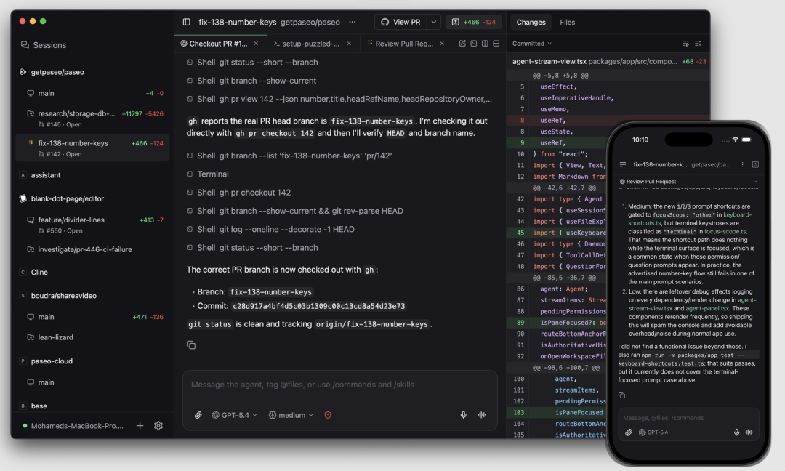
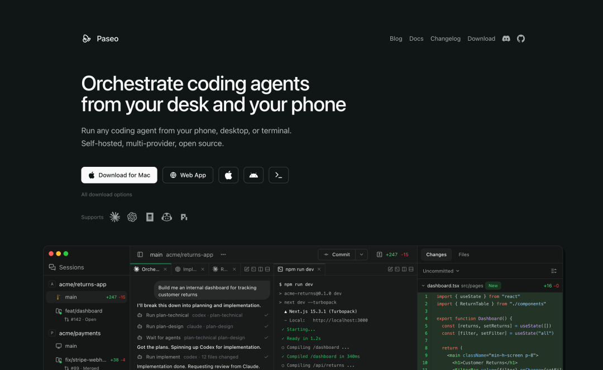
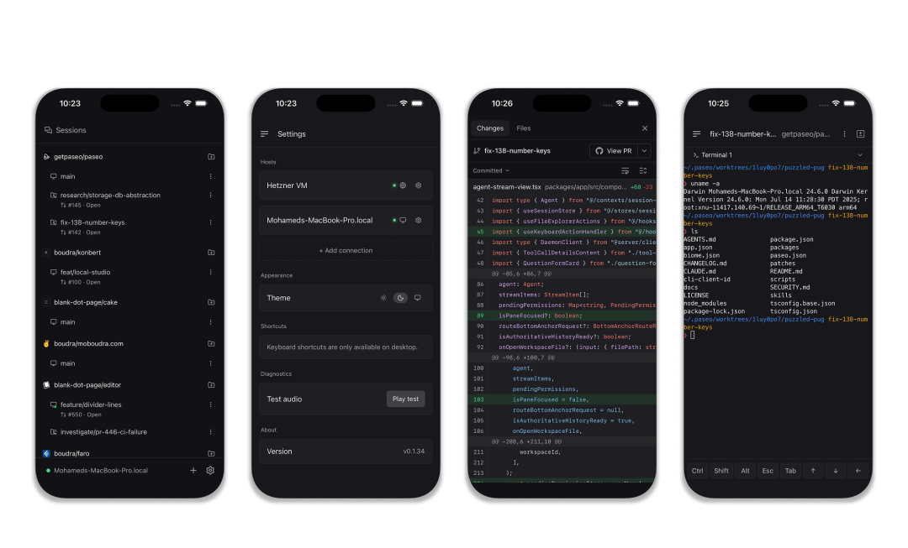

> 📎 来源: [物联网星球](https://mp.weixin.qq.com/s?__biz=MzkzMDQ0MjE3Mg==&mid=2247501703&idx=1&sn=aa4807d426f38bbf35fc94eddf5937a9&chksm=c3558543f3d3cbc119587c760e3280bb51b34eec0704c54990ffded743262b4bd097f3c80680&mpshare=1&scene=1&srcid=0411MF8mLtW6RxRSXazjwzyx&sharer_shareinfo=86964d55cdda4b22c2f4562989e402ef&sharer_shareinfo_first=86964d55cdda4b22c2f4562989e402ef) | 时间: 2026-04-13 15:35

---

做AI编程的，现在手上至少有两三个不同的代码智能体：Claude Code、Codex、OpenCode……每个都有自己的命令行，各自为政，切来切去烦死人。

最近 GitHub 上有个开源项目叫 **Paseo**，正好解决这个问题——一个界面统一管理所有主流AI编程智能体，手机、桌面、CLI 都能用。



---

## 核心定位：智能体编排器

Paseo 不是又一个AI编程工具，而是一个**编排层**。



它自己不写代码，而是帮你管理 Claude Code、Codex、OpenCode 这些底层智能体。你可以：

•从手机远程启动家里的 Claude Code 跑任务

•同时在多个代码库并行跑不同的智能体

•用语音给智能体下指令

•在桌面端和移动端无缝切换

一句话：**把分散的AI编程能力，整合到一个统一的控制界面。**

---

## 架构设计：本地优先，隐私第一

Paseo 的核心是一个本地守护进程（daemon），运行在你的机器上：

```
┌─────────────────────────────────────────┐│  手机App / 桌面App / Web / CLI          ││  (客户端，只负责展示和输入)              │└──────────────┬──────────────────────────┘               │ WebSocket               ▼┌─────────────────────────────────────────┐│  Paseo Daemon (本地运行)                ││  - 进程管理                             ││  - 智能体编排                           ││  - MCP服务器                            │└──────────────┬──────────────────────────┘               │    ┌──────────┼──────────┐    ▼          ▼          ▼┌───────┐  ┌───────┐  ┌───────┐│Claude │  │ Codex │  │OpenCode││ Code  │  │       │  │        │└───────┘  └───────┘  └───────┘
```

**关键点：**

•**Self-hosted**：智能体在你的机器上运行，用你的开发环境、你的工具链、你的配置

•**无遥测**：不开源的项目天天传数据，Paseo 零追踪、零强制登录

•**跨设备**：iOS、Android、桌面、Web、CLI 五端覆盖

---

## 功能亮点

### 

### 1. 多提供商统一接入

Claude Code、Codex、OpenCode 三个主流智能体，一个界面切换。不同任务选不同模型：

•复杂架构设计 → Claude Opus

•快速原型开发 → Codex GPT-5.4

•轻量级脚本 → OpenCode

### 2. 并行运行

多个智能体同时在不同代码库工作，互不影响。比如：

•让 Codex 在 feature-x 分支实现新功能

•同时让 Claude 在 main 分支重构旧代码

•手机端随时查看两个任务的进度

### 3. 语音控制

支持语音输入，走路、开车时也能给智能体下指令。

### 4. CLI 完整支持

所有App能做的操作，CLI都能做：

5. 智能体编排技能（Experimental）

更高级的功能——教智能体怎么调用 Paseo CLI 来编排其他智能体：

•**handoff**：和 Claude 讨论完方案，直接交接给 Codex 实现

•**loops**：设定验收标准，让智能体循环迭代直到达标

•**orchestrator**：创建智能体团队，用聊天室协调分工

这有点像**智能体的智能体**，用AI来管理AI。

---

## 适用场景

**Paseo 适合谁？**

•同时用多个AI编程工具，想统一管理的开发者

•需要远程监控/操作家里/公司机器上智能体的场景

•对隐私敏感，不想把代码上传到第三方平台的团队

•喜欢自托管、想要完全控制权的极客

**不适合谁？**

•只想用一个智能体、不需要多设备切换的轻度用户

•不想折腾本地部署， prefer 开箱即用的云服务

---

## 吴同学

Paseo 解决了一个很实际的问题：**AI编程工具碎片化**。

Claude Code、Codex、OpenCode 各有优势，但分别管理效率太低。Paseo 提供了一个统一的编排层，让你可以在不同智能体、不同设备、不同场景之间灵活切换。

开源、本地优先、无遥测——这三个特性在当前AI工具市场尤其难得。

如果你已经在用多个AI编程智能体，Paseo 值得一试。

---

**项目地址：** github.com/getpaseo/paseo


## End

---

**往期推荐**

[产品推荐｜ThingsKit 物联网平台，2.0版本，项目交付首选IoT平台，支持源代码与镜像包交付](https://mp.weixin.qq.com/s?__biz=MzkzMDQ0MjE3Mg==&mid=2247501039&idx=1&sn=cf0d3543e6045a3c6525bcdc52acebbc&scene=21#wechat_redirect)

[Node-RED：开源的物联网与工业4.0的视觉化编排规则引擎，大厂都在用！](https://mp.weixin.qq.com/s?__biz=MzkzMDQ0MjE3Mg==&mid=2247501023&idx=1&sn=8ef2e509a04149b81cd534495d1e731b&scene=21#wechat_redirect)

[15k Star丨一个超漂亮的数据可视化大屏开源项目（MIT协议），IoT数据大屏应用首选](https://mp.weixin.qq.com/s?__biz=MzkzMDQ0MjE3Mg==&mid=2247500697&idx=1&sn=8d4a66a4996b4c10afd80ad0005dfa1d&scene=21&poc_token=HNATb2mjitylB4u0UbT6t9O5HXkFcKVhZiJ7YSww&token=1738189348&lang=zh_CN#wechat_redirect)

[opcode：开源 Claude Code 的桌面可视化开发工具](https://mp.weixin.qq.com/s?__biz=MzkzMDQ0MjE3Mg==&mid=2247501264&idx=1&sn=44470e14d987f07b2fea74a72125f471&scene=21&token=1222753081&lang=zh_CN#wechat_redirect)

[物联网常见协议清单，一文搞懂！](https://mp.weixin.qq.com/s?__biz=MzkzMDQ0MjE3Mg==&mid=2247501515&idx=1&sn=fab7836cbb1b82dea08c802c22686a3d&scene=21#wechat_redirect)

---

**关注「物联网星球」**

每日分享物联网、AI干货 | 开源项目 | 实战教程 | 实用工具
