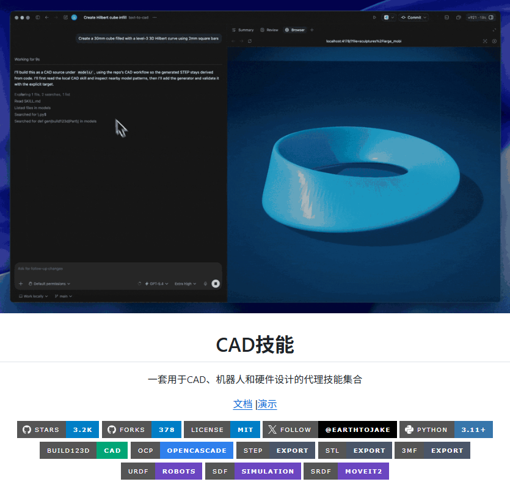
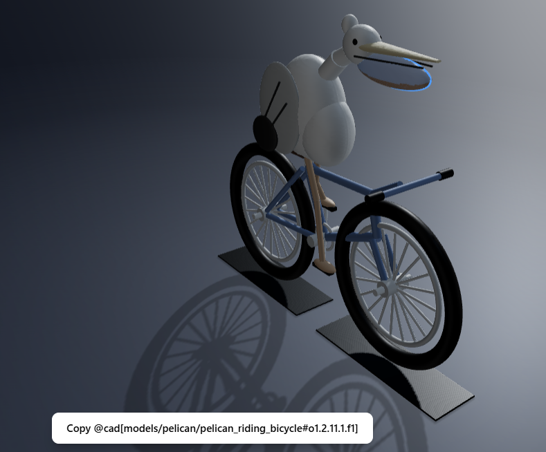
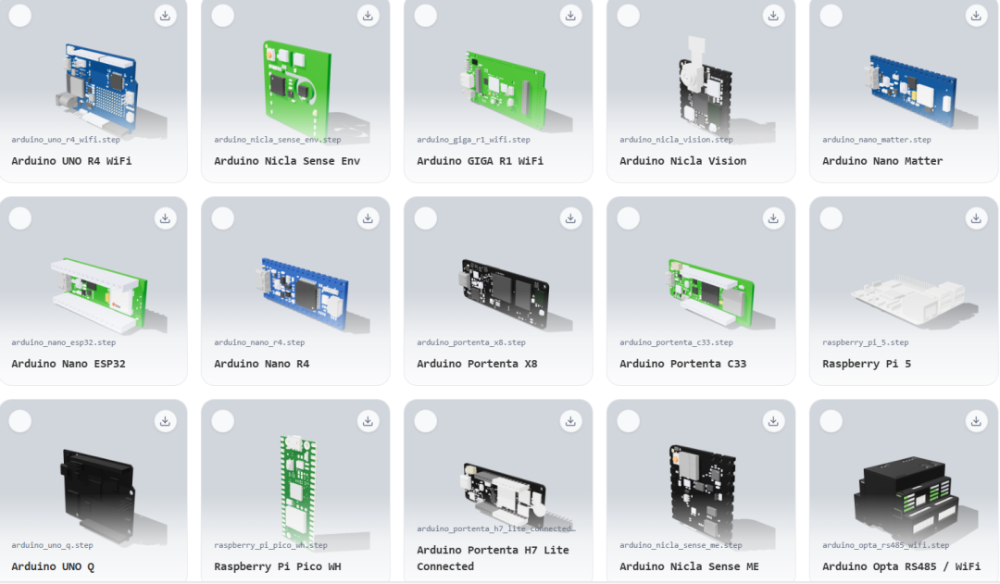
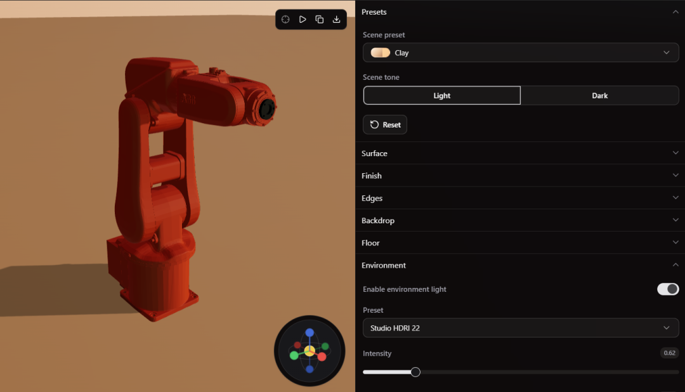
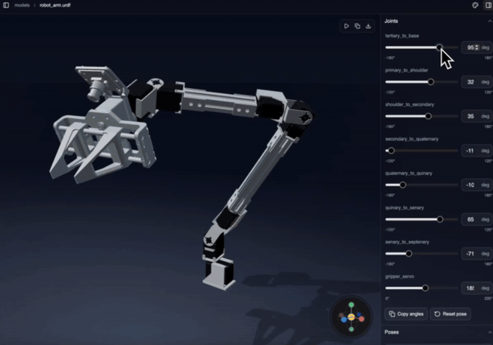
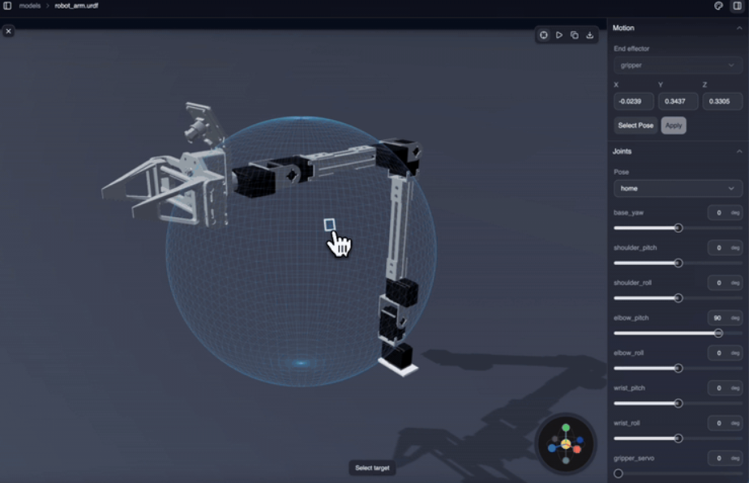

> 📎 来源: [AI开源提效指南](https://mp.weixin.qq.com/s?__biz=MzY5NzIxODM2MQ==&mid=2247484799&idx=1&sn=8960675157c0b61c69b3b03e1943b2ed&chksm=f595058c9a980bdbe33c636cc0e34773d2fc0abf216425598ebe45e2891c4fbe8c4abba9ea8d&mpshare=1&scene=1&srcid=0526WWFoVgdjphfnpv8Ue94j&sharer_shareinfo=6849f145dcb6e839d98d2acf273df996&sharer_shareinfo_first=6849f145dcb6e839d98d2acf273df996) | 时间: 2026-05-26 12:42

---

大家好！这里是

```
AI开源提效指南
```

！

Text-to-CAD 是一个开源的、 AI Agent 驱动的 CAD 建模技能集！

它可以用自然语言生成 3D 零件，专为 CAD 建模、机器人和硬件设计而生。

目前在 Github 已经收获 3K+ Stars！



它的核心理念非常强大：

> 用自然语言描述你想要的零件或机构，让 AI 编程代理（如 Codex、Claude Code）自动生成参数化 CAD 模型。

底层基于 **build123d**（Python CAD 库）和 **OpenCascade**（开源 CAD 引擎），通过 WASM 和 Agent 技能实现端到端的 Text-to-CAD 工作流。

你可以把它理解为：

- **AI 驱动的 CAD 生成器**：用文字描述，生成精确的 3D 模型
- **AI Agent 的硬件设计技能**：Codex、Claude Code、Gemini、OpenClaw 都能用
- **全格式导出**：STEP、STL、3MF、DXF、GLB、URDF、SDF、SRDF
- **完整的机器人描述生成**：URDF、SDF、SRDF 一键生成

---

## 技术架构

- **build123d**：Python 参数化 CAD 库
- **OpenCascade**：开源 CAD 内核
- **WASM**：WebAssembly 支持浏览器端渲染
- **Agent Skills 标准**：遵循 Agent Skills 开放标准

---

## 七大技能

### 1️. CAD Skill（核心）

- 生成参数化 CAD 模型
- 导出格式：STEP、STL、3MF、DXF、GLB
- 生成拓扑数据
- ```
  @cad[...]
  ```

   几何引用——Agent 可以做精确的后续编辑
- 快速渲染审查图片



### 2. step.parts Skill（标准件库）

- 从 www.step.parts 查找和下载标准件
- 支持：螺丝、螺母、垫圈、轴承、隔离柱、电子元件、电机、连接器
- 评估和筛选合适的零件



### 3. CAD Explorer Skill（模型浏览器）

- 启动或复用 CAD Explorer
- 返回可视化审查链接
- 支持格式：

  ```
  .step
  ```

  、

  ```
  .stp
  ```

  、

  ```
  .stl
  ```

  、

  ```
  .3mf
  ```

  、

  ```
  .dxf
  ```

  、

  ```
  .urdf
  ```

  、

  ```
  .srdf
  ```

  、

  ```
  .sdf
  ```
- 基于浏览器 WebGL 渲染



### 4. URDF Skill（机器人描述）

- 生成 URDF XML 文件
- 定义机器人连杆、关节、限制
- 自动验证
- 网格引用
- CAD Explorer 中直接可视化 URDF



### 5. SDF Skill（仿真描述）

- 生成 SDFormat/SDF XML
- 定义仿真模型和世界结构
- 自动验证
- 网格 URI
- 插件支持
- 仿真器特定元数据

### 6️. SRDF Skill（MoveIt2 语义）

- MoveIt2 SRDF 语义定义
- 直接 SRDF 到 URDF Explorer 链接
- 逆运动学
- 路径规划
- 可选 MoveIt2 服务器测试



### 7️. SendCutSend Skill（激光切割预处理）

- SendCutSend.com 专用的 DXF 和 STEP/STP 上传预处理报告
- 基于订购指南、目录和规格
- 支持选定材料、SKU、服务和二次加工

---

## 🎮 快速上手

### 安装

**克隆仓库**

```
git clone https://github.com/earthtojake/text-to-cad.gitcd text-to-cad
```

**Codex**

```
./scripts/codex-install.sh
```

**Claude Code**

```
./scripts/claude-install.sh
```

**Gemini CLI**

```
./scripts/gemini-install.sh
```

**OpenClaw**

```
./scripts/openclaw-install.sh
```

**通用安装（推荐）**

```
npx agent-skills-cli add earthtojake/text-to-cad
```

### 工作流

1. **描述**——告诉 Agent 你想要的零件、组件、夹具、机器人或机构
2. **编辑**——让 Agent 更新 CAD 源文件
3. **生成**——创建 STEP、STL、3MF、DXF、GLB、URDF、SDF 或 SRDF 输出
4. **检查**——打开 CAD Explorer 审查生成的模型
5. **引用**——复制 

   ```
   @cad[...]
   ```

    句柄进行几何感知的精确编辑
6. **提交**——保存源文件和生成的产物

---

## 🔥 项目亮点

### 1️. Text-to-CAD 的完整实现

用自然语言描述零件，AI Agent 自动生成精确的参数化 CAD 模型。

 支持从简单的校准块到复杂的行星齿轮组。

### 2️. 支持多种格式

- **CAD 格式**：STEP、STL、3MF、DXF、GLB
- **机器人格式**：URDF（ROS）、SDF（Gazebo/Isaac）、SRDF（MoveIt2）

### 3️. 七大技能，各司其职

- CAD 生成
- 标准件查找
- 模型浏览
- URDF 机器人描述
- SDF 仿真描述
- SRDF MoveIt2 语义
- SendCutSend 激光切割预处理

### 4️. 多 Agent 支持

Codex、Claude Code、Gemini CLI、OpenClaw 全部支持。

### 5️. 10 个基准测试案例

项目包含 10 个从简单到复杂的基准测试，验证生成质量：

| # | 名称 | 描述 |
| --- | --- | --- |
| 1 | 矩形校准块 | 四孔校准块 |
| 2 | 圆形法兰 | 螺栓孔阵列 |
| 3 | L 型支架 | 加强筋、双向孔 |
| 4 | 阶梯轴 | 键槽 |
| 5 | 开放式电子外壳 | 带安装柱 |
| 6 | 航空级叉形支架 | 减重切口 |
| 7 | 径向发动机气缸 | 散热片 |
| 8 | 离心叶轮 | 后弯叶片 |
| 9 | 螺旋楼梯 | 螺旋扶手 |
| 10 | 行星齿轮组 | 多齿轮配合 |

### 6️. CAD Explorer 可视化

不用安装桌面 CAD 软件，基于 WebGL 的浏览器支持 8 种文件格式的在线预览。

## 📖 学习资源

```
- 官方文档: https://www.cadskills.xyz- 在线演示: https://demo.cadskills.xyz- GitHub : https://github.com/earthtojake/text-to-cad
```

---

## 🎯 总结

Text-to-CAD 是目前比较全面的 AI 驱动 CAD 建模技能集。

它把 build123d 和 OpenCascade 的强大能力与 AI Agent 的自然语言理解结合起来，让硬件设计也能像软件一样"说出来就生成"。

无论你是机械工程师、机器人研究者还是硬件创客，这个工具集都值得关注！

---

免责声明：本文内容仅供学习交流，所述工具/方法请遵守相关平台服务条款及法律法规。如涉及第三方服务，请以官方最新政策为准。

---

**🎯****觉得这份工具干货有用？希望收到您的支持：**

- ⭐ 星标 / 置顶公众号，**第一时间解锁最新工具分享！**
- ✅ **点赞**「**推荐**」，让更多技术伙伴发现优质干货！
- 🔗 **转发**给团队小伙伴，一起高效提效！
- 💬 **底部留言区**，告诉我您想找的工具/项目方向！

**📬 长期追踪优质开源工具**

- 关注「**AI 开源提效指南**」｜日更开源神器，玩转技术提效！
- 回复 **【容器加速器】**，即刻开启你的高效探索之旅～
