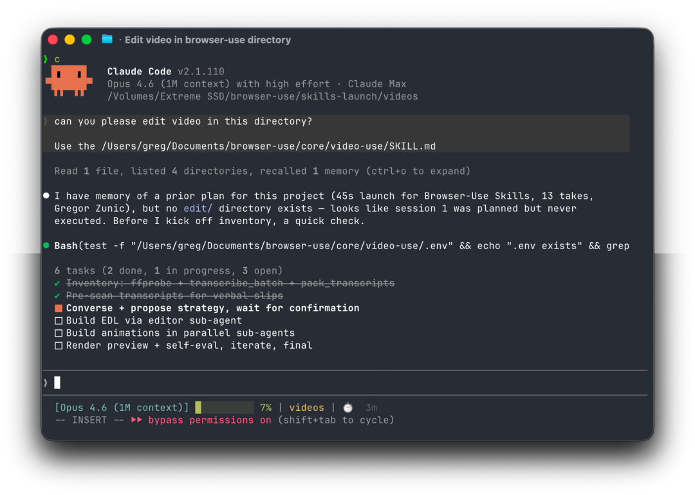
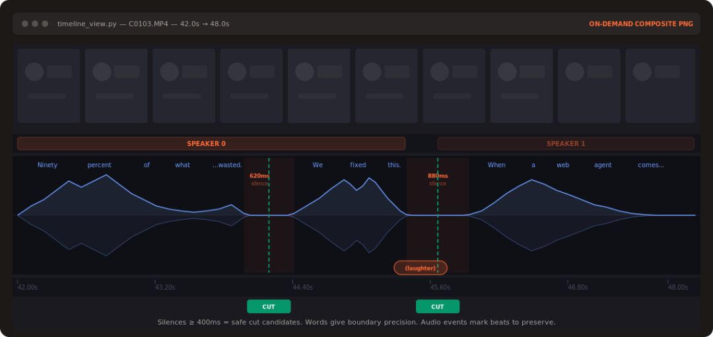

> 📎 来源: [程序员锋仔](https://mp.weixin.qq.com/s?__biz=MzYzMTA2MDY0Mg==&mid=2247488605&idx=1&sn=06adaa8781e56f094c3c139ea1749798&chksm=f19c0eefd0e1494102130de2801c42dd56eb48c0785ac249878a1ce203c816d56d900e20159a&mpshare=1&scene=1&srcid=0421hZMxcCEBNMPSwZLXm7jp&sharer_shareinfo=f38c36132b18acf8c35e128735675ebf&sharer_shareinfo_first=f38c36132b18acf8c35e128735675ebf) | 时间: 2026-04-21 11:53

---

## 视频剪辑的AI革命：video-use让Claude成为你的私人剪辑师



你是否曾想过，如果有一个AI能理解你的视频内容，自动去除冗余，优化音画，甚至添加字幕和动画，那该多好？今天，我要向你介绍一个改变游戏规则的开源项目——  **video-use**  。这个工具让你只需与Claude Code对话，就能将一堆原始素材变成一部专业级的视频作品。

> "Drop raw footage in a folder, chat with Claude Code, get final.mp4 back." —— 把原始素材放进文件夹，和Claude Code聊聊，就能拿到final.mp4。

### video-use能做什么？

video-use是一个100%开源的视频编辑工具，它通过AI智能处理视频内容，无需复杂的预设和菜单，适用于各种类型的视频内容：

• 自动去除填充词（"嗯"、"啊"、不完整的句子）和镜头间的空白
 • 自动调色（电影感暖色调、中性高对比度或自定义ffmpeg滤镜链）
 • 每个剪辑点添加30ms音频渐变，避免突兀的爆音
 • 烧录字幕（默认为2词大写块，完全可自定义）
 • 通过Manim、Remotion或PIL生成动画覆盖层
 • 自我评估渲染输出，确保每个剪辑点都完美
 • 在project.md中保持会话记忆，下次继续未完成的工作



### 如何开始使用？

使用video-use非常简单，只需三个步骤：

```
# 1. 克隆并链接到Claude Code的技能目录git clone https://github.com/browser-use/video-usecd video-useln -s "$(pwd)" ~/.claude/skills/video-use# 2. 安装依赖pip install -e .brew install ffmpeg # 必需brew install yt-dlp # 可选，用于下载在线资源# 3. 添加你的ElevenLabs API密钥cp .env.example .env$EDITOR .env # ELEVENLABS_API_KEY=...
```

然后，将Claude Code指向你的原始素材文件夹：

```
cd /path/to/your/videosclaude
```

在会话中，只需简单地说：

> "把这些剪辑成一个发布视频"

Claude会盘点所有素材，提出剪辑策略，等待你的确认，然后在你的素材旁边生成edit/final.mp4。所有输出都位于  /edit/目录下，保持技能目录整洁。

### 工作原理：AI如何"阅读"视频？

video-use的创新之处在于，AI从不直接"观看"视频，而是通过两层结构精确"阅读"视频内容：

**第一层 - 音频转录（始终加载）**
 每个素材通过一次ElevenLabs Scribe调用，获得词级时间戳、说话人分离和音频事件（笑声、掌声、叹息）。所有素材被打包成一个约12KB的takes\_packed.md文件，这是LLM的主要阅读视图。

```
## C0103 (duration: 43.0s, 8 phrases)[002.52-005.36] S0 百分之九十的网络代理工作完全是浪费。[006.08-006.74] S0 我们解决了这个问题。
```

**第二层 - 视觉合成（按需调用）**
 timeline\_view为任何时间范围生成胶片条+波形+词标签PNG。仅在决策点调用——模糊的停顿、重拍比较、剪辑点合理性检查。

传统方法：30,000帧×1,500token=4500万token的噪音。
 video-use：12KB文本+少量PNG。

### 处理流程：从素材到成品

| 步骤 | 说明 |
| --- | --- |
| 转录 | 将音频转换为带时间戳的文本 |
| 打包 | 将所有素材信息整合到一个文件 |
| LLM推理 | AI决定剪辑策略 |
| EDL | 生成编辑决策列表 |
| 渲染 | 生成最终视频 |
| 自我评估 | 检查剪辑质量，发现问题则修复重渲染 |

自我评估循环会在每个剪辑边界处对渲染输出运行timeline\_view，捕捉视觉跳跃、音频爆音和隐藏字幕。只有通过检查的预览才会显示给你。

### 设计理念：AI剪辑的12条硬性规则

video-use遵循以下设计原则，确保专业级的剪辑质量：

1. \*\*文本+按需视觉\*\*：不导出帧，转录是主要界面
 2. \*\*音频优先，视觉跟随\*\*：剪辑基于语音边界和静音间隙
 3. \*\*询问→确认→执行→自我评估→持久化\*\*：不无策略地剪辑
 4. \*\*零内容类型假设\*\*：观察、询问，然后剪辑
 5. \*\*12条硬性规则，艺术自由 elsewhere\*\*：制作正确性不容妥协，品味可以自由发挥

> "See SKILL.md for the full production rules and editing craft." —— 完整的制作规则和剪辑工艺请参见SKILL.md。

### 为什么选择video-use？

video-use不仅仅是一个工具，它代表了一种新的视频创作方式：

•  **效率革命**  ：将数小时的剪辑工作缩短到几分钟的对话
 •  **专业级输出**  ：即使是非专业人士也能制作出专业水准的视频
 •  **完全控制 •  **开源透明**  ：100%开源，可自由定制和扩展
 •  **跨平台兼容**  ：适用于各种类型的视频内容**

无论你是内容创作者、营销人员、教育工作者，还是想快速处理家庭录像的普通人，video-use都能为你提供前所未有的视频编辑体验。

### 未来展望

video-use展示了AI在创意领域的巨大潜力。随着技术的不断发展，我们可以期待：

• 更智能的内容识别和理解
 • 更丰富的视觉效果和过渡
 • 更自然的音频处理和语音合成
 • 与更多创意工具的无缝集成

video-use已经为我们打开了AI视频创作的大门，未来，我们可能会看到更多类似的工具出现，彻底改变我们创作和消费视频的方式。

本文基于开源项目video-use撰写
 项目地址：https://github.com/browser-use/video-use
