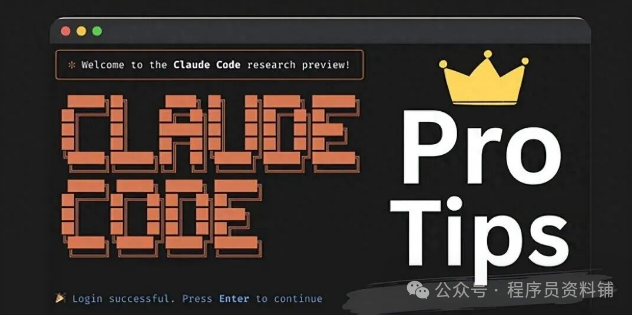
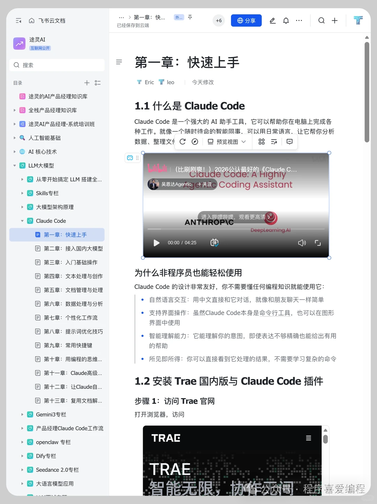
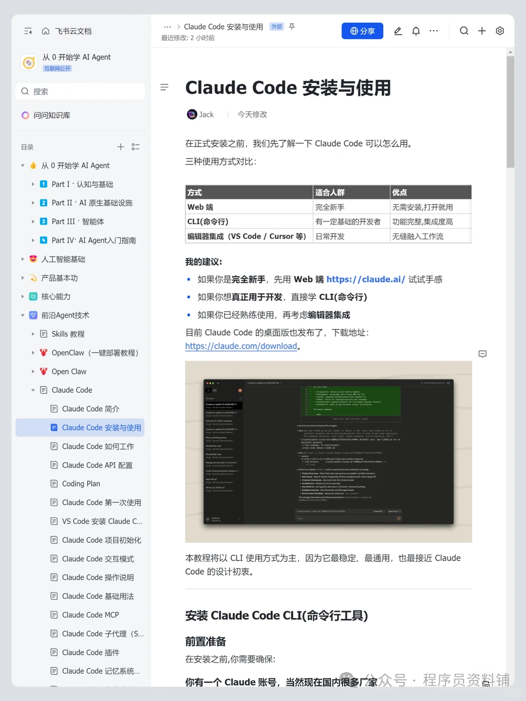
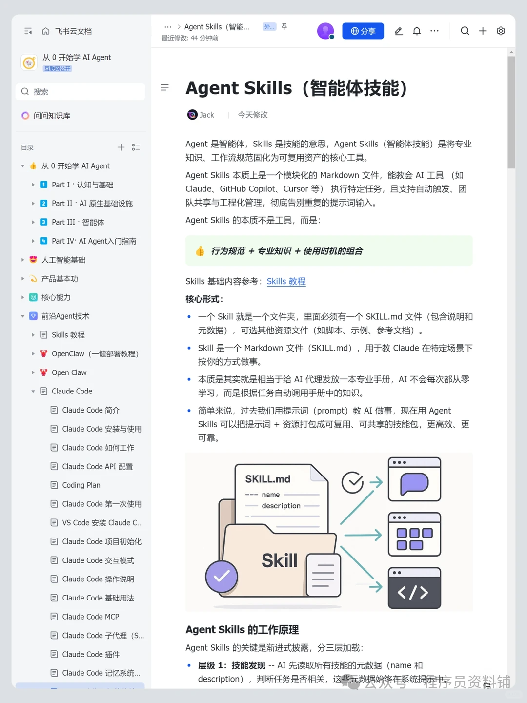
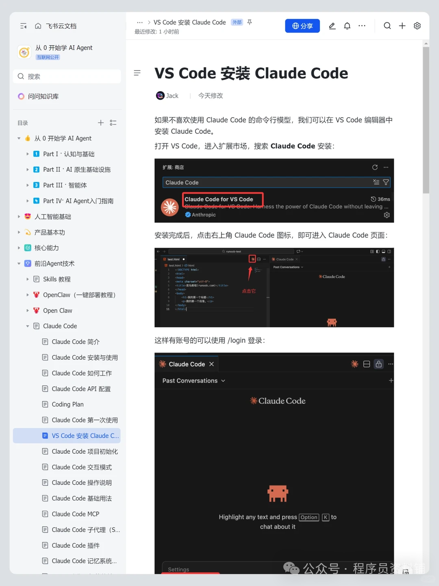
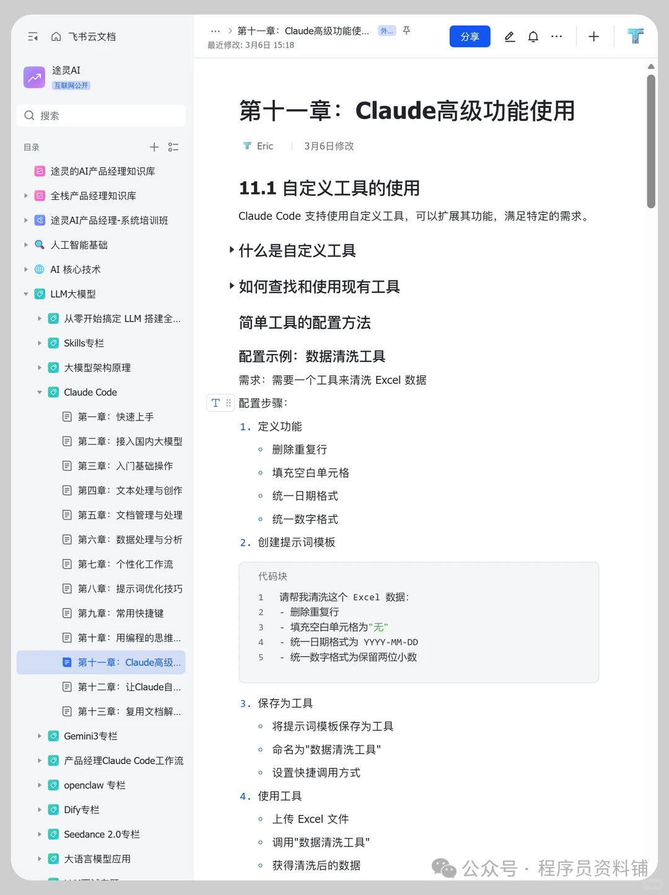
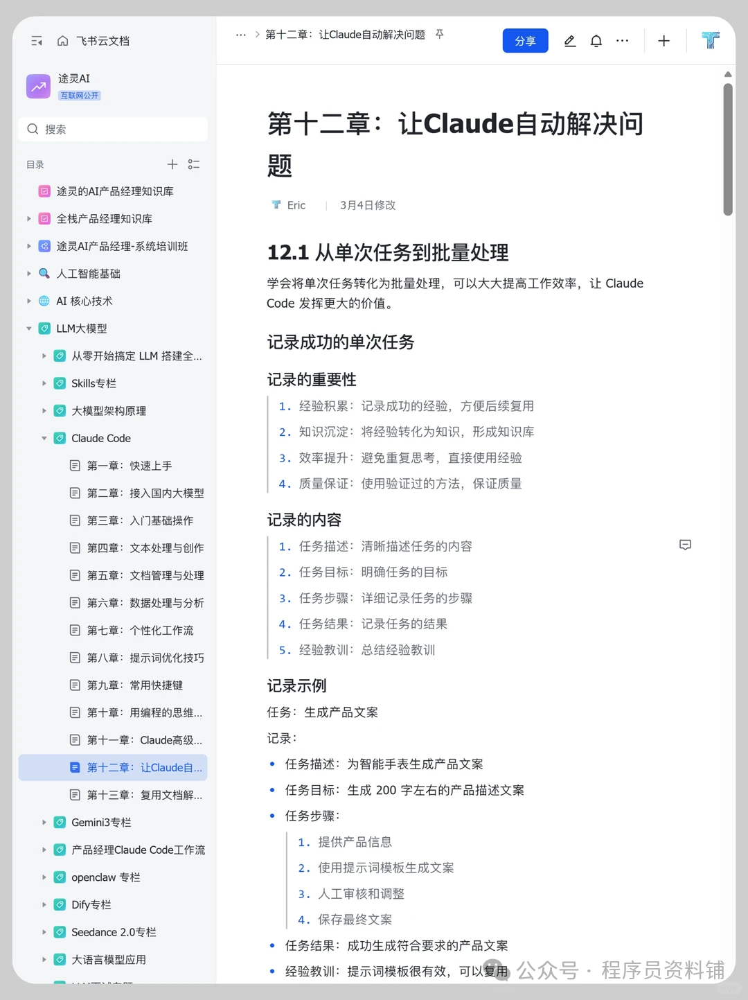

> 📎 来源: [小薛谈编程](https://mp.weixin.qq.com/s?__biz=Mzk0NjUxMDcxNA==&mid=2247491701&idx=2&sn=9b61fcbc8e70840998cdfb574242368a&chksm=c27dbd723ba0daeccb4dfe6cfaa6751858f18d598c64a605c0caeb611e5b6820edfd8623dcd9&mpshare=1&scene=1&srcid=0509Wn3aV91RDGPx9H2cdCrw&sharer_shareinfo=c8976f5343faf85185e268c5e1bd11bc&sharer_shareinfo_first=c8976f5343faf85185e268c5e1bd11bc) | 时间: 2026-05-09 02:05

---

# Claude要验证身份了。 我看了一遍官方原文，说几个我觉得重要的点。 首先——不是所有人都会触发， 是特定功能或场景才会弹出来。 但如果触发了，要准备： 政府颁发的实体证件（护照、身份证都行）手机/电脑带摄像头 全程2-5分钟就好！

字节跳动Claudecode中文使用手册！

完整版就不一一展示了：

Claude Code资料给大家整理好了，

如果有需要的话可以

点赞 + 红心

后台回复：学习

[互联网卷不动、副业没方向、怕被AI淘汰？这场直播别错过！](https://mp.weixin.qq.com/s?__biz=Mzk0NjUxMDcxNA==&mid=2247491601&idx=2&sn=9d49a00312ea023b5bcf9b1ebb611b68&scene=21#wechat_redirect)
