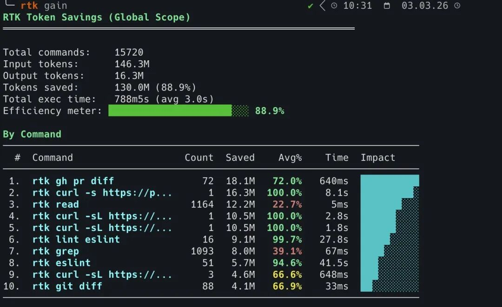
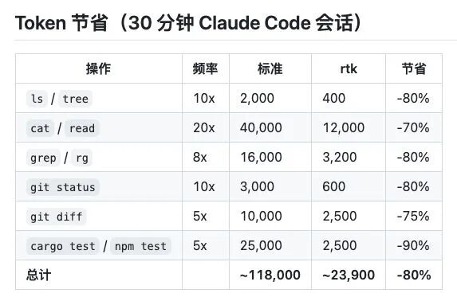

> 📎 来源: [今日穿衣宝典](https://mp.weixin.qq.com/s?__biz=MzY5NjI4NTAyMg==&mid=2247483673&idx=1&sn=528a3d6d9d78455adcca9366e4d180a0&chksm=f5e5a86fc1162c950a678de897febcf5b7f820270f64c49aee267a125157b1b969ec548da471&mpshare=1&scene=1&srcid=0429vJG4QIC8MuiyHck18CAp&sharer_shareinfo=5e5229e5363758f2df3bf2529e5dfc1b&sharer_shareinfo_first=5e5229e5363758f2df3bf2529e5dfc1b) | 时间: 2026-04-29 03:41

---

开源省钱神器！

有人刚刚开源了一个工具，叫 **RTK（Rust Token Killer）** ，它是一个基于 Rust 开发的轻量级 CLI 代理工具，专门为 AI 编码工具（如 Claude Code、Cursor、Gemini CLI 等）做终端输出的"减法"——在命令执行结果返回给 LLM 之前，过滤掉噪音信息，从而将 Token 消耗降低 60%～90%。  它位于你的 AI 和终端之间，在命令输出进入上下文之前进行压缩。

git push、cargo test、ls、grep……全部自动重写。  支持 Claude Code、Cursor、Gemini、Codex、Copilot。  100%开源。

### 一句话概括

RTK 就像你编程时身边站着的一个 **"话痨过滤器"**——每次 AI 助手想看命令结果时，它先帮你看一遍，把啰嗦废话删掉，只把最关键的信息递给 AI，省时省钱。

### 打个比方

想象你有个同事（AI 助手），每次你跑完一个命令，他都要你把所有输出一个字不差地念给他听——包括 100 行"进度条在转"、"98 个测试通过了"之类的废话。

**RTK 做的事就是**：你还没开口念，它先把输出拦下来，划掉那些无关紧要的内容，只让同事听到关键信息。比如你跑了 `git status`，它把"哪些文件被改了、新增了几个"提炼出来；你跑了 `cargo test`，它把"哪两个测试挂了、报了什么错"拎出来，其他全部扔掉。

关键是——你同事完全不知道 RTK 的存在，他以为你念的就是全部。

### 具体怎么干的

**第一步：悄悄抢过话筒**

RTK 在 AI 工具里安插了一个"小机关"（Hook）。本来 AI 要执行 `git status`，这个小机关在中间偷偷把命令改成了 `rtk git status`。AI 完全没察觉，它以为还是原来的命令。

**第二步：当"人肉摘要器"**

RTK 拿到原始输出后，会用四招来"瘦身"：

- **报总数不报流水账**：`git push` 的 15 行进度条 → 压缩成一句 `ok main`
- **只看考卷里的错题**：200 行测试输出，98 个通过的统统扔掉，只留着 2 个挂了的
- **同类错误合并**：100 条 `no-unused-vars` 错误 → 一句 `no-unused-vars: 23 violations`
- **重复的只记次数**：100 行同样的报错日志 → 一行 `Connection refused (×100)`

**第三步：万一搞砸了也不影响干活**

RTK 有个底线原则——**绝不让过滤导致你工作卡壳**。如果它判断失误把重要信息删了，或者过滤过程出错了，它会老老实实把原始输出原样交给 AI，假装什么都没发生过。

开源地址：https://github.com/rtk-ai/rtk
