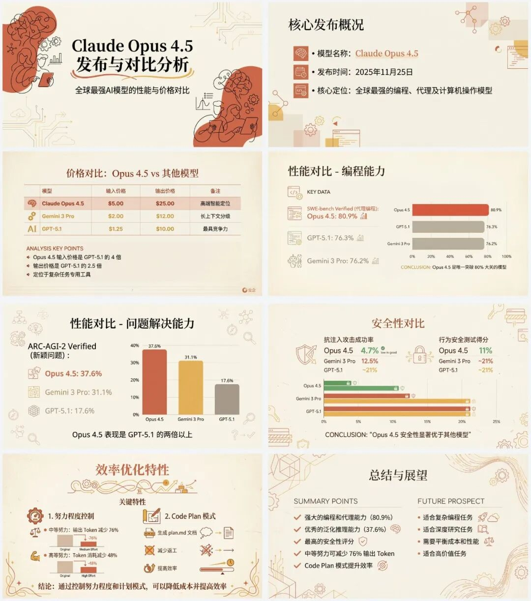
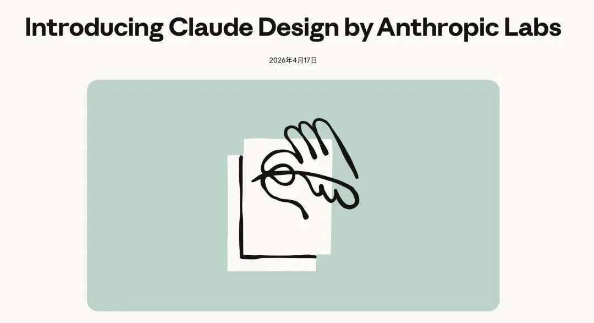

> 📎 来源: [梁粉几碗](https://mp.weixin.qq.com/s?__biz=MzI5MjM2NDIwOQ==&mid=2247485191&idx=1&sn=b6bad9670371ab89ef6b52888b89ce52&chksm=ed6bb2d08ce631715da68fd11ec5b194e64a1fc95bbeffa3944ae130812aec1434cb703ca7b0&mpshare=1&scene=1&srcid=0429g8TLFfr8ZQYdAsk9p85I&sharer_shareinfo=fddcd09841b01d7f2cb7666a761eb2fd&sharer_shareinfo_first=fddcd09841b01d7f2cb7666a761eb2fd) | 时间: 2026-04-29 03:40

---

---

作为曾长期跟PPT打交道的人，用过很多AI-ppt类产品工具。

经常感叹：

> **"AI生成只要3分钟，修改花了3小时"**

不论是Gamma、可画，还是国产的**AiPPT还是Nano-Banana，效果都难言满意。**

第一眼看上去：配色协调、排版规整、图表齐全。

再看：英文模板自带的衬线体，重点数据被挤到角落，字号小得像是怕被看见；最致命是：还有中文字体乱码。

---

#

# 01.AI生成PPT“血与泪”的故事

#

## 1. 早期：AI-ppt工具：能看，但不敢用。

早期AI幻灯片工具解决的是"从无到有"的问题。输入大纲，它们能快速输出一套结构完整的幻灯片。

模板库的配色“西方商务”，版式中庸，做出来的PPT内部讨论看看行，但一旦拿到客户提案或营销比稿场景，那种"AI味"透露着毫无诚意。

这样生成的PPT：能看，但不敢用。

更重要的是：这些AI工具不理解"这页PPT的核心观点是什么"。

## 2. 中期：Gemini生成素材的"抽卡"困境

我也试过用Gemini、Midjourney生成单页PPT的视觉素材，再手动拼到Keynote/ppt里。

这条路的问题是不确定性太高。

同样一段提示词，第一次生成可能完美契合你的品牌色，第二次可能跑出一个完全不搭的科幻风。

更棘手的是：中文往往出现乱码、笔画缺失、字体不协调的问题。

## 3. 后期：NotebookLM做PPT也差口气

NotebookLM的优势在于和文档的深度结合——上传一份报告，它能提炼要点、自动分页。

但成品的视觉质量，只能说适合内部快速同步，上不了正式场合。

配色单调、版式单一、设计感薄弱。对于要给甲方提案的场景，NotebookLM的输出距离"可交付"还差得很远。

---

#

# 02.不妨试试用Claude做PPT

最近，像Image2等图像模型对界面元素的控制精度有了质的飞跃。

模型已经能精准控制界面文字、配色、间距，生成以假乱真的UI截图。

关于Image2的相关介绍，可翻看往期文章（下方蓝字链接）：

[image2惊艳登场，AI生成图让“眼见为实”变“眼见为疑”！](https://mp.weixin.qq.com/s?__biz=MzI5MjM2NDIwOQ==&mid=2247485179&idx=1&sn=17cebf440dee8281916a4c342e38cc85&scene=21#wechat_redirect)

而且，你可以用Claude+Skill让最优秀的大模型帮你"想清楚"和"做出来"完美衔接。

建立一套完整的PPT工作流：生成前先通过反问帮你厘清需求，内置专业的设计系统规范输出风格，最后生成可直接使用的视觉资产。

结果就是：你可以把PPT外包给AI，而且成品真的能直接用。

---

#

# 03.让Claude帮你：四步出大片

#

## Step 1：内容结构化

> **"PPT的灵魂在结构，不在动画"**

好的PPT不是信息的堆砌，而是观点的递进。

Claude帮你完成内容的结构化。

你可以直接丢给它一篇文章、一份数据表，甚至是一段语音转文字。

它会提炼出核心论点，梳理出逻辑链条，输出一页一句核心观点的骨架。

关键是"反问自己没想清楚的问题"还有哪些？

- 目标受众是谁？
- 希望对方看完采取什么行动？
- 风格偏向商务严谨还是创意大胆？

这些追问，把模糊的需求变成清晰的brief。

## Step 2：视觉确认

> **"好的设计是约束的产物，不是灵感的爆发"**

你的Claudecode安装Skill:axi-front-design-skill

内置了一套完整的设计系统：配色方案、字体规范、间距比例、版式网格。

让你的PPT报告在专业设计体系的约束下输出。

交互是选项式确认：

风格方向：商务/创意/极简/科技，三选一

尺寸页数：16:9还是4:3，预计多少页

让Agent给你三套或多套风格方案供你挑选。

确定你整个PPT的视觉语言。

## Step 3：视觉生成

> **"从'将就能看'到'敢投影到大屏'"**

要幻灯片要的是高分辨率的视觉成品

——字体内嵌、排版固化、色彩准确。

特别是很多PPT汇报是要遵循品牌VI原则。

用Agent来解决品牌调性统一和可复现性。

上述提到用Claude打造高质PPT的工作流，推荐你安装一下Skill：

axi-front-design-skill：文章/内容转PPT、产品宣传动效

diagram-skill：26种技术图表（流程图/架构图/甘特图等）

infographic-skill：Claude Code风格信息图

把名字复制给到Claude,并结合Skill创建幻灯片工作流。

---

#

# 04：实战效果对比

用大V归藏分享的提示词，创造一套Anthropic风格的PPT：

当然，你也可以选择用Image2来生成风格化图片素材。

如果你用的是Claude pro官方套餐，你甚至还可以直接做Excel、PPT，毕竟微软里已支持两者打通。

官方最新海更新了Claude Design，专为设计师准备，用自然语言给你做原型、PPT和视觉内容。

没有条件用官方或者不习惯用幻灯片汇报，也觉得幻灯片制作太费时间。

还可以考虑，张咋啦的 PPT Skill：frontend-slides。

它可以生成单个HTML文件，而且支持你在浏览器编辑文字。

---

#

# 写在最后

过去我们花大量时间在找模板、调格式、修字体上，真正用于思考"这页PPT要传递什么核心信息"的时间反而被压缩。

Claude + Skill的工作流，解决的不仅是效率问题，更是注意力分配的问题。

当AI承担了"把想法变成视觉"的执行层工作，你可以把省下的时间用来：理解听众需求、提炼核心观点、准备演讲表达。

工具负责执行，人负责思考。

关于PPT用AI制作的话题欢迎评论区进行交流。

