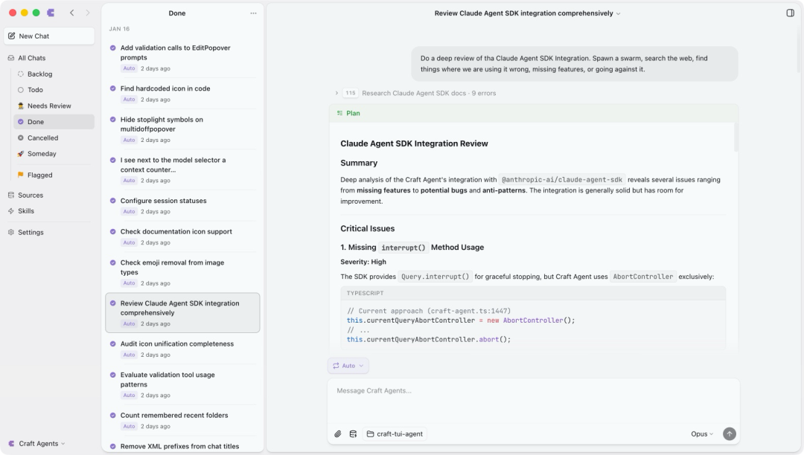
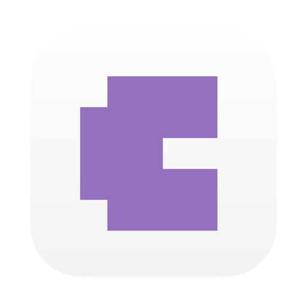

> 📎 来源: [李流念](https://mp.weixin.qq.com/s?__biz=MzY4NzA0MjY4Ng==&mid=2247483991&idx=1&sn=1e7beb1ed5dcc9b85a1369d1ffbad7ca&chksm=f240663454419b49496f398049ff9e390720b7c95b771a996fe9bae0ad8a326e64ce74cd7384&mpshare=1&scene=1&srcid=0408uS3xQ5NYmWiaiPXH8kHm&sharer_shareinfo=5c3102fee05d103c55f487e133981482&sharer_shareinfo_first=5c3102fee05d103c55f487e133981482) | 时间: 2026-04-13 16:15

---

# 告别黑终端！Claude Code 最强桌面客户端来了 开源免费，可视化操作顺手太多了

THE ZEN OF DEEP THINKING

我昨天看到这个项目时，第一反应不是“又一个 Claude Code 套壳”，而是：这东西终于不像只给重度终端用户准备的了。Craft 团队把 Claude Agent SDK 做进了一个真正能长期工作的桌面环境里，会话、权限、Sources、Skills、多模型连接，全都重新编排了一遍。它最值钱的地方不是 GUI 好看，而是它开始认真回答一个问题：**Agent 软件，能不能从会跑命令的终端，变成真正给人每天用的工作台。**

****

01

### 它最先打到我的，不是功能表，而是那张工作台截图

FOCUS ｜ LOGIC ｜ INSIGHT

很多 AI 工具我看一眼就关了。不是因为能力不够，而是你能一眼看出来，它只是在原来那套东西外面糊了一层 UI。Craft Agents 不是这个路子。README 里那张主截图很说明问题：左边是会话列表，中间是任务流，右边是上下文和操作区，整个感觉更像一个长期工作的工作台，而不是一次性提问窗口。**这点很关键，因为真正天天用 Claude Code 的人都知道，最大的问题其实不是模型不够强，而是工作流太散。**

你开两个会话还好，开到第五个的时候就开始乱了。哪个窗口在跑任务，哪个窗口刚配完 MCP，哪个窗口里还有一半没做完的调试思路，过一会儿自己都分不清。更别说你一手滑把终端关了，前面那串上下文直接断掉。所以 Craft Agents 做的第一件对的事，就是把“会话”当成一个长期对象来管理，而不是把它当成临时命令行标签页。

02

### 它修的不是审美，而是 Agent 真正落地时最烦的那几件小事

FOCUS ｜ LOGIC ｜ INSIGHT

这个项目最容易被误解的地方，是大家会先看到 GUI，然后以为它只是“Claude Code 可视化”。其实不是。它真正切的，是 Agent 工具在真实使用里最劝退人的摩擦成本。比如多会话管理。README 里直接把这个功能叫 Multi-Session Inbox，你可以把不同任务放进一个收件箱式列表里，标记 Todo、In Progress、Done，还能归档、搜索、加旗标。说白了，它在修的不是聊天框，而是任务管理层。

再比如权限模式。它保留了 Explore、Ask to Edit、Auto 三档，和我们熟悉的 Agent 工作方式一致，但它把这个切换做成了桌面端里随时可切的交互。这个体验差别很大。因为很多人不是不会用 Agent，而是不敢一下子放权。现在你可以先只读，再确认修改，再自动执行，心里会稳很多。

还有一个我觉得特别现实的点，是它把 Sources 和 Skills 这两块重新拉顺了。MCP、REST API、本地文件系统，这些东西在 README 里都被统一放进 Sources 这个概念里。你不需要脑子里同时记住三套完全不同的入口。对普通用户来说，这种抽象比多加十个高级参数有用多了。Claude Code 老用户还能直接导入自己的 skills，这个动作特别对。因为真正值钱的，从来不只是模型，而是你围着模型搭起来的那套个人工作流。

这个图标本身不复杂，但很适合放在中段当视觉停顿点。它会提醒你，这不是某个零散脚本，而是一个试图被当成产品来打磨的 Agent 工作台。

03

### 真正让我上头的，是它开始把 Agent 当成“软件环境”做

FOCUS ｜ LOGIC ｜ INSIGHT

我看完 README 后最大的感受，不是“这个桌面客户端不错”。而是 Craft 团队其实已经不满足于做一个聊天壳子了。它往前走了一步，去碰一个更像下一代软件的问题：如果 Agent 真的是新的交互层，那它应该长什么样？Craft Agents 给的答案很清楚。第一，会话要能持久化。不是问完就散，而是能长期保存、随时续上。第二，连接能力要内建。MCP、API、本地文件、外部服务，不应该拆成一堆只有老手才看得懂的配置入口。

第三，多模型是默认前提。它不是只写一家的连接方式，README 里直接摆了多种接入：Anthropic、Google AI Studio、ChatGPT Plus、GitHub Copilot、OpenRouter、Ollama、自定义端点，都能接。第四，桌面端只是皮，背后其实还在往远程工作流走。它甚至提供 headless server 和 thin client 这套东西，意思很明确：以后你本地看到的是 UI，真正跑任务的地方可以在另一台机器上。**这就已经不是给 Claude Code 做个外壳了，这是在搭 Agent 原生软件的雏形。**

04

### 为什么这事比又多一个模型榜单更重要

FOCUS ｜ LOGIC ｜ INSIGHT

因为大部分人并不是不会和 AI 协作，他们只是没法忍受那一整套又碎又吵的操作链路。终端、配置文件、多个窗口、权限确认、不同服务接法、会话丢失、工具切换，这些东西每个看起来都不算致命，但全堆在一起，足够把很多本来愿意认真用 Agent 的人劝退。所以你会发现，很多人不是不想用 Claude Code，而是他们喜欢它的能力，不喜欢它的入口。

Craft Agents 恰好就在补这个缺口。它把那个原本偏极客、偏命令行、偏工程内部流程的东西，往“更像一个可以每天挂在桌面的生产力软件”推了一大步。我最近越来越强烈地觉得，接下来真正会拉开差距的，不只是哪个模型更强，而是谁先把模型、工具、上下文、任务流和界面，真正捏成一个完整环境。Craft Agents 不一定是最后那个答案，但它至少已经把正确的问题摆到桌面上了。

当然，它也不是万能药。如果你本来就是重度 CLI 用户，而且你就喜欢纯终端那种极快、极轻、手感直接的方式，它不一定能替代你现在的工作流。另外，它毕竟还是一个快速迭代的开源项目，后面会继续长、继续变。但这恰好也是开源项目最有意思的地方：你可以直接看源码，可以自己改，可以把它变成你想要的样子。

AI 不是来替代你的，
而是来放大你的能力。

—— 流念

如果你最近也刚好在折腾 Claude Code，或者本来就想找一个不那么“终端原教旨主义”的入口，这个项目值得你自己装上去跑一遍。你用了大概率会有一种感觉：原来 Agent 软件，真不一定非得长得像个终端。

项目仓库：
https://github.com/lukilabs/craft-agents-oss

官网：
https://agents.craft.do/

点赞转发推荐留言LIUNIANEST. 2024

感谢阅读 ｜ 期待在评论区听到你的回响
