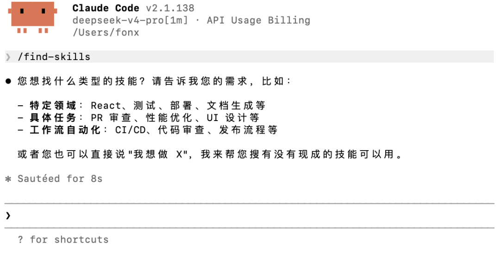
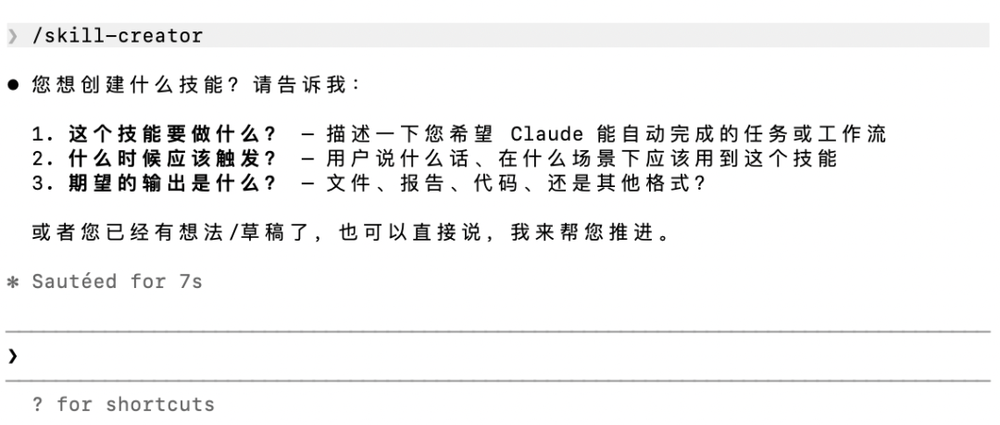

> 📎 来源: [数智青廉](https://mp.weixin.qq.com/s?__biz=MzkzNTk2ODQ5Nw==&mid=2247483942&idx=1&sn=e5b71ed7947704605b6928c88fd042eb&chksm=c3c4295675702f2558ca554488e5fff0896f5ac8ac98dded4ddee7a3665e24b99dcea7b57952&mpshare=1&scene=1&srcid=0511tCKNWZx9uBQK5NOVvoIC&sharer_shareinfo=9ac2629535a546c084e95f554b1902fd&sharer_shareinfo_first=9ac2629535a546c084e95f554b1902fd) | 时间: 2026-05-11 15:41

---

> 写在前面的话：Skill 是 Claude Code 的「专业工具箱」——装对了事半功倍，装多了反而拖后腿。我在安好 CC 后，一口气装了11个 Skill，不仅大量消耗 Tokens，而且很多时候为了按照 Skill 的指示去做，把一个个简单的代码问题全部复杂化了。下面这篇文章，是一篇“踩坑”之后的分享指南。

---

## 关注“数智青廉”公众号，后续将在“数智赋能”栏目逐期发布 AI Coding 相关教程、Skill 以及各类小工具（完全免费）。

---

## 什么是 Skill？

**Skill 我个人理解，就是给 Claude Code 装的「说明书」，本质上还是我们平常和 AI 聊天时发送的 Prompt，归根到底还是**「**提示词**」。****

打个比方：默认的 Claude Code 像一个刚毕业的勤奋的天才的大学生——什么都懂一点，你让他做什么他都能做，但做什么都要你手把手教（才不至于因为，不然很容易按照自己的想法做很多多余的事）。装上一个 Skill，就像给他配了一本说明书——他知道什么时候该出手、怎么一步步把事情做完，具体做某件事时应该调用什么工具。

比如 

```
xlsx
```

这个 Skill：你只需要把 Excel 文件拖进去说「帮我汇总这个季度销售数据」，它自己就知道要读表、算公式、出图表，不需要你再解释「你先用 openpyxl 读取 Sheet1，然后按月份分组……」。

每个 Skill 只负责一件事，触发精准、流程固定。

---

## 一条铁律：别装太多

Skill 不是越多越好。**每装一个 Skill，它的说明和指令就会占掉一部分上下文窗口。**

Claude Code 的上下文是有限的（就像短期记忆）。装 20 个 Skill，光 Skill 描述就可能吃掉几千甚至几万 token，而很多时候你现在的任务根本用不到其中的所有 Skill，白白浪费 token 不说，还会占用上下文。

> **原则：只装你真的会用的（当然这个也需要自己测试后才能得出结论）**

---

## 全局 Skill vs 项目 Skill

这是很多新手不知道的技巧：**Skill 可以只装在某个项目文件夹里，不影响其他地方。**

```
~/.claude/settings.json          ← 全局 Skill，所有项目生效某个项目/.claude/settings.json   ← 项目 Skill，只在这个项目生效
```

我自己的习惯是：跑一个项目时，把这个项目专用的 Skill 放进 

```
.claude/
```

文件夹。比如做数据分析的项目就放 

```
xlsx
```

和 

```
pdf
```

，写代码的项目就放 

```
review
```

和 

```
security-review
```

。**不同项目的 Skill 互不干扰，也不吃全局的 token 配额。**

这样全局只保留最通用的几个，清爽得很。

---

## 我的推荐清单

以下是我个人亲身体验过后，决定推荐给大家的几个 SKill，按「装了有用」的程度排列，聚焦我们技术小白日常场景。

### 🥇 第一个必装

**```
find-skills
```

— 找 Skill 的 Skill**



没有它，你连有什么 Skill 可以装都不知道。装了它之后，**你甚至不需要自己去找——直接让 Claude Code 帮你看**。

比如在对话里说：「帮我找找有没有能处理 Word 文档的 Skill」「有没有做代码审查的」，Claude Code 自己就会调 

```
find-skills
```

去搜、去装。**你只负责提需求，它负责找工具。**

这是你该装的第一个 Skill，也是永远不会卸的那个。

### 🥈 办公三件套

**```
pdf
```**— 合并拆分 PDF、提取文字表格、OCR 扫描件。学生党的论文、打工人的合同，天天打交道。

**```
xlsx
```**— Excel 一条龙：数据清洗、透视表、公式计算、画图。汇报、记账、数据整理，逃不掉的。

**```
pptx
```**— 读 PPT、写 PPT、改 PPT。季度汇报、毕业答辩、分享演讲，省你半天排版时间。

**```
pdf-converter
```**— PDF 转 Word / Markdown / 可编辑格式。跟 

```
pdf
```

互补——一个管操作，一个管转换。

（为什么没提到 Word，大家可以往下看）

### 🥉 写代码必备

**```
init
```**— 进一个新项目，第一条命令跑这个。它会自动分析项目结构，生成 CLAUDE.md，让 Claude **记住你这个项目是干嘛的、文件怎么组织的**。没这一步，Claude 每次打开都像失忆。

**```
review
```**— 代码写完了，让它帮你 review 一遍。省去复制粘贴 diff 的麻烦，直接在终端里给出审查意见。

**```
security-review
```**— 检查代码有没有安全漏洞。提交前跑一下，放心。

**```
simplify
```**— 帮你检查代码里的冗余和坏味道。写完功能顺手优化。

### 🏅 进阶一点

**```
loop
```**— 定时重复执行。比如「每 5 分钟检查一次部署状态」「每小时看看有没有新 issue」。

**```
schedule
```**— 比 loop 更彻底——设置 cron 定时任务，到点自动跑，关了电脑也能执行（云端运行）。

---

## 装了 Skill 不等于万事大吉

Skill 之间有「好用的」和「不好用的」之分，需要自己摸索。

举个真实例子：我之前装了 Word 文档生成的 Skill，但每次用都特别慢——因为它底层是一行一行用代码拼装 docx 文件，生成一个排版稍微复杂点的文档要跑好几分钟，还容易出错。

后来我摸索出一套更好的方案：**先让 Claude Code 写好 Markdown，再用 

```
pandoc
```

一行命令转成 Word。**排版又快又稳，复杂格式也不容易变形。

```
# 我的 Word 生成方案pandoc output.md -o output.docx
```

> **经验：装了一个 Skill 不好用，不代表这件事做不了。换个思路、换种工具组合，可能又快又好。**有些 Skill 的实现方式决定了它的效率和稳定性，实际用了才知道适不适合你。

---

## 重点：你自己也能造 Skill

**```
skill-creator
```**这个 Skill 就是帮你创建自定义 Skill 的。



什么意思呢？假设你经常做一件事：把某个文件夹里的 CSV 文件合并、去重、排序，然后生成一个汇总表。每次都要一步步告诉 Claude 怎么做，很烦。

用 

```
skill-creator
```

，你可以把这一整套流程封装成你自己的 Skill——起个名字、写段描述、定义触发条件和执行步骤。**下次直接把文件夹拖进去，它自动按你的套路来。**

每个人的工作流都不一样，官方的 Skill 覆盖不了所有场景。**能自己造 Skill，Claude Code 才真正变成你的专属工具。**

---

## 推荐顺序总结

```
先装：find-skills → init再加：pdf, xlsx, pptx（看你日常工作需不需要）开发党补：review, security-review, simplify有需要再补：skill-creator（想造自己的 Skill 时）偶尔用到：loop, schedule, pdf-converter
```

---

## 最后的建议

1. **让 Claude Code 帮你找，别自己搜。**不知道有没有某个 Skill？直接问 CC，它会用 

   ```
   find-skills
   ```

   帮你搜出来并装上。
2. **按需安装，用完就卸。**别因为「看起来不错」就装一堆。
3. **技能放进对应项目。**做不同项目时，让 Claude Code 只看到该看的 Skill。
4. **每个 Skill 都要亲测。**装完跑一遍，确认它在你场景下足够快、足够稳，不好用就换方案。
5. **自己造 Skill。**重复三次以上的操作，就值得封装成一个 Skill。
6. **保持全局 Skill 不超过 5-8 个。**留给实际工作的 token 越多越好。

---

*装好 

```
find-skills
```

，然后直接对 Claude Code 说：「帮我找找有没有 XXX 的 Skill。」让它自己帮你搞定。*

---

*如果你的电脑上还没有安装 Claude Code，可以先阅读“数智赋能”栏目前期发布的安装指南：*

*Mac 端安装指南：*

## [数智赋能丨“零基础”不要紧，这个教程“零操作”！帮你在 Mac 上部署 Claude Code，接入 DeepSeek-V4-Pro](https://mp.weixin.qq.com/s?__biz=MzkzNTk2ODQ5Nw==&mid=2247483904&idx=1&sn=7bd7310dbdabece98cecb08233176b21&scene=21#wechat_redirect)

## Windows 端安装指南：

[数智赋能丨低成本体验 AI Coding，手把手教你在 Windows 电脑上部署 Claude Code，接入 DeepSeek-V4-Pro](https://mp.weixin.qq.com/s?__biz=MzkzNTk2ODQ5Nw==&mid=2247483938&idx=1&sn=a2fba35e35b1a071e4e43365995499a2&scene=21#wechat_redirect)

## 这两篇推文完整介绍了如何在你的电脑上部署 Claude Code 接入 DeepSeek-V4-Pro。

## 如果你想理解一下 AI Coding 的一些基本概念，可以阅读下面这篇文章：

## [数智赋能丨文科生 AI Coding 入门：一文理清 LLM、Token、百万上下文、API、Agent、RAG 等概念](https://mp.weixin.qq.com/s?__biz=MzkzNTk2ODQ5Nw==&mid=2247483884&idx=1&sn=5f387c7a7afd56edcd02540cc7d90d92&scene=21#wechat_redirect)

> “数智赋能”栏目下期预告：发布本人自己制作的一个 Skill 及配套脚本，帮助大家实现 CC 对话记录可视化存储与项目复盘，提高复杂任务工作效率。

> 如有疑问，欢迎关注“数智青廉”公众号，后台私信反馈。

> 后续将会更新更多专属于文科生的科研工具，敬请关注。

> 欢迎分享给更多师友，一起进步。

> “数智青廉”为在校学生运营的个人账号，所发布的所有文章仅代表作者个人观点，不代表作者所在学校及任何单位的立场，本人对所有内容负责。

> 文章不设置打赏功能，如您觉得我的文章内容对您的学习工作有帮助，可以点击下方免费的👍和❤️支持一下。

> 如您确实想要赞助一二，可以点击下方“一起捐”按钮，为我家乡的公益项目捐款，祝您生活愉快！
