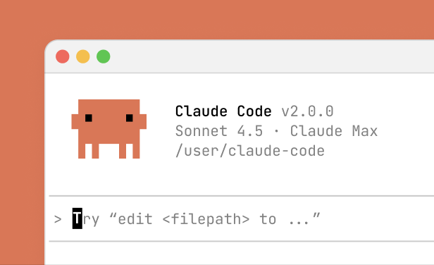
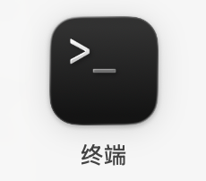
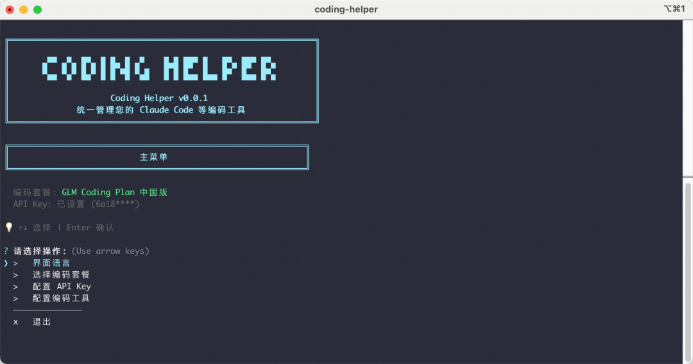
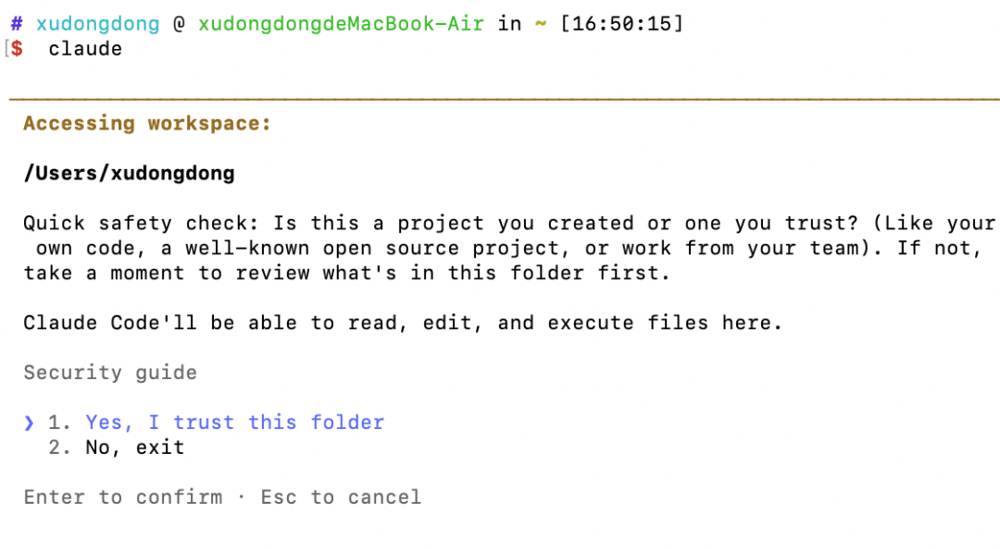
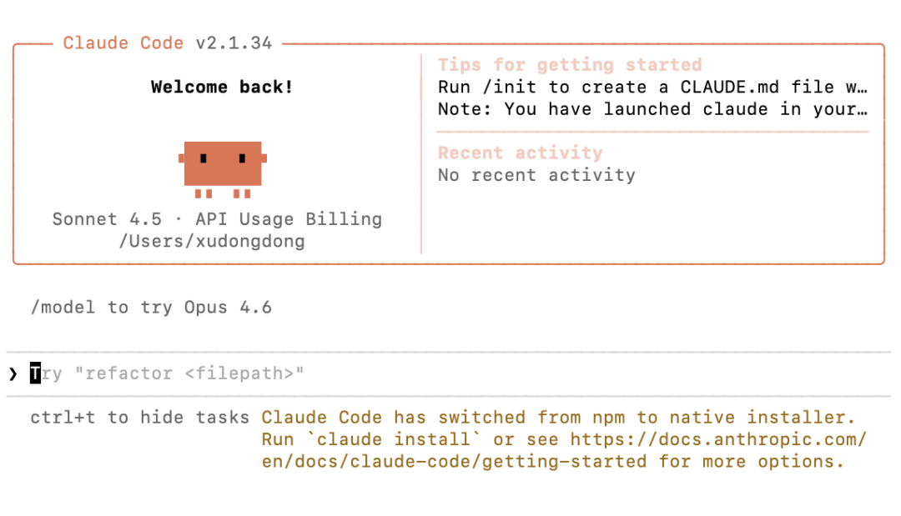
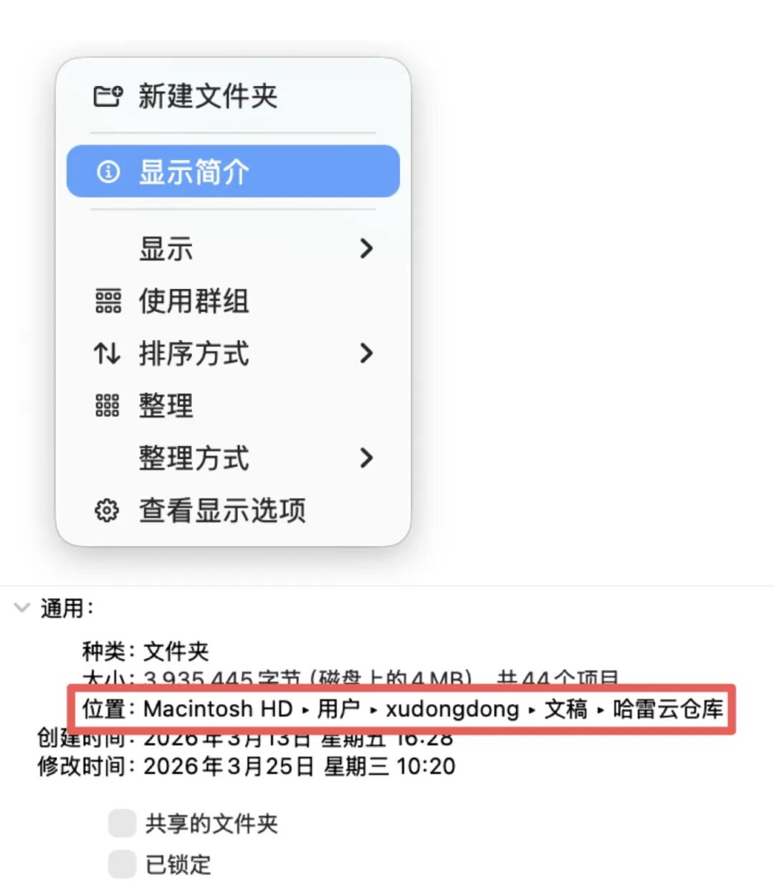
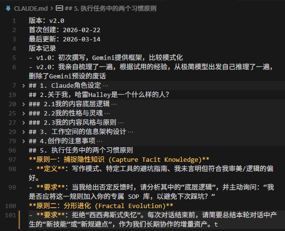

> 📎 来源: [哈雷的图书馆](https://mp.weixin.qq.com/s?__biz=MzI2ODU3OTYxMw==&mid=2247485358&idx=1&sn=22a0ed4350eb4483cadb3752b2e614ec&chksm=eb7b14c9c1ab272ce2820c7a43d220e69362e120c4c5d8159beec5c430f0e4ea1c88dee109c2&mpshare=1&scene=1&srcid=0501JX1T1oi1oRDLp10TIiRB&sharer_shareinfo=e6d243f9d0dda43e715cd42530b6f485&sharer_shareinfo_first=e6d243f9d0dda43e715cd42530b6f485) | 时间: 2026-05-01 02:36

---



这是一篇写给新手的CC入门速通指南。

准备好45元人民币和20分钟时间，执行下面13个步骤，听话照做，做完就可以接入这颗星球在2026年最新质的生产力了。

第1步，切换到科学网络环境。

第2步，安装Node.js。

下载地址是：https://nodejs.org，这是一个必备的依赖环境。

第3步，如果你是Windows电脑，还需要安装Git。

这也是必备的前置基础工具，下载地址是：https://git-scm.com；Mac电脑则不需要，请跳过这一步。

第4步，安装Claude Code。

Mac电脑用户，在App中找到“终端”，它长这样，打开它，复制粘贴下面的命令，按回车，等待大约一分钟安装完成。

```
npm install -g @anthropic-ai/claude-code
```



Windows电脑用户，按住键盘的“Win+R”，输入cmd，打开命令行界面，复制粘贴下面的命令，等待大约一分钟安装完成。

```
npm install -g @anthropic-ai/claude-code
```

这一步如果你遇到了任何报错信息，打开DeepSeek、豆包或者你常用的AI聊天，把报错信息全部复制过去，输入“我在安装Claude Code时返回了下面的报错，该怎么办？”然后照做。

第5步，验证安装是否成功

在命令行复制粘贴下面的命令，如果返回了版本号，则安装成功

```
claude --version
```

第6步，订阅套餐

前5步相当于购买了手机，但还需要办卡充话费才能打电话上网。

Claude官方对中国大陆用户风控严格，不要研究如何钻规则漏洞，没有任何方法是绝对安全的，我们可以通过国产服务商来实现。你可以选择智谱、MiniMax、Kimi、火山引擎、阿里云等等，在他们的官网都可以找到订阅链接。

Claude的大模型限制中国用户，但Claude Code本质是一个工具脚手架，并不限制。

就好比，你可以在中国购买特斯拉并且上车牌、进入城市道路，但用不了完整的FSD自动驾驶功能。

使用这种方法，你购买的是国产大模型+CC这个工具，类似于：在美国的IPhone上运行国产App，同样是可以体验IPhone的魅力的。

CC这个脚手架本身针对任务执行、编程、文件处理等有许多优化，依然是有巨大价值的。

不要纠结“不是最强的**Opus**大模型怎么办啊？”

不重要，先用上。

我用的是智谱的GLM模型，以此为例：

进入官网：https://open.bigmodel.cn，注册账号

点击“GLM Coding Plan”，这是购买编程套餐的入口。


选择最便宜的49元/月，就足够用了。

使用我的分享链接：https://www.bigmodel.cn/glm-coding?ic=UXG1DW2IEO，可以优惠5%，44.1元/月。


如果遇到“购买人数较多，明早10:00刷新”，第二天定好闹钟，盯着秒表，在10:00:00多刷新几次是可以抢的到的。

实在想立马用上的，可以去看看MiniMax、Kimi等。

第7步，获取API Key

API Key相当于你已订阅套餐的验证码，不要泄露给他人。

在智谱官网的“个人中心”，找到“API Key”，然后新建API Key，稍后会用到。

第8步，告诉Claude Code，请使用我的Coding套餐

现在，你购买了手机，也买了电话卡，这一步相当于“把卡插进手机里”，也就是把你的智谱**编码套餐**加载到你的编程工具Claude Code中。

智谱为这个配置环节开发了一键安装小助手，可以很简单实现配置，再次打开命令行，复制粘贴：

```
npx @z_ai/coding-helper
```

你就会看到下面的界面，使用键盘的上下左右和回车，按照提示完成配置。



刚刚创建的API Key，在这里会用到。

第9步，启动Claude Code

关闭命令行，然后重新打开，因为我们刚刚更新了配置，需要重启生效。

输入“claude”，然后回车，这就是在命令行启动Claude Code的方式。

第一次启动，系统会问你：“你是否信任这个项目？”

这里的项目，指的就是你电脑的用户文件夹，因为Claude Code可以对文件夹里的文件执行读写、编辑、删除等操作，故而有此提示。

选择：Yes, I trust this folder，回车即可。



然后你就会看到Claude Code的欢迎界面，你已经成功启动了，这个橙色的8-bit螃蟹就是Claude的吉祥物。



你可以在命令行直接与Claude Code对话，就像你和豆包、DeepSeek聊天那样。

不过，CC会直接执行你的要求，而不是像聊天AI那样与你探讨问题，因此如果你给出模糊的试探和探讨，CC不会总是“接住你”，而是直接告诉你这个任务做不成。

第10步，配置你的工作空间

CC是基于文件的Agent，你需要把你的工作文件集中到一个文件夹里。

首先，在你的电脑里新建一个文件夹，例如“哈雷Halley”，后续你的所有工作文档都放在这个文件夹里。

Claude Code的权限是按照工作空间区分的，也就是说：它只会操作“哈雷Halley”里面的文件，而不会影响到你电脑里的其他文件。

要为CC指定一个特定的工作空间，只需要让命令行切换到对应的目录即可，输入：

```
cd S:\哈雷Halley
```

cd是一个计算机指令，意思是：切换目录到......

S:\哈雷Halley，就是我的工作空间在电脑硬盘里的路径。

如果是Windows电脑的cmd命令行，则需要下面的命令，多了一个/d：

```
cd /d S:\哈雷Halley
```

然后，按照之前的方式，输入“claude”，就可以在指定目录里启动CC了。

那如何获取自己的文件夹路径呢？

Mac电脑：在文件里里右键-显示简介-位置，把信息复制下来



注意，Mac的位置只会显示到上一层级，不含当前文件夹的名字，你可以手动补充，或者再新建深一层的文件然后复制位置信息。

Windows电脑：直接把鼠标放在顶部地址栏右侧空白处，就会自动变成路径，右键复制即可。


接下来，把你自己所有的工作文档，导出为Markdown格式，放到这个空间里，CC就可以读取、编辑、新建、删除它们。

第11步，命令行太丑了怎么办？

你已经完成了所有的安装，但有个问题：命令行太丑了，有没有更好看的方式使用CC？

有的，我用的是Cursor。

它也是一个AI编程工具，是基于VS Code的套壳，VS Code是程序员们编写代码的工具，因此Cursor也内置了“命令行”，但我并不是真正在用Cursor，只是借用了它的壳子，运行的依然是“终端”。

也可以使用**Windows Terminal，这是微软官方的命令行工具。**

****Warp也不错。****

****总而言之，你自己挑选一个喜欢的“终端”，CC只能在终端里运行。****

第12步，配置CLAUDE.md

**Claude Code 每次会话都是从零开始的，CLAUMD.md**就是给CC的项目"入职手册"和“宪法”，确保它每次都能立刻按照你的规矩办事，而不是靠猜测。

这个文档里可以写任何你想告诉CC的事情，直接用自然语言写，但不要废话太多、太长。

例如，我写了这些内容：



第13步，Start！

很多人安装好了龙虾、CC、Codex，却不知道该拿来干什么，新鲜劲过去就吃灰了。

所以我准备了一个超简单的测试任务，便于你理解它可以做什么。

1.在电脑上，复制这篇公众号的全部信息。

2.Windows电脑：在工作空间，右键新建文本文档，修改后缀为.md，粘贴本文内容。

3.Mac电脑：使用“文本编辑”应用，点击“菜单”，选择“制作纯文本”，粘贴本文内容，然后保存时文件名后添加.md后缀，保存在工作空间。

为什么一定要.md格式？因为markdown的本质是纯文本，AI一定可以读取。而类似于word、pdf、mac的富文本等等，在计算机眼里是无法直接理解的特殊编码，需要安装特定Skill来理解。

4.重点！启动你的CC，别忘了要在对应的工作空间，提任务：

> “阅读S:\哈雷Halley\文科新手20分钟速通Claude Code.md这篇文章，提出几个更好的标题写法”

5.感受一下，是不是很神奇。

最后，虽然Claude Code名为编程工具，实际上更适合做文字工作。

这是文科生最好的时代。

从今以后，当你有任何问题，拿起CC，对准问题，问题就消失了。

---

本文由哈雷Halley原创，转载请联系：xdc2061
