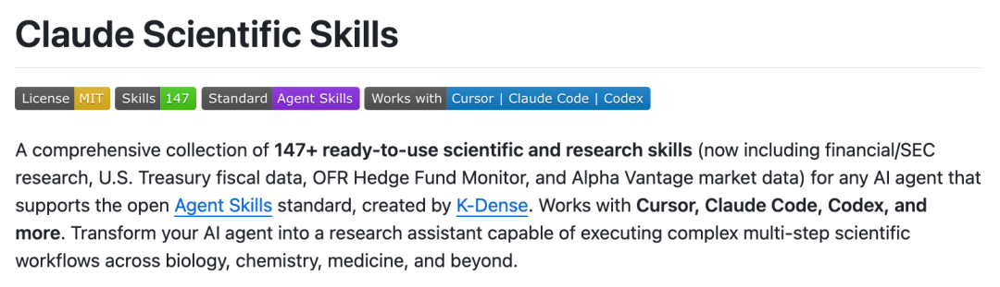
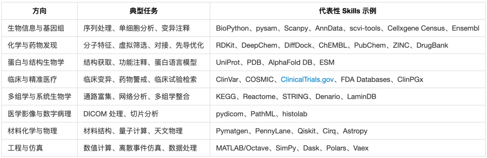
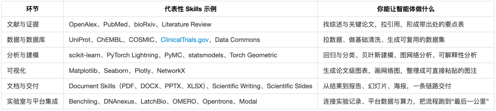
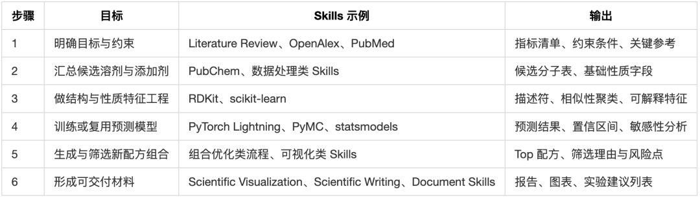
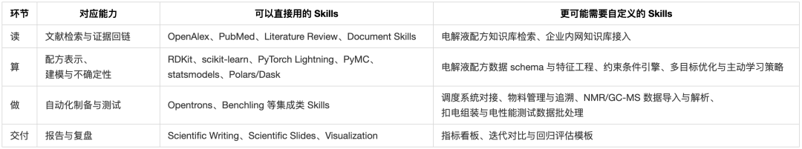
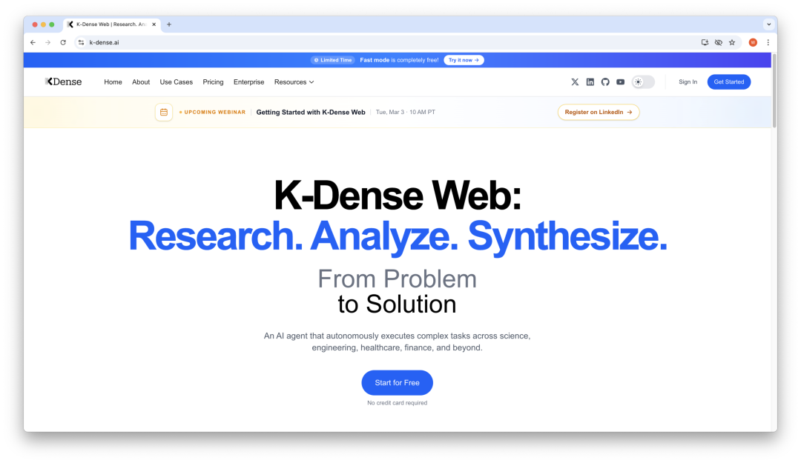
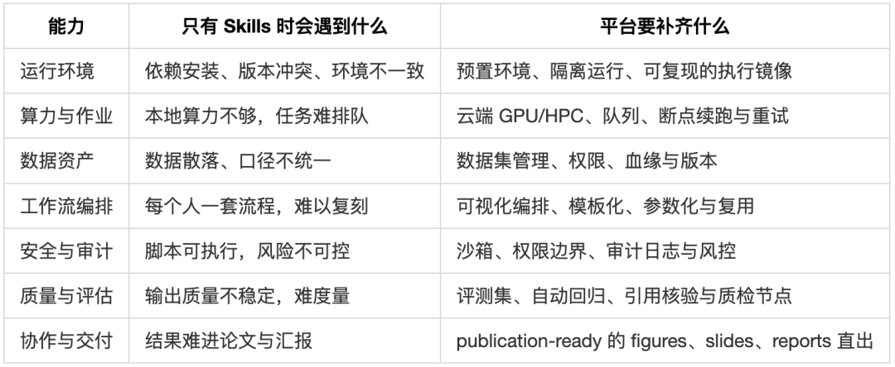
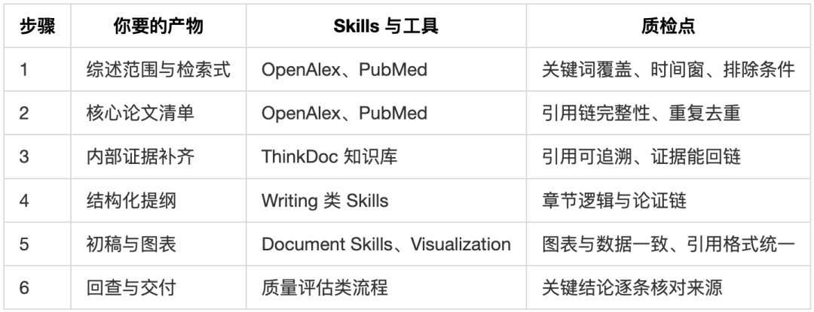

> 📎 来源: [大卫数智话](https://mp.weixin.qq.com/s?__biz=MzkyNzMyNTkwMg==&mid=2247485825&idx=1&sn=72dc8ae6af6a872213e7ac3b9774ea3b&chksm=c3d6ae7fb0eca359063c87407b6e23dfab82489340d4c02673f65931c18004372683aca5ed58&mpshare=1&scene=1&srcid=0423WXBSdpBjSa42Jb2bsqas&sharer_shareinfo=5c7f69e51713bcfb89c4f397eff60280&sharer_shareinfo_first=5c7f69e51713bcfb89c4f397eff60280) | 时间: 2026-04-23 22:00

---


去年有研究员把文献综述的写作要求发给我。

足足好几页，把主旨、逻辑结构、要点分析、可读性都写得很细。

我一直在思考，如何更好地实现 AI 写作文献综述，且质量超越市面上的通用工具。

当时可用的主流技术是工作流。但是，针对不同的场景，就得设计不同的工作流，扩展性和灵活性不高。

Skills 出现之后，我认为拐点来了。

过年期间，我看到一个开源项目时，这种感觉更强了。

项目地址：https://github.com/K-Dense-AI/claude-scientific-skills

K-Dense 把 147+ 个科学与研究 Skills 整理成一套可直接安装的技能库，名字叫 Claude Scientific Skills。



它吸引我的关键点在于 Skills 这种形式。

科研流程终于有机会像代码一样被沉淀、复用、迁移，还能做版本管理。

对于非计算机背景的科学家和研究员，这种方式也更友好。

我们可以创造更好的科研智能体了。

PART 01｜我们去年解决的，是先把“数据与流程”跑通

去年，我们研发垂直领域深度研究系统[氢能 AI 助手](https://mp.weixin.qq.com/s?__biz=MzkyNzMyNTkwMg==&mid=2247485284&idx=1&sn=76a8ad46502409f495fef721e20b04ca&scene=21#wechat_redirect)时，我们走的是一条很工程的路。

ThinkDoc 认知数据引擎负责把多源异构数据吃进去。论文、报告、图表、网页、PDF，先解析，再处理，再做融合检索。这样做的好处很朴素，答案能回到证据上，引用可追溯，事实能核实。

Dify 负责把任务跑起来。检索智能体先找材料，分析智能体提炼结构，写作智能体生成章节，最后再加一个质量评估智能体做回查。你把一个题目丢进去，它能自动化生成一份长报告。

我们还用到 MCP，把外部工具和数据源接进来。比如做经济性分析时，需要在某些节点调用计算脚本、拉取参数、做敏感性分析，MCP 这类连接能力就很实用。

很多朋友会问，Dify 已经是低代码平台了，为什么还说门槛高。

原因很现实。

对非计算机专业人员来说，能把节点拖出来是一回事，能把数据在节点间流动、在关键节点写一段处理代码、把异常情况兜住，又是另一回事。

我以前总结过，深度研究系统的效果来自三件事的组合。

数据、工具、智脑。

数据决定上限，工具决定可执行性，智脑决定组织与推理能力。

但当你真在实验室里用它，第四件事会越来越扎眼。

你靠什么把“专家经验”稳定地交给智能体。

PART 02｜今年的新变量，是 Agent Skills 开放标准

Skills 的概念，看起来很简单。

它就是一个文件夹，里面放指令、脚本和资源。智能体按需加载它，用来完成某类任务的固定流程。更重要的是，它提供的是流程型知识，也就是 procedural knowledge。怎么做，做对的标准是什么，常见坑在哪里。

Claude 的帮助文档把它说得很直白。

Skills 用来提高特定任务的一致性与性能，并且通过按需加载的方式降低上下文压力。

Agent Skills 的规范也被发布成开放标准，放在 agentskills.io 上。

这里面有两个信号，我觉得值得重视。

第一，Skill 可以跨工具复用。今天你在 Claude Code 里用，明天也可以搬到 Trae、Cursor、Codex 这类支持 Skills 的工具里用。

第二，Skills 和 MCP 是互补关系。MCP 解决连接问题，把数据库、代码、平台接进来。Skills 解决过程问题，教智能体怎么把这些工具用对、用稳、用出可交付。

如果把 Deep Research 看成一条流水线。

MCP 更像插座和管道。

Skills 更像作业指导书和质检标准。

PART 03｜开源的 147+ 个 Skills 到底都有哪些

先别被数字吓到，把它拆成两张表就清楚了。

一张表按研究方向拆解，另一张表按研究环节拆解。你会发现，这套技能库的意图其实很明确。

第一，让智能体能把数据拿到手  

第二，让智能体能把分析跑起来  

第三，让智能体能把结果写成可交付

表 1  按研究方向盘点 Skills



表 2  按研究环节盘点 Skills



PART 04｜怎么使用这 147+ 个 Skills

看这类仓库，我有个习惯。

我不先看它有多少技能，我先问它能不能跑完一条链。

例如，在电解液配方发现与催化剂筛选里怎么把 Skills 串起来。

电解液研发是一个很典型的场景。配方组合空间可以大到 10¹³-10²⁰ 量级，组分之间还有强非线性协同。传统模式下，一轮配方开发往往要半年起步，成本也很高。

我看到过一套更工程化的做法。把研发拆成读、算、做三段，用自动化工站和调度系统把实验通量做上去，再用模型把下一轮候选配方推出来，按周迭代。

在那套系统里，团队在 3 个月里锁定了 5 组有效配方，整体效率比传统方式提升一个量级。

那套系统还有两个细节我很认可。

一个是把证据做厚，知识库整合了 1.7 亿篇学术文献，其中包含 40 万篇电解液相关成果和 1.5 万余条配方数据。

另一个是把执行做稳，用自动化工作站、调度操作系统和智能大脑三层架构，把配液、表征、扣电组装、电性能测试这些环节连起来。

如果你想用 Claude Scientific Skills 去复刻这件事，我的判断是可以，但要分层。

- 「读」和「算」，大部分可以直接用现成 Skills 拼起来
- 「做」这一步，往往需要你们自己的实验室系统、仪器和调度平台，所以更可能要补一批自定义 Skills

以电解液配方发现为例，你可以把一条研究链拆成下面这张流程表。每一步都有输入、输出，也能插入质检点。

表 3  一条电解液配方发现研究链如何串 Skills



表 3A  把读算做拆成 Skills，哪里够用，哪里要自定义



如果你们暂时没有自动化实验室，我建议先把读和算做扎实。把候选清单、约束条件、试验方案输出给人来做，先把数据口径和评估标准统一。等数据量起来了，再把做这一段补成自定义 Skills，把每一次实验变成可追溯的训练样本。

同样的串联方式，也可以迁移到催化剂相关的研究里。

比如做催化剂筛选，你往往需要两条线同时推进。一条线是结构与性质数据，偏材料与计算。另一条线是文献证据，偏机制与实验可复现。Skills 的好处是，你可以把这两条线拆成明确步骤，让智能体按步骤跑，并在每一步留下中间产物，方便人来复核。

如果你想更直观，可以用这种“一句话驱动多步流程”的提示词风格去写需求。

```
目标是做电解液配方初筛
```

你会发现，这里最关键的不是“写了一个很聪明的 prompt”。关键是流程被写成了一个可以复刻的结构，并且每一步都有对应的工具与技能去支撑。

PART 05｜商业化平台的增强点，是自建平台需要补齐的地方

开源的 147 个 Skills 更像一套很好用的工具箱。你把工具箱搬回实验室，就能开始干活。

但当你想把它变成团队级平台，让更多研究者稳定使用，你会发现缺口常常出现在平台层的增强能力上。

K-Dense 不仅开源了 147+ Scientific Skills，还推出了商业化平台 K-Dense Web，内置了超过 200 个 Skills，提供云端服务，以及生产级的输出质量。



K-Dense Web 的价值点，我理解为把这些平台能力补齐，变成更接近交付的形态。对我们这种想基于开源技能库自建平台的人来说，它也像一份补课清单。

表 4  从技能库到平台，通常要补齐哪些能力



PART 06｜落地，从文献综述这条小流程开始，把要求写成 Skills

我建议做这类事情，先小后大。

你不需要一上来就想做一个“AI 科学家”。先把一个最常见的研究流程写成 Skills，让它能稳定跑完，再谈扩展。

我用文献综述举个更具体的落地方式。

公开文献数据可以用 OpenAlex、PubMed 这类 Skills 来拉。团队内部材料可以放进 ThinkDoc 知识库，再用检索能力把证据抓出来。最后用写作与文档类 Skills 输出可交付的综述。

表 5  文献综述工作流如何落地成 Skill



回到文章开头那份长长的文献综述写作要求。那其实就是一份很好的 Skills 草稿。

它已经把输入、输出、结构、格式、评判标准写清楚了。你要做的，是把它从聊天记录和 Word 文档里搬出来，变成团队共享的技能资产，让智能体按这个标准去执行。

PART 06｜写在最后

回到之前那个问题，针对不同的场景，能不能复刻一套工作流？

现在我更确定了。真正可复刻的，是一套被写清楚、能被执行、能被质检的 Skills 资产。

从 Deep Search 到 Deep Research，再到 AI Scientist，这条路的终点很诱人。但越往前走，你越会发现，决定系统是否可靠的往往是一些看起来很朴素的东西。

把流程写清楚。

把证据连起来。

把技能沉淀下来。

对于科研智能体，不要用更大的模型掩盖流程缺失，真正的专业，往往体现在那些可复用的细节里。
