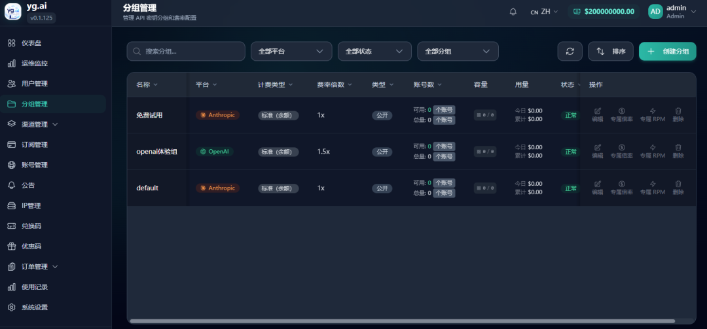
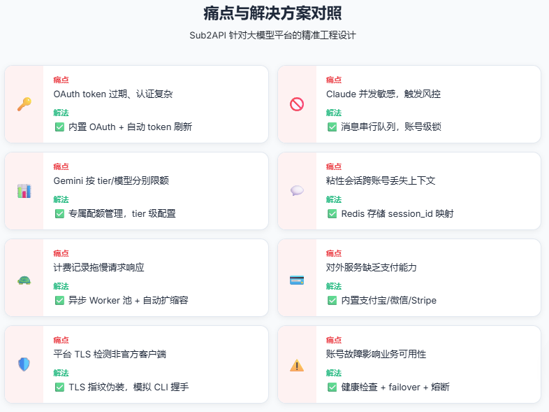
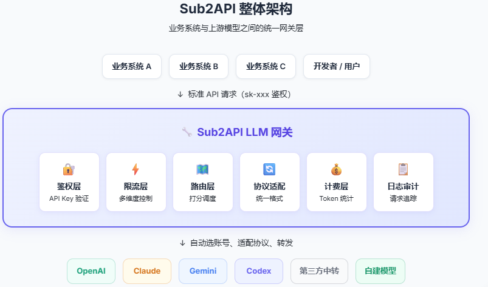
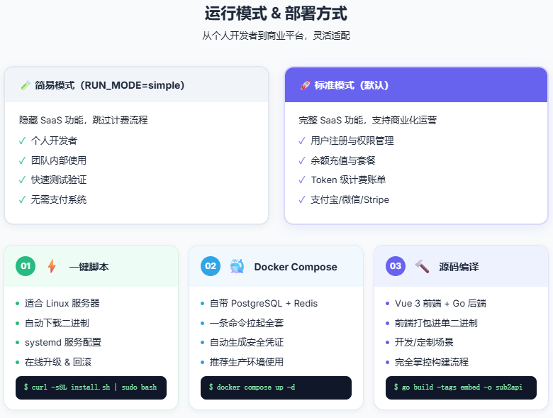
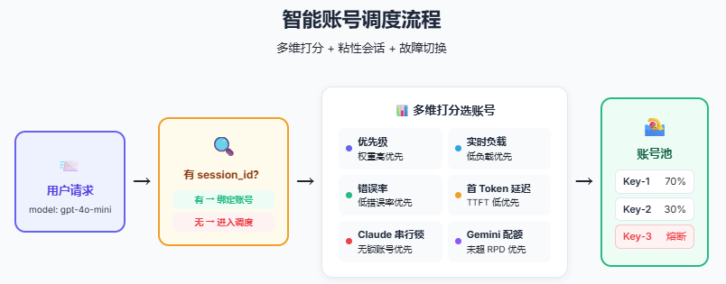
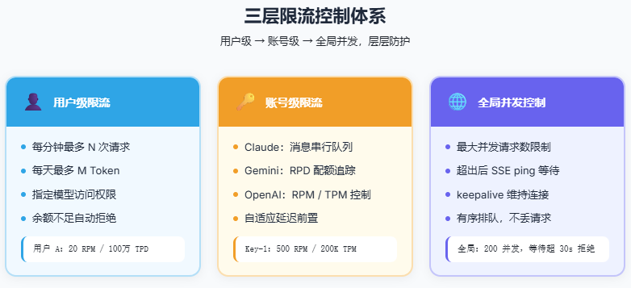
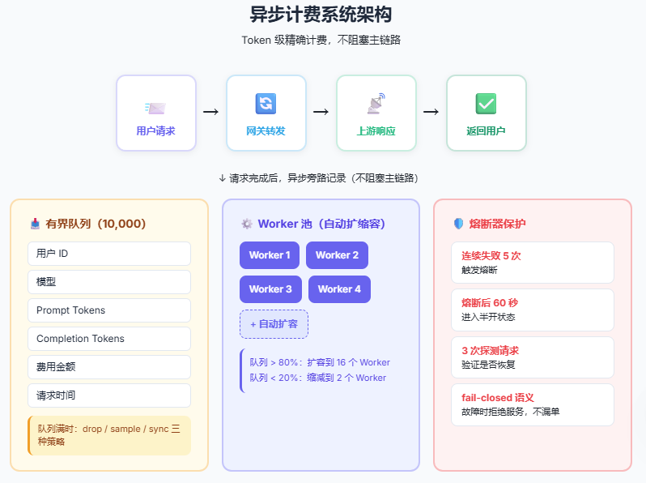

> 📎 来源: [z.ai.dev](https://mp.weixin.qq.com/s?__biz=Mzg2MDE0Mjk1MQ==&mid=2247484573&idx=1&sn=9c156b45197c036bbbea1d6bbb2547da&chksm=cfcc61e0b0862a91719efcc4e1d58c812c32205862b2c36f8e808acf5bbe6623569107c85706&mpshare=1&scene=1&srcid=0513sFOX2eDtdbrmtRX1NJbV&sharer_shareinfo=72e6df6fbbb836e77d54aa2002c81241&sharer_shareinfo_first=72e6df6fbbb836e77d54aa2002c81241) | 时间: 2026-05-13 01:58

---



前几天我发了一个[自己搭了个API中转站，就差号池了](https://mp.weixin.qq.com/s?__biz=Mzg2MDE0Mjk1MQ==&mid=2247484505&idx=1&sn=e386e9f424490fe534bc56d1162bd149&scene=21#wechat_redirect)，有小伙伴私信我用什么搭的，怎么搭的，今天我们就聊聊这个。

Claude Code、Codex、Gemini CLI这些工具越来越好用，但订阅账号有配额，多人共用有冲突，成本难以统计，账号一旦触发限流就直接影响生产。

下面就引入我们的主角：Sub2API。

Sub2API是一个开源的AI API网关平台，专门解决这些问题。它把多个上游订阅账号统一管理，对外提供标准API接口，内置鉴权、计费、限流、调度、支付全套能力。本文结合它的源码和设计，聊聊它到底解决了什么、怎么解决的。

真实存在的痛点

01

订阅账号不是 API Key，管理复杂得多

很多人以为"多账号"就是多几个API Key轮着用，实际上现代AI平台的账号体系远不止于此：

- **Claude：需要OAuth授权，有session概念，并发请求不能随意混用同一个session，Anthropic对此有严格检测。**
- **Gemini：有OAuth账号，也有API Key账号，不同tier（免费/付费）有完全不同的 RPD 限额。**
- **OpenAI Codex：走/v1/responses接口，有WebSocket通道，粘性会话要靠session\_id这类请求头传递。**

如果自己写代码管这些，每一种都需要单独处理认证逻辑、token刷新逻辑、会话管理逻辑——维护成本极高。

02

限流不只是"每分钟多少次"

大模型的限流规则比普通 API 复杂得多：

- OpenAI 有**RPM**（每分钟请求数）、**TPM**（每分钟Token数）、**RPD**（每天请求数）。
- Gemini 分Pro模型和Flash模型，分别有独立的**RPD额度**，不同账号tier额度不同。
- Claude OAuth账号对并发有限制，同一账号不能同时处理太多请求。
- Codex走WebSocket，连接数本身就是一种资源约束。

这意味着限流逻辑需要多维度组合控制，不是简单的计数器能搞定的。

03

多人共用时，谁用了多少根本不知道

团队内部 5 个人共用一个Claude Pro账号，月底一看额度用完了，谁用的？用在哪个项目上？哪个模型消耗最高？

如果没有网关层做Token级的使用量记录，这些问题根本无法回答。

04

平台服务时，计费和支付需要自己搭一套

如果你想基于订阅账号对外提供API服务，还需要：

- 用户注册登录
- 余额充值（支付宝、微信、Stripe）
- 按用量扣费
- 账单查询

这些东西单独做，工作量不小。

05

上游不稳定，业务跟着抖动

OAuth token过期了没刷新，某个账号触发了风控，Gemini的某个tier 超出RPD了——这些情况如果业务代码不做处理，用户就直接看到报错。

针对以上痛点，Sub2API都有对应的解决方案：



下面我们就看下它是如何设计实现来解决这些痛点的吧。

什么是Sub2API

Sub2API的官方描述是：

> *AI API gateway platform for subscription quota distribution.*

也就是：把AI产品的订阅配额，通过网关分发出去。

它的架构位置是这样的：

```
用户 / 业务系统
```

```
用户只需要一个平台生成的
```

技术栈为：

- **后端：Go 1.25.7 + Gin + Ent ORM**
- **前端：Vue 3.4 + Vite 5 + TailwindCSS**
- **数据库：PostgreSQL 15+**
- **缓存/队列：Redis 7+**



## 先把运行模式及部署方式写在前面，后面是干货讲解。 运行模式：SaaS 模式 vs 简易模式 Sub2API支持两种运行模式，适应不同场景： **标准模式（默认）**：完整的SaaS功能，包括用户注册、余额管理、支付、计费、权限控制，适合对外提供服务的平台。 **简易模式**（`RUN_MODE=simple`）：隐藏SaaS相关功能，跳过计费流程，适合个人开发者或内部团队快速使用。 ``` export RUN_MODE=simple ``` 这个设计让Sub2API既能作为个人的多账号代理工具，也能作为商业化 API 平台的核心引擎。

部署方式

Sub2API提供三种部署方式，难度依次递增：



### 方式一：一键脚本（最快）

适合 Linux 服务器，自动下载预编译二进制、配置systemd服务：

```
curl -sSL https://raw.githubusercontent.com/Wei-Shaw/sub2api/main/deploy/install.sh | sudo bash
```

```
安装完成后访问
```

升级也很简单，在管理后台左上角点「检测更新」即可在线升级，支持回滚。

### 方式二：Docker Compose（推荐生产）

自带PostgreSQL和Redis，我自己用的就是这种方式，一条命令拉起全套服务：

```
mkdir -p sub2api-deploy && cd sub2api-deploy
```

```
脚本会自动生成
```

推荐使用 `docker-compose.local.yml`（数据存本地目录），迁移服务器时直接`tar`打包整个目录即可，无需处理Docker volume。

### 方式三：源码编译（开发/定制）

前端（Vue 3）和后端（Go）分别编译，后端使用 `-tags embed` 将前端打包进单二进制文件：

```
# 编译前端
```

```
数据库 schema 变更后需要重新生成 Ent + Wire 代码：
```

**一个值得注意的细节：Nginx 配置**

如果你用Nginx反向代理Sub2API，必须在 `http` 块里加这一行：

```
underscores_in_headerson;
```

```
原因是：Nginx默认会丢弃名称中含下划线的请求头，而Codex CLI的粘性会话依赖
```

这是一个很容易踩的坑，但也体现了Sub2API对实际部署细节的关注。

---

##

Sub2API的核心功能

**多账号管理：不只是 Key 池**

Sub2API 支持两类上游账号：

- **API Key 账号：提供Base URL + Key即可，适合OpenAI兼容接口、第三方中转。**
- **OAuth 账号：需要走OAuth授权流程，适合Claude、Gemini官方账号。**

对于OAuth账号Sub2API有专门的**Token自动刷新机制**（`TokenRefreshConfig`），会在token过期前提前刷新，避免请求中途失败。配置项包括检查间隔、提前刷新时间、重试次数和退避策略：

```
token_refresh:
```

对于**Claude OAuth账号**，还有一个关键问题：Anthropic对同一账号的并发请求非常敏感，不能让多个请求同时使用同一个账号的同一个session。Sub2API通过**用户消息串行队列**（`UserMessageQueue`）来解决这个问题。

它支持两种模式：

- `serialize：账号级串行锁 + RPM 自适应延迟，严格保证同一账号同一时间只有一个活跃的对话轮次。`
- `throttle：只做 RPM 自适应前置延迟，不阻塞并发。`

```
gateway:
```

```
这个设计直接源于Claude的使用约束，不是通用限流，是针对特定上游行为的精准控制。
```

智能调度：粘性会话 + 多维打分

Sub2API 的账号调度不是简单的轮询，而是一套**多维打分机制**。



调度器会根据以下维度为每个候选账号打分，然后选出最优的账号：

```
// 来自 GatewayOpenAIWSSchedulerScoreWeights
```

对于Codex / OpenAI Responses这类需要WebSocket长连接的场景，还有专门的**粘性会话**机制：

- 用户请求携带`session_id`请求头（这就是为什么Nginx需要配置`underscores_in_headers on`，否则这个头会被丢弃）
- 网关把`session_id → account_id`的映射存在 Redis 里，TTL可配置
- 后续同一会话的请求，优先路由到之前使用的账号，保证上下文连续性

同时还维护`response_id → account_id`的映射，让`previous_response_id`的请求能找回原来的账号。

**连接池隔离**也是一个精细化的设计，支持三种策略：

| 策略 | 说明 | 适用场景 |
| --- | --- | --- |
| `proxy` | 按代理隔离 | 代理数量少、账号多 |
| `account` | 按账号隔离 | 账号少、需严格隔离 |
| `account_proxy` | 按账号+代理组合隔离（默认） | 最细粒度隔离 |

###

Gemini 专属限额管理

Gemini的配额体系比较独特，Sub2API 专门做了适配。

不同tier的账号有不同的RPD（每天请求数）限制，Pro模型和Flash模型各有独立额度，超出后需要冷却一段时间才能继续使用：

```
gemini:
```

这样配置之后，网关在调度Gemini账号时会自动考虑当前账号的RPD使用情况，不会把请求打到已经超额的账号上。

限流：用户、账号、全局三层控制

Sub2API 的限流分三层：



**用户级限流**：控制每个下游用户的请求频率，防止单个用户占用过多资源。

**账号级限流**：控制每个上游账号的请求频率，防止触发平台封号。支持 `user_message_queue` 做账号级串行化。

**并发控制**（`ConcurrencyConfig`）：限制同时进行中的请求数量，超出后用户会收到SSE ping保持连接，直到有空余槽位。

对于需要等待的请求，网关会定期发送keepalive事件维持连接，避免客户端超时断开：

```
gateway:
```

```

```

精确计费：Token 级异步记录

计费是 Sub2API 的核心功能之一，设计上特别考虑了高并发场景的性能。



它采用**异步队列 + 固定 Worker**的架构来记录使用量，避免计费逻辑阻塞请求处理：

```
gateway:
```

队列满时有三种策略：

- `drop：直接丢弃，牺牲计费精度换性能`
- `sample：按比例采样后同步写入，折中方案`
- `sync：同步写入，保证精度但可能影响响应时间`

计费异常时还有**熔断器**（Circuit Breaker）机制，防止计费系统故障时请求仍然被放行但未被记录（fail-closed 语义）：

```
billing:
```

```

```

内置支付系统

这是 Sub2API 区别于很多同类项目的一个重要特性：**支付功能直接内置**，不需要单独部署支付服务。

支持的支付渠道：

- **易支付（EasyPay）：国内小额聚合支付**
- **支付宝官方：直接对接支付宝开放平台**
- **微信支付官方：直接对接微信支付**
- **Stripe：国际卡支付**

用户可以自助充值，余额记录在平台账户里，按实际消耗扣减。这套能力让Sub2API可以直接作为**商业化 API 分发平台**的后端基础设施来用。

TLS 指纹伪装

这是一个相当低层的能力，说明Sub2API针对真实使用场景做了很深的适配。

Claude CLI是基于Node.js实现的，它的TLS握手特征（密码套件、扩展顺序、椭圆曲线等）和普通Go HTTP客户端是不同的。一些平台可能通过 TLS指纹识别出请求来自非官方客户端，从而触发风控。

Sub2API支持配置TLS指纹模板，模拟Claude CLI（Node.js 20.x）的握手特征：

```
gateway:
```

Antigravity 账号支持

Sub2API还支持Antigravity账号，这是一种第三方的Claude/Gemini授权账号服务。接入后，网关会为 Antigravity 账号暴露专用端点：

| 端点 | 模型 |
| --- | --- |
| `/antigravity/v1/messages` | Claude 模型 |
| `/antigravity/v1beta/` | Gemini 模型 |

并支持**混合调度**模式，让Antigravity账号和普通账号混合参与调度，提升整体可用配额。

---

## Sub2API 怎么解决开头提到的痛点

把问题和解决方案对应起来：

| 痛点 | Sub2API 的解法 |
| --- | --- |
| OAuth 账号管理复杂，token 会过期 | 内置 OAuth 授权流程 + 自动 token 刷新 |
| Claude 账号并发敏感，容易触发风控 | 用户消息串行队列，账号级串行锁 |
| Gemini 配额按 tier 和模型分别计算 | 专属 Gemini 配额管理，tier 级配置 |
| 粘性会话需要账号级路由 | Redis 存储 session\_id/response\_id 映射 |
| 计费记录影响请求性能 | 异步队列 + Worker 池 + 自动扩缩容 |
| 对外提供服务需要支付系统 | 内置支付宝/微信/Stripe 支持 |
| 平台识别非官方客户端 | TLS 指纹伪装，模拟 Claude CLI 握手特征 |
| 账号不稳定，上游故障 | 健康检查 + failover + 计费熔断器 |

---

##

**写在最后**

Sub2API解决的不是"怎么调用大模型"这个问题——那太简单了。它解决的是**规模化、稳定、可计费地运营大模型调用**这个工程问题。

它的设计里有很多值得学习的细节：用消息串行队列解决Claude OAuth 并发限制、用TLS指纹伪装应对平台检测、用异步Worker池解耦计费性能、用session\_id粘性路由解决多账号下的上下文连续性……这些都不是通用网关能开箱即用的，而是针对大模型平台的具体约束精心设计的。

对于个人开发者，简易模式 + Docker Compose，10 分钟内就能跑起来，统一管理自己的多个订阅账号。

对于团队，标准模式提供完整的用量统计和分账能力，每个人用自己的 API Key，不再共享账号，不再为"谁把额度用完了"互相推诿。

对于平台型产品，内置的支付系统 + Token级计费 + 多用户管理，可以直接支撑起一个API分发服务的基础设施层。

开源项目地址：https://github.com/Wei-Shaw/sub2api

**-THE END-**
