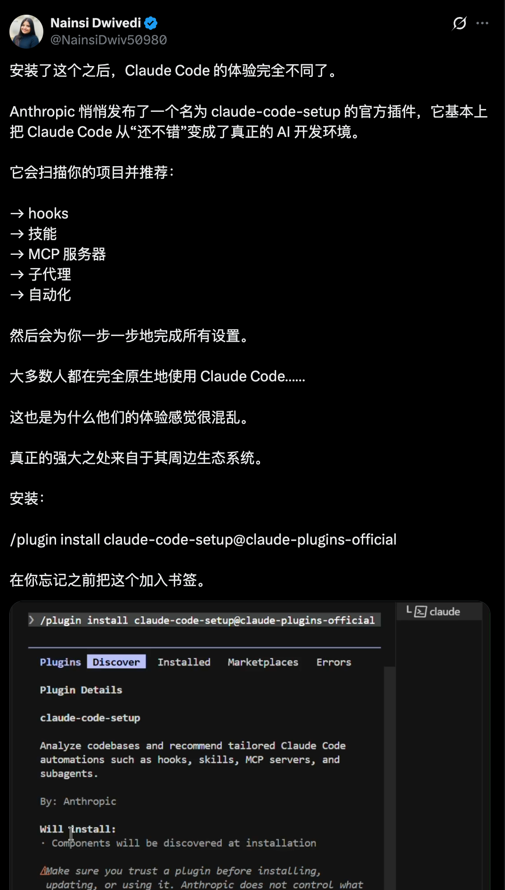
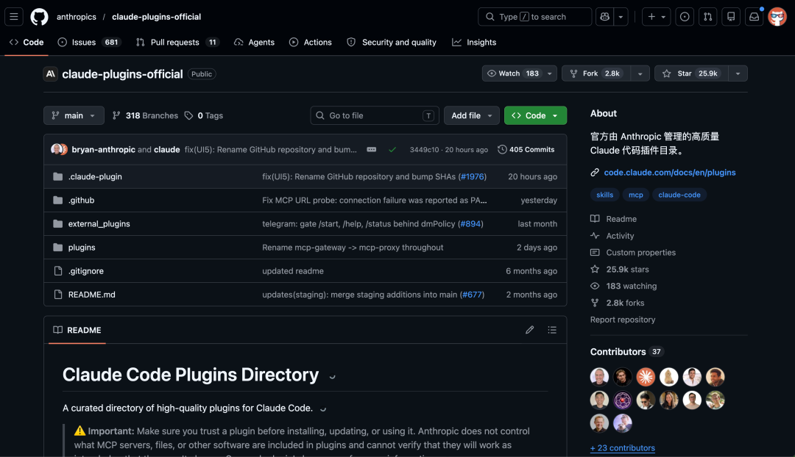
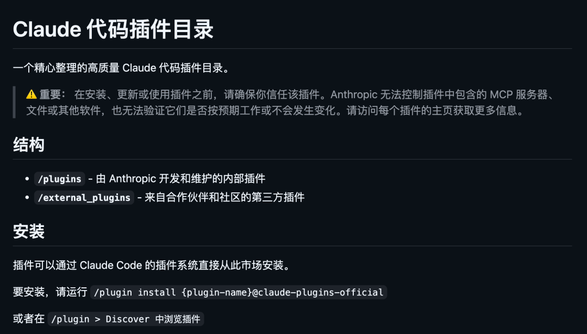
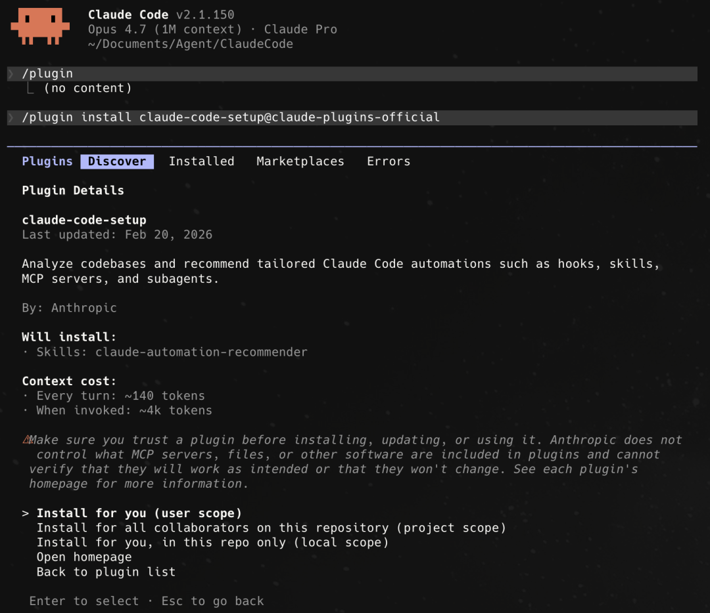
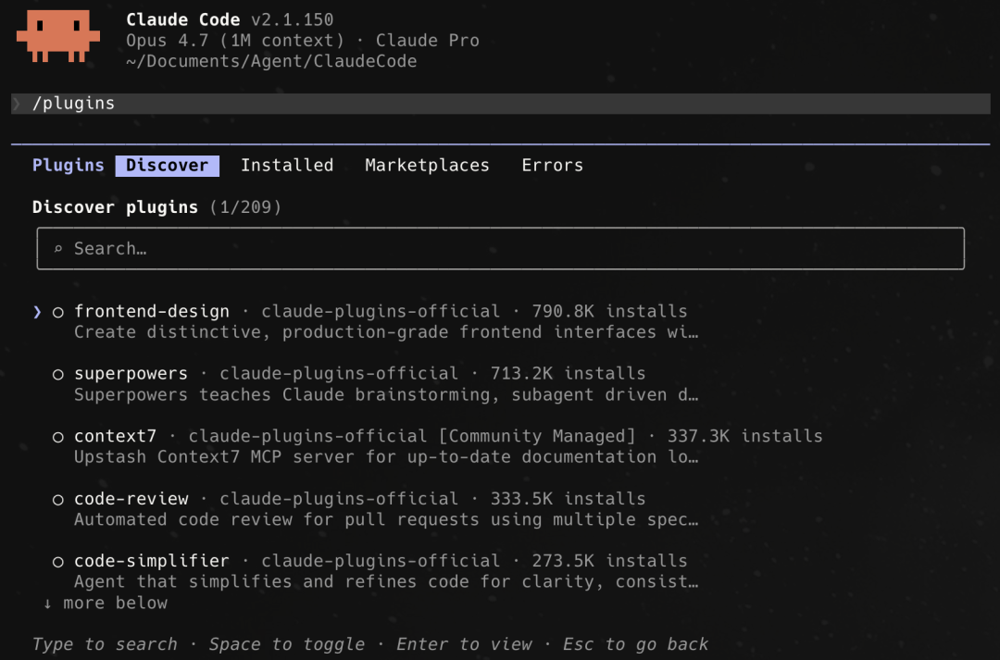
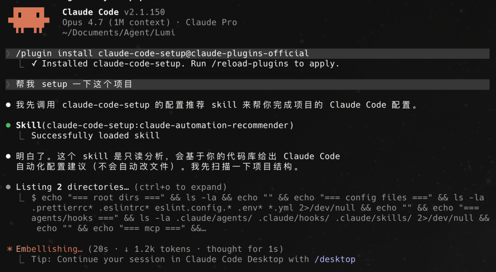
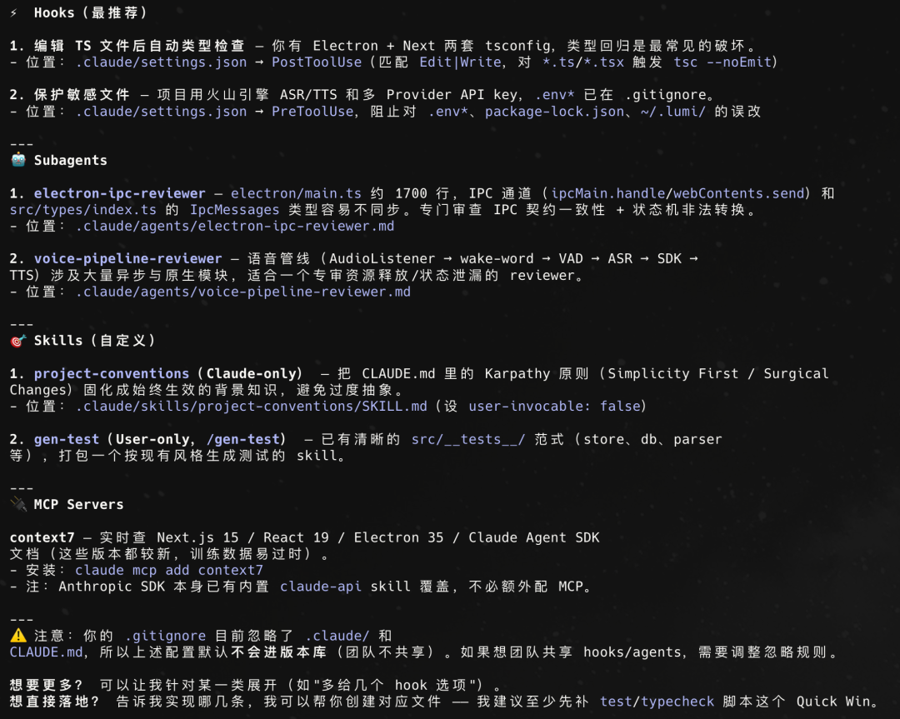
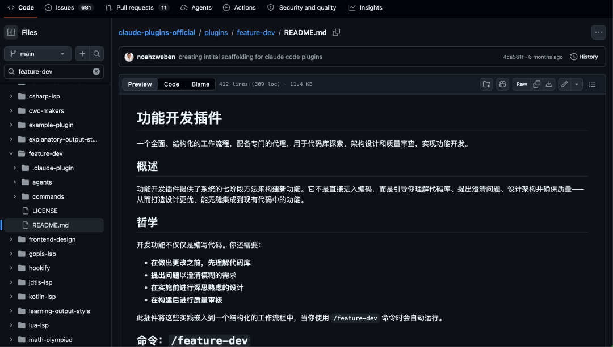
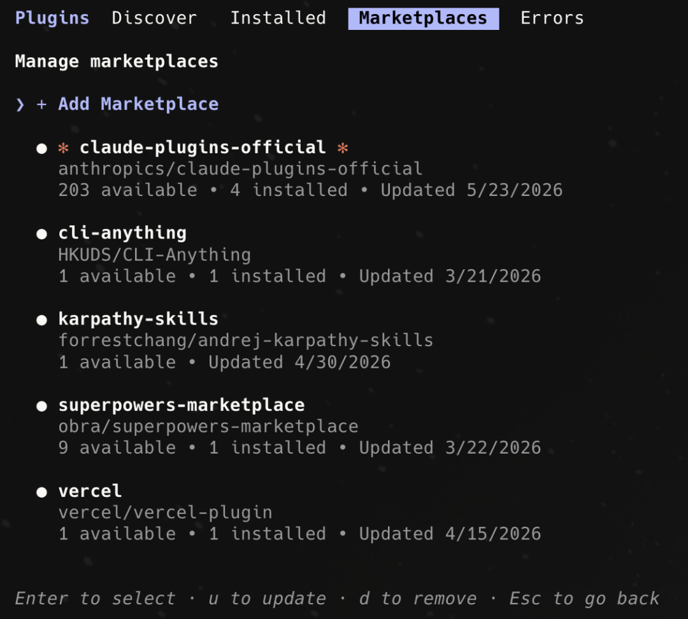

> 📎 来源: [逛逛GitHub](https://mp.weixin.qq.com/s?__biz=MzUxNjg4NDEzNA==&mid=2247533995&idx=1&sn=b91dec98b97f0cd58f89f7cd3a6f68b2&chksm=f85d094309feb6d444643c1cfdf66a4f8b9003a5fd3ff93051eb878bb1b5cea3316d8e2d29fe&mpshare=1&scene=1&srcid=0525Cyn6PbX4Fl8QZEmtATl2&sharer_shareinfo=905413711be2f781cc1f36146a9fd01a&sharer_shareinfo_first=905413711be2f781cc1f36146a9fd01a) | 时间: 2026-05-25 13:08

---

最近刷 X 的时候，发现一条推文被疯狂转发：

Anthropic 悄悄发布了一个官方插件，叫 claude-code-setup，装上后你的 Claude Code 的体验会完全不一样。



然后顺藤摸瓜，发现 Anthropic 其实已经把整个官方插件开源在 GitHub 上了，叫 claude-plugins-official。

现在都 2 万多 Star 了，今天就来聊聊这个开源项目。



01

**开源项目简介**

claude-plugins-official 是 Anthropic 官方在 GitHub 上维护的 Claude Code 插件目录。

这是一个官方认证的插件市场。

你装了 Claude Code 之后，可以一键从这里面安装各种插件，给你的 Claude Code 加各种能力。

目前仓库里有 30 多个内部插件和 10 多个外部插件，包含了 Code Review、功能开发、遗留代码迁移、Hook 管理、多语言 LSP 支持等场景。



每个插件可以包含：

- 斜杠命令，快速触发某个工作流
- 专门的子智能体，干特定的事情
- Skills 文件，教 Claude 怎么做某类任务
- Hooks，自动触发的钩子，比如保存时自动格式化
- MCP Servers，外部工具集成



插件安装只需要一行命令：

```
/plugin install {插件名}@claude-plugins-official
```

或者直接在 Claude Code 里输入 `/plugin`，进图形化界面浏览安装。



```
开源地址：https://github.com/anthropics/claude-plugins-official
```

02

**必装插件推荐**

仓库里插件不少，但不是每个都适合所有人。挑几个我觉得最值得装的聊聊。

### claude-code-setup

这个就是在 X 上被疯狂安利的那个插件。

它的作用很简单但很实用，扫描你的代码库，然后推荐最适合你项目的自动化配置。

你只需要对 Claude 说一句：

```
帮我 set up 一下当前这个项目
```



它就会分析你的项目结构、技术栈、依赖关系，然后告诉你：

推荐装哪些 MCP Servers，比如前端项目推荐 Playwright，文档类推荐 context7

推荐用哪些 Skills，比如 Plan agent、frontend-design

推荐配哪些 Hooks，比如自动格式化、自动 lint、敏感文件保护

推荐用哪些 Subagents，安全审查、性能优化、无障碍检测

推荐哪些 Slash Commands，比如 /test、/pr-review



关键是这个插件是只读的，它只分析不修改，不会动你的任何文件。

除非你授权他去修改。

安装命令：

```
/plugin install claude-code-setup@claude-plugins-official
```

### feature-dev

这个插件是我个人觉得也挺惊艳的，日常开发一直在用这个。

它把功能开发变成了一套 7 阶段的结构化流程：发现需求 → 探索代码库 → 澄清问题 → 架构设计 → 编码实现 → 质量审查 → 总结。

这个插件强制你在写代码之前，先把需求搞清楚、把代码库摸透、把架构想明白。

特别是第 4 阶段，它会同时启动 2-3 个架构师 Agent，分别从最小改动、干净架构、务实平衡三个角度设计方案，然后给你对比推荐。

第 6 阶段的质量审查也很硬核，3 个独立的审查 Agent 并行跑：一个看代码质量，一个找 Bug，一个检查是否符合项目规范。



安装命令：

```
/plugin install feature-dev@claude-plugins-official
```

使用方式：

```
/feature-dev 基于 OAuth 增加用户授权流程
```

### hookify

这个插件解决了一个痛点：Claude Code 的 Hooks 功能很强大，但配置 hooks.json 文件太繁琐。

hookify 让你用自然语言描述规则就行了：

```
/hookify 当我执行 rm -rf 命令的时候警告我
```

它会自动帮你生成对应的 markdown 配置文件，立即生效，不用重启。

支持的动作类型也全：

- **bash：监控终端命令**
- **file：监控文件编辑**
- **stop：在 Claude 想要停止时触发**
- **prompt：在用户提交 prompt 时触发**

可以设置 warn 警告但允许 或 block 直接拦截。

比如防止误删文件、阻止在 TypeScript 文件里写 console.log、要求提交前必须跑测试，这些场景都能覆盖。

安装命令：

```
/plugin install hookify@claude-plugins-official
```

### code-modernization

这个插件专门做遗留代码现代化。

如果你的项目里有老旧的 COBOL、遗留 Java/C++、单体 Web 应用，这个插件能帮你把它们迁移到现代技术栈，同时保证行为不变。

它有一套很严谨的流程：

```
/modernize-assess billing     # 评估遗留代码
```

整个过程不会直接改你的遗留代码，所有改动都输出到 modernized/ 目录，你自己决定什么时候用。

03

**如何使用**

整套流程很简单：

第一步，确保你已经安装了 Claude Code。

第二步，在 Claude Code 里输入：

```
/plugin
```

进入插件管理界面，可以直接浏览和安装所有官方插件。



或者用命令行直接安装指定插件：

```
/plugin install claude-code-setup@claude-plugins-official
```

第三步，安装完就能用了。

每个插件都有自己的命令或者触发方式，看各插件的 README 就行。

如果你是第一次用，建议先装 claude-code-setup，让它帮你一键分析项目，推荐最适合你的插件组合。

门槛太低了。

04

**点击下方卡片，关注逛逛 GitHub**

这个公众号历史发布过很多有趣的开源项目，如果你懒得翻文章一个个找，你直接关注微信公众号：逛逛 GitHub ，后台对话聊天就行了：


