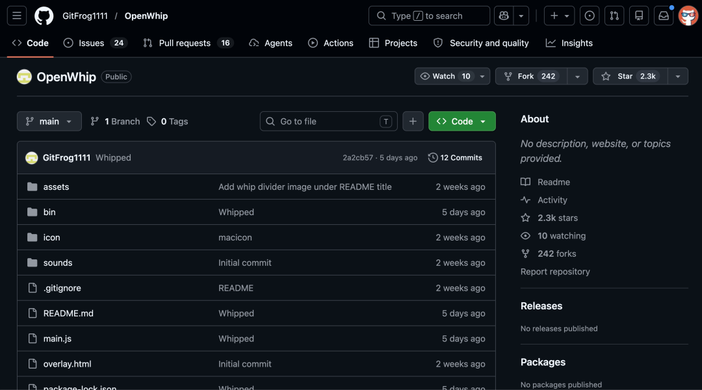
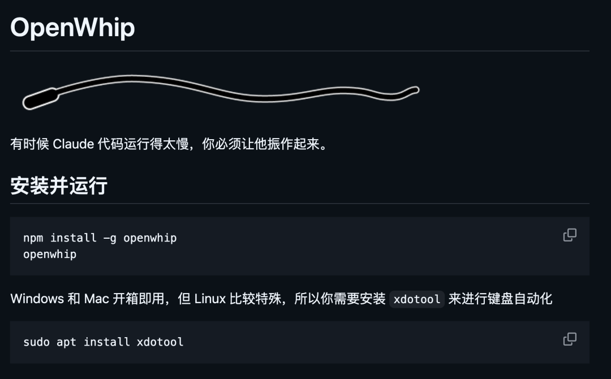

> 📎 来源: [逛逛GitHub](https://mp.weixin.qq.com/s?__biz=MzUxNjg4NDEzNA==&mid=2247533407&idx=1&sn=9c458a0617106eb13679cf408a8db7a6&chksm=f8aac838a6308d5fcc43482ab8410b813019a162887f77168ac49919973b007c2ae9ad78f26f&mpshare=1&scene=1&srcid=05034QzPxWDsu0rMQXlaW4H5&sharer_shareinfo=bcd8521bbe26b0e559a43b13d82b9d1b&sharer_shareinfo_first=bcd8521bbe26b0e559a43b13d82b9d1b) | 时间: 2026-05-03 13:39

---

哈哈哈哈哈，发现了一个专门鞭策 Claude Code 的沙雕神器。

用过 Claude Code 的都懂，它啥都好，就是偶尔会犯懒。

一个简单的重构，转圈转个十几秒。

一段本来五分钟能搞定的代码，它在那儿反复改同一行，越改越离谱。

更顶的是偶尔陷入死循环，读文件、改文件、读文件、改文件，你只能干瞪眼看着它表演。

这时候手动 Ctrl-C 打断吧，总觉得缺点仪式感，打断完还得自己打一长串话告诉它刚才在瞎搞。

最近刷到了这个开源项目，一看我直接笑出声，它的解决方案是：**给 Claude Code 上鞭子**。



01

**开源项目简介**

项目叫 OpenWhip，是一个基于 Electron 的跨平台桌面小工具，作者在 README 开头就一句话交代动机：

> 有时候 Claude Code 跑得太慢，你需要一根鞭子来鞭策它。

说白了就是一个桌面小工具，你嫌 AI 摸鱼了，点一下图标，一条鞭子从屏幕飞出来抽它一下。

顺便替你按 Ctrl-C 打断当前任务，再冒出一句随机的吐槽话术。



工作原理也非常直接：

- 看到 CC 犯懒，点击鞭子图标
- 屏幕上生成一条鞭子
- 再点一下屏幕任意位置，鞭子挥下去
- 系统自动向 Claude Code 发一个 Ctrl-C 中断信号
- 顺便从 5 条预设话术里随机甩一条鼓励/羞辱的消息过去

非常符合一个打工人面对摸鱼 AI 时的真实情绪。

这玩意儿还挺有梗的

这个项目能一周多冲上 2.3K Star，算是你看到 AI 摸鱼犯傻时候的情绪出口。

① **AI 摸鱼时的情绪出口**

用 Claude Code 写过复杂任务的都有体会，有时候它会陷在某个小问题里出不来，来回改来回试，你看着进度条转啊转，手放键盘上又不知道该说啥。

这个时候多一个能让你发泄一下的按钮，还挺搞的。

手动按 Ctrl-C 打断，功能上是一样的，但就是少了点情绪价值。OpenWhip 的鞭打动画加上随机话术，相当于给你一个合法的情绪出口。

② **Roadmap 比项目本身还好笑**

这项目最顶的地方是作者写的 Roadmap，我直接摘一下：


03、怎么装来玩

部署非常简单，一条命令搞定：

```
npm install -g openwhip
```

装完直接运行，右上角会出现一个鞭子图标，点它就能用。

平台支持上：

**macOS / Windows：开箱即用**

**Linux：需要额外装一下**`xdotool`，这个是用来模拟键盘按键的，大部分发行版都能直接 `apt install xdotool` 或者 `pacman -S xdotool` 搞定

装好之后，打开一个 Claude Code 的终端窗口跑点活儿，等它开始摸鱼的时候，点托盘图标、点屏幕，一气呵成。

值得提一句的是，因为要给它发全局快捷键，首次运行的时候 macOS 会弹窗让你授权辅助功能权限，这一步正常授权就行。

03

**点击下方卡片，关注逛逛 GitHub**

这个公众号历史发布过很多有趣的开源项目，如果你懒得翻文章一个个找，你直接关注微信公众号：逛逛 GitHub ，后台对话聊天就行了：


