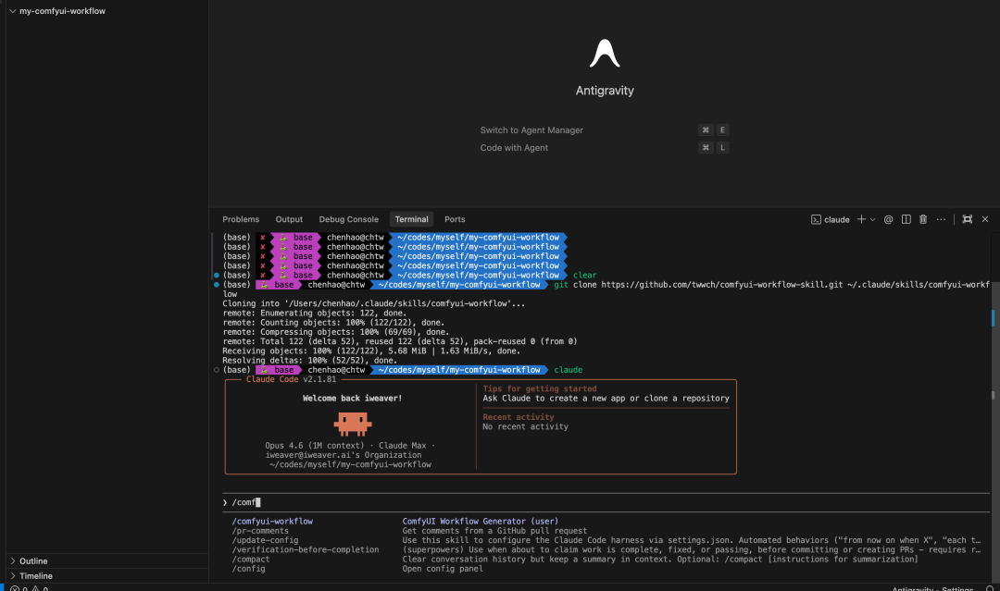
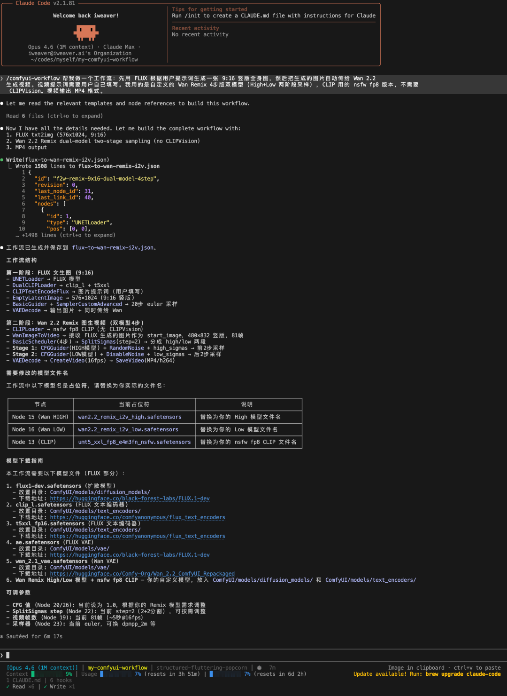
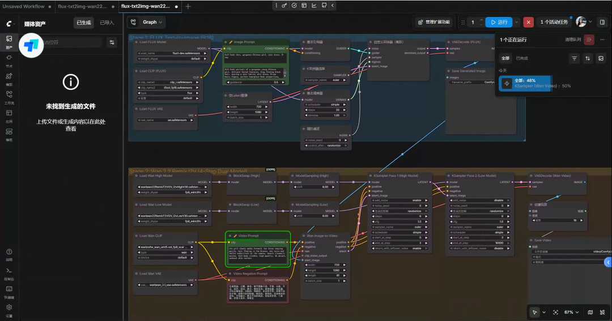
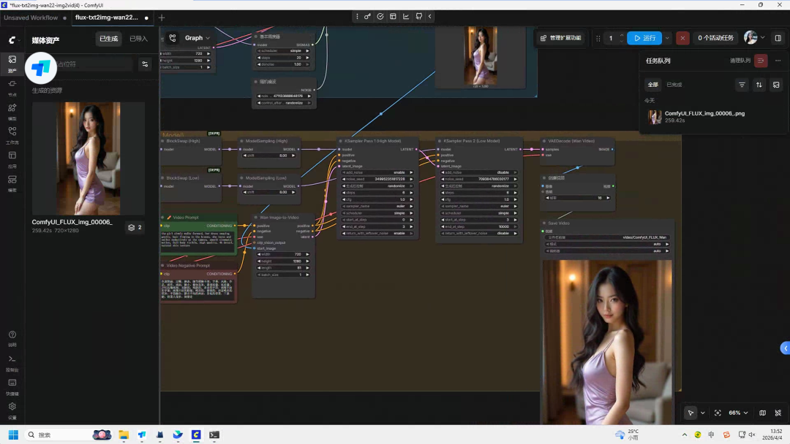
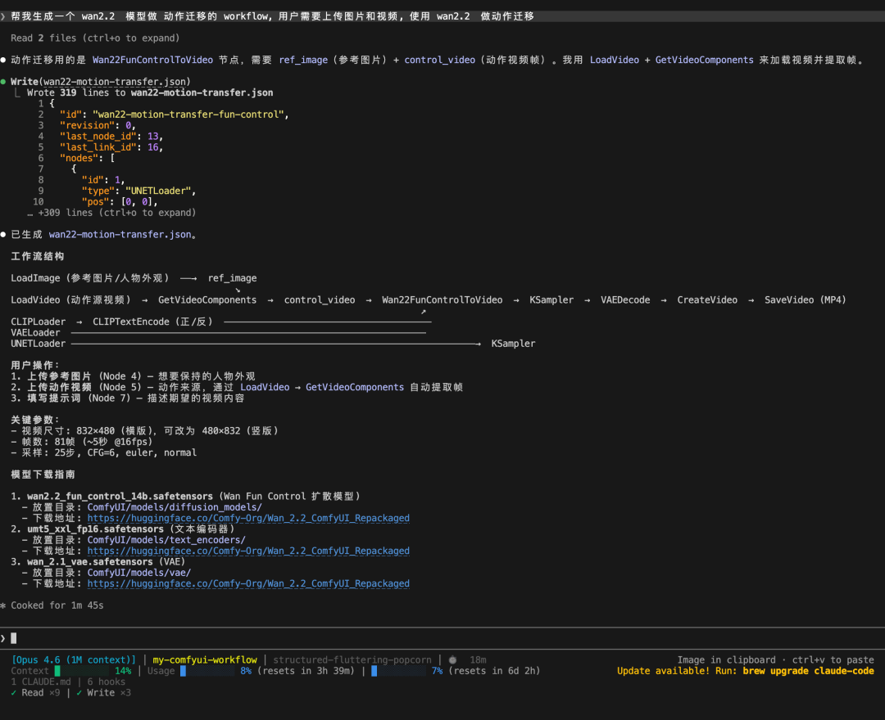
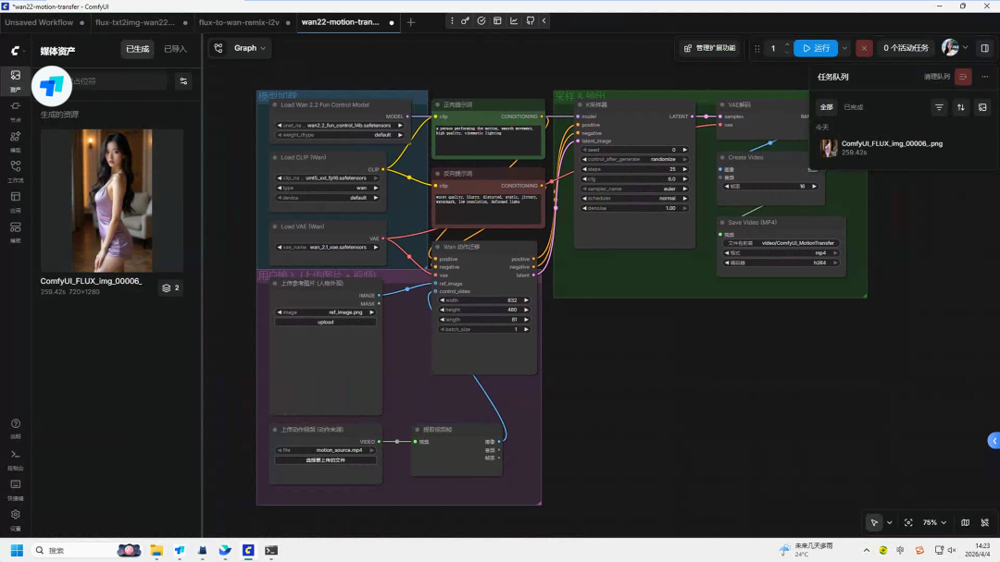
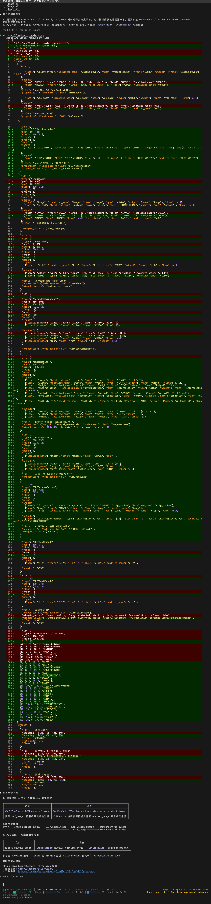
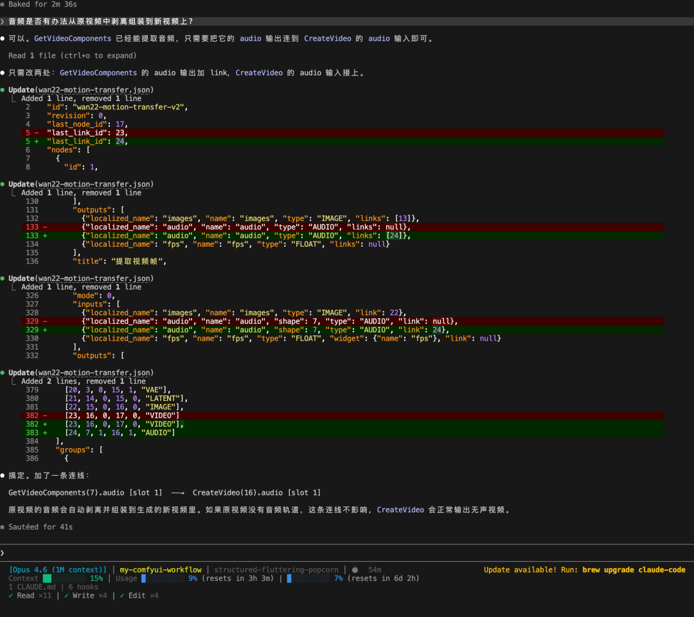
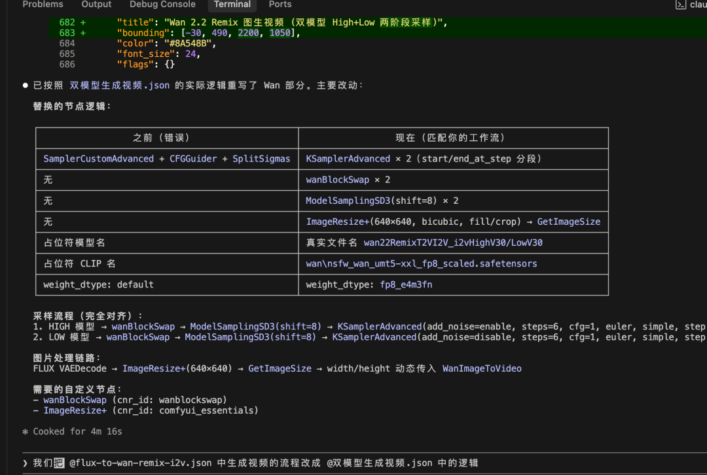

> 📎 来源: [IT一氪](https://mp.weixin.qq.com/s?__biz=MzI3ODY3ODg2Nw==&mid=2247484467&idx=1&sn=79314c45f9ccd8ca0523587893168a24&chksm=ea8f365988addd3ea4564bf774acb583f40f1e3fc2112b4a6a43fced6716d30d79c2b181899b&mpshare=1&scene=1&srcid=0514xsgWOr0hcImjszvwUXjD&sharer_shareinfo=1170aa375a4a0fa7c153b81a49fb6402&sharer_shareinfo_first=1170aa375a4a0fa7c153b81a49fb6402) | 时间: 2026-05-14 11:59

---

> 一句话描述你想要的效果，AI 自动生成完整的 ComfyUI workflow JSON，直接导入即用。

---

## 痛点

玩过 ComfyUI 的都知道，节点连线是个体力活。

想搭一个 FLUX 文生图 + Wan2.2 图生视频的流水线？先找节点、再连线、调参数、查文档……一个完整的工作流搭下来，少说半小时。

更痛苦的是：换个模型？重新来。加个 LoRA？又要查哪个节点接哪个口。改个分辨率？还得确认 latent 尺寸对不对。

**所以我做了一个东西：用自然语言，让 AI 帮你生成 ComfyUI 工作流。**

---

## 它是什么

**comfyui-workflow-skill** 是一个给 AI 编程助手（Claude Code / Cursor / Codex）用的 Skill。

安装之后，你只需要用自然语言告诉 AI 你想做什么：

```
"帮我生成一个 FLUX 文生图的工作流""做一个 Wan2.2 图生视频的 workflow，分辨率 720p""生成一个 FLUX 生图 + Wan2.2 图生视频的完整流水线""帮我做一个动作迁移的工作流，用 Wan2.2 Fun Control"
```

AI 就会生成一个**完整的、可以直接导入 ComfyUI 运行的 JSON 文件。**

---

## 安装：一行命令

```
git clone https://github.com/twwch/comfyui-workflow-skill.git ~/.claude/skills/comfyui-workflow
```



装完之后，Claude Code 会自动识别这个 Skill。当你提到 ComfyUI、工作流、文生图、图生视频等关键词时，它会自动激活。

---

## 实战演示 1：FLUX 生图 + Wan2.2 图生视频

这是最常见的需求：先用 FLUX 生成一张高质量图片，再用 Wan2.2 把图片变成视频。

我只说了一句：

> "帮我生成一个 FLUX 文生图 + Wan 2.2 图生视频的工作流"

AI 就开始工作了——读取模板、组合节点、生成完整的 workflow JSON：



生成的工作流导入 ComfyUI 后，完整的节点图长这样：



点击运行，FLUX 先生成图片：


然后 Wan2.2 自动接力，把这张图变成视频：



最终生成的视频效果：

工作流下载地址：https://github.com/twwch/comfyui-workflow-skill

---

## 实战演示 2：动作迁移工作流

更复杂的场景——给一张参考图 + 一段动作视频，生成动作迁移视频。

同样是一句话：

> "帮我生成一个 Wan2.2 动作迁移的 workflow，使用 Fun Control"

AI 自动生成了完整的动作迁移工作流：



导入 ComfyUI 后的节点图：



---

## AI 还能帮你修 Bug

生成的工作流运行出问题？直接把报错贴给 AI，它会帮你修。

比如我遇到了节点连接错误，AI 直接读取 JSON、定位问题、修改节点连接：



甚至发现生成的视频没有音频，它还能自动加上音频还原的节点：



---

## 多个工作流合并？一句话搞定

已经有几个工作流，想合并成一个？或者想在现有工作流上加功能？

AI 可以直接读取多个 JSON 文件，理解节点关系，然后合并/更新：



---

## 支持的模型和任务

内置 **34 个模板，**覆盖主流模型和任务类型：

| 类型 | 支持的模型 |

|------|-----------|

| 文生图 | SD 1.5 / SDXL / SD3 / FLUX |

| 图生图 | SD 1.5 / SDXL / FLUX |

| 文生视频 | Wan 2.2 / HunyuanVideo / LTXV / Mochi / Cosmos |

| 图生视频 | Wan 2.2 / HunyuanVideo / LTXV / Cosmos |

| 视频控制 | Wan 2.2 Camera / Fun Control / First-Last Frame |

| LoRA | SD 1.5 / SDXL / FLUX |

| ControlNet | SD 1.5 / SDXL |

| 重绘 (Inpaint) | SD 1.5 / SDXL |

| 放大 (Upscale) | RealESRGAN / UltraSharp |

| 音频生成 | Stable Audio |

| 3D 生成 | Hunyuan3D v2 |

| LLM 集成 | OpenAI / Claude / Gemini / DeepSeek / Ollama |

还内置了 **360+ 个 ComfyUI 节点定义，**AI 清楚每个节点的输入输出、参数范围、连接方式。

---

## 自动下载模型

生成的工作流自带 `models` 字段，导入 ComfyUI 后会自动检测缺失的模型并弹出下载对话框，不用手动找模型文件。

---

## 开源地址

**GitHub:**https://github.com/twwch/comfyui-workflow-skill

欢迎 Star、Fork、提 PR。

如果你也在用 ComfyUI，试试这个 Skill，告别手动连线的痛苦。

---

*用 AI 生成 AI 绘画的工作流，这大概就是套娃的终极形态吧。*
