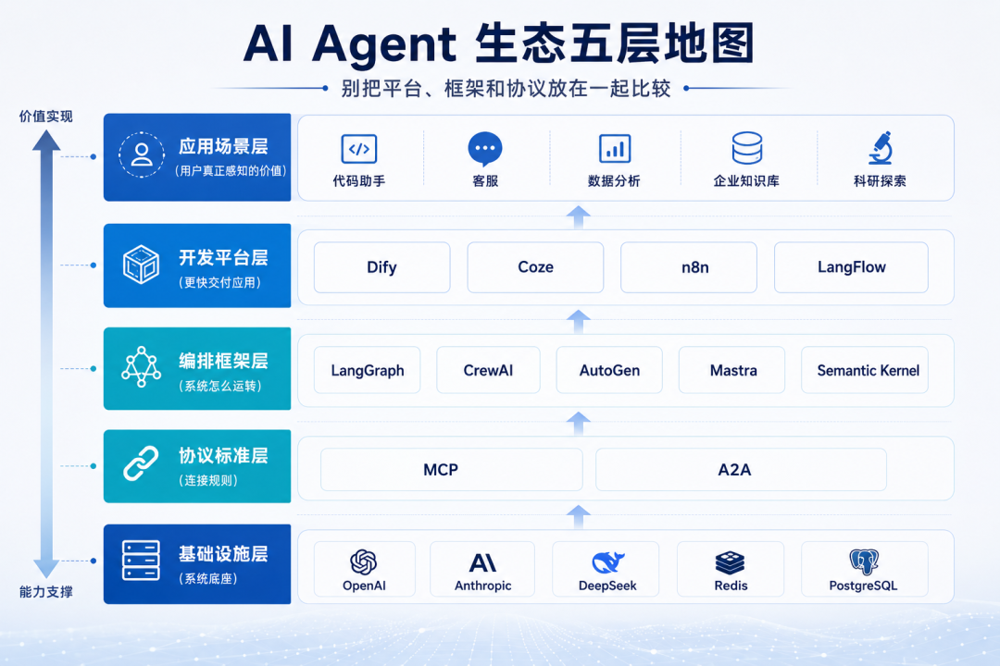
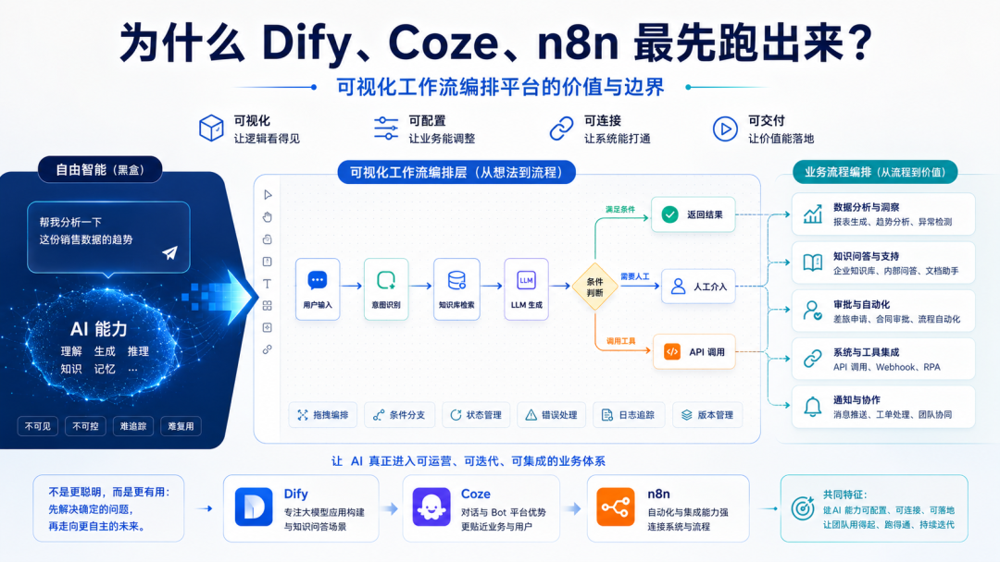
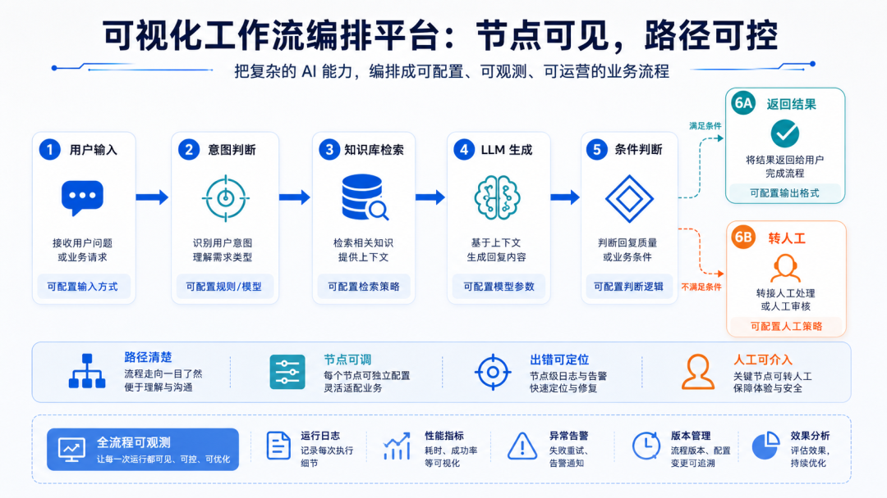
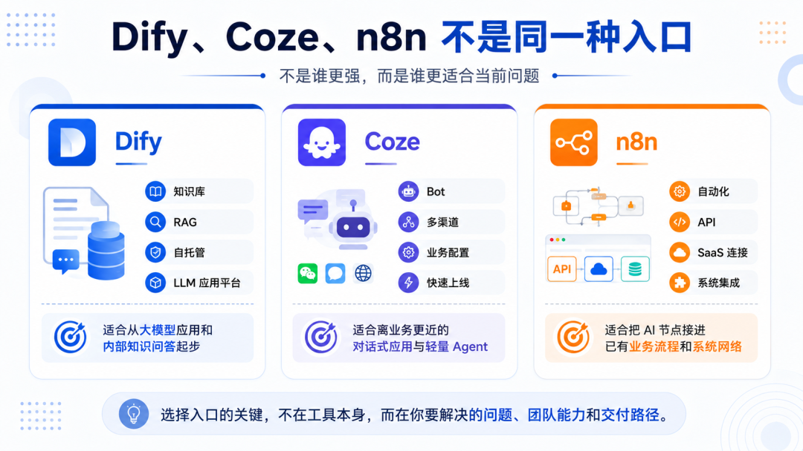
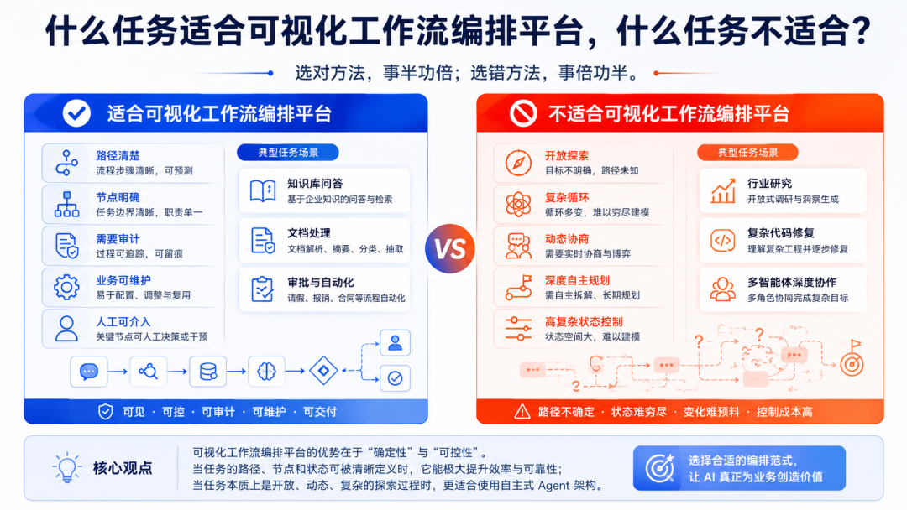
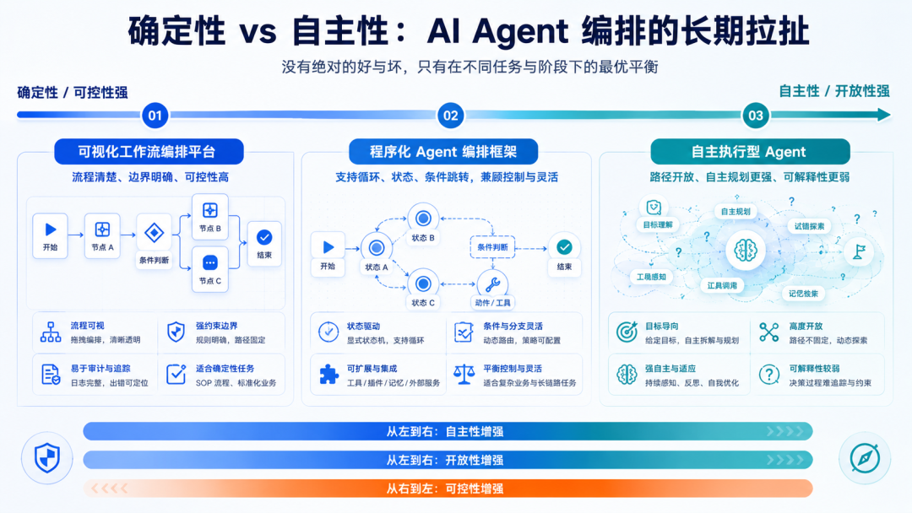

> 📎 来源: [GQ观澜](https://mp.weixin.qq.com/s?__biz=MzYzOTg5MjY5OA==&mid=2247483707&idx=1&sn=08ab0393d7e5b46312b4055f897c4345&chksm=f16a8770a9ed358a0fb62a3d5ae398ead4dd1190f063cad1b21b637d615981bd3b5d09c3f1e5&mpshare=1&scene=1&srcid=0509WxSaxn4lIrc31WRxSr96&sharer_shareinfo=2e3ee1a12bd74f7461d7dac384ea469a&sharer_shareinfo_first=2e3ee1a12bd74f7461d7dac384ea469a) | 时间: 2026-05-09 23:16

---

上一篇说到，理解 AI Agent 生态，第一步不是问“哪个工具最好”，而是先分层。

[AI Agent 全景课 01：为什么 AI Agent 会从单兵作战走向团队协作？](https://mp.weixin.qq.com/s?__biz=MzYzOTg5MjY5OA==&mid=2247483686&idx=1&sn=7f2973eca4b004c5b220c55cf881c90d&scene=21#wechat_redirect)

这篇先讲最容易落地的一层：可视化工作流编排平台，也是对应图中开发平台层的产品，也就是很多人已经在用的 Dify、Coze、n8n。

这类工具在技术圈里有点尴尬。

一方面，它们确实很流行，很多团队做 AI 应用都是从这里开始；另一方面，很多开发者会下意识觉得它们“低代码”“拖拖拽拽”“不够硬核”。

我以前也有这种偏见。

后来发现，这个判断太粗了。

Dify、Coze、n8n 不是 Agent 技术的天花板。

它们最先跑出来，是因为它们解决了一个很朴素的问题：

企业要的第一批 AI 应用，通常不是最自由的 Agent，而是能上线、能解释、能修改、能接入业务的东西。

这才是可视化工作流的真实价值。

它不一定最聪明，但它很接地气。

## 先把类别定义清楚：这三类系统不是一回事

上一篇说到，理解 AI Agent 生态，第一步不是问“哪个工具最好”，而是先分层。

为了避免把平台、框架和 Agent 混在一起，先把这一组常见名称放在同一张表里。

| 类别 | 中文名称 | 英文名称 | 典型代表 | 说明 |
| --- | --- | --- | --- | --- |
| 第一类 | 可视化工作流编排平台 | Visual workflow orchestration platforms | Dify、Coze、n8n | 流程图对用户显式可见，通常通过节点、分支、触发器、工具调用来搭建流程。 |
| 第二类 | 程序化 Agent 编排框架 | Programmatic agent orchestration frameworks | LangGraph、CrewAI、AutoGen | 编排主要通过代码定义，更强调状态、角色、消息、路由与恢复能力。 |
| 第三类 | 自主执行型 Agent | Autonomous agents | Claude Code、Codex、OpenClaw | 用户通常不给它显式画图，系统更多在运行时决定下一步动作。 |

把这三类放清楚后，再看 Dify、Coze、n8n 为什么先跑出来，很多问题就不容易比歪。

## 一、企业落地时，问题会突然变具体

很多 Agent 讨论是从模型能力开始的。

模型能不能自主规划？能不能调用工具？能不能自我反思？能不能连续完成一个复杂任务？

这些当然重要。

但一到企业场景，问题会变得很琐碎。

比如你要做一个客服知识库问答系统。

模型回答得好不好，只是其中一件事。

业务团队还会问：

• 用户从哪个渠道进来？
• 要不要先判断问题类型？
• 查哪个知识库？
• 哪些问题不能让模型自由答？
• 哪些问题必须转人工？
• 回答错了以后，能不能看到是哪一步错了？
• 业务同事能不能自己改提示词和知识库？
• 日志、权限、数据边界怎么处理？

这些问题一点也不酷，但上线时绕不开。

所以企业第一阶段往往不会先追求一个“完全自主”的 Agent。

太自由的东西，演示时很迷人，管理时会让人紧张。

企业更想要的是流程可见、节点可调、出错能定位、业务人员能参与。

Dify、Coze、n8n 的价值就在这里。

它们把 AI 从一个聪明的对话框，放进了一条能被人看见的业务流程里。

这一步看起来不性感，但非常关键。

## 二、可视化工作流编排到底是什么？

先说一个更稳妥的定义。

这里讨论的 Dify、Coze、n8n，更专业的叫法是“可视化工作流编排平台”。它的核心做法，是把一个 AI 应用拆成一组看得见的节点，再用线把这些节点连起来。

一个节点接收用户输入。

一个节点判断问题类型。

一个节点检索知识库。

一个节点调用大模型。

一个节点做条件判断。

最后输出结果，或者转给人工。

这就是很多 Dify、Coze、n8n 应用的基本形态。

你可以把它理解成业务流程图，只是其中一些节点变成了大模型、知识库、工具调用和 Agent。

过去大家经常把这类东西叫 DAG 工作流。

严格说，DAG 是有向无环图。

但现在很多平台已经支持循环、迭代、批处理或 Agent 节点，所以更稳妥的说法不是 DAG，而是“可视化工作流编排”。

重点不在于它是不是严格无环，而在于：

流程大体由人提前画出来。

这和 Claude Code、Cursor Agent 这类自主执行型 Agent 很不一样。

后者更像你给它一个目标，它自己决定下一步查什么、改什么、跑什么命令。执行路径是在过程中浮现出来的。

可视化工作流编排则更克制。

模型可以在某个节点里做判断，但流程边界通常由人定义。

好处很明显：路径清楚、行为可控、调试直接，业务同事也更容易看懂。

代价也很明显：它没那么自由。

这不是先进和落后的区别，而是取舍不同。

## 三、为什么企业喜欢它？

我觉得主要是三个原因。

### 1）看得见

企业不太喜欢黑盒，尤其是要进业务系统的时候。

一个 Agent 如果自己规划、自己调用工具、自己改路径，演示时可能很惊艳。

但只要一出错，问题马上来了：

• 它刚才为什么这么做？
• 哪一步错了？
• 谁能解释？
• 下次怎么避免？

可视化工作流编排的好处是，每一步都摊在桌面上。

输入从哪里来，经过哪些节点，哪个节点查了知识库，哪个节点调用了模型，哪个节点触发了条件分支，最后输出了什么，都可以拆开看。

这对业务团队很重要。

业务人员不一定懂代码，但他们能理解流程。

他们可以直接指出：

• 这里应该先判断是不是 VIP。
• 这里不能直接答，要转人工。
• 这里要查内部知识库，不要让模型凭印象说。
• 这里提示词写得太宽了。

一旦 AI 应用变成可视化流程，它就不再只是技术团队的黑盒。

业务、产品、技术能围绕同一张图讨论。

### 2）改得动

企业 AI 应用很少一次就设计对。

上线后一定会改。

知识库要更新，提示词要调，条件分支要加，异常情况要单独处理，某个系统接口也可能换掉。

如果所有逻辑都写在代码里，每次调整都要排开发。

但如果流程是可视化的，很多业务层调整可以从“改代码”变成“改流程”。

这不是说开发者不重要。

开发者仍然要处理系统接入、权限、复杂逻辑、工程边界。

只是那些本来就应该由业务快速试错的东西，不一定都要压到代码里。

低代码真正有价值的地方，不是让所有人都不写代码，而是把可配置的部分从代码里拿出来。

### 3）出错能定位

AI 应用和传统软件不太一样，中间夹了一个不稳定的模型。

同样的问题，模型可能换一种表达。

知识库召回可能不准。

提示词可能写得太含糊。

API 可能返回异常。

最后的输出格式也可能不符合要求。

如果没有流程拆解，排查会很痛苦。

可视化工作流编排至少能让你知道问题大概卡在哪里：

• 输入理解错了
• 知识库没召回
• 模型回答偏了
• 工具调用失败
• 条件分支走错了
• 最后输出格式不对

生产环境里，真正麻烦的不是“会不会出错”。

AI 应用一定会出错。

真正麻烦的是，出错后你找不到原因。

可视化工作流不保证系统不犯错，但它让排查有地方下手。

## 四、Dify、Coze、n8n 不是同一种入口

这三个名字经常被放在一起说，但它们的气质不太一样。

### Dify：适合从 LLM 应用和知识库起步

如果你的问题是：

我想快速做一个基于大模型和知识库的 AI 应用。

Dify 是一个很自然的入口。

它适合企业知识库问答、文档问答、RAG 应用、内部 AI 助手，以及一些简单的工具调用场景。

对数据比较敏感、希望自托管的团队，也会更容易考虑它。

Dify 的好处是，它把 LLM 应用里常用的部分放到了一起：模型配置、提示词、知识库、文档处理、工作流、API 发布、自托管。

这对很多团队足够实用。

因为企业第一批 AI 应用，大多不是复杂多 Agent 协作，而是把内部知识、文档和模型连接起来，让它能回答、总结、分类、提取、生成。

Dify 的边界也比较清楚。

它适合把 LLM 能力产品化、流程化、服务化。

但如果任务需要复杂状态机、长链路回放、多 Agent 动态协商，或者非常复杂的条件循环，它就不一定适合作为核心引擎。

这种时候，LangGraph 这类更偏代码和状态控制的框架会更合适。

### Coze：适合离业务更近的 Bot 和 Agent

如果你的问题是：

我想让业务团队快速搭一个能对话、能调用插件、能发布到渠道里的 Bot。

Coze 会更容易上手。

它强调 Bot 构建、可视化工作流、插件和知识库、多渠道发布，以及业务人员的配置体验。

Coze 的特点是离业务更近。

客服、营销、内部助手、轻量业务 Bot，这些场景里，业务团队往往更关心“这个 Bot 面向谁、能答什么、发到哪里、能调用哪些工具”，而不是底层状态机怎么设计。

不过 Coze 也不能只看一个标签。

公有云 Coze 和开源的 Coze Studio 并不完全等价。

做企业选型时，不能只看“是否开源”，还要看部署方式、能力边界、生态集成和平台锁定风险。

Coze 适合快速搭业务应用。

真要做高度定制、深度嵌入内部系统、对执行链路有很强工程控制要求的 Agent 系统，还是要认真评估边界。

### n8n：适合把 AI 接进已有系统

n8n 和前两个不太一样。

它原本就是工作流自动化平台。

它的基本盘不是“做一个 AI 应用”，而是连接各种系统、API、数据库和 SaaS 服务。

这反而让它在企业里很实用。

很多企业不是从零开始做一个 AI 应用。

它们已经有 CRM、ERP、工单、飞书、Slack、Notion、数据库、邮件、表格、审批系统。

AI 的现实价值，很多时候不是替换这些系统，而是嵌进它们之间。

比如：

• 表单来了以后自动分类
• CRM 新增客户后自动生成跟进建议
• 定时抓取数据并生成报告
• 邮件、数据库、表格之间自动流转
• 在已有业务流程里加一个 AI 节点

这种时候，n8n 很自然。

它不一定是最 Agent 原生的工具，但它很擅长把 AI 接进已有流程。

如果说 Dify 更像 LLM 应用平台，Coze 更像业务 Bot 平台，n8n 更像企业系统之间的一张连接网。

## 五、什么场景适合可视化工作流编排平台？

一个简单判断：

任务路径相对清楚，就可以优先考虑可视化工作流编排平台。

1. 比如企业知识库问答。

用户问题进来，先判断意图，再检索知识库，再生成回答，必要时转人工。

流程清楚，出错也好拆。

2. 比如文档处理。

上传合同、报告、简历、会议纪要，然后抽取字段、总结重点、分类归档、写入表格。

这类任务步骤明确，很适合工作流。

3. 比如业务自动化。

订单状态变化后通知客户，销售线索进入后生成跟进建议，表单提交后自动分类分发。

这类场景本来就是工作流自动化的地盘，AI 只是其中一个能力节点。

4. 还有审批和人工介入。

有些节点必须让人确认，比如高风险回复、敏感信息、重要客户、合同内容、财务数据。

可视化工作流编排可以把人工节点放进去，让 AI 在关键位置受控。

5. 还有一种情况也很常见：系统上线后，业务团队需要持续改提示词、改条件、改知识库、改回复策略。

这时可视化工作流编排平台的价值会变大。

因为业务同事不是只能提需求等排期，他们可以参与系统的日常调整。

## 六、它什么时候会吃力？

可视化工作流编排平台不是万能的。

路径越开放，它越难画。

比如你让 AI 研究一个陌生行业，自己判断该看哪些资料，最后形成一份有洞察的报告。

这种任务很难提前画好流程，因为你不知道中途会遇到什么信息，也不知道哪些方向值得深挖。

如果硬画，最后可能会得到一张很复杂的流程图，但还是覆盖不了真实情况。

复杂代码修复也是类似。

读取错误、搜索代码、提出方案、修改文件、跑测试、失败后重新分析、再修改、再测试。

这里面有循环、回退、条件判断和状态积累。

可视化工作流编排可以做一部分，但路径一复杂，维护成本会迅速上升。

还有多智能体深度协商。

多个 Agent 互相审稿、互相质疑、互相修正，直到结果变好。

这不是简单的 A 到 B 再到 C，而是一个动态协作网络。

可视化工作流编排可以模拟，但不一定自然。

最后是对底层执行控制要求很高的生产系统。

如果你需要精确控制状态、检查点、回放、人机介入、异常恢复和权限边界，可视化平台可以做外层产品界面，但核心执行引擎可能仍然需要代码框架。

不要把“能画出来”误解成“能支撑所有复杂生产需求”。

## 七、可视化不是低端，很多时候是必要的中间层

很多技术人员看到拖拽节点就皱眉。

我能理解。

复杂系统如果全靠拖拽，最后很可能变成另一种泥球。

但这不代表可视化工作流没有价值。

它真正改变的是协作方式。

很多 AI 应用失败，不是因为模型不够强，也不是因为框架不够先进，而是因为业务流程没有被想清楚。

谁输入？

谁审批？

谁负责知识库？

哪些问题不能答？

哪些回答要留痕？

异常交给谁？

这些问题不是换一个更强框架就会自动消失。

可视化工作流会逼着团队把流程画出来。

这张图可能不完美，但它让业务、产品、技术终于有了一个共同讨论的对象。

这就是它的现实价值。

## 结语：第一站，不等于终点

Dify、Coze、n8n 这类可视化工作流编排平台，可能不是 Agent 技术的最终形态。

但它们很可能是很多企业 AI 落地的第一站。

原因不复杂。

它们让 AI 应用变得可见、可改、可交付。

它们让业务人员能参与，让开发者能接入，也让管理者知道风险大概在哪里。

边界也要看清楚。

当任务路径高度开放、状态复杂、需要自主规划或多智能体动态协商时，可视化工作流编排会开始吃力。

所以不要神化它，也不要轻视它。

更合适的态度是：

• 用可视化工作流编排平台处理路径清楚、业务规则明确的任务。
• 用程序化 Agent 编排框架或自主执行型 Agent 处理更开放、更需要自主性的任务。

这就是 AI Agent 编排里一个长期存在的拉扯：

确定性，还是自主性。

下一篇，我们进入另一条路线：

LangGraph、CrewAI、AutoGen 这类程序化 Agent 编排框架，为什么会成为复杂 Agent 系统的关键拼图？

[AI Agent 全景课 01：为什么 AI Agent 会从单兵作战走向团队协作？](https://mp.weixin.qq.com/s?__biz=MzYzOTg5MjY5OA==&mid=2247483686&idx=1&sn=7f2973eca4b004c5b220c55cf881c90d&scene=21#wechat_redirect)
