> 📎 来源: [白聊科技](https://mp.weixin.qq.com/s?__biz=MzIwNjYyNDc0NQ==&mid=2247526028&idx=1&sn=0c999ff66e4f3993f3ee5adfd4262cef&chksm=9634202d36a7531bcb59dfedcf48f37cca321b69ae737b52d96dc4d6a8446a72d7ed02303456&mpshare=1&scene=1&srcid=05240HmC24fo717tUAbmG4Ft&sharer_shareinfo=133b7a46e408a060f4bc143c7a8dff42&sharer_shareinfo_first=133b7a46e408a060f4bc143c7a8dff42) | 时间: 2026-05-24 11:58

---


一、概述

在日常工作和学习中，我们经常需要和数据打交道。无论是分析报告、项目展示，还是简单的数据洞察，一个清晰直观的图表，往往能胜过千言万语。

一款能让数据可视化变得超级简单的 MCP Server，由蚂蚁集团 AntV 团队开源的 mcp-server-chart

github地址：https://github.com/antvis/mcp-server-chart

目前已经支持超过 15 种我们常用的可视化图表类型，比如：

折线图、柱状图、饼图、面积图、条形图

直方图、散点图、矩阵树图、词云图、双轴图

雷达图、思维导图、网络图、流程图、鱼骨图

可以说，它几乎能满足我们日常工作中绝大多数场景的可视化需求。 最棒的是，它会以图片链接的形式返回生成结果，方便你嵌入到任何需要的地方。

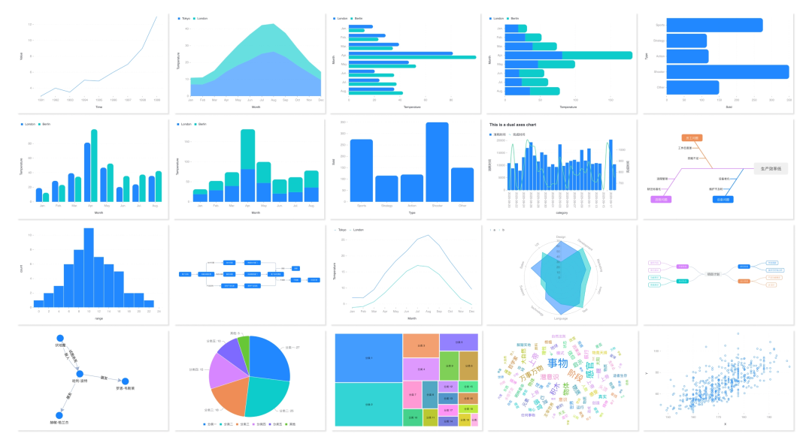

二、MCP工具初体验

docker运行

mcp-server-chart官方已经封装好了镜像，docker hub地址：https://hub.docker.com/r/acuvity/mcp-server-chart

目前最新版本是0.4.0，运行一下

```
docker run -d --name mcp-server-chart -it -p 8000:8000  acuvity/mcp-server-chart:0.4.0
```

mcp-server-chart支持3种调用方式，分别是STDIO，SSE，streamable Http

Cherry Studio调用

这里以Cherry Studio客户端，来演示一下如何使用

添加MCP服务器

名称：mcp-server-chart

类型：streamable Http

地址：http://10.44.32.14:8000/mcp

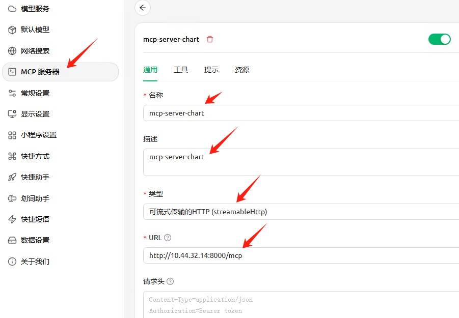

添加完成后，查看工具列表

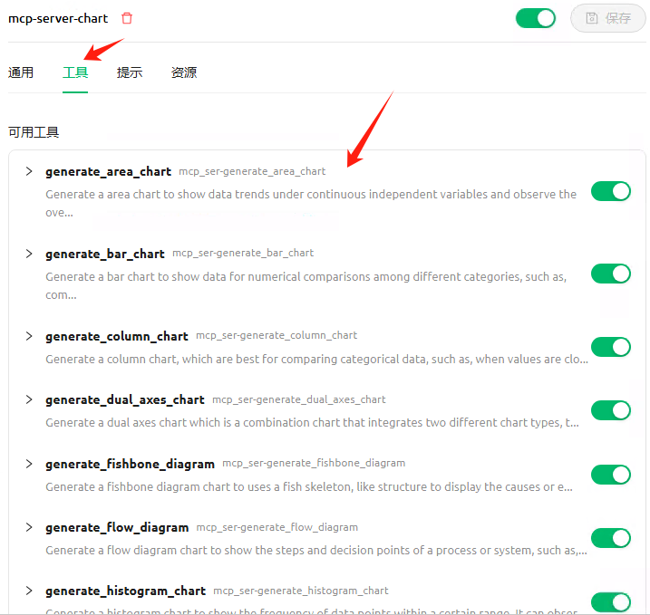

能看到几十个工具方法，就说明运行正常。

新建一个默认会话，选择mcp服务器

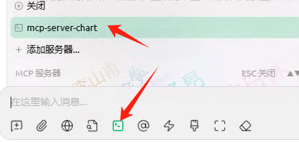

输入提示词：

```
根据诗人的名气以诗人的名字生成一个词云图，至少50位中国古代诗人，给出图片链接后再用Markdown语法直接展示。
```

效果如下：

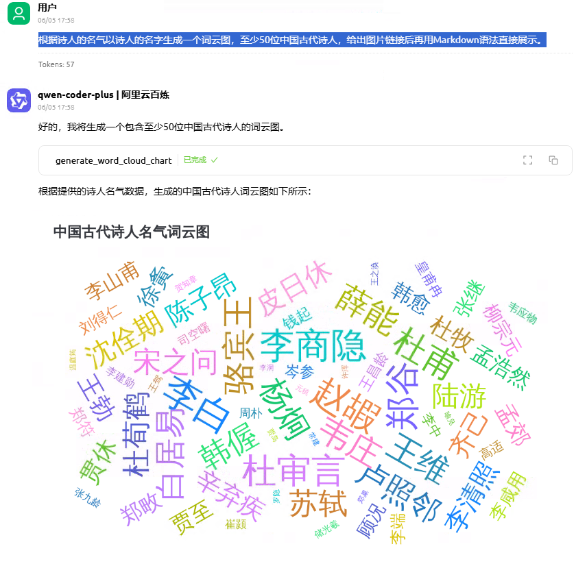

整个过程，大模型就像一位经验丰富的设计师，不仅理解了你的需求，还自动帮你准备好了绘制图表所需的各种参数（比如图片的宽度、高度、标题等），最后给出了图片链接。

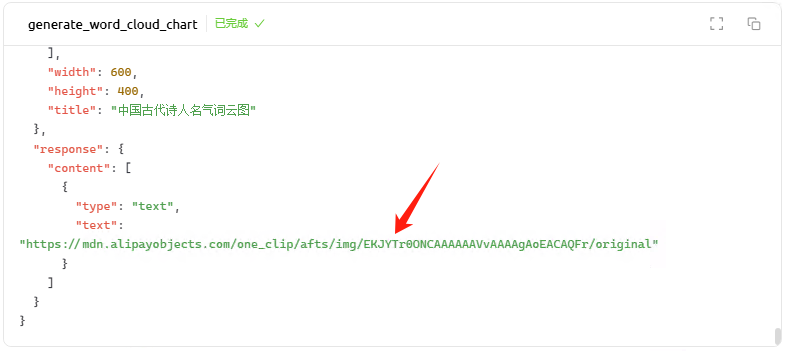

注意，这个链接，公网是可以打开的

https://mdn.alipayobjects.com/one\_clip/afts/img/EKJYTr0ONCAAAAAAVvAAAAgAoEACAQFr/original

三、Dify+可视化图表MCP

目前有很多文章，一般都是通过Dify 结合数据库和 ECharts插件，实现数据可视化的。

但是实现过程比较复杂，首先通过数据库查询原始数据，其次通过python代码转换成 ECharts能够理解的图表格式，最后调用ECharts插件实现图表展示。

整个过程需要不少经验和技巧，一不小心就容易出错。

但是！有了 mcp-server-chart 这个 MCP 工具，事情就变得简单多了。

场景演示：用户用自然语言提问，我们通过 Dify 工作流从数据库里查询数据，并生成图表。

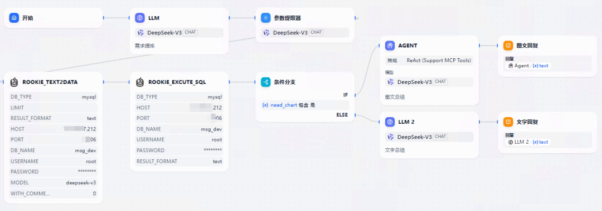

示例数据

为了方便演示，我用MySQL 数据库搭建了一些示例数据

新建表boxoffice

```
CREATE TABLE `boxoffice` (
```

插入数据

```
INSERT INTO boxoffice (id, years, movie_name, score, director, box_office) VALUES
```

打开表，效果如下：

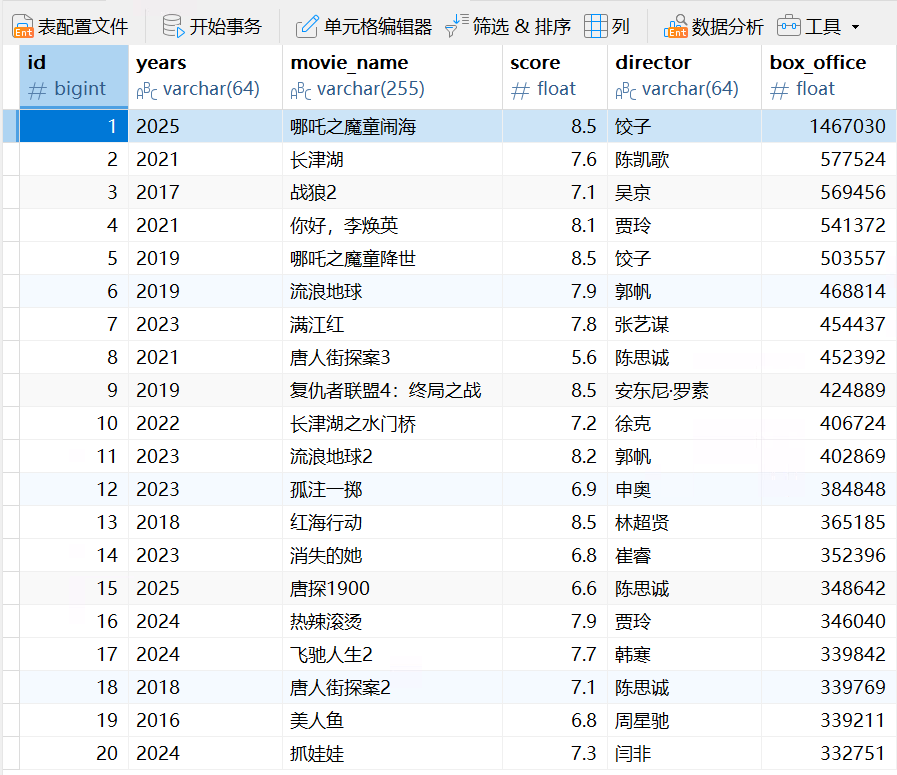

开始节点

新建一个空白应用

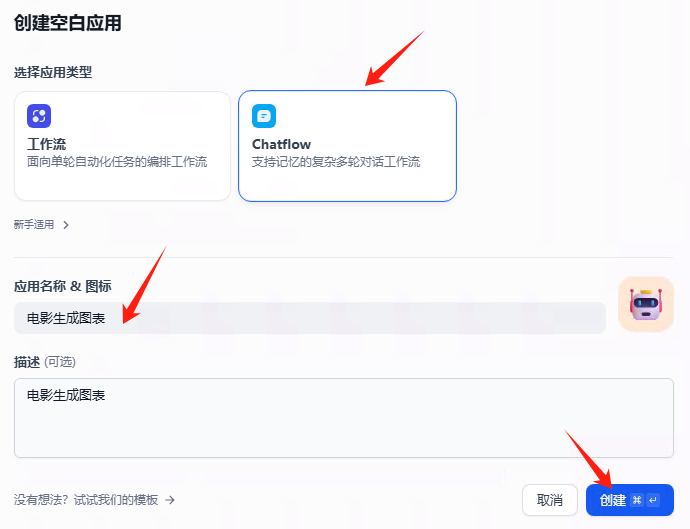

开始节点默认配置，接收用户问题。

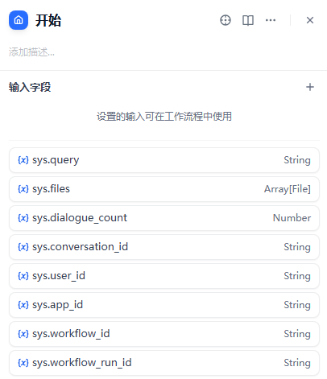

需求提炼

分析用户问题，判断用户是否需要生成图表，提取出SQL查询的需求。

输出如下：

```
sql_requirement: [精炼后的数据查询需求]
```

大模型选择DeepSeek-V3

注意：大模型必须选择DeepSeek-V3，选择其他模型可能会导致最后图表无法生成。

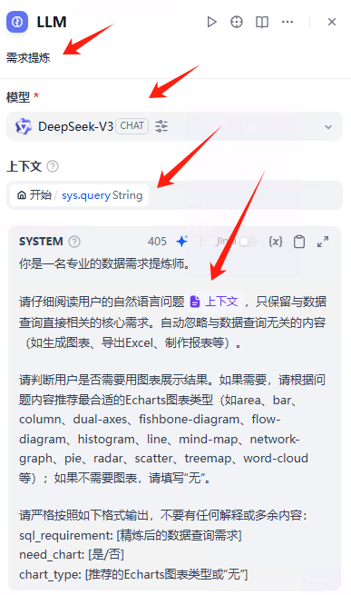

提示词如下：

```
你是一名专业的数据需求提炼师。
```

参数提取器

把上一个节点的三个输出参数提取出来。

添加提取参数

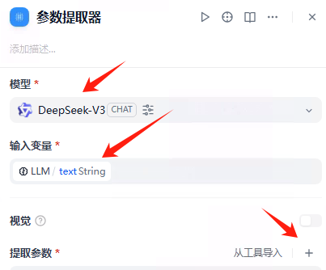

第一个参数，内容如下

```
sql_requirement
```

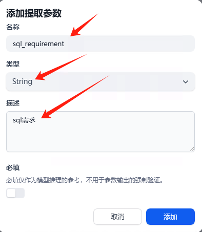

其他参数依次类推

```
need_chart
```

最后效果如下：

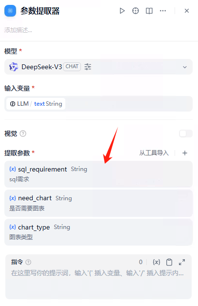

自然语言转SQL（ROOKIE\_TEXT2DATA）

打开插件市场，搜索关键字ROOKIE\_TEXT2DATA，安装插件


添加节点，注意选择rookie text2data

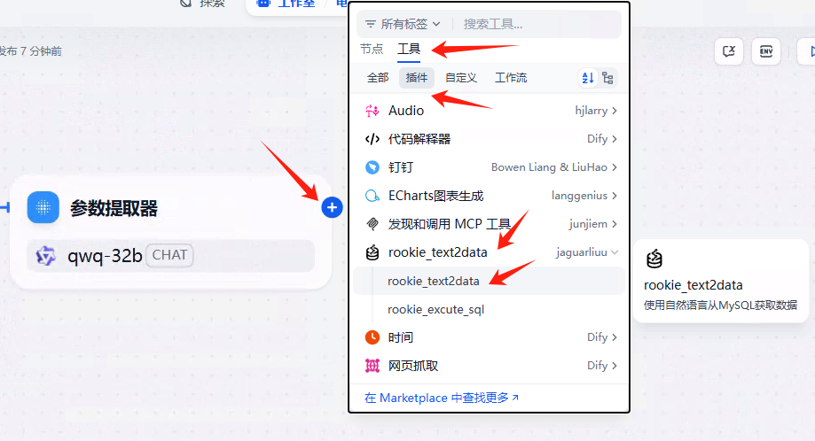

这个节点的核心功能就是把用户的自然语言转成SQL语句了。

输入为提取后的SQL语句需求，关联参数提取节点的sql\_requirement。

数据库配置: 正确填写数据库类型、IP、端口、库名、用户名、密码。

大模型：我这里必须用DeepSeek-V3

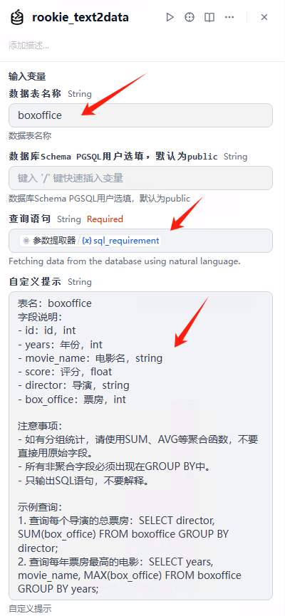

注意：这里的查询语句，选择变量sql\_requirement。输入/就有下拉框

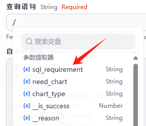

提示词如下：

```
表名：boxoffice
```

数据库配置连接信息

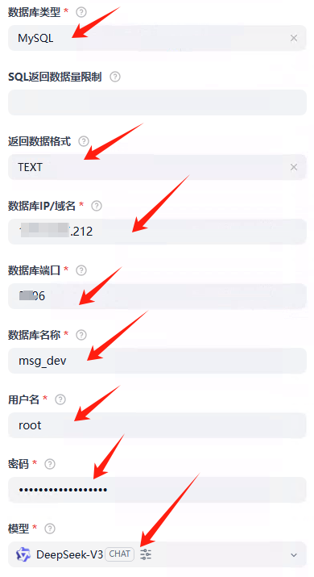

注意返回格式，选择text

执行SQL

此节点负责连接数据库，并执行上一步生成的SQL语句。

输入变量：上一节点返回的SQL语句。

数据库配置: 正确填写数据库类型、IP、端口、库名、用户名、密码。

输出变量：返回数据格式为文本。

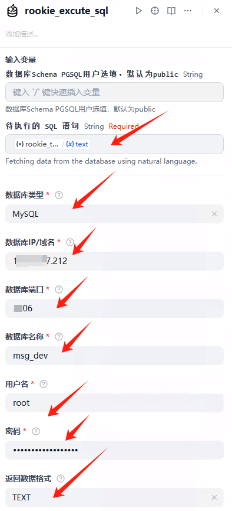

注意返回格式，选择text

注意，这里的执行sql语句，选择变量 ROOKIE TEXT2DATA.text

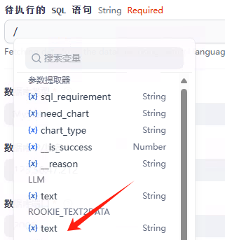

条件分支

判断是否需要图表，给到不同的分支。

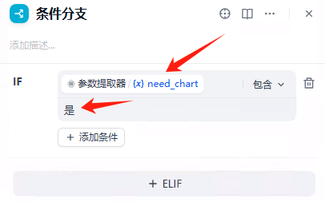

图文总结

如果需要生成图表，走这个节点。

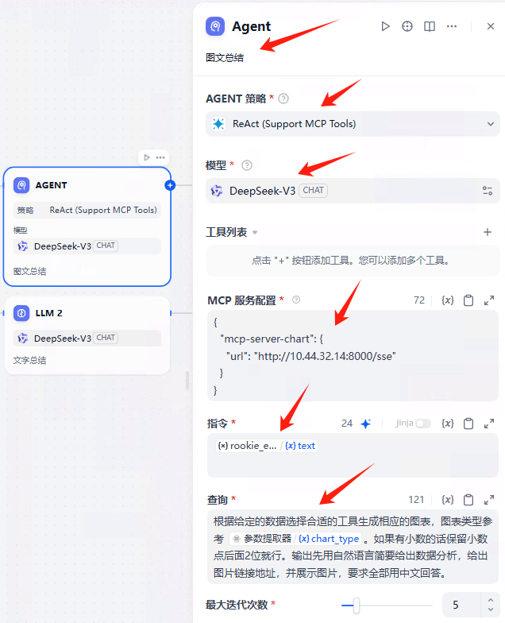

Agent策略选择ReAct（Support MCP Tools）

MCP服务器配置如下，url换成你自己的

```
{
```

注意：这里必须是SSE模式，不能用streamable\_http

为什么？因为插件Agent策略，不支持以streamable\_http协议生成图表，但是SSE协议是支持的。

但是上面你明明用Cherry Studio客户端，可以生成图表了呀。

我们首先要理清一点，mcp-server-chart本身是支持以streamable\_http协议生成图表

Cherry Studio是客户端，它更新快。那么插件Agent策略，它也是客户端，更新很慢。现在问题是插件目前不支持，怎么办？等插件更新就好了。

指令

注意选择ROOKIE EXCUTE SOL.text

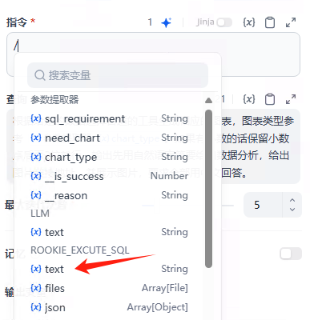

查询

提示词如下：

```
根据给定的数据选择合适的工具生成相应的图表，图表类型参考 {{#1749119517859.chart_type#}}。如果有小数的话保留小数点后面2位就行。输出先用自然语言简要给出数据分析，给出图片链接地址，并展示图片，要求全部用中文回答。
```

注意：这里的提示词复制之后，需要手动替换一下里面的变量。 因为每一个人的变量id是不一样的。 我这里是1749119517859，你那里就不一样了。

手动替换好之后，效果如下：

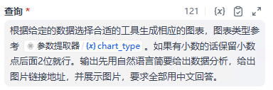

文字总结

如果用户只是想查询数据，不需要图表，那么工作流就会走到这个相对简单的节点。它会根据数据库查询结果，用简洁的自然语言给出分析和意见。

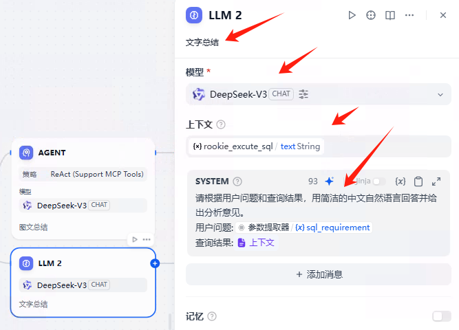

模型，必须是DeepSeek-V3

上下文，选择变量rookie excute\_sql.text

提示词如下：

```
请根据用户问题和查询结果，用简洁的中文自然语言回答并给出分析意见。
```

注意：这里的提示词复制之后，需要手动替换一下里面的变量。 因为每一个人的变量id是不一样的。 我这里是1749119517859，你那里就不一样了。

替换好之后，就是上面的效果了。

回复节点

直接引用图文总结或文字总结的输出就好了。

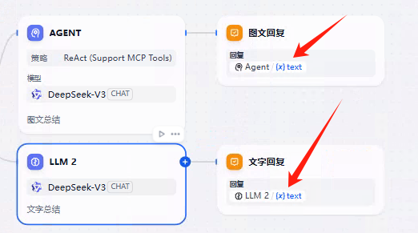

四、测试

比如问一下各导演的票房占比，可以看到给出了分析结果和图片链接地址。

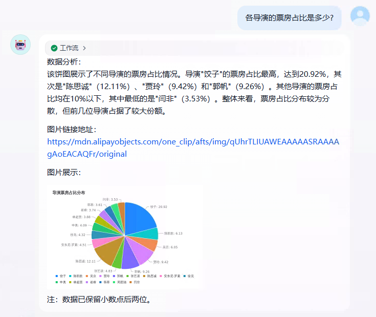

图片链接可以直接打开：

https://mdn.alipayobjects.com/one\_clip/afts/img/qUhrTLIUAWEAAAAASRAAAAgAoEACAQFr/original

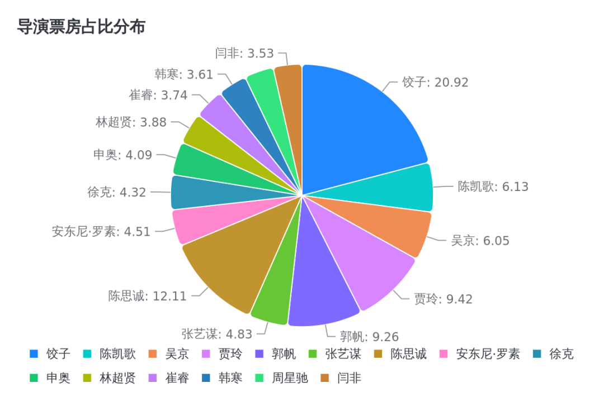

在测试一下折线图。

请用图表展示历年票房变化

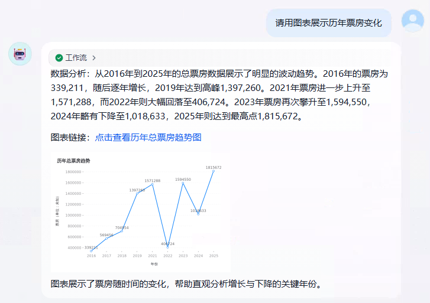

打开图表链接：

https://mdn.alipayobjects.com/one\_clip/afts/img/LX\_NRqh9-FIAAAAARrAAAAgAoEACAQFr/original

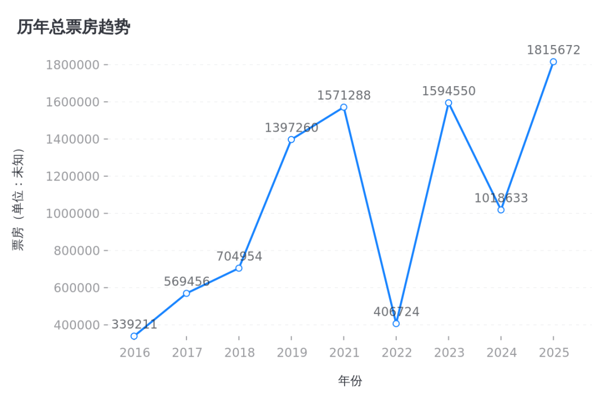

五、AntV插件的使用

除了MCP工具，在插件市场搜索antv可以看到蚂蚁集团提供的这个可视化工具插件。

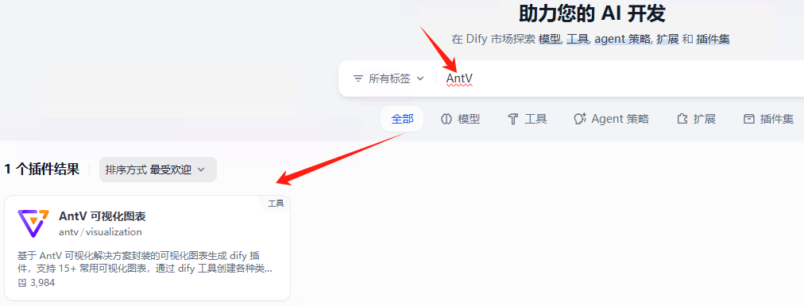

和mcp server一样，也是支持了15种工具。

创建一个Agent

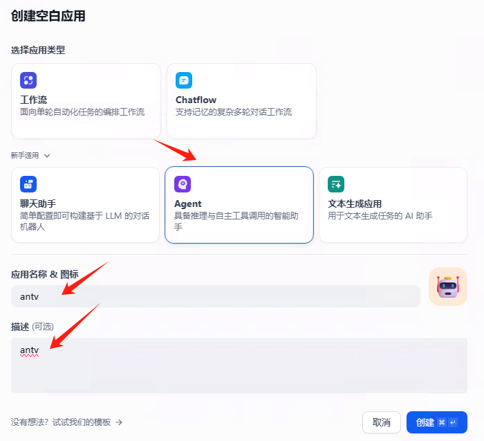

添加这些工具

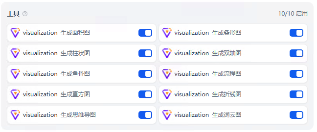

提示词如下：

```
根据用户提供的数据选择相应的工具生成可视化图表。
```

最终效果如下：

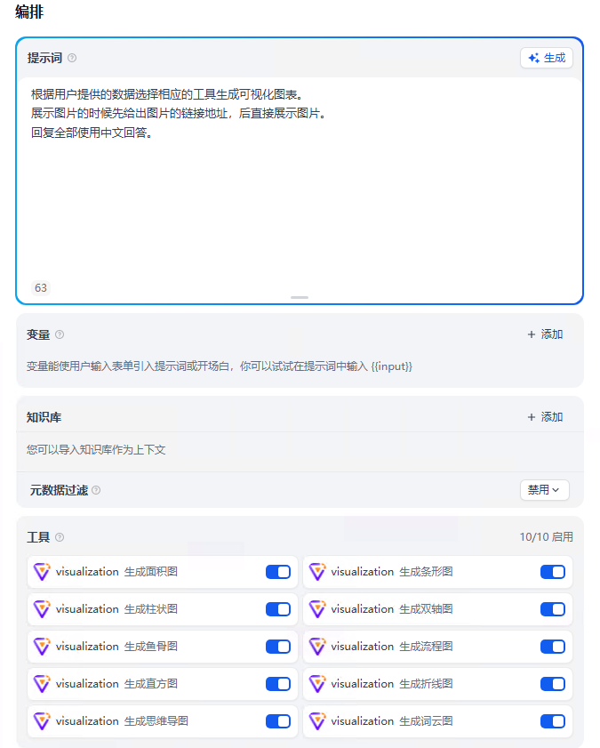

注意确保有生成词云图

默认只能添加10个工具，如果需要添加更多数量，需要修改dify环境变量

```
MAX_TOOLS_NUM=20
```

重启dify所有组件，就可以添加20个工具了。

直接加满

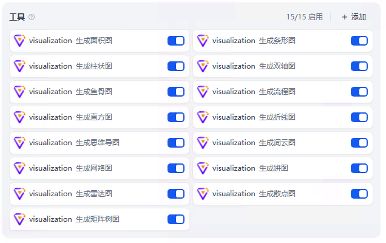

我们就可以随便用自然语言让大模型给出相应的图表了。

我让它生成了一个《三体》小说的人物词云图。

生成一个三体小说主要人物的词云图。至少列举出30个主要人物来。

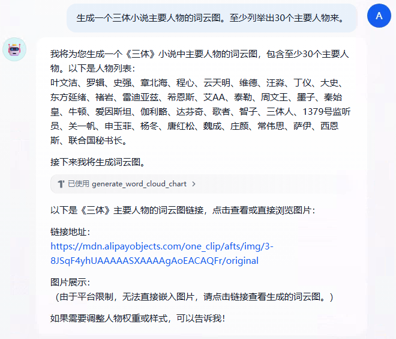

插件不支持插入图片，手动打开图片：

https://mdn.alipayobjects.com/one\_clip/afts/img/3-8JSqF4yhUAAAAASXAAAAgAoEACAQFr/original


当然了，你也可以在工作流中调用这些工具。

和其他的生成图表的插件类似，给出对应的数据。

不过，这个插件可以更方便地调整图表的大小。自定义图表的宽和高。

点击设置

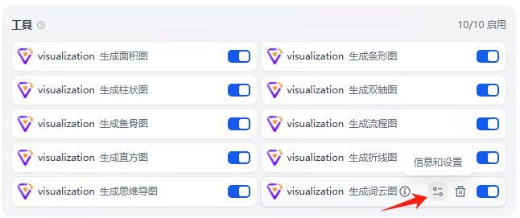

可以设置宽高

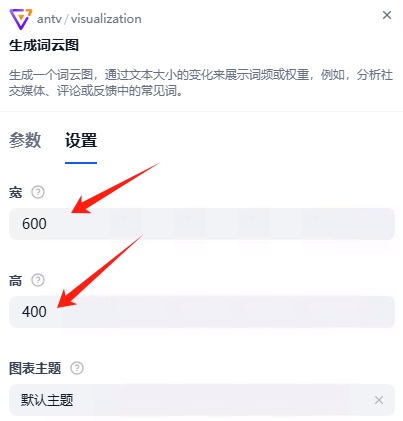

这些“底层轮子”的不断涌现，无疑是一件大好事。

它们让我们能够从繁琐的、重复性的底层技术实现中解放出来，更专注于业务逻辑本身，更聚焦于如何创造真正的价值。

文章读完后，你的**点赞**、分享、推荐，我们都深表感谢！

**点击******


