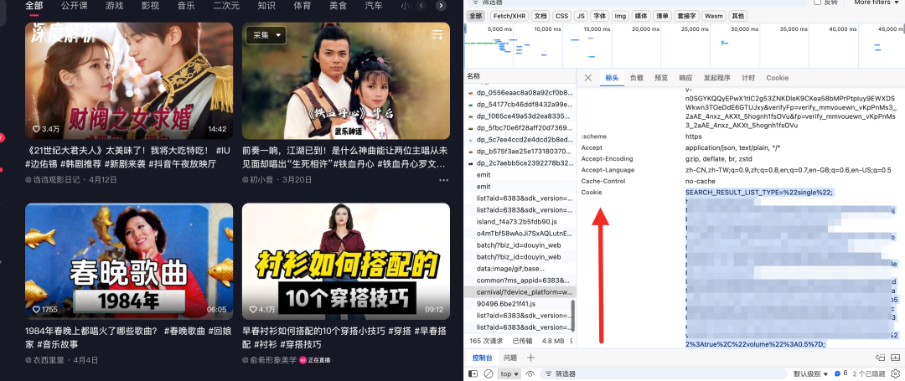
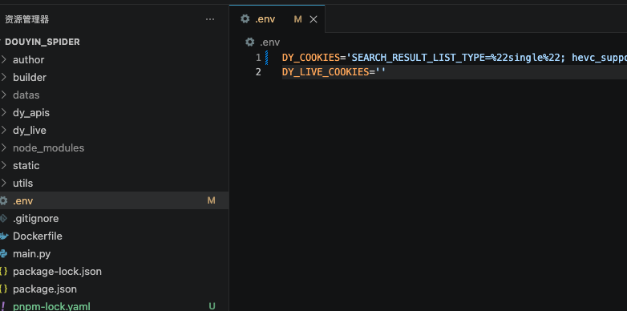
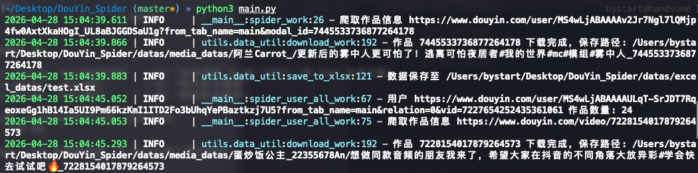

> 📎 来源: [青檬小栈](https://mp.weixin.qq.com/s?__biz=MzkwODYyNTY4MQ==&mid=2247490649&idx=1&sn=191e2e65d89a5249eb86b6bc6d98b1fd&chksm=c1a8d4b48b59a8c94303fa00ff3ffd97b365ad1e319110968029efd1402ca81a844feca1b6df&mpshare=1&scene=1&srcid=0529p3tzXigzVMeEer4J1jh1&sharer_shareinfo=b2f4c25e92d139e210099a3eb849c48d&sharer_shareinfo_first=b2f4c25e92d139e210099a3eb849c48d) | 时间: 2026-05-29 12:49

---


# 项目简介

**DouYin\_Spider** 是一个基于 Python 和 Node.js 的抖音数据采集工具。

它可以帮助开发者获取抖音作品、评论、用户主页、搜索结果、粉丝关注、直播间弹幕等信息，也支持直播间事件监听，例如弹幕、礼物、点赞、进场、关注等。

简单来说，你可以把它理解成一个“抖音数据研究工具箱”。

如果你是新手，可以先不用关心它内部复杂的接口逻辑，只需要知道它主要解决三个问题：

第一，帮你获取抖音上的公开数据。

第二，帮你监听直播间里的实时消息。

第三，帮你把采集到的数据保存下来，方便后续分析。

这对于想学习爬虫、数据分析、直播间互动逻辑、WebSocket 通信的朋友来说，是一个很好的参考项目。

# 功能特点

1、**作品数据采集**

支持获取抖音作品信息，包括作品内容、作者信息、发布时间等数据。

2、**用户信息采集**

支持采集用户主页、作品列表、关注列表、粉丝列表等内容。

3、**评论数据采集**

支持采集作品评论以及评论回复，适合做用户反馈和评论区分析。

4、**关键词搜索采集**

可以根据关键词搜索相关视频内容，方便整理某个领域或热点下的数据。

5、**直播间实时监听**

支持监听直播间弹幕、礼物、点赞、用户进场、关注提醒等事件。

6、**私信消息处理**

支持私信接收、发送私信、查询会话等功能，适合进阶研究。

7、**数据保存导出**

支持将采集结果保存为 JSON、Excel 或媒体文件，方便后续分析。

8、**模块化结构**

项目按接口、直播、工具函数等模块划分，代码结构清晰，便于学习和扩展。

9、**支持 Docker 部署**

提供 Dockerfile，方便在服务器或测试环境中运行。

# 部署方式

项目支持 **本地部署** 和 **Docker 部署**。如果是第一次使用，建议先选择本地部署。

## 本地部署

需要提前安装：

```
Python3.7+Node.js18+
```

检查是否安装成功：

```
python --versionnode --versionnpm --version
```

能正常显示版本号，就说明环境没问题，然后下载项目：

```
git clone https://github.com/cv-cat/DouYin_Spider.gitcd DouYin_Spider
```

安装依赖：

```
pip3 install-r requirements.txtpip3 install protobuf3-to-dict# 配置镜像源npm config set registry https://registry.npmmirror.compnpm config set registry https://registry.npmmirror.com# 下载依赖二选一npminstallpnpminstall
```

如果下载速度慢，可以使用国内镜像源。

项目运行前需要配置 

```
.env
```

 文件，里面主要填写抖音相关 Cookie 信息。

> Cookie 是敏感信息不要发给别人

登录到抖音web端，打开浏览器**F12**随便找几个请求，然后把**Cookie**内容复制出来：



如果 

```
.env
```

 配置不正确，项目可能会出现请求失败或无法获取数据的问题。



然后启动项目，就会开始爬取数据：

```
python main.py
```



是爬虫入口，可根据需求自行修改调用。

直播间监听则是需要去，下面的地址获取**Cookie**：

> live.douyin.com

```
# 启动监听python dy_live/server.py
```

## Docker 部署

如果熟悉 Docker，可以使用容器方式运行。

在项目根目录下执行：

```
docker build -t douyin-spider .# 运行项目docker run --rm --env-file .env douyin-spider# 保存采集结果到本地docker run --rm\  --env-file .env \-v$(pwd)/data:/app/data \  douyin-spider# 运行直播监听docker run --rm --env-file .env douyin-spider python dy_live/server.py
```

---

DouYin\_Spider 是一个功能较完整的抖音数据采集与直播监听项目，覆盖作品采集、评论获取、搜索数据、直播间监听、私信处理和数据保存等能力。

***欢迎大家关注我的公众号，将会为大家推荐更优质的内容！***
