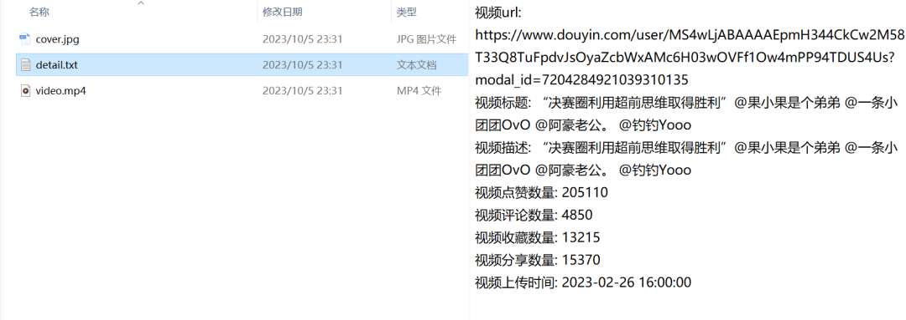
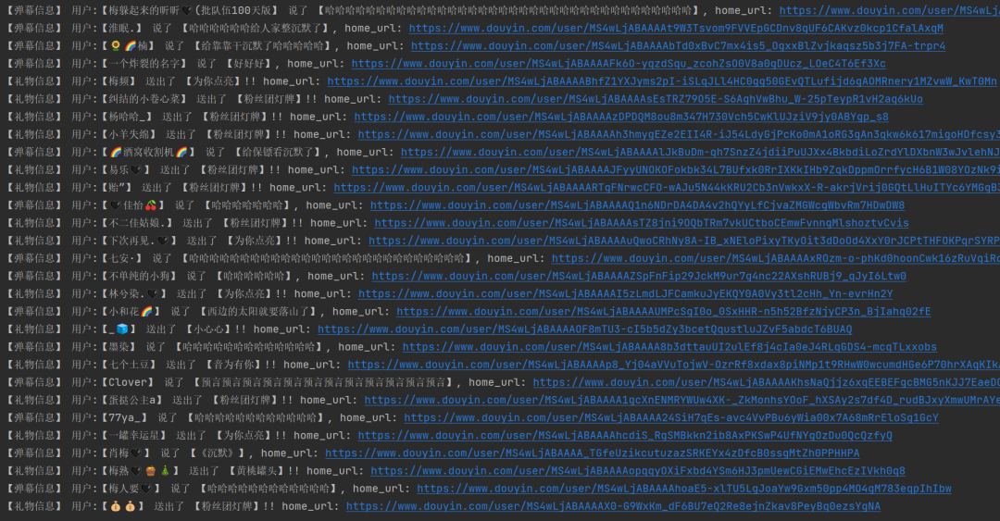
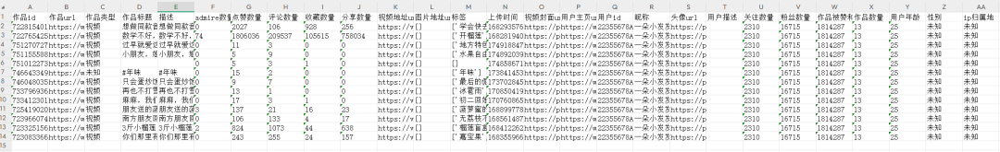
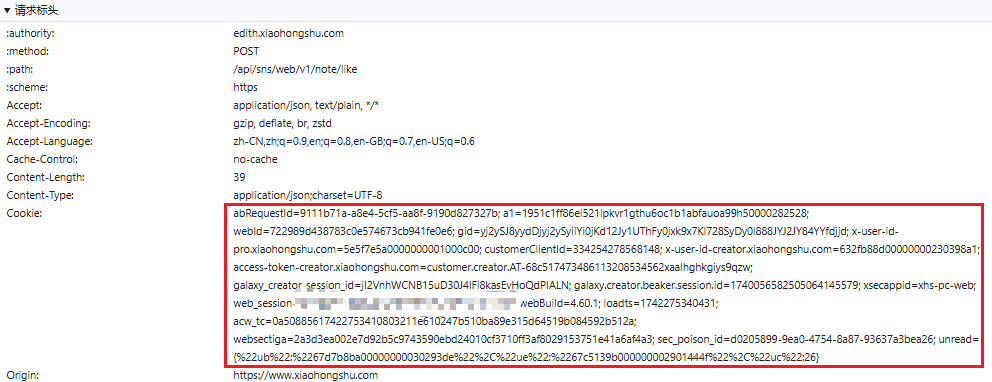

> 📎 来源: [枫瑞博客网](https://mp.weixin.qq.com/s?__biz=MzIxMzQ2Nzc3OA==&mid=2247490253&idx=1&sn=f147c10b6d5d5e8da8ac2faacff56728&chksm=96b23563e860b20110ee232c19dd4adfd9cb1562e6b5668bc23873b5274e8c417618cb054983&mpshare=1&scene=1&srcid=0529Qxyc5wGJseGq2rVDgPl0&sharer_shareinfo=00243e028ba6c89e7ae1a36df491f1e4&sharer_shareinfo_first=00243e028ba6c89e7ae1a36df491f1e4) | 时间: 2026-05-29 12:51

---

生为人杰，死亦鬼雄，我辈修士，何惜一战


# 序

DouYin\_Spider 是一款面向抖音平台的专业数据采集与交互工具，面向AI Agent与自动化场景提供通信能力，支持数据爬取、直播间监听、私信实时处理等核心能力，项目基于Python与Node.js构建，可快速部署运行

# 核心功能

支持用户主页信息与作品详情数据采集

支持评论区数据采集，包含多级评论回复

支持智能搜索，可搜索视频、用户、直播相关内容

支持关注列表与粉丝列表数据获取

支持消息通知、收藏列表、推荐流数据采集

支持直播间实时监听，可获取弹幕、礼物、进场、关注、点赞、房间热度信息

支持直播间发送弹幕与直播间点赞操作

支持WebSocket实时接收私信

支持主动发送私信与会话列表创建、查询

支持视频点赞、发布评论、回复评论互动操作

支持作品收藏、移动、取消收藏操作

具备自动重试与断线重连的高性能保障机制

适配抖音最新API，具备完善异常处理能力

支持proxy代理配置，保障运行安全稳定

支持结构化目录存储与JSON、EXCEL、MEDIA格式化输出

# 截图







# 环境

需要Python 3.7及以上版本

需要Node.js 18及以上版本

# 依赖

```
pip install -r requirements.txt
```

# 运行

```
# 数据爬取
```

# 配置

用小红书的cookie获取为例

注意.env文件有两个变量，一个是打开www.douyin.com这个域名获取的，另一个是打开live.douyin.com这个域名获取的，第一个用于爬虫，第二个用于直播间监听

配置文件在项目根目录.env文件中，将下图自己的登录cookie放入其中，cookie获取在浏览器f12打开控制台，点击网络，点击fetch，找一个接口点开



# 开源地址

https://github.com/waydone/DouYin\_Spider

[PHP+SQLite简易版仓库管理系统](https://mp.weixin.qq.com/s?__biz=MzIxMzQ2Nzc3OA==&mid=2247490171&idx=1&sn=f8260a635709e441df712c068ed93966&scene=21#wechat_redirect)

[【Res Downloader】傻瓜式下载视频号、小程序、网页、图片、音视频等的工具](https://mp.weixin.qq.com/s?__biz=MzIxMzQ2Nzc3OA==&mid=2247489967&idx=1&sn=320ccd297efbbc132eb2dc04329cec00&scene=21#wechat_redirect)
