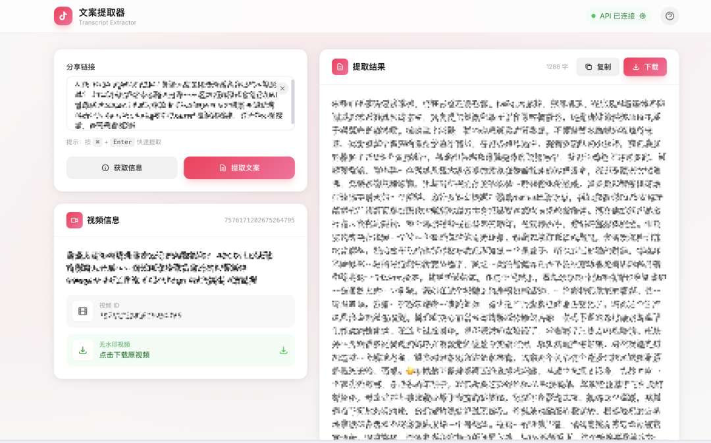
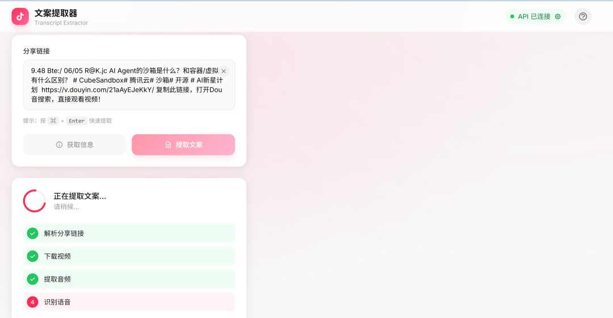

> 📎 来源: [掘金GitHub](https://mp.weixin.qq.com/s?__biz=Mzk2NDMzMDY3OA==&mid=2247484351&idx=1&sn=c1d56e9879db0e12a3f41f357b14cf70&chksm=c5a355ece65d32460a1608aa76be58e4dd7515a8df038c1fbc1530d01a2aaad1a8c4432a5128&mpshare=1&scene=1&srcid=05293y4tgnAP7CZuIp5XZKbv&sharer_shareinfo=3926ab12194c824889fd88c238102e12&sharer_shareinfo_first=3926ab12194c824889fd88c238102e12) | 时间: 2026-05-29 12:44

---

刷到抖音想保存无水印版本？

想提取视频里的文案？

douyin-mcp-server 一次性搞定这两件事。

支持 WebUI 浏览器操作，也支持集成到 Claude Desktop。

GitHub：https://github.com/yzfly/douyin-mcp-server

## 01 核心功能

这东西解决了两个核心痛点：

**无水印视频下载** — 从抖音分享链接直接获取高质量无水印视频下载链接，不用安装任何 APP，不用看广告。

**AI 语音文案提取** — 视频下载后自动提取音频，调用硅基流动 SenseVoice API 转成文字。超过 1 小时或 50MB 的音频自动分段处理，不用担心 API 限制。



## 02 三种使用方式

项目支持三种玩法，按需选择。

### 2.1 WebUI 浏览器操作（最推荐）

普通用户首选。打开浏览器就能用，不需要记命令行。

操作步骤：

1. 1. 克隆项目并安装依赖
2. 2. 启动服务：

   ```
   uv run python web/app.py
   ```
3. 3. 浏览器访问 

   ```
   http://localhost:8080
   ```
4. 4. 粘贴抖音链接，选择「获取信息」或「提取文案」

API Key 配置有两种方式：

- 浏览器内配置（推荐）：页面点击「API 未配置」，输入 API Key 保存到本地
- 环境变量：启动前设置 

  ```
  API_KEY
  ```

   环境变量



### 2.2 MCP Server 集成

Claude Desktop 用户可以直接在对话中调用。配置文件添加：

```
{  "mcpServers": {    "douyin-mcp": {      "command": "uvx",      "args": ["douyin-mcp-server"],      "env": {        "API_KEY": "sk-xxxxxxxxxxxxxxxx"      }    }  }}
```

然后在对话里说：「帮我提取这个视频的文案 https://v.douyin.com/xxxxx/」，Claude 会自动调用工具提取。

### 2.3 命令行工具

开发者批量处理用命令行更高效。

```
# 获取视频信息（无需 API）uv run python douyin-video/scripts/douyin_downloader.py -l "分享链接" -a info# 下载无水印视频uv run python douyin-video/scripts/douyin_downloader.py -l "分享链接" -a download -o ./videos# 提取文案（需要 API_KEY）export API_KEY="sk-xxx"uv run python douyin-video/scripts/douyin_downloader.py -l "分享链接" -a extract -o ./output# 提取文案并保存视频uv run python douyin-video/scripts/douyin_downloader.py -l "分享链接" -a extract -o ./output --save-video
```

输出结果是一个 Markdown 文件，包含视频元数据和 AI 识别的文案内容。

## 03 技术亮点

这个项目的设计细节值得说。

### 3.1 大文件自动分段

SenseVoice API 有单次 1 小时/50MB 的限制。项目自动处理这个问题：

- 检测音频时长和文件大小
- 用 FFmpeg 自动分割成 9 分钟片段
- 逐段调用 API 转录
- 合并所有文本结果

用户不需要关心这些细节，直接上传长视频就行。

### 3.2 输出格式规范

生成的 Markdown 文件结构清晰：

```
# 视频标题| 属性 | 值 ||------|-----|| 视频 ID | `7600361826030865707` || 提取时间 | 2026-01-30 14:19:00 || 下载链接 | [点击下载](url) |---## 文案内容这里是 AI 识别的语音文案...
```

方便后续整理、搜索或复用。

### 3.3 依赖管理简单

只用三个核心依赖：

- **uv** — Python 包管理（安装快，比 pip 好用）
- **Python 3.10+** — 主流版本都支持
- **FFmpeg** — 音视频处理（系统级安装）

没有复杂的依赖链，不容易踩坑。

## 04 怎么上手

15 分钟就能跑起来。

**Step 1 安装 uv**

```
curl -LsSf https://astral.sh/uv/install.sh | sh
```

**Step 2 获取免费 API Key**

硅基流动：https://cloud.siliconflow.cn/i/DrgxdqSF
新用户有免费额度。

**Step 3 克隆项目并启动**

```
git clone https://github.com/yzfly/douyin-mcp-server.gitcd douyin-mcp-serveruv syncuv run python web/app.py
```

**Step 4 浏览器访问**

打开 

```
http://localhost:8080
```

，点击页面顶部配置 API Key，粘贴抖音链接开始用。

整个过程不需要改配置文件，不需要记复杂命令。

## 写在最后

工具类项目最大的价值是「开箱即用」。

WebUI 对普通用户友好，MCP 集成对 AI 玩家友好，命令行对开发者友好。

GitHub：https://github.com/yzfly/douyin-mcp-server
