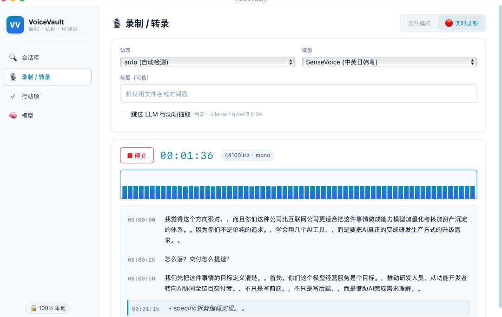
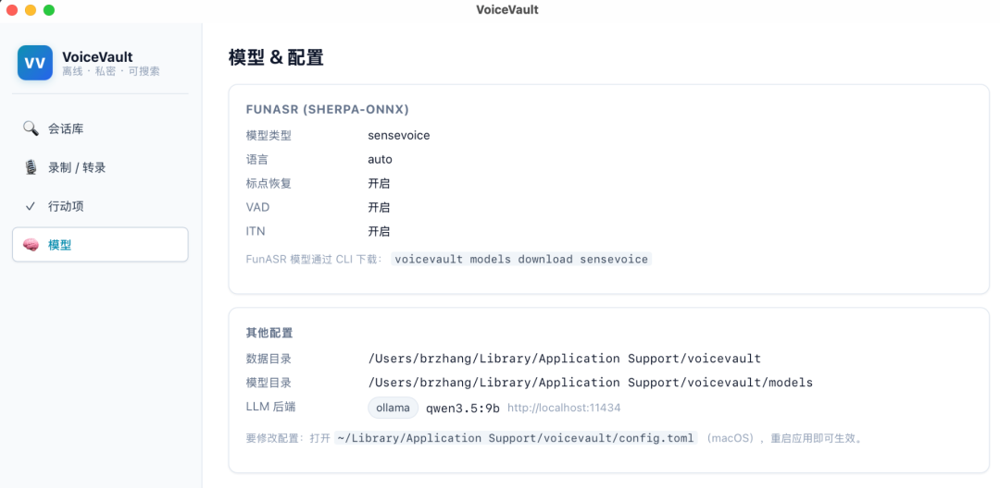
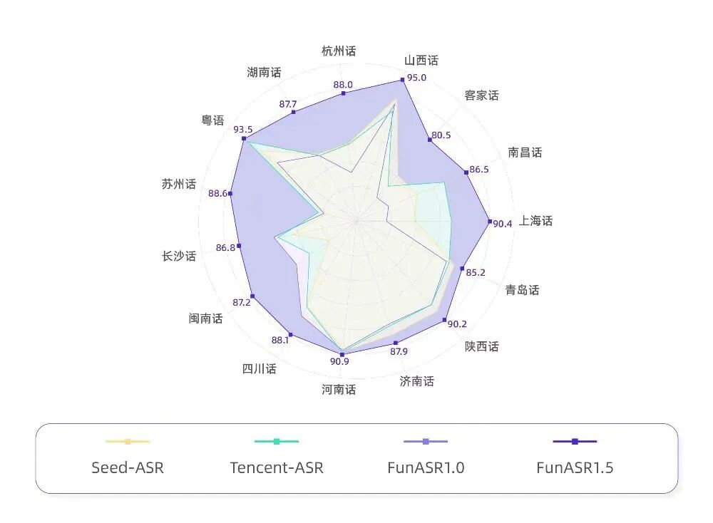
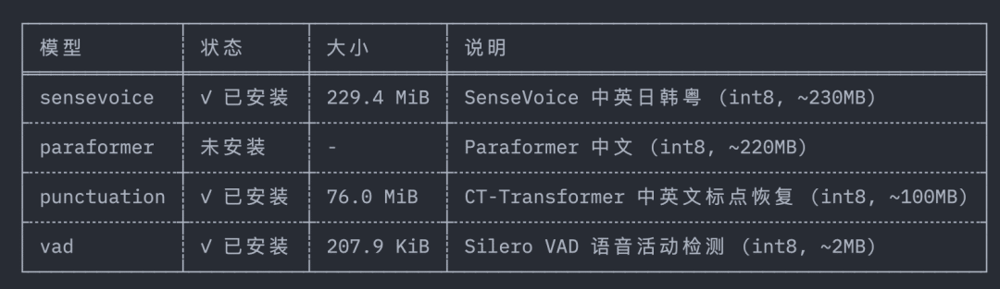

> 📎 来源: [老码小张](https://mp.weixin.qq.com/s?__biz=MzkxNzY0OTA4Mg==&mid=2247493342&idx=1&sn=93729d8a919f43b07ec7d598d6e042a7&chksm=c0330a7f8bc910962e8a8c0f5cae86baaf5add9e33f532deed87479ff3640b54560c5aeadf38&mpshare=1&scene=1&srcid=0530L0Trd9XJwGkteuU3SyDh&sharer_shareinfo=06e744f64556d6039f7ae463c44535e9&sharer_shareinfo_first=06e744f64556d6039f7ae463c44535e9) | 时间: 2026-05-30 19:30

---

把 VoiceVault 的转录引擎从 Whisper 迁移到 FunASR（sherpa-onnx），中文识别速度提升 3x，不再需要 500MB 的模型文件。但"切个后端"这件听起来很简单的事，让我在 GitHub Release 的 404、Tauri 白屏、trait object 生命周期和 CSP 策略里翻滚了一整天。这篇文章把每个坑都扒干净。



asr真流式真的好



干掉 wishper，用上 funAsr

### 为什么要换引擎

Whisper 是个好模型，但它有三个让我越来越难受的问题：

**1. 中文不是一等公民**

Whisper 的训练数据以英文为主。

```
base
```

 模型跑中文会议，标点全丢、语气词乱飞、"的"和"得"五五开。想要像样的中文，至少得上 

```
medium
```

（1.5GB），M1 Pro 推理一分钟音频要 40 秒。

**2. 模型太大，用户流失在下载**

告诉用户"先下载一个 1.5GB 的模型"，90% 的人关掉页面。

```
base
```

 模型 141MB 勉强可以接受，但效果又不行。

**3. 流式是假流式**

上一篇文章说过，Whisper 不是流式架构。每次 partial 都要对整段 buffer 重推理。30 秒的音频，每 2.5 秒做一次 partial，每次推理完整 30 秒 —— CPU 在烧，但用户看到的文字并没有变多少。

然后我遇到了 **FunASR**（via sherpa-onnx）。



各项指标 SOTA

### FunASR / sherpa-onnx 凭什么

sherpa-onnx 是新一代一男哥（Daniel Povey，Kaldi 之父）团队的推理框架。它把阿里达摩院的 FunASR 系列模型（SenseVoice、Paraformer）打包成纯 ONNX，提供 C API + 多语言绑定。

三个硬数字说服了我：

| 对比项 | Whisper base | SenseVoice int8 |
| --- | --- | --- |
| 模型大小 | 141 MB | 229 MB（但含 5 种语言） |
| 1 分钟中文推理 | ~4 秒 | **~1.2 秒** |
| 内置标点恢复 | 无 | 有（ITN + CT-Transformer） |
| 内置 VAD | 无（靠外挂 RMS） | 有（Silero VAD） |

而且 SenseVoice 原生支持中英日韩粤五种语言，**不需要指定语言参数就能自动检测**。这对多语言会议场景是杀手级功能。

更关键的是：sherpa-onnx 提供了 Rust crate 

```
sherpa-onnx
```

，直接 

```
cargo add sherpa-onnx --features static
```

，静态链接进二进制，**零运行时依赖**。

### 双后端架构：一个 trait 搞定

VoiceVault 在 Phase 1 就抽了一个 

```
LlmBackend
```

 trait，让 Ollama 和 OpenAI 共存。这次对转录引擎做同样的事。

核心 trait 只有 3 个方法：

```
pub trait TranscriptionBackend: Send + Sync {    fn transcribe(&self, pcm_16k: &[f32]) -> Result<Vec>;    fn backend_name(&self) -> &str;    fn language(&self) -> &str;}
```

输入统一为 **16kHz mono f32 PCM**（这是 Whisper 和 FunASR 共同的要求），输出统一为 

```
Vec
```

。调用方不需要知道底层跑的是什么。

FunASR 后端的实现核心大概长这样：

```
impl TranscriptionBackend for FunasrBackend {    fn transcribe(&self, pcm_16k: &[f32]) -> Result<Vec> {        let duration_secs = pcm_16k.len() as f64 / 16000.0;        if self.use_vad && self.vad.is_some() && duration_secs > 30.0 {            // 长音频：Silero VAD 切段 → 逐段推理            self.transcribe_with_vad(pcm_16k)        } else {            // 短音频：一次性推理            self.transcribe_whole(pcm_16k)        }    }}
```

配置切换也是一行 TOML：

```
# config.tomlbackend = "funasr"   # 或 "whisper"[funasr]model_kind = "sensevoice"use_punctuation = trueuse_vad = true
```

**不改代码，不改命令行参数**。整个 CLI 和桌面端的转录管线自动走 FunASR。

### FunASR 模型从 sherpa-onnx 的 GitHub Releases 下载要注意选对模型

FunASR 模型从 sherpa-onnx 的 GitHub Releases 下载。我按照 README 里的 tag 

```
v1.12.39
```

 拼了 URL：

```
https://github.com/k2-fsa/sherpa-onnx/releases/download/v1.12.39/  sherpa-onnx-offline-punctuation-ct-transformer-zh-int8.tar.bz2
```

结果：**HTTP 404 Not Found**。

我确认了三遍文件名没拼错，然后去 GitHub 看那个 release —— 281 个 assets，**没有一个叫 punctuation 的**。

折腾了 20 分钟后我意识到：sherpa-onnx 的模型不是按版本号发 release 的，是按**类型标签**发的。

用 GitHub API 扫了所有 releases：

```
curl -s "https://api.github.com/repos/k2-fsa/sherpa-onnx/releases?per_page=100&page=2" \  | python3 -c "import json, sysfor r in json.load(sys.stdin):    for a in r.get('assets', []):        if 'punct' in a['name'].lower():            print(f\"{r['tag_name']}: {a['name']}\")"
```

输出：

```
punctuation-models: sherpa-onnx-punct-ct-transformer-zh-en-vocab272727-2024-04-12-int8.tar.bz2
```

**tag 不是 

```
v1.12.39
```

，而是 

```
punctuation-models
```**。而且文件名也完全不同 —— 多了 

```
zh-en-vocab272727
```

 这一段。

逐个验证后发现，**四个模型全错**：

| 模型 | 错误 tag | 正确 tag | 文件名也变了？ |
| --- | --- | --- | --- |
| SenseVoice | v1.12.39 | **asr-models** | 是，  ``` -int8- ```   位置不同 |
| Paraformer | v1.12.39 | **asr-models** | 是，完全不同的日期 |
| 标点恢复 | v1.12.39 | **punctuation-models** | 是，名字大改 |
| Silero VAD | v1.12.39 | **asr-models** | 是，**不是 tar.bz2，是单个 .onnx 文件** |



VAD 最骚：别的模型都是 tar.bz2 压缩包，就它一个裸的 

```
silero_vad.int8.onnx
```

 文件，200KB，直接下载。

下载代码得加分支：

```
async fn download_funasr_model(ctx: &AppContext, info: &FunasrModelInfo) -> Result<()> {    let is_single_file = !info.archive.ends_with(".tar.bz2");    if is_single_file {        // 单文件下载（如 silero_vad.int8.onnx）        std::fs::create_dir_all(&local_dir)?;        let target = local_dir.join(&info.archive);        download_file(&url, ⌖, info.archive).await?;    } else {        // tar.bz2 归档：下载 → 解压 → 重命名        download_file(&url, &archive_path, info.archive).await?;        Command::new("tar").args(["xjf", ...]).output()?;        std::fs::rename(&extracted_dir, &local_dir)?;    }}
```

**经验**：不要相信 README 里的下载 URL。用 

```
curl -sI
```

 验证每一个。302 重定向 = 存在，404 = 不存在

### 流式转录器被 Whisper 绑死了

VoiceVault 的流式转录（实时录音 + 实时出字幕）是整个产品最复杂的组件。上一篇文章用了 2000 字讲它的架构。

问题是：**它被 Whisper 硬编码了**。

```
// 改之前：直接依赖 Whisper 的 Transcriberpub struct StreamingTranscriber {    // ...}impl StreamingTranscriber {    pub fn start(cfg: StreamingConfig) -> Result<Self> {        let transcriber = Arc::new(Transcriber::new(&cfg.model_path, &cfg.language)?);        // ...    }}
```

```
Transcriber
```

 就是 whisper-rs 的封装。想用 FunASR 做流式？整个 

```
StreamingTranscriber
```

 要重写。

但仔细看代码，流式的核心逻辑跟具体后端**完全无关**：

1. 1. VAD 检测静音边界 → commit
2. 2. 定时发 partial 预览
3. 3. 超时强制 commit
4. 4. 音频归一化
5. 5. 事件分发

真正跟后端相关的只有一行：

```
transcriber.transcribe(&pcm)
```

。

于是重构方案很清晰 —— **把 

```
Arc
```

 换成 

```
Arc
```**：

```
// 改之后：接受任意后端impl StreamingTranscriber {    pub fn start(        cfg: StreamingConfig,        backend: Arc<dyn TranscriptionBackend + Send + Sync>,    ) -> Result<Self> {        let task = tokio::spawn(async move {            run_loop(cfg, backend, input_rx, event_tx, stop_rx).await;        });        // ...    }}
```

```
StreamingConfig
```

 也瘦了 —— 去掉了 

```
model_path
```

 和 

```
language
```

（这些是具体后端的事，不是流式框架的事）：

```
// 改之前pub fn new(model_path: PathBuf, language: String, input_sr: u32) -> Self// 改之后pub fn new(input_sr: u32) -> Self
```

调用方（桌面 

```
start_streaming
```

 命令）负责创建后端：

```
let backend: Arc<dyn TranscriptionBackend + Send + Sync> = match state.config.backend {    TranscriptionBackendKind::Funasr => {        let funasr = FunasrBackend::new(&funasr_config)?;        Arc::new(funasr)    }    TranscriptionBackendKind::Whisper => {        let whisper = Transcriber::new(&model_path, ⟨)?;        Arc::new(whisper)    }};let mut transcriber = StreamingTranscriber::start(stream_cfg, backend)?;
```

**重构量**：改了 ~50 行核心代码，没增加复杂度，去掉了一个硬编码依赖。所有原有的单元测试继续通过。

这种重构如果在 Phase 1 做就是"过度设计"。但在第五次迭代做，就是"刚好"。**好的架构是演进出来的，不是预测出来的**。

### 迁移后的效果

拉个对比：

```
Whisper (base)         FunASR (SenseVoice int8)──────────────────────────────────────────────────────────────────────模型下载            141 MB                  229 MB（含 5 语种）+ 标点恢复           无                     + 76 MB+ VAD               无                     + 0.2 MB──────────────────────────────────────────────────────────────────────总下载量            141 MB                  305 MB──────────────────────────────────────────────────────────────────────1 分钟中文推理       ~4 秒                   ~1.2 秒标点                无                      自动恢复语种切换            需手动指定               自动检测长音频处理          整段推理（30s 限制）      VAD 分段推理（无限制）
```

最明显的改善：

1. 1. **标点回来了**。CT-Transformer 标点恢复模型自动给中文加句号逗号问号，转录结果终于像人话了
2. 2. **长音频不再崩**。Silero VAD 把 1 小时音频切成几百个 2-10 秒的片段，逐段推理，内存稳定
3. 3. **首次启动更快**。FunASR 模型加载 200ms，Whisper base 要 800ms

### 给想做类似事情的你的建议

#### sherpa-onnx 是 2026 年 Rust 端侧推理的最佳选择

如果你在做本地 ASR/TTS/VAD，sherpa-onnx 的 Rust 绑定值得认真看。它的优势：

- 静态链接，零运行时依赖
- ONNX Runtime 后端，支持 CPU / GPU / NNAPI / CoreML
- 模型生态丰富（SenseVoice / Paraformer / Zipformer / Silero VAD / CT-Transformer 标点）
- C API 稳定，Rust crate 活跃维护

缺点：模型散落在不同 GitHub Release tag 里，发现正确的下载 URL 需要侦探技能。

### 写在最后

这次迁移的技术收获不在于"用 FunASR 替代 Whisper" —— 那只是换了一行依赖。真正的收获是：

VoiceVault 现在有了真正的实时流式字幕、全文搜索、LLM 行动项提取。全部离线，全部开源，13MB 二进制。

下一步：Silero VAD 替换 RMS VAD 做流式分段，partial 增量复用减少重复推理。做完这两件事，流式转录就真正到"生产级"了。

开源地址：http://github.com/coder-brzhang/voicevault

注意，本项目仅在小张的400 多个人的小群（公众号菜单-联系我-加群）中分享。
