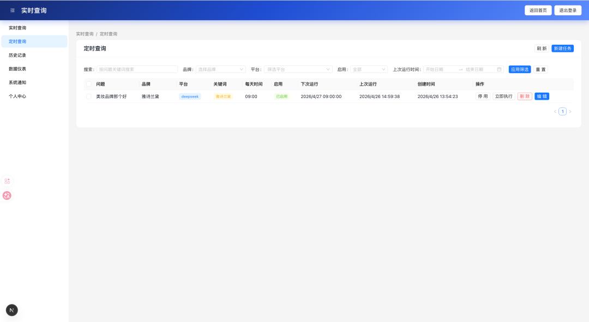
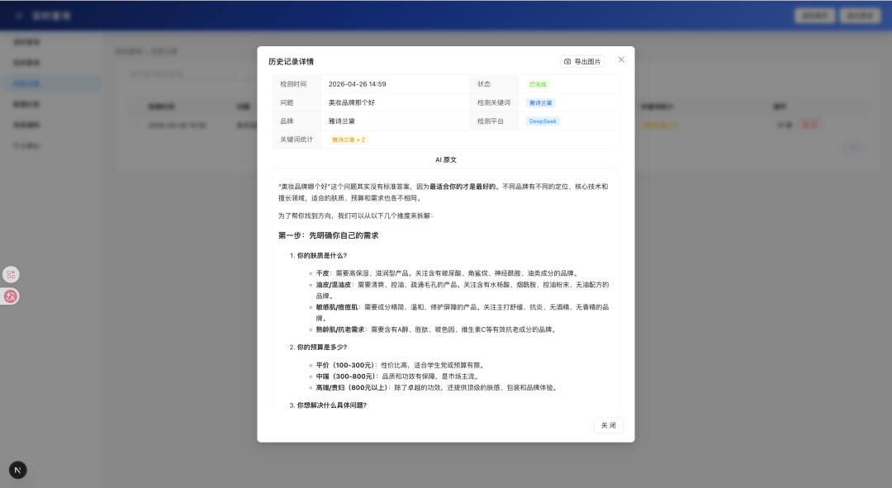
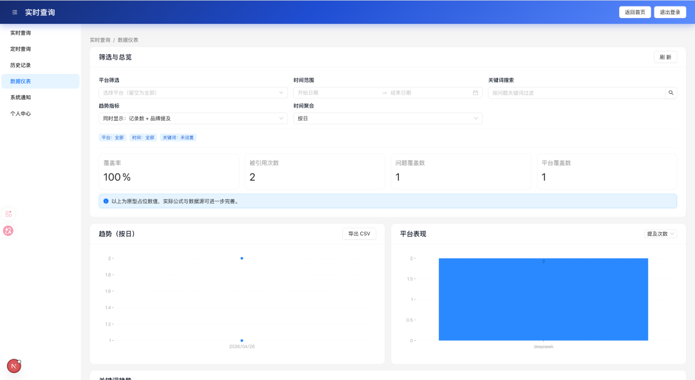

> 📎 来源: [Goodie AI](https://mp.weixin.qq.com/s?__biz=MzU4OTgwMzMwNA==&mid=2247485047&idx=1&sn=d2adf387d562a29dc7326fde723d6ec1&chksm=fca07ceddafb055ad02fcc30bed5e9cc177227d284ec8cdf0aa2f39c952d23d496d15736340d&mpshare=1&scene=1&srcid=0519gnVUmMqdzSR9nyyXYH5u&sharer_shareinfo=3a6ce5126aa795c7caec089abcc35056&sharer_shareinfo_first=3a6ce5126aa795c7caec089abcc35056) | 时间: 2026-05-19 11:47

---

在过去传统 SEO 关注的是搜索引擎里的关键词排名、网页收录和搜索流量。

但随着豆包、DeepSeek、Kimi、通义千问、腾讯元宝等 AI 平台被越来越多用户使用，信息获取方式正在发生变化。

很多用户不再只是输入关键词，然后浏览一页搜索结果，而是直接向 AI 提问：

- 有哪些值得推荐的工具？
- 某个品牌怎么样？
- 某类产品有哪些选择？
- 某个行业有哪些代表公司？

在这些场景里，用户看到的是 AI 生成的一段回答。

这也带来了一个新的问题：

**品牌是否会出现在 AI 的回答中？AI 又是如何描述这个品牌的？**

围绕这个问题，一个开源的 GEO 生成式搜索监测系统被开发出来。

项目地址：

定时任务

监测结果

数据仪表

> https://github.com/lorin-code/ai-geo-monitoring

## 什么是 GEO？

GEO 是 **Generative Engine Optimization** 的简称，通常可以理解为“生成式引擎优化”。

如果说传统 SEO 更关注网页在搜索引擎中的排名，那么 GEO 更关注品牌、产品、服务或关键词在 AI 生成式回答中的呈现情况。

在 AI 搜索场景中，用户看到的不一定是网页列表，而是 AI 整理后的答案。

因此，品牌需要关注的不只是：

> 网站有没有排名？

还包括：

> AI 回答相关问题时，有没有提到这个品牌？

以及：

> AI 是正面、准确地描述品牌，还是遗漏、误解，甚至更多提到了竞品？

这类问题很难单靠人工临时测试长期追踪，因此需要一套系统化的监测工具。

## 这个开源项目解决什么问题？

这个项目是一个面向 GEO 场景的生成式搜索监测系统。

它的核心目标是：观察品牌在不同 AI 平台回答中的可见度。

系统支持创建监测任务，设置品牌、问题、平台和关键词，然后记录每次 AI 平台返回的回答内容。

它主要关注这些信息：

- 品牌是否在 AI 回答中被提及
- 设定关键词是否命中
- 不同 AI 平台的回答内容是什么
- 每次检测结果如何归档
- 历史检测结果如何追踪
- 是否可以按计划定时检测

简单来说，它不是传统意义上的搜索排名工具，而是一个用来观察“品牌在 AI 回答中是否被看见”的基础系统。

## 当前支持的功能

目前项目已经包含一套较完整的基础功能：

- 用户登录与权限管理
- 品牌检测任务创建
- 多 AI 平台检测
- 品牌提及识别

- 历史检测记录查看
- 定时检测任务
- 会员额度管理
- 后台管理
- 采用SQLite数据库
- 前后端统一启动

当前支持的 AI 平台包括：

- 豆包
- DeepSeek

这些能力可以覆盖一个 GEO 监测系统的基础流程：创建任务、执行检测、保存结果、查看历史、管理用户和配置。

## 技术栈

项目采用常见的全栈技术结构，便于本地运行和二次开发。

- 前端：Next.js、React、Ant Design
- 后端：Node.js、Express、Sequelize
- 数据库：SQLite
- 启动方式：前后端统一启动

SQLite 数据库会在本地启动时自动初始化，适合开发者快速拉取代码后运行体验。

## 适合哪些人关注？

这个项目适合以下人群：

- 对 GEO 感兴趣的开发者
- 正在研究 AI 搜索变化的 SEO / AEO 从业者
- 关注品牌在 AI 回答中曝光情况的团队
- 想搭建 AI 搜索监测工具的产品或技术团队
- 想学习 Next.js + Express + SQLite 全栈项目的人
- 对多 AI 平台回答采集、归档和分析感兴趣的研究者

对于开发者来说，它可以作为一个全栈项目参考。

对于 SEO/AEO 从业者来说，它可以帮助理解 AI 搜索时代新的监测对象。

对于品牌团队来说，它提供了一个观察品牌 AI 可见度的基础框架。

## 后续可以扩展什么？

这个项目后续还有很多可扩展方向，例如：

- 增加更多 AI 平台
- 增加竞品提及分析
- 优化品牌提及判断逻辑
- 增加趋势图和统计报表
- 支持团队空间和多项目管理
- 支持检测结果导出
- 增加报告生成能力
- 支持 MySQL / PostgreSQL
- 支持 Docker 部署
- 完善测试和 API 文档

这些方向都可以围绕 GEO 监测继续深入。

## 项目地址

GitHub：

> https://github.com/lorin-code/ai-geo-monitoring

欢迎关注、Star、Issue 和 PR。

## 写在最后

AI 正在改变用户发现信息的方式。

过去，品牌需要关注自己在搜索结果页中的位置；现在，也需要关注自己是否出现在 AI 的回答中。

GEO 仍然处在早期阶段，但它很可能会成为 SEO、AEO 之后，一个值得长期关注的新方向。

对于正在关注 AI 搜索、品牌可见度和生成式引擎优化的人来说，它或许可以提供一些参考。
