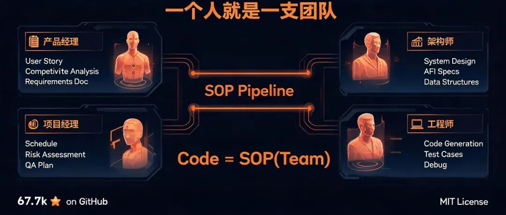
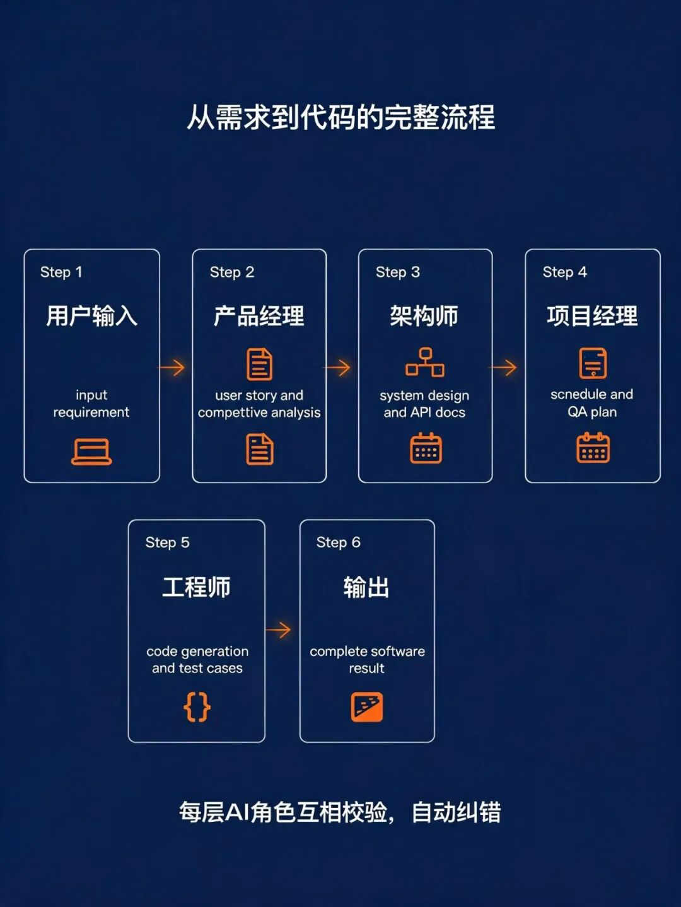
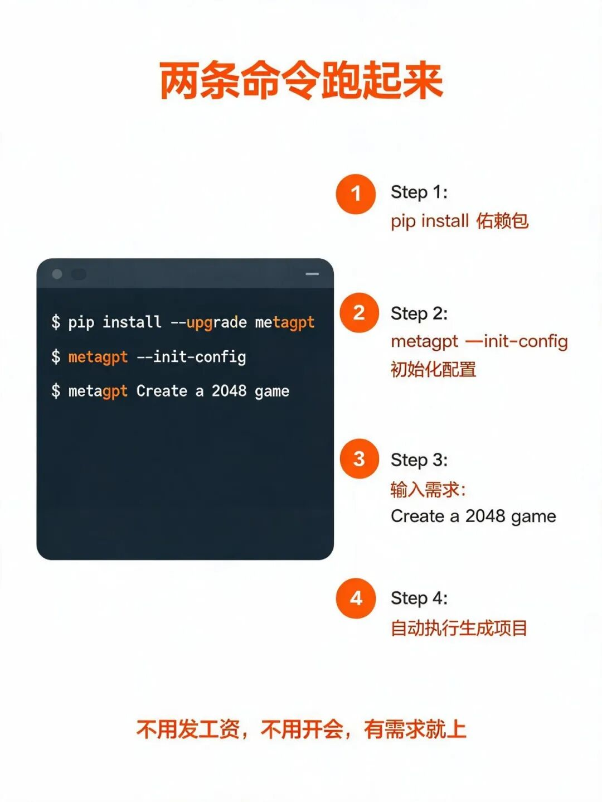
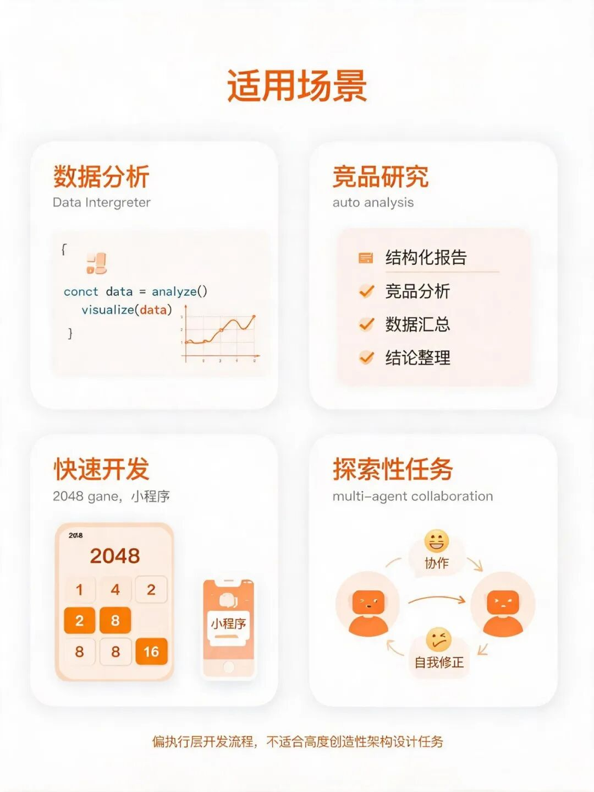

> 📎 来源: [小波AI日志](https://mp.weixin.qq.com/s?__biz=MzkxMDUzMjM4OQ==&mid=2247484692&idx=1&sn=2dcbfb0ac28d4bf0c837a0017beb7a29&chksm=c0cba6781c377d70a29b2808c34b5c5b65f34d2ce4ae03f5f72a59e3add486c3744ed1415fd1&mpshare=1&scene=1&srcid=0506TkFvpZrY6gMLdrRYDm0U&sharer_shareinfo=344d26b38baf031a680f012a663e8e10&sharer_shareinfo_first=344d26b38baf031a680f012a663e8e10) | 时间: 2026-05-06 04:09

---



凌晨刷到这个项目的时候，我正打算把之前写的一个小工具重新整理一下。 67.7k stars ， MIT 协议开源。第一眼看到 star 数的时候， DNA 是真的动了。

不是惊讶于它有多火——GitHub 上火的项目多了去了。是这个项目的定位：**Multi-Agent Framework: First AI Software Company, Towards Natural Language Programming**。翻译过来就是：多智能体框架，第一个 AI 软件公司，用自然语言编程。

它的核心理念很有意思，一句话总结是：**Code = SOP(Team)**。

什么意思？把软件开发看作一个标准操作流程，流程里有不同角色的智能体，像真实公司一样协作。

## 它到底怎么工作的



MetaGPT 把整个开发团队的角色全塞进了一个系统里：**产品经理**、**架构师**、**项目经理**、**工程师**，四合一。你只管提需求，剩下的它自动跑。

流程是这样的：你输入一句话，比如"帮我做个 2048 游戏"。系统收到需求，产品经理先产出用户故事和竞品分析，架构师跟进输出系统设计，项目经理排期评估，工程师出代码， QA 跑测试用例——一条流水线下来，完整的软件开发结果就出来了。

说实话，这种架构听起来很美好，但落地的时候那种"AI 觉得你懂了但其实你没懂"的撕裂感，我才不信只有我一个人踩过坑。

你可能会问：多个 AI 协作跟单个 AI 比，优势在哪？

我觉得关键在于**互相校验**。单个模型容易一条路走到黑，但多个角色之间会产生自然的"卡壳-纠正"环节。产品经理的需求输出给架构师，架构师的理解如果有偏差，项目经理这层会触发重新评估。这种设计在去年 Multi-Agent 成为主流之后，已经被验证过多次了。

## 实测安装，只需要两条命令



说实话，我一开始以为这类工具配置起来会很麻烦。但上手成本低得有点意外：

```
pip install --upgrade metagpt
metagpt --init-config
```

第一条命令装包，第二条创建默认配置文件。配置文件放在 `~/.metagpt/config2.yaml`，里面只需要填 API 密钥。配好之后，运行只需要一条指令：

```
metagpt "Create a 2048 game"
```

它就开始跑了。产品经理先启动，输出结构化需求文档，然后架构师接上，设计系统模块和接口，接着工程师角色生成代码，最后跑测试。整个流程全自动，中途你可以在终端看到各个角色在"工作"的状态。怎么说呢，有种"赛博朋克终于开始了"的微妙感觉。

## 这个项目意味着什么



目前 GitHub 上 67.7k 的 star 数，已经超过了很多老牌开发者工具。但 star 数不是重点，重点是这个数字背后有多少人在问同一个问题：**一个人，到底能跑多快**？

AI 工具这两年最大的变化，就是从"辅助你做事"到"替你做事"的边界越来越模糊。 MetaGPT 是少数几个把这件事做得比较彻底的。但它也有局限性——对于需要高度创造性架构设计的任务， AI 的判断力还是有上限的。它更适合偏执行层的开发流程，以及数据分析、探索性任务这类场景。这个赛道还在快速演化，我的判断是——两三年内，这类工具大概率会从"极客玩具"变成"标配"，就像五年前的 GitHub Copilot 。

值得试吗？

值得。但不要期待它明天就能颠覆你的工作流。它更像是给你配了一个随叫随到的小团队——不用发工资，不用开会，有需求就上。目前 GitHub 上的活跃度说明它还在快速迭代，生态也在慢慢成型。

感兴趣的话，直接去 GitHub 搜 `geekan/MetaGPT`， README 有完整的安装文档和示例。

我这边已经配好了，等有空跑一个真实项目看看效果。到时候再分享实际体验。

关注小波每天带来最热的Ai资讯
