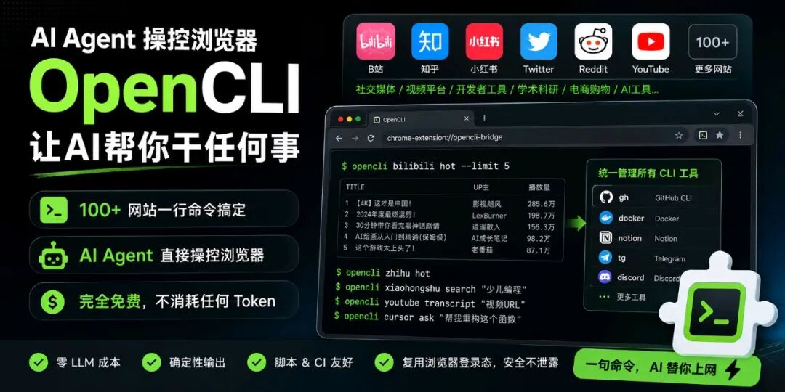

> 📎 来源: [北漂小码哥](https://mp.weixin.qq.com/s?__biz=MzIzMjUxNzUzOA==&mid=2247488338&idx=1&sn=1e2e0a0747fe16928f9014960fc679b8&chksm=e9a543d2495a163bf860dc275641126134c2063b125f210093dfd343e7cb736dc8d47b585a43&mpshare=1&scene=1&srcid=0517qKbYm5JCGmaarkT9806Y&sharer_shareinfo=f2ca8903162c0bcdf4d55875a4118476&sharer_shareinfo_first=f2ca8903162c0bcdf4d55875a4118476) | 时间: 2026-05-17 16:28

---



---

上周刷GitHub的时候，我被一个项目震惊了。

一个叫 **OpenCLI** 的开源项目，短短几个月就拿下了 **20,900+ Star**，Fork 数超过 2,100。在GitHub Trending榜上霸榜多日。

我花了一晚上研究它，发现这玩意儿真的改变了我对"AI工具"的认知。

**一句话总结：它能让AI Agent直接操控你的浏览器，帮你干任何事。**

刷B站、逛知乎、发小红书、查论文、抢票……全部用一行命令搞定，而且**完全免费，不消耗任何AI token**。

---

## 一、OpenCLI到底是什么？

简单来说，OpenCLI做了三件事：

1. **把网站变成命令行**：B站、知乎、小红书、Twitter、Reddit、YouTube等100+网站，全部可以用一行命令操作
2. **让AI Agent操控浏览器**：安装一个skill，你的AI（Claude Code、Cursor等）就能用你的已登录浏览器，导航、点击、填表、抓数据
3. **统一所有CLI工具**：gh、docker、Notion、Telegram、Discord……全部注册到同一个入口

听起来是不是很疯狂？但它是真的。

| 能力 | 传统方式 | 用OpenCLI |
| --- | --- | --- |
| 看B站热门 | 打开浏览器→登录→找热门→手动翻 | ``` opencli bilibili hot --limit 5 ``` |
| 刷知乎热榜 | 打开浏览器→登录→找热榜 | ``` opencli zhihu hot ``` |
| 搜索小红书笔记 | 打开App→搜索→逐条看 | ``` opencli xiaohongshu search "关键词" ``` |
| 查Twitter趋势 | 翻墙→登录→找趋势 | ``` opencli twitter trending ``` |
| 让AI帮你操作网页 | 不可能 | 安装skill，用自然语言告诉AI |

**关键点：它直接复用你的Chrome登录态，账号密码永远不会离开浏览器。**

---

## 二、为什么它能火？3个核心原因

### 原因1：AI Agent时代来了，但工具生态是碎片化的

现在几乎每个开发者都在用AI Agent——Claude Code、Cursor、Copilot。但这些AI Agent有个致命问题：**它们不知道怎么操作网站**。

你让Claude Code帮你"看看小红书的通知"，它只能告诉你"我没有浏览器访问权限"。

OpenCLI解决了这个问题。它给AI Agent提供了一个统一的浏览器控制层，让AI能真正"上网"。

### 原因2：零LLM成本，跑多少次都不花钱

这是最让我心动的一点。

用Selenium、Playwright这些传统自动化工具，你得自己写脚本。用AI浏览器工具（比如Browser Use），每次操作都要消耗token。

**OpenCLI不一样**——它在运行时完全不调用LLM。你跑1万次命令，一分钱不花。

对于需要频繁操作网站的场景（数据监控、内容分发、批量操作），这个优势是碾压级的。

### 原因3：确定性输出，脚本和CI的好朋友

同一个命令，同样的输出结构。这意味着：

- 你可以写Shell脚本批量操作
- 可以集成到CI/CD流水线
- 可以用管道串联多个命令
- AI Agent可以稳定地调用，不用担心格式变化

---

## 三、实际体验：5个让我惊呼的用法

### 用法1：一行命令查B站热门

opencli bilibili hot --limit 10

直接返回B站热门视频的标题、播放量、UP主，结构化数据，可以接管道处理。

### 用法2：让AI帮你刷小红书

安装

```
opencli-adapter-author
```

 skill后，你只需要对AI说：

"帮我看看小红书上关于'少儿编程'的最新笔记"

AI会自动打开你的浏览器，搜索、翻页、提取笔记内容，最后整理好发给你。

### 用法3：批量下载YouTube字幕

opencli youtube transcript "视频URL"

不需要登录，不需要第三方网站，一行命令拿到字幕。

### 用法4：统一管理所有CLI工具

opencli external register gh     # 注册GitHub CLI 

opencli external register docker # 注册Docker

以后所有工具都在

```
opencli
```

 下统一管理，不用记那么多命令了。

### 用法5：控制Cursor写代码

opencli cursor status  # 查看Cursor状态 

opencli cursor ask "帮我重构这个函数"  # 直接给Cursor发指令

没错，它甚至能通过CDP协议控制Electron桌面应用。

---

## 四、支持的网站太多了，列几个重点的

| 分类 | 支持的网站 |
| --- | --- |
| 社交媒体 | Twitter、Reddit、小红书、微博、知乎、贴吧、即刻、Facebook、Instagram、LinkedIn |
| 视频平台 | B站、YouTube、抖音 |
| 开发者工具 | GitHub(Gitee)、V2EX、StackOverflow、ProductHunt、HackerNews |
| 新闻资讯 | 36氪、BBC、Bloomberg、Reuters |
| 学术科研 | arXiv、PubMed、Google Scholar、百度学术 |
| 电商购物 | 京东、淘宝、亚马逊、1688 |
| AI工具 | ChatGPT、Claude、Gemini、豆包、Kimi |
| 生产力 | Notion、微信读书、豆瓣、雪球 |
| 桌面应用 | Cursor、Codex、Antigravity、ChatGPT桌面版 |

100+个站点，基本覆盖了你日常会用到的所有网站。

---

## 五、3分钟快速上手

### 第一步：安装

# 需要Node.js >= 21 

npm install -g @jackwener/opencli

### 第二步：安装浏览器扩展

去Chrome Web Store搜索"OpenCLI"，安装Browser Bridge扩展。

或者手动下载：去GitHub Releases页面下载zip，解压后在

```
chrome://extensions
```

 加载。

### 第三步：验证环境

opencli doctor

看到绿色的 ✓ 就说明一切正常。

### 第四步：跑第一个命令

opencli list              # 查看所有可用命令 

opencli hackernews top    # 看HackerNews热榜 

opencli bilibili hot      # 看B站热门

就这么简单。

---

## 六、给AI Agent安装skill

如果你想让AI Agent操控浏览器，需要安装对应的skill：

npx skills add jackwener/opencli

安装后，你的AI Agent就能：

- **导航**到任意URL
- **读取**页面内容（通过结构化DOM快照，不是截图）
- **交互**——点击按钮、填写表单、选择选项
- **提取**页面数据或拦截API响应
- **等待**元素加载完成

你只需要用自然语言告诉AI你想做什么，它会自动处理所有浏览器操作。

---

## 七、写在最后

OpenCLI让我看到了AI Agent的一个重要方向：**不是让AI从零开始造轮子，而是让AI学会使用人类已经造好的工具**。

网站、桌面应用、命令行工具——这些都是人类几十年积累的"基础设施"。OpenCLI做的事情，就是给AI Agent一把万能钥匙，让它们能无缝接入这些基础设施。

20,900个Star，不是没有原因的。

如果你是开发者，强烈建议试试。如果你是AI Agent爱好者，这可能是你今年最值得收藏的项目。

项目地址：https://github.com/jackwener/OpenCLI

---

### 我是北漂小码哥，一个爱折腾技术的程序员。

如果觉得这篇文章有用，欢迎点赞、转发、在看三连。

关注我，不错过每一篇干货。

— END —

北漂小码哥
