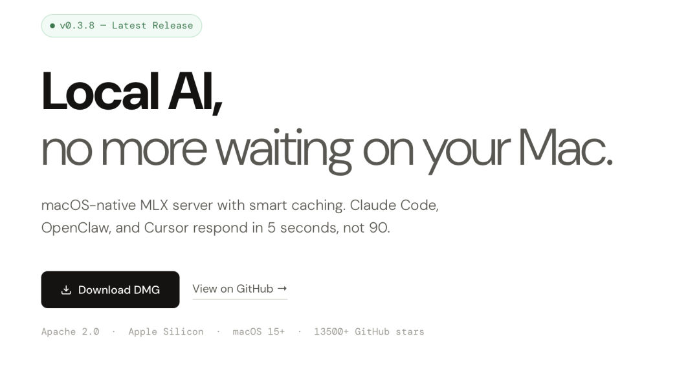

> 📎 来源: [王亮不开发](https://mp.weixin.qq.com/s?__biz=Mzg3NjkzMDgzMQ==&mid=2247484503&idx=1&sn=bc807fbe6154a3a79d6983f92f2ec8fe&chksm=ce5e77983d8707a082de2e1ee8afd23883bbc1f7169d2b7db25dda8f15e7fa1ab2b22b648ec1&mpshare=1&scene=1&srcid=05129SDmE4ARJtcbNQi3Fk7u&sharer_shareinfo=837a722256280bfb3912cf5627db3658&sharer_shareinfo_first=837a722256280bfb3912cf5627db3658) | 时间: 2026-05-12 04:04

---

9router 凭“白嫖”之力首次登顶，Anthropic 金融方案和 agent-skills 继续焊死在前三。然而连续霸榜五天之后，今天的看点其实藏在后排：一个只用 3300 行代码就能让 Agent 自己长出技能树的项目，和一个把 Mac 本地推理从“能跑”拉到“能用”的工程利器。

---

三巨头速览（老面孔，新读者请翻往期）

🥇 9router +803⭐

→ 免费模型路由神器，接 40+ 免费端点，还省 Token。今天登顶，说明开发者对“降本”的饥渴远超想象。（昨天深扒过）

🥈 anthropics/financial-services +1,449⭐

→ Anthropic 官方华尔街方案，今日涨星最猛，金融圈持续涌入。（往期有完整拆解）

🥉 agent-skills +1,065⭐

→ Addy Osmani 的工程纪律包，连续五天稳居前三。

想看这三款的完整解读直接翻历史推送。今天重点说两个新面孔，AI-Trader 前日已详解，不再重复。

---

## 今日新星：第5名和第7名

### 🏅 GenericAgent — 从 3300 行代码开始，越用越强⭐ +174

### 

大多数 Agent 的能力是“预装”的——开发者给它塞一堆工具和 prompt，它只会用这些。
**GenericAgent 走了一条截然不同的路：它只有 3300 行核心代码和 9 个原子工具，但它会自己“长技能”。**

怎么长？
每当你让它完成一个新任务，比如“帮我读微信消息”“监控这只股票并提醒我”“把这个文件发 Gmail”，它会自己去安装依赖、逆向接口、写脚本、调试、跑通，然后把这一整套操作固化为一个可复用的 **skill**。下次再遇到同类请求，直接调用 skill 瞬间完成，不再重新推理。

这个“自进化”不是噱头，最震撼的证明是：**整个 GenericAgent 仓库本身——从安装 Git、初始化仓库，到每一次 commit——全部由它自己完成，作者没打开过一次终端。**等于它自己生成了自己的代码仓库历史。

另外，它的 Token 消耗不到同类 Agent 的十分之一。因为分层记忆架构让它只把“当前最该知道的东西”装进上下文，不塞废话，幻觉也更少。

⚠️ **注意**：自进化也意味着不可控。自主结晶的 skill 质量可能参差，建议在沙箱环境里使用，定期审查 skill 树。目前技术报告已发布在 arXiv。

**一句话价值**：它回答了一个关键问题——Agent 的能力天花板怎么破？不是给它装更多技能，而是让它学会怎么自己长出技能。

**适合谁**：追求极致自动化、愿意花时间“调教”出一个独属于你的 Agent 的重度用户。

### 开源项目地址：https://github.com/lsdefine/GenericAgent

---

🏅 omlx — 专治 Mac 本地推理的“90 秒焦虑”⭐ +185

 

用 Mac 跑本地模型接 Agent 的开发者都懂一种绝望：发一条指令，模型要反应 90 秒。
**omlx 的目标很明确：把 90 秒压到 5 秒以内。**

它的核心是一套**内存+SSD 两级 KV 缓存**。其他推理服务器一遇到新上下文就清空重算，omlx 不干这傻事——所有算过的上下文全部持久化在 SSD 上，关掉会话再重开，缓存还在，不需要重新推理。对编程 Agent 这种动辄几小时的长对话场景，这是质变。

另外几个直击痛点的功能：

- **菜单栏管理**：点一下就能切换模型、查看状态，不用开终端
- **连续批处理**：多个请求并发处理，多 Agent 并行不排队
- **兼容 OpenAI API**：任何客户端都能直连
- **Support MCP**：Agent 可直接通过 MCP 调用推理能力
- **内置模型下载与切换**：LLM、VLM、Embedding、Reranker 都支持

实测对比：基于 Apple MLX 框架直调 Metal GPU，推理速度比 Ollama 快 26%-30%，尤其在 M3 Ultra 上优势明显。2026 年 Mac 端横评中被评为“Agent 场景 TTFT（首 Token 延迟）最低”的推理服务器。

⚠️ **提醒**：它不会把你的 MacBook 变成服务器集群，物理限制依然在。但它的价值是 **把你现有硬件的利用率推满，让本地推理真正可日常使用**，而不是被束之高阁的极客玩具。

**一句话价值**：Mac 的本地 Agent 终于从“能跑”进化到了“能用”。

**适合谁**：在 Mac 上重度使用 Claude Code、Cursor、OpenClaw 等编程 Agent 的开发者。

### 开源项目地址：https://github.com/jundot/omlx

---

今天的信号：Agent 的两个进化切面

GenericAgent 和 omlx，一个代表 **“能力怎么长出来”**，一个代表 **“能力怎么跑起来”**。
前者回答了 Agent 的个性化天花板问题，后者解决了本地化部署的体验瓶颈。二者加在一起，指向一个清晰的未来：Agent 不再是只能做一次性任务的工具，而是会学习、能记住、跑得快的长期搭档。

> 连续五天，GitHub 热榜格局看似不变，实则暗流涌动。关注我，每天一篇深度速递，帮你先一步看见趋势。

---

以上是AI交流群里经常交流的内容，如果感兴趣，可以关注公众号后回复【AI编程】，获取我的个人微信。添加时备注“入群”，我看到后通过，拉你进群。

[GitHub AI 热榜 | 5月10日：字节Agent桌面上线，AI也有“记性”了](https://mp.weixin.qq.com/s?__biz=Mzg3NjkzMDgzMQ==&mid=2247484496&idx=1&sn=2d1413f9e4915d1db5d37f9ef7c60690&scene=21#wechat_redirect)

[GitHub AI 热榜 | 5月9日：前三洗牌，羊毛与交易 Agent 杀入战场](https://mp.weixin.qq.com/s?__biz=Mzg3NjkzMDgzMQ==&mid=2247484489&idx=1&sn=05a01b6845c37a8b7ba6804a41633a82&scene=21#wechat_redirect)

[GitHub AI 热榜 | 5月8日：前三焊死，新血凶猛](https://mp.weixin.qq.com/s?__biz=Mzg3NjkzMDgzMQ==&mid=2247484480&idx=1&sn=e984cfece70f6bdf3a8a01085971ac48&scene=21#wechat_redirect)

[AI 编程工具大爆发！GitHub 今日热榜前三，哪个最适合你？](https://mp.weixin.qq.com/s?__biz=Mzg3NjkzMDgzMQ==&mid=2247484473&idx=1&sn=52004caa933dcc2ef9e3491e6ee7b8f9&scene=21#wechat_redirect)
